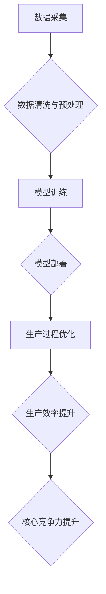

## 核心竞争力提升的新质生产力策略

> 关键词：人工智能、生产力、算法优化、数据驱动、自动化、机器学习、深度学习、流程优化

### 1. 背景介绍

在当今数字化时代，科技发展日新月异，企业面临着前所未有的竞争压力。传统生产力提升策略逐渐失效，企业迫切需要寻求新的突破口。人工智能（AI）作为第四次工业革命的核心技术，为企业提升核心竞争力提供了全新的机遇。

AI技术的快速发展，特别是深度学习的突破，使得机器具备了学习、分析和决策的能力，为企业带来了前所未有的自动化、智能化和数据化转型机会。通过将AI技术应用于生产流程、运营管理、产品研发等各个环节，企业可以实现生产效率的显著提升、成本的有效控制、产品质量的持续改进以及客户体验的优化升级。

### 2. 核心概念与联系

**2.1 核心概念**

* **新质生产力:** 指利用先进技术，特别是人工智能技术，实现生产效率、产品质量、成本控制和客户体验等方面的突破性提升，从而实现企业核心竞争力的跃升。
* **数据驱动:** 基于海量数据分析和挖掘，为决策提供科学依据，实现生产过程的智能化和自动化。
* **自动化:** 通过AI技术，实现生产流程的自动化，减少人工干预，提高效率和降低成本。
* **智能化:** 利用AI技术，赋予生产系统智能决策能力，实现生产过程的优化和自适应。

**2.2 架构图**



**2.3 联系**

新质生产力策略的核心是将数据驱动、自动化和智能化有机结合，通过AI技术实现生产过程的全面优化，最终提升企业核心竞争力。

### 3. 核心算法原理 & 具体操作步骤

**3.1 算法原理概述**

新质生产力策略的核心算法主要包括机器学习、深度学习和强化学习等。

* **机器学习:** 通过训练模型，使模型能够从数据中学习规律，并对新数据进行预测或分类。
* **深度学习:** 基于多层神经网络，能够学习更复杂的特征，实现更精准的预测和识别。
* **强化学习:** 通过奖励机制，训练模型在特定环境中做出最优决策。

**3.2 算法步骤详解**

1. **数据收集:** 收集生产过程中的相关数据，例如设备运行状态、生产效率、产品质量等。
2. **数据预处理:** 对收集到的数据进行清洗、转换和特征工程，使其适合模型训练。
3. **模型选择:** 根据具体应用场景选择合适的机器学习、深度学习或强化学习算法。
4. **模型训练:** 使用训练数据训练模型，调整模型参数，使其能够准确地预测或分类。
5. **模型评估:** 使用测试数据评估模型的性能，并进行模型调优。
6. **模型部署:** 将训练好的模型部署到生产环境中，用于实时数据分析和决策支持。

**3.3 算法优缺点**

* **优点:** 能够自动学习和优化生产流程，提高效率和降低成本。
* **缺点:** 需要大量的数据进行训练，模型训练过程复杂，需要专业技术人员进行操作。

**3.4 算法应用领域**

* **生产过程优化:** 通过预测设备故障、优化生产计划、控制生产参数等，提高生产效率和降低成本。
* **产品质量控制:** 通过图像识别、传感器数据分析等，实现对产品质量的实时监控和控制。
* **客户体验优化:** 通过个性化推荐、智能客服等，提升客户体验和服务质量。

### 4. 数学模型和公式 & 详细讲解 & 举例说明

**4.1 数学模型构建**

假设生产过程可以抽象为一个多变量函数，其中每个变量代表生产过程中的一个因素，例如设备运行状态、原材料质量、生产参数等。目标是找到最佳的变量组合，以实现最大生产效率和最小成本。

**4.2 公式推导过程**

可以使用线性规划、非线性规划等数学优化方法，构建数学模型并求解最佳变量组合。

**4.3 案例分析与讲解**

例如，在制造业生产过程中，可以构建一个数学模型，将生产效率、成本、设备寿命等因素作为目标函数，并根据实际生产条件设定约束条件。通过求解该模型，可以找到最佳的生产参数组合，以实现最大生产效率和最小成本。

### 5. 项目实践：代码实例和详细解释说明

**5.1 开发环境搭建**

使用Python语言和相关库，例如TensorFlow、PyTorch等，搭建深度学习开发环境。

**5.2 源代码详细实现**

```python
import tensorflow as tf

# 定义模型结构
model = tf.keras.models.Sequential([
    tf.keras.layers.Dense(128, activation='relu', input_shape=(input_dim,)),
    tf.keras.layers.Dense(64, activation='relu'),
    tf.keras.layers.Dense(1)
])

# 编译模型
model.compile(optimizer='adam', loss='mse')

# 训练模型
model.fit(train_data, train_labels, epochs=10)

# 评估模型
loss = model.evaluate(test_data, test_labels)
```

**5.3 代码解读与分析**

这段代码实现了深度学习模型的训练过程。首先定义了模型结构，包括输入层、隐藏层和输出层。然后编译模型，选择优化器和损失函数。最后使用训练数据训练模型，并评估模型的性能。

**5.4 运行结果展示**

训练完成后，可以将模型应用于实际生产场景，例如预测设备故障、优化生产计划等。

### 6. 实际应用场景

**6.1 智能制造**

AI技术可以应用于智能制造，实现生产过程的自动化、智能化和数据化。例如，通过机器视觉技术，可以实现对产品质量的实时监控和控制；通过预测性维护技术，可以提前预测设备故障，避免生产停滞。

**6.2 自动化物流**

AI技术可以应用于自动化物流，提高物流效率和降低成本。例如，通过机器人技术，可以实现货物搬运、分拣和配送的自动化；通过路径规划算法，可以优化物流路线，减少运输时间和成本。

**6.3 个性化服务**

AI技术可以应用于个性化服务，提升客户体验和服务质量。例如，通过推荐系统，可以为客户提供个性化的产品推荐；通过智能客服，可以为客户提供24小时在线服务。

**6.4 未来应用展望**

随着AI技术的不断发展，其应用场景将更加广泛，例如：

* **工业设计:** 利用AI技术，实现产品设计过程的自动化和智能化。
* **供应链管理:** 利用AI技术，优化供应链流程，提高供应链效率和弹性。
* **金融服务:** 利用AI技术，实现金融风险管理、欺诈检测和个性化金融服务。

### 7. 工具和资源推荐

**7.1 学习资源推荐**

* **在线课程:** Coursera、edX、Udacity等平台提供丰富的AI课程。
* **书籍:** 《深度学习》、《机器学习实战》等书籍是学习AI技术的经典教材。
* **开源社区:** TensorFlow、PyTorch等开源社区提供丰富的学习资源和技术支持。

**7.2 开发工具推荐**

* **Python:** Python是AI开发最常用的编程语言。
* **TensorFlow:** TensorFlow是Google开发的开源深度学习框架。
* **PyTorch:** PyTorch是Facebook开发的开源深度学习框架。

**7.3 相关论文推荐**

* **《ImageNet Classification with Deep Convolutional Neural Networks》**
* **《Attention Is All You Need》**
* **《Generative Adversarial Networks》**

### 8. 总结：未来发展趋势与挑战

**8.1 研究成果总结**

新质生产力策略的应用已经取得了显著成果，例如提高生产效率、降低成本、提升产品质量等。

**8.2 未来发展趋势**

未来，新质生产力策略将朝着更加智能化、自动化和数据化的方向发展，例如：

* **更强大的AI算法:** 随着AI算法的不断发展，将能够解决更复杂的问题，实现更精准的预测和控制。
* **更广泛的应用场景:** AI技术将应用于更多领域，例如医疗、教育、金融等，实现跨行业的生产力提升。
* **更完善的生态系统:** AI生态系统将更加完善，包括更丰富的工具、资源和服务，为企业提供更便捷的AI应用体验。

**8.3 面临的挑战**

新质生产力策略的应用也面临一些挑战，例如：

* **数据安全和隐私保护:** AI技术依赖于海量数据，如何保障数据安全和隐私保护是一个重要问题。
* **算法可解释性和透明度:** 许多AI算法是黑箱模型，难以解释其决策过程，这可能会导致信任问题。
* **人才短缺:** AI技术人才需求量大，而供给不足，人才短缺是一个制约AI发展的重要因素。

**8.4 研究展望**

未来，需要加强对AI算法的可解释性和透明度的研究，开发更安全、可靠和可信赖的AI技术。同时，需要加强AI人才培养，为AI产业发展提供人才保障。


### 9. 附录：常见问题与解答

**9.1 如何选择合适的AI算法？**

选择合适的AI算法需要根据具体应用场景和数据特点进行分析。例如，对于分类问题，可以考虑使用支持向量机、决策树等算法；对于回归问题，可以考虑使用线性回归、神经网络等算法。

**9.2 如何解决数据安全和隐私保护问题？**

可以采用数据加密、匿名化、脱敏等技术手段，保障数据安全和隐私保护。

**9.3 如何提高AI模型的准确性？**

可以采用数据清洗、特征工程、模型调优等方法，提高AI模型的准确性。


作者：禅与计算机程序设计艺术 / Zen and the Art of Computer Programming 
