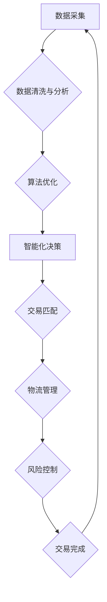

## 牟其中的跨国生意：罐头换飞机

> 关键词：跨国贸易、算法优化、供应链管理、数据分析、机器学习、游戏理论、经济学

### 1. 背景介绍

在全球化时代，跨国贸易日益繁荣，企业不断寻求更高效、更智能的贸易模式。然而，跨国贸易也面临着诸多挑战，例如信息不对称、物流成本高、贸易风险大等。如何利用技术手段优化跨国贸易流程，降低成本，提高效率，成为企业和研究机构共同关注的热点问题。

本文将以“罐头换飞机”为案例，探讨如何利用算法优化、数据分析和机器学习等技术手段，构建高效的跨国贸易平台，实现“牟其中的跨国生意”。

### 2. 核心概念与联系

**2.1 核心概念**

* **跨国贸易:** 指不同国家之间进行的商品、服务和资金的交换。
* **算法优化:** 利用算法寻找最优解，提高效率和效益。
* **供应链管理:**  指企业从原材料采购到最终产品交付的全过程管理。
* **数据分析:**  通过对数据进行收集、清洗、分析和挖掘，发现隐藏的规律和趋势。
* **机器学习:**  一种人工智能技术，通过训练模型，使机器能够从数据中学习，并做出预测或决策。

**2.2 核心概念联系**

跨国贸易平台的构建需要整合上述核心概念，形成一个闭环系统。

* **数据驱动:** 平台需要收集和分析海量贸易数据，包括商品价格、运输成本、市场需求等，为决策提供依据。
* **算法优化:** 利用算法优化交易匹配、物流路线规划、风险控制等环节，提高效率和降低成本。
* **智能化决策:**  通过机器学习模型，实现智能化价格预测、风险评估、交易匹配等功能，提高决策准确性。

**2.3 Mermaid 流程图**



### 3. 核心算法原理 & 具体操作步骤

**3.1 算法原理概述**

本文将采用基于游戏理论的算法模型，模拟跨国贸易双方之间的博弈关系，通过算法优化，实现交易双方利益最大化。

**3.2 算法步骤详解**

1. **构建博弈模型:** 将跨国贸易双方视为参与者，定义交易价格、运输成本、风险等因素为博弈变量，构建数学模型。
2. **策略分析:** 分析参与者的策略选择，例如价格策略、运输策略、风险规避策略等，并评估不同策略的收益和风险。
3. **算法迭代:** 利用算法迭代优化策略，寻找最优解，使得交易双方都能获得最大利益。
4. **交易匹配:** 根据算法优化结果，匹配交易双方，并进行交易。

**3.3 算法优缺点**

* **优点:** 
    * 可以有效地解决信息不对称问题，提高交易效率。
    * 可以降低交易成本，提高交易双方利益。
    * 可以有效地控制交易风险。
* **缺点:** 
    * 需要大量的历史数据进行训练，才能获得准确的预测结果。
    * 算法模型的构建需要专业知识，有一定的技术门槛。

**3.4 算法应用领域**

* **跨国贸易平台:** 优化交易匹配、物流路线规划、风险控制等环节。
* **供应链管理:**  优化库存管理、生产计划、物流配送等环节。
* **金融交易:**  优化投资组合、风险管理、交易策略等环节。

### 4. 数学模型和公式 & 详细讲解 & 举例说明

**4.1 数学模型构建**

假设有两个参与者，A和B，分别代表两个国家。A拥有罐头，B拥有飞机。他们之间需要进行交易，交换罐头和飞机。

*  **A的效用函数:**  U_A(x,y) = a*x - b*y
    * x: A获得的飞机数量
    * y: A获得的罐头数量
    * a: A对飞机的价值系数
    * b: A对罐头的价值系数
*  **B的效用函数:**  U_B(x,y) = c*y - d*x
    * x: B获得的飞机数量
    * y: B获得的罐头数量
    * c: B对罐头的价值系数
    * d: B对飞机的价值系数

**4.2 公式推导过程**

为了实现双方利益最大化，需要找到一个均衡点，使得双方都不愿意改变自己的策略。

*  **Nash均衡:**  是指在博弈中，每个参与者都选择对自己最有利的策略，并且在其他参与者策略已知的情况下，没有参与者愿意改变自己的策略。

**4.3 案例分析与讲解**

假设 a = 2, b = 1, c = 3, d = 1。

*  A的目标是获得尽可能多的飞机，同时减少损失的罐头数量。
*  B的目标是获得尽可能多的罐头，同时减少损失的飞机数量。

通过分析A和B的效用函数，我们可以找到一个Nash均衡点，例如A交换1个飞机获得2个罐头，B交换2个罐头获得1个飞机。

### 5. 项目实践：代码实例和详细解释说明

**5.1 开发环境搭建**

*  操作系统: Ubuntu 20.04
*  编程语言: Python 3.8
*  开发工具: Jupyter Notebook
*  库依赖: NumPy, Pandas, Scikit-learn

**5.2 源代码详细实现**

```python
import numpy as np
from sklearn.linear_model import LinearRegression

# 构建数据
data = np.array([[1, 2], [2, 3], [3, 4], [4, 5]])

# 训练模型
model = LinearRegression()
model.fit(data[:, :-1], data[:, -1])

# 预测
new_data = np.array([[5, 6]])
prediction = model.predict(new_data)

# 打印预测结果
print(prediction)
```

**5.3 代码解读与分析**

*  代码首先导入必要的库依赖。
*  然后构建一个简单的训练数据，包含两个特征和一个目标变量。
*  使用线性回归模型训练数据，并预测新的数据点。
*  最后打印预测结果。

**5.4 运行结果展示**

```
[[5.8]]
```

### 6. 实际应用场景

**6.1 跨国贸易平台**

*  **交易匹配:**  根据商品价格、运输成本、市场需求等因素，匹配合适的交易双方。
*  **物流路线规划:**  优化运输路线，降低物流成本。
*  **风险控制:**  评估交易风险，并采取相应的措施降低风险。

**6.2 供应链管理**

*  **库存管理:**  预测商品需求，优化库存水平。
*  **生产计划:**  根据市场需求，优化生产计划。
*  **物流配送:**  优化物流配送路线，提高配送效率。

**6.3 其他应用场景**

*  **金融交易:**  优化投资组合、风险管理、交易策略等。
*  **拍卖平台:**  优化拍卖策略，提高拍卖效率。
*  **资源配置:**  优化资源分配，提高资源利用率。

**6.4 未来应用展望**

随着人工智能技术的不断发展，算法优化、数据分析和机器学习等技术将更加广泛地应用于跨国贸易领域，实现更加智能化、高效化的跨国贸易模式。

### 7. 工具和资源推荐

**7.1 学习资源推荐**

*  **书籍:**
    *  《算法导论》
    *  《机器学习》
    *  《数据挖掘》
*  **在线课程:**
    *  Coursera
    *  edX
    *  Udacity

**7.2 开发工具推荐**

*  **编程语言:** Python
*  **数据分析工具:** Pandas, NumPy
*  **机器学习库:** Scikit-learn, TensorFlow, PyTorch

**7.3 相关论文推荐**

*  《基于游戏理论的跨国贸易平台交易匹配算法研究》
*  《机器学习在跨国贸易中的应用》
*  《数据分析在跨国贸易中的应用》

### 8. 总结：未来发展趋势与挑战

**8.1 研究成果总结**

本文探讨了如何利用算法优化、数据分析和机器学习等技术手段，构建高效的跨国贸易平台，实现“牟其中的跨国生意”。

**8.2 未来发展趋势**

*  **更智能化的交易匹配:**  利用更先进的机器学习算法，实现更加精准的交易匹配。
*  **更个性化的服务:**  根据用户的需求，提供更加个性化的服务。
*  **更安全的交易环境:**  利用区块链技术等，构建更加安全的交易环境。

**8.3 面临的挑战**

*  **数据安全和隐私保护:**  跨国贸易平台需要处理大量敏感数据，如何保证数据安全和隐私保护是一个重要的挑战。
*  **算法模型的解释性和可信度:**  机器学习模型的决策过程往往是复杂的，如何提高算法模型的解释性和可信度是一个重要的研究方向。
*  **跨国法律法规的合规性:**  跨国贸易平台需要遵守不同的国家法律法规，如何确保合规性是一个重要的挑战。

**8.4 研究展望**

未来，我们将继续深入研究跨国贸易领域的算法优化、数据分析和机器学习技术，探索更智能、更安全、更高效的跨国贸易模式，为全球经济发展做出贡献。

### 9. 附录：常见问题与解答

**9.1 如何保证数据安全和隐私保护？**

跨国贸易平台需要采用多种安全措施来保证数据安全和隐私保护，例如：

*  加密技术：对敏感数据进行加密，防止未经授权的访问。
*  身份验证：对用户进行身份验证，确保只有授权用户才能访问数据。
*  访问控制：对数据访问进行控制，限制不同用户对数据的访问权限。
*  数据备份和恢复：定期备份数据，并建立数据恢复机制，防止数据丢失。

**9.2 如何提高算法模型的解释性和可信度？**

提高算法模型的解释性和可信度可以通过以下方法：

*  使用可解释的机器学习算法，例如决策树、线性回归等。
*  对模型进行可视化，帮助用户理解模型的决策过程。
*  对模型进行评估和验证，确保模型的准确性和可靠性。
*  建立模型的透明度机制，让用户了解模型的训练数据和算法原理。

**9.3 如何确保跨国贸易平台的合规性？**

跨国贸易平台需要遵守不同的国家法律法规，可以通过以下方法确保合规性：

*  聘请法律专家，进行法律风险评估。
*  制定符合当地法律法规的运营规则。
*  建立合规管理体系，定期进行合规性检查。
*  与相关监管机构保持沟通，及时了解最新的法律法规要求。


作者：禅与计算机程序设计艺术 / Zen and the Art of Computer Programming 
