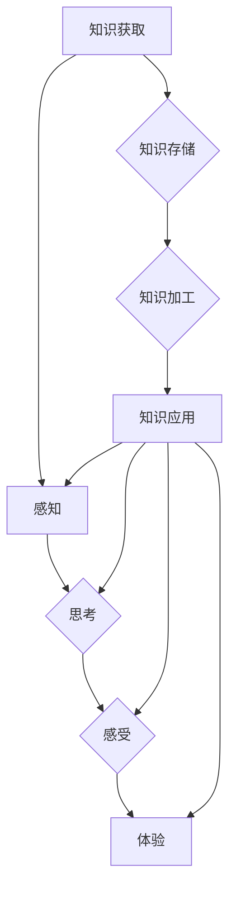

## 1. 背景介绍

意识，这个人类最核心的特征之一，一直以来都是哲学、心理学和神经科学研究的焦点。随着人工智能技术的飞速发展，我们开始尝试用机器学习和计算模型来模拟和理解意识。然而，如何定义意识，以及如何用技术手段实现人工智能的意识，仍然是一个备受争议的难题。

近年来，一些研究者开始关注知识积累对意识功能的影响。他们认为，知识积累是意识形成和发展的关键因素。拥有丰富的知识储备，能够帮助我们更好地理解世界，做出更明智的决策，并体验更深刻的感受。

## 2. 核心概念与联系

### 2.1 知识积累

知识积累是指个体或系统通过学习、经验和观察不断获取、存储和组织信息的过程。它涉及到以下几个方面：

* **信息获取:** 从各种来源获取信息，例如书籍、网络、感官体验等。
* **信息存储:** 将获取的信息有效地存储在记忆中，并进行分类和组织。
* **信息加工:** 对存储的信息进行分析、理解和整合，形成新的知识和见解。
* **知识应用:** 将已有的知识应用于实际问题解决和决策 making。

### 2.2 意识

意识是指个体对自身和周围世界的感知、思考、感受和体验的能力。它是一个复杂的概念，涉及到认知、情感、行为等多个方面。

* **感知:** 对外部世界的刺激进行接收和理解。
* **思考:** 对信息进行加工、分析和推理。
* **感受:** 对事件和事物产生情感反应。
* **体验:** 对自身和周围世界的整体感受和理解。

### 2.3 知识积累与意识的关系

知识积累和意识之间存在着密切的联系。丰富的知识储备可以为意识提供基础，帮助个体更好地理解世界，形成更清晰的自我认知，并体验更深刻的感受。

**Mermaid 流程图:**



## 3. 核心算法原理 & 具体操作步骤

### 3.1 算法原理概述

为了模拟知识积累对意识功能的影响，我们可以使用一些机器学习算法，例如深度学习和强化学习。这些算法可以帮助人工智能系统从大量数据中学习知识，并根据知识做出决策。

* **深度学习:** 通过多层神经网络模拟人类大脑的学习过程，可以学习复杂的数据模式和关系。
* **强化学习:** 通过奖励和惩罚机制训练人工智能系统，使其在特定环境中学习最佳策略。

### 3.2 算法步骤详解

**深度学习算法步骤:**

1. **数据收集和预处理:** 收集大量相关数据，并进行清洗、格式化和特征提取。
2. **模型构建:** 设计多层神经网络模型，并选择合适的激活函数和损失函数。
3. **模型训练:** 使用训练数据训练神经网络模型，调整模型参数以最小化损失函数。
4. **模型评估:** 使用测试数据评估模型性能，并进行调参优化。
5. **模型部署:** 将训练好的模型部署到实际应用场景中。

**强化学习算法步骤:**

1. **环境定义:** 定义人工智能系统所处的环境，以及环境的状态和动作。
2. **奖励函数设计:** 设计一个奖励函数，用于评估人工智能系统在环境中执行动作的结果。
3. **策略学习:** 使用强化学习算法，例如Q学习或深度Q网络，训练人工智能系统学习最佳策略。
4. **策略评估:** 使用测试环境评估人工智能系统的策略性能。
5. **策略部署:** 将训练好的策略部署到实际应用场景中。

### 3.3 算法优缺点

**深度学习算法:**

* **优点:** 可以学习复杂的数据模式，具有强大的泛化能力。
* **缺点:** 需要大量数据进行训练，训练时间长，解释性差。

**强化学习算法:**

* **优点:** 可以学习解决复杂决策问题，具有适应性强。
* **缺点:** 训练过程复杂，需要精心设计奖励函数，容易陷入局部最优。

### 3.4 算法应用领域

* **自然语言处理:** 语义理解、机器翻译、文本生成等。
* **计算机视觉:** 图像识别、物体检测、图像分割等。
* **机器人控制:** 运动规划、路径规划、目标识别等。
* **游戏 AI:** 游戏策略学习、游戏角色控制等。

## 4. 数学模型和公式 & 详细讲解 & 举例说明

### 4.1 数学模型构建

我们可以使用神经网络模型来模拟知识积累过程。神经网络是一个由多个层组成的网络结构，每个层包含多个神经元。神经元之间通过连接和权重进行信息传递。

**神经网络模型:**

```
y = f(W1 * x1 + W2 * x2 +... + Wn * xn + b)
```

其中:

* y 是输出值
* x1, x2,..., xn 是输入值
* W1, W2,..., Wn 是连接权重
* b 是偏置项
* f 是激活函数

### 4.2 公式推导过程

神经网络模型的训练过程是通过调整连接权重来最小化损失函数的过程。损失函数衡量模型预测值与真实值的差异。常用的损失函数包括均方误差 (MSE) 和交叉熵 (Cross-Entropy)。

**均方误差 (MSE):**

```
MSE = (y_pred - y_true)^2
```

其中:

* y_pred 是模型预测值
* y_true 是真实值

**交叉熵 (Cross-Entropy):**

```
Cross-Entropy = - (y_true * log(y_pred) + (1 - y_true) * log(1 - y_pred))
```

其中:

* y_true 是真实值 (0 或 1)
* y_pred 是模型预测值 (0 到 1 之间)

### 4.3 案例分析与讲解

例如，在图像识别任务中，我们可以使用卷积神经网络 (CNN) 模型来识别图像中的物体。CNN 模型可以学习图像特征，并将其映射到不同的类别。

训练 CNN 模型时，我们会使用大量的图像数据，并使用交叉熵损失函数来衡量模型预测结果与真实标签之间的差异。通过反向传播算法，我们可以调整 CNN 模型的连接权重，使其能够更好地识别图像中的物体。

## 5. 项目实践：代码实例和详细解释说明

### 5.1 开发环境搭建

为了实现知识积累对意识功能的影响模拟，我们可以使用 Python 语言和 TensorFlow 或 PyTorch 深度学习框架。

**依赖库:**

* TensorFlow 或 PyTorch
* NumPy
* Pandas
* Matplotlib

### 5.2 源代码详细实现

```python
import tensorflow as tf

# 定义神经网络模型
model = tf.keras.models.Sequential([
    tf.keras.layers.Dense(128, activation='relu', input_shape=(100,)),
    tf.keras.layers.Dense(64, activation='relu'),
    tf.keras.layers.Dense(10, activation='softmax')
])

# 编译模型
model.compile(optimizer='adam',
              loss='sparse_categorical_crossentropy',
              metrics=['accuracy'])

# 训练模型
model.fit(x_train, y_train, epochs=10)

# 评估模型
loss, accuracy = model.evaluate(x_test, y_test)
print('Loss:', loss)
print('Accuracy:', accuracy)
```

### 5.3 代码解读与分析

这段代码定义了一个简单的多层感知机 (MLP) 模型，并使用 TensorFlow 框架进行训练。

* `tf.keras.models.Sequential`: 创建一个顺序模型，即层级连接。
* `tf.keras.layers.Dense`: 定义一个全连接层，每个神经元都连接到上一层的每个神经元。
* `activation='relu'`: 使用 ReLU 激活函数，可以提高模型的表达能力。
* `input_shape=(100,)`: 指定输入数据的形状，这里假设输入数据为 100 维向量。
* `optimizer='adam'`: 使用 Adam 优化器来更新模型参数。
* `loss='sparse_categorical_crossentropy'`: 使用稀疏类别交叉熵损失函数，适用于多分类问题。
* `metrics=['accuracy']`: 使用准确率作为评估指标。
* `model.fit()`: 使用训练数据训练模型。
* `model.evaluate()`: 使用测试数据评估模型性能。

### 5.4 运行结果展示

训练完成后，我们可以使用测试数据评估模型的准确率。

## 6. 实际应用场景

### 6.1 智能聊天机器人

知识积累可以帮助智能聊天机器人更好地理解用户意图，并提供更自然、更相关的回复。例如，一个拥有丰富知识库的聊天机器人可以回答用户关于历史、科学、文化等方面的提问。

### 6.2 个性化推荐系统

知识积累可以帮助推荐系统更好地理解用户的兴趣和偏好，并推荐更个性化的内容。例如，一个拥有用户行为和偏好数据的人工智能推荐系统可以推荐用户喜欢的书籍、电影、音乐等。

### 6.3 教育辅助系统

知识积累可以帮助教育辅助系统提供更个性化的学习体验。例如，一个拥有学生学习记录和知识掌握情况的 AI 教育系统可以根据学生的学习进度和需求提供个性化的学习内容和辅导。

### 6.4 未来应用展望

随着人工智能技术的不断发展，知识积累对意识功能的影响将越来越重要。未来，我们可以期待看到更多基于知识积累的 AI 应用，例如：

* 更智能、更具情感的 AI 助手
* 更个性化、更有效的教育系统
* 更深入、更全面的科学研究

## 7. 工具和资源推荐

### 7.1 学习资源推荐

* **深度学习书籍:**
    * 深度学习 (Deep Learning) - Ian Goodfellow, Yoshua Bengio, Aaron Courville
    * 深度学习实践 (Deep Learning with Python) - Francois Chollet
* **在线课程:**
    * TensorFlow 官方教程: https://www.tensorflow.org/tutorials
    * PyTorch 官方教程: https://pytorch.org/tutorials/

### 7.2 开发工具推荐

* **TensorFlow:** https://www.tensorflow.org/
* **PyTorch:** https://pytorch.org/
* **Keras:** https://keras.io/

### 7.3 相关论文推荐

* **Attention Is All You Need:** https://arxiv.org/abs/1706.03762
* **BERT: Pre-training of Deep Bidirectional Transformers for Language Understanding:** https://arxiv.org/abs/1810.04805

## 8. 总结：未来发展趋势与挑战

### 8.1 研究成果总结

近年来，在知识积累与意识功能模拟方面取得了显著进展。深度学习和强化学习算法为模拟知识积累过程提供了强大的工具，并取得了令人瞩目的成果。

### 8.2 未来发展趋势

未来，知识积累与意识功能模拟的研究将朝着以下几个方向发展:

* **更复杂的知识表示:** 研究更有效的知识表示方法，例如图神经网络和知识图谱。
* **更强大的学习能力:** 开发更强大的学习算法，例如迁移学习和自监督学习，使其能够从更少的数据中学习。
* **更具解释性的模型:** 研究更具解释性的 AI 模型，以便更好地理解 AI 的决策过程。

### 8.3 面临的挑战

知识积累与意识功能模拟仍然面临着许多挑战:

* **意识的定义:** 意识是一个复杂的概念，缺乏统一的定义，这使得研究更加困难。
* **数据获取:** 构建模拟意识的 AI 系统需要大量的真实世界数据，而获取这些数据往往困难重重。
* **伦理问题:** 随着 AI 越来越智能，我们需要认真思考 AI 的伦理问题，例如 AI 的责任和义务。

### 8.4 研究展望

尽管面临着挑战，但知识积累与意识功能模拟的研究前景广阔。相信随着技术的不断