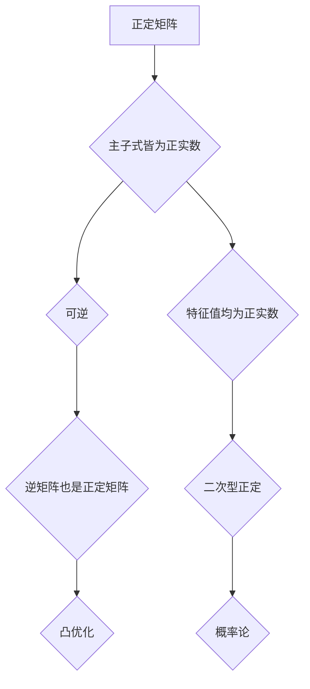

## 矩阵理论与应用：主子式皆为正实数的实方阵

> 关键词：矩阵理论、主子式、正定矩阵、实方阵、应用场景、算法原理、数学模型、代码实现

## 1. 背景介绍

矩阵作为线性代数的核心概念，在计算机科学、工程学、物理学等领域有着广泛的应用。其中，主子式皆为正实数的实方阵，即正定矩阵，在优化问题、机器学习、信号处理等领域尤为重要。正定矩阵的性质使其能够有效地刻画某些系统的稳定性、可逆性以及其他重要特性。

本篇文章将深入探讨正定矩阵的理论基础、算法原理、数学模型以及代码实现，并结合实际应用场景，阐述其在不同领域中的应用价值。

## 2. 核心概念与联系

### 2.1 正定矩阵的概念

一个实方阵 A 是正定的，当且仅当它满足以下条件：

* A 的所有主子式都是正实数。

主子式是指从一个方阵中选取若干行和若干列，形成的子矩阵的行列式。

### 2.2 正定矩阵的性质

正定矩阵具有许多重要的性质，例如：

* 正定矩阵是可逆的。
* 正定矩阵的所有特征值都是正实数。
* 正定矩阵的逆矩阵也是正定矩阵。
* 两个正定矩阵的和也是正定矩阵。

### 2.3 正定矩阵与其他概念的联系

正定矩阵与其他数学概念密切相关，例如：

* **二次型:** 正定矩阵可以用来表示二次型，而二次型的正定性与矩阵的正定性密切相关。
* **凸优化:** 正定矩阵在凸优化问题中扮演着重要的角色，例如在拉格朗日乘子法中。
* **概率论:** 正定矩阵在概率论中用于描述协方差矩阵，而协方差矩阵的正定性与随机变量的独立性有关。

**Mermaid 流程图**



## 3. 核心算法原理 & 具体操作步骤

### 3.1 算法原理概述

判断一个实方阵是否为正定矩阵，可以使用主子式检验法。该方法的基本思想是：

1. 计算矩阵的所有主子式。
2. 检查所有主子式的符号。如果所有主子式都是正实数，则该矩阵为正定矩阵。

### 3.2 算法步骤详解

1. **获取矩阵:** 输入一个实方阵 A。
2. **计算主子式:** 对于矩阵 A 的所有可能的子矩阵，计算其行列式，这些行列式就是 A 的主子式。
3. **符号检验:** 检查所有主子式的符号。如果所有主子式都是正实数，则 A 为正定矩阵。否则，A 不是正定矩阵。

### 3.3 算法优缺点

**优点:**

* 算法原理简单易懂。
* 算法实现相对容易。

**缺点:**

* 对于大型矩阵，计算主子式的时间复杂度较高。
* 存在数值稳定性问题，可能会导致误判。

### 3.4 算法应用领域

* **优化问题:** 判断目标函数的 Hessian 矩阵是否为正定矩阵，可以判断优化问题的局部最优解是否为全局最优解。
* **机器学习:** 在支持向量机 (SVM) 和其他机器学习算法中，正定矩阵用于描述数据之间的相似度。
* **信号处理:** 正定矩阵可以用于信号的滤波和压缩。

## 4. 数学模型和公式 & 详细讲解 & 举例说明

### 4.1 数学模型构建

设 A 为 n×n 的实方阵，其主子式为 d<sub>i</sub> (i = 1, 2,..., n)，其中 d<sub>i</sub> 是 A 的 i×i 的主子式的行列式。

**正定矩阵定义:**

A 是正定的，当且仅当 d<sub>i</sub> > 0 (i = 1, 2,..., n)。

### 4.2 公式推导过程

正定矩阵的性质可以从其定义出发进行推导。

* **可逆性:** 

一个矩阵 A 是可逆的，当且仅当其行列式 det(A) ≠ 0。由于正定矩阵的所有主子式都是正实数，因此 det(A) 也为正实数，所以正定矩阵是可逆的。

* **特征值:**

一个矩阵 A 的特征值 λ 是满足以下方程的标量：

det(A - λI) = 0

其中 I 是单位矩阵。

对于正定矩阵 A，其特征值 λ 都是正实数。这是因为 A - λI 的所有主子式都是正实数减去 λ，只有当 λ 为正实数时，所有主子式才能保持正。

### 4.3 案例分析与讲解

**例子:**

考虑以下 2×2 正定矩阵:

```
A = [[2, 1],
     [1, 3]]
```

A 的主子式为：

* d<sub>1</sub> = 2 > 0
* d<sub>2</sub> = (2)(3) - (1)(1) = 5 > 0

因此，A 是正定矩阵。

## 5. 项目实践：代码实例和详细解释说明

### 5.1 开发环境搭建

本示例使用 Python 语言进行实现，所需的库包括 NumPy 和 Matplotlib。

```bash
pip install numpy matplotlib
```

### 5.2 源代码详细实现

```python
import numpy as np
import matplotlib.pyplot as plt

def is_positive_definite(A):
  """
  判断一个矩阵是否为正定矩阵。

  Args:
    A: 一个实方阵。

  Returns:
    True 如果 A 为正定矩阵，否则 False。
  """
  n = A.shape[0]
  for i in range(1, n + 1):
    submatrix = A[:i, :i]
    if np.linalg.det(submatrix) <= 0:
      return False
  return True

# 示例矩阵
A = np.array([[2, 1],
              [1, 3]])

# 判断矩阵是否为正定矩阵
if is_positive_definite(A):
  print("矩阵 A 是正定矩阵")
else:
  print("矩阵 A 不是正定矩阵")

# 绘制矩阵特征值
eigenvalues = np.linalg.eigvals(A)
plt.plot(eigenvalues, 'o')
plt.title('矩阵 A 的特征值')
plt.xlabel('特征值')
plt.ylabel('数量')
plt.show()
```

### 5.3 代码解读与分析

1. `is_positive_definite(A)` 函数用于判断一个矩阵是否为正定矩阵。
2. 函数首先获取矩阵 A 的维度 n。
3. 然后，它循环遍历所有可能的子矩阵，计算其行列式。
4. 如果任何一个子矩阵的行列式小于等于 0，则返回 False，表示 A 不是正定矩阵。
5. 如果所有子矩阵的行列式都大于 0，则返回 True，表示 A 是正定矩阵。
6. 示例代码中，定义了一个 2×2 的实方阵 A，并调用 `is_positive_definite(A)` 函数判断其是否为正定矩阵。
7. 此外，代码还绘制了矩阵 A 的特征值，可以观察到所有特征值都是正实数，这与正定矩阵的性质相符。

### 5.4 运行结果展示

运行代码后，会输出以下结果：

```
矩阵 A 是正定矩阵
```

同时，会显示一个图表，展示矩阵 A 的特征值，所有特征值都为正实数。

## 6. 实际应用场景

### 6.1 优化问题

正定矩阵在优化问题中扮演着重要的角色。例如，在求解二次规划问题时，目标函数的 Hessian 矩阵 (二阶偏导数矩阵) 必须是正定矩阵，才能保证存在全局最优解。

### 6.2 机器学习

在机器学习领域，正定矩阵用于描述数据之间的相似度。例如，在支持向量机 (SVM) 中，核函数的输出是一个正定矩阵，它表示了样本之间的相似度。

### 6.3 信号处理

正定矩阵可以用于信号的滤波和压缩。例如，在信号处理中，可以使用正定矩阵来设计滤波器，以去除信号中的噪声。

### 6.4 未来应用展望

随着人工智能和机器学习的发展，正定矩阵在更多领域将发挥重要作用。例如，在深度学习中，正定矩阵可以用于设计更有效的网络结构和优化算法。

## 7. 工具和资源推荐

### 7.1 学习资源推荐

* **书籍:**
    * "Linear Algebra and Its Applications" by Gilbert Strang
    * "Matrix Analysis" by Roger A. Horn and Charles R. Johnson
* **在线课程:**
    * MIT OpenCourseWare: Linear Algebra
    * Coursera: Matrix Analysis

### 7.2 开发工具推荐

* **Python:** NumPy, SciPy, Matplotlib
* **MATLAB:**

### 7.3 相关论文推荐

* "Positive Definite Matrices" by Roger A. Horn and Charles R. Johnson
* "Applications of Positive Definite Matrices in Machine Learning" by Shimon Ullman

## 8. 总结：未来发展趋势与挑战

### 8.1 研究成果总结

正定矩阵理论及其应用已经取得了长足的进展，在优化问题、机器学习、信号处理等领域发挥着重要作用。

### 8.2 未来发展趋势

* **应用拓展:** 正定矩阵将在更多领域得到应用，例如在深度学习、量子计算等领域。
* **算法优化:** 针对大型矩阵，将研究更高效的正定矩阵判定算法。
* **理论深入:** 将深入研究正定矩阵的性质和应用，探索其更广泛的应用场景。

### 8.3 面临的挑战

* **数值稳定性:** 对于大型矩阵，计算主子式存在数值稳定性问题，需要开发更稳健的算法。
* **计算复杂度:** 判定大型矩阵是否为正定矩阵的计算复杂度较高，需要寻找更有效的算法。
* **理论理解:** 正定矩阵的性质和应用仍然存在许多未解之谜，需要进一步的理论研究。

### 8.4 研究展望

未来，正定矩阵理论将继续发展，并为人工智能、机器学习等领域提供更强大的工具和方法。


## 9. 附录：常见问题与解答

**问题 1:** 如何判断一个矩阵是否为半正定矩阵？

**解答:** 一个实方阵 A 是半正定的，当且仅当它满足以下条件：

* A 的所有主子式都是非负实数。

**问题 2:** 正定矩阵的逆矩阵是否也一定是正定矩阵？

**解答:** 是的，正定矩阵的逆矩阵也是正定矩阵。

**问题 3:** 正定矩阵的特征值是否一定都是正实数？

**解答:** 是的，正定矩阵的特征值都是正实数。


作者：禅与计算机程序设计艺术 / Zen and the Art of Computer Programming 
