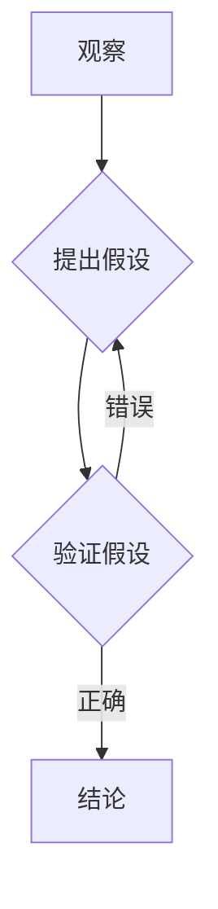

## 科学探究：从观察到结论

> 关键词：科学方法、算法设计、数据结构、编程实践、数学建模、人工智能、机器学习、深度学习

### 1. 背景介绍

在瞬息万变的科技时代，我们身处一个数据爆炸的时代。海量数据涌现，为我们提供了前所未有的机遇，但也带来了新的挑战。如何有效地从海量数据中提取有价值的信息，并将其转化为可操作的知识，成为了当今科技领域的核心问题。

科学探究，作为人类探索未知世界的核心方法，在解决这一挑战中发挥着至关重要的作用。它强调从观察到结论的严谨逻辑，通过不断地假设、验证和修正，最终揭示事物背后的本质规律。

在计算机科学领域，科学探究同样适用。无论是设计高效的算法，构建合理的软件架构，还是开发智能的机器学习模型，都需要遵循科学探究的原则。

### 2. 核心概念与联系

科学探究的核心概念包括：

* **观察:** 仔细观察现象，记录相关数据。
* **假设:**  根据观察结果，提出合理的假设。
* **验证:** 设计实验或模拟，验证假设的正确性。
* **修正:**  根据实验结果，修正假设或提出新的假设。
* **结论:**  总结验证结果，得出最终结论。

这些概念在计算机科学领域有着直接的对应关系：

* **观察:**  分析用户需求，识别问题痛点。
* **假设:**  提出解决方案，设计算法或架构。
* **验证:**  进行代码测试，评估算法性能。
* **修正:**  根据测试结果，优化代码，改进算法。
* **结论:**  总结解决方案的优缺点，并进行推广应用。

**Mermaid 流程图:**



### 3. 核心算法原理 & 具体操作步骤

#### 3.1  算法原理概述

算法，作为解决特定问题的指令序列，是计算机科学的核心概念。高效的算法可以显著提高程序的运行效率，节省资源，并提升用户体验。

科学探究的原则同样适用于算法设计。我们需要通过观察问题，提出合理的假设，并设计实验来验证算法的有效性。

#### 3.2  算法步骤详解

**举例：** 

**冒泡排序算法**

1. **比较相邻元素:** 从数组的第一个元素开始，比较相邻的两个元素。
2. **交换元素:** 如果两个元素的顺序错误，则交换它们的位置。
3. **重复步骤 1 和 2:** 重复上述步骤，直到整个数组排序完成。

**具体操作步骤:**

```python
def bubble_sort(arr):
  n = len(arr)
  for i in range(n):
    # Last i elements are already in place
    for j in range(0, n-i-1):
      # Swap if the element found is greater than the next element
      if arr[j] > arr[j+1]:
        arr[j], arr[j+1] = arr[j+1], arr[j]
  return arr
```

#### 3.3  算法优缺点

**冒泡排序算法的优缺点:**

* **优点:** 
    * 算法简单易懂，实现代码简洁。
    * 稳定排序算法，相等元素的相对顺序保持不变。
* **缺点:** 
    * 时间复杂度较高，在最坏情况下为 O(n^2)，效率较低。
    * 不适合处理大规模数据。

#### 3.4  算法应用领域

冒泡排序算法由于其简单易懂的特点，常用于教学和入门级程序设计练习。

### 4. 数学模型和公式 & 详细讲解 & 举例说明

#### 4.1  数学模型构建

算法的性能分析通常依赖于数学模型。例如，冒泡排序算法的时间复杂度可以用数学公式表示：

**时间复杂度:** O(n^2)

其中，n代表数组的长度。

#### 4.2  公式推导过程

时间复杂度表示算法运行时间随输入数据规模变化的趋势。

冒泡排序算法的时间复杂度为 O(n^2) 是因为：

* 外层循环执行 n 次。
* 内层循环在最坏情况下执行 (n-1) + (n-2) +... + 1 次，总共为 n(n-1)/2 次。

因此，算法的总运行时间为 O(n^2)。

#### 4.3  案例分析与讲解

假设我们有一个包含 10 个元素的数组，使用冒泡排序算法进行排序。

* 外层循环执行 10 次。
* 内层循环在最坏情况下执行 45 次。
* 因此，算法的总运行时间为 O(10^2) = 100 次操作。

如果数组包含 100 个元素，则算法的运行时间将为 O(100^2) = 10000 次操作。

### 5. 项目实践：代码实例和详细解释说明

#### 5.1  开发环境搭建

* 操作系统: Windows/macOS/Linux
* 编程语言: Python
* 开发工具: VS Code/PyCharm

#### 5.2  源代码详细实现

```python
def bubble_sort(arr):
  n = len(arr)
  for i in range(n):
    # Last i elements are already in place
    for j in range(0, n-i-1):
      # Swap if the element found is greater than the next element
      if arr[j] > arr[j+1]:
        arr[j], arr[j+1] = arr[j+1], arr[j]
  return arr

# Example usage
numbers = [64, 34, 25, 12, 22, 11, 90]
sorted_numbers = bubble_sort(numbers)
print("Sorted array:", sorted_numbers)
```

#### 5.3  代码解读与分析

* 函数 `bubble_sort(arr)` 接受一个数组 `arr` 作为输入。
* 外层循环 `for i in range(n)` 控制排序的轮数，每次循环将最大的元素“冒泡”到数组末尾。
* 内层循环 `for j in range(0, n-i-1)` 比较相邻元素，并交换位置，直到整个数组排序完成。
* `if arr[j] > arr[j+1]:` 判断相邻元素的大小关系。
* `arr[j], arr[j+1] = arr[j+1], arr[j]` 交换元素位置。
* 最后返回排序后的数组 `sorted_numbers`。

#### 5.4  运行结果展示

```
Sorted array: [11, 12, 22, 25, 34, 64, 90]
```

### 6. 实际应用场景

冒泡排序算法在实际应用中，由于其时间复杂度较高，通常只用于小型数据集合的排序，例如：

* **学生成绩排序:**  对少量学生的成绩进行排序。
* **简单的列表排序:** 对用户输入的简单列表进行排序。

### 6.4  未来应用展望

随着人工智能和机器学习的发展，新的排序算法不断涌现，例如快速排序、归并排序等，这些算法具有更高的效率和更广泛的应用场景。

### 7. 工具和资源推荐

#### 7.1  学习资源推荐

* **书籍:**
    * 《算法导论》
    * 《数据结构与算法分析》
* **在线课程:**
    * Coursera: 数据结构与算法
    * edX: 算法导论
* **网站:**
    * GeeksforGeeks
    * LeetCode

#### 7.2  开发工具推荐

* **Python:**
    * VS Code
    * PyCharm
* **C++:**
    * Visual Studio
    * CLion

#### 7.3  相关论文推荐

* **The Analysis of Algorithms** by Thomas H. Cormen, Charles E. Leiserson, Ronald L. Rivest, and Clifford Stein
* **Introduction to Algorithms** by Thomas H. Cormen, Charles E. Leiserson, Ronald L. Rivest, and Clifford Stein

### 8. 总结：未来发展趋势与挑战

#### 8.1  研究成果总结

科学探究方法在计算机科学领域发挥着至关重要的作用，帮助我们设计高效的算法、构建合理的软件架构，并开发智能的机器学习模型。

#### 8.2  未来发展趋势

* **人工智能:**  人工智能的发展将推动算法设计和优化，例如深度学习算法的不断改进。
* **大数据:**  大数据时代的到来，对算法的效率和可扩展性提出了更高的要求。
* **云计算:**  云计算平台为算法开发和部署提供了新的可能性。

#### 8.3  面临的挑战

* **算法复杂性:**  随着问题的复杂性增加，设计高效的算法变得更加困难。
* **数据安全:**  数据安全和隐私保护是算法开发和应用中需要考虑的重要因素。
* **伦理问题:**  人工智能算法的应用可能引发伦理问题，需要谨慎考虑和解决。

#### 8.4  研究展望

未来，我们将继续探索新的算法设计方法，提高算法的效率和鲁棒性，并将其应用于更广泛的领域，为人类社会带来更多福祉。

### 9. 附录：常见问题与解答

* **Q: 冒泡排序算法的时间复杂度为什么是 O(n^2)?**

* **A:** 冒泡排序算法的时间复杂度为 O(n^2) 是因为：
    * 外层循环执行 n 次。
    * 内层循环在最坏情况下执行 (n-1) + (n-2) +... + 1 次，总共为 n(n-1)/2 次。
    * 因此，算法的总运行时间为 O(n^2)。

* **Q: 冒泡排序算法的稳定性是什么意思?**

* **A:** 冒泡排序算法是一种稳定排序算法，这意味着相等元素在排序后的位置保持不变。


作者：禅与计算机程序设计艺术 / Zen and the Art of Computer Programming 
