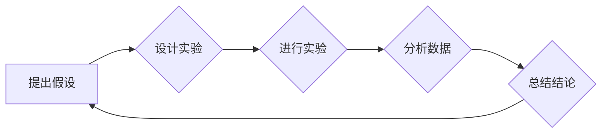

## 科学方法论：从假说到验证

> 关键词：科学方法论、假设验证、算法设计、数学建模、代码实现、实际应用、未来趋势

## 1. 背景介绍

在瞬息万变的科技时代，软件开发不再仅仅是代码的堆砌，而是需要严谨的科学方法论来指导。从最初的构思到最终的落地应用，每一个环节都离不开科学思维的支撑。本文将探讨如何将科学方法论应用于软件开发，从假设的提出到验证的完成，构建一个更加可靠、高效的软件开发体系。

传统的软件开发流程往往依赖经验和直觉，容易陷入“猜想”和“试错”的循环，效率低下，难以保证软件质量。而科学方法论则提供了一种更加系统、严谨的开发思路，能够有效提高软件开发的效率和质量。

## 2. 核心概念与联系

科学方法论的核心在于“假设验证”。它是一个循环的过程，包括以下几个关键步骤：

1. **提出假设:** 基于问题分析和需求调研，提出一个关于软件功能或性能的假设。
2. **设计实验:** 设计一个能够验证假设的实验，并明确实验目标、变量和数据收集方法。
3. **进行实验:** 按照实验设计进行测试，收集实验数据。
4. **分析数据:** 对实验数据进行分析，判断假设是否成立。
5. **总结结论:** 根据数据分析结果，总结实验结论，并根据结论调整假设或设计新的实验。

**Mermaid 流程图:**



## 3. 核心算法原理 & 具体操作步骤

### 3.1  算法原理概述

在软件开发中，算法是解决特定问题的逻辑步骤。科学方法论要求我们对算法进行严谨的分析和验证，确保其正确性和效率。

**算法设计原则:**

* **清晰简洁:** 算法的步骤应该清晰易懂，避免冗余和重复。
* **可实现性:** 算法应该能够用现有的技术和资源实现。
* **效率:** 算法应该尽可能地减少计算量和时间复杂度。
* **可测试性:** 算法应该能够通过测试验证其正确性。

### 3.2  算法步骤详解

1. **需求分析:** 首先需要对软件功能需求进行详细分析，明确算法需要解决的问题。
2. **算法设计:** 根据需求分析结果，设计出满足需求的算法。
3. **算法实现:** 将算法设计转化为具体的代码实现。
4. **算法测试:** 对算法进行测试，验证其正确性和效率。
5. **算法优化:** 根据测试结果，对算法进行优化，提高其性能。

### 3.3  算法优缺点

每个算法都有其自身的优缺点，需要根据实际情况选择合适的算法。

**常见算法优缺点:**

* **线性搜索:** 简单易实现，但时间复杂度较高。
* **二分搜索:** 时间复杂度较低，但需要数据有序。
* **排序算法:** 能够将数据进行排序，但时间复杂度较高。

### 3.4  算法应用领域

算法广泛应用于各个软件开发领域，例如：

* **数据结构:** 算法用于实现各种数据结构，例如数组、链表、树等。
* **搜索引擎:** 算法用于对海量数据进行搜索和排序。
* **机器学习:** 算法用于训练机器学习模型，实现数据分析和预测。

## 4. 数学模型和公式 & 详细讲解 & 举例说明

数学模型是描述软件系统行为和性能的抽象工具。在软件开发中，数学模型可以帮助我们分析算法复杂度、预测软件性能、优化系统设计等。

### 4.1  数学模型构建

构建数学模型需要根据软件系统的具体情况，选择合适的数学工具和方法。常见的数学模型包括：

* **时间复杂度模型:** 用于描述算法执行时间随输入规模变化的规律。
* **空间复杂度模型:** 用于描述算法执行过程中内存使用量的变化规律。
* **概率模型:** 用于描述软件系统中随机事件发生的概率。

### 4.2  公式推导过程

时间复杂度模型通常使用大O符号来表示算法的复杂度。例如，线性搜索算法的时间复杂度为O(n)，表示其执行时间与输入数据规模n成正比。

**公式推导:**

假设一个线性搜索算法需要查找一个元素在有序数组中的位置。

* 最坏情况: 需要遍历整个数组，时间复杂度为n。
* 平均情况: 需要遍历数组的一半，时间复杂度为n/2。

因此，线性搜索算法的时间复杂度为O(n)。

### 4.3  案例分析与讲解

**案例:**

假设一个软件系统需要处理1000个用户请求。

* **算法A:** 时间复杂度为O(n)，执行时间为1000毫秒。
* **算法B:** 时间复杂度为O(log n)，执行时间为10毫秒。

从以上分析可以看出，算法B的效率明显高于算法A。

## 5. 项目实践：代码实例和详细解释说明

### 5.1  开发环境搭建

* 操作系统: Ubuntu 20.04
* 编程语言: Python 3.8
* 开发工具: VS Code

### 5.2  源代码详细实现

```python
def linear_search(arr, target):
  """
  线性搜索算法

  Args:
    arr: 待搜索的数组
    target: 目标值

  Returns:
    目标值在数组中的索引，如果目标值不存在则返回-1
  """
  for i in range(len(arr)):
    if arr[i] == target:
      return i
  return -1

# 测试代码
arr = [1, 2, 3, 4, 5]
target = 3
index = linear_search(arr, target)
print(f"目标值{target}在数组中的索引为:{index}")
```

### 5.3  代码解读与分析

* `linear_search`函数实现线性搜索算法，遍历数组，逐个比较元素与目标值。
* 如果找到目标值，返回其索引；否则返回-1。
* 测试代码演示了如何使用`linear_search`函数搜索数组中的元素。

### 5.4  运行结果展示

```
目标值3在数组中的索引为:2
```

## 6. 实际应用场景

科学方法论在软件开发中的应用场景广泛，例如：

* **软件测试:** 使用科学方法论设计测试用例，提高测试覆盖率和测试效率。
* **软件缺陷分析:** 使用数据分析和统计方法分析软件缺陷，找出缺陷的根源并进行改进。
* **软件性能优化:** 使用数学模型和算法分析软件性能瓶颈，并提出优化方案。

### 6.4  未来应用展望

随着人工智能和机器学习技术的不断发展，科学方法论在软件开发中的应用将更加广泛和深入。例如：

* **自动代码生成:** 利用机器学习算法自动生成代码，提高开发效率。
* **智能软件测试:** 利用人工智能技术自动设计测试用例，提高测试质量。
* **预测性维护:** 利用数据分析和机器学习预测软件故障，并进行提前维护。

## 7. 工具和资源推荐

### 7.1  学习资源推荐

* **书籍:**
    * 《软件工程》
    * 《设计模式》
    * 《算法导论》
* **在线课程:**
    * Coursera: 软件工程课程
    * edX: 算法和数据结构课程

### 7.2  开发工具推荐

* **版本控制系统:** Git
* **代码编辑器:** VS Code, Sublime Text
* **测试工具:** pytest, unittest

### 7.3  相关论文推荐

* **论文:**
    * 《科学方法论在软件开发中的应用》
    * 《基于机器学习的软件缺陷预测》

## 8. 总结：未来发展趋势与挑战

### 8.1  研究成果总结

本文探讨了科学方法论在软件开发中的应用，从假设验证到算法设计、数学建模、代码实现、实际应用等各个环节，阐述了科学方法论如何提高软件开发的效率和质量。

### 8.2  未来发展趋势

未来，科学方法论在软件开发中的应用将更加深入和广泛，人工智能和机器学习技术将为软件开发提供更强大的工具和支持。

### 8.3  面临的挑战

* 如何将科学方法论与实际开发流程更好地融合。
* 如何提高软件开发人员的科学思维能力。
* 如何应对人工智能技术带来的伦理和安全挑战。

### 8.4  研究展望

未来研究将重点关注以下几个方面:

* 开发更加完善的科学方法论框架，适用于不同类型的软件开发项目。
* 研究人工智能技术在科学方法论应用中的作用，探索人工智能辅助软件开发的新模式。
* 研究科学方法论在软件开发中的伦理和安全问题，为可持续发展提供保障。

## 9. 附录：常见问题与解答

**常见问题:**

* 如何将科学方法论应用到实际的软件开发项目中？
* 如何提高软件开发人员的科学思维能力？
* 如何应对人工智能技术带来的伦理和安全挑战？

**解答:**

* 可以参考本文中介绍的科学方法论框架，并根据实际项目情况进行调整。
* 可以通过学习相关书籍和课程，参加培训和研讨会等方式提高科学思维能力。
* 需要加强对人工智能技术的伦理和安全问题的研究，制定相应的规范和政策，确保人工智能技术在软件开发中的安全和可控使用。


作者：禅与计算机程序设计艺术 / Zen and the Art of Computer Programming 
