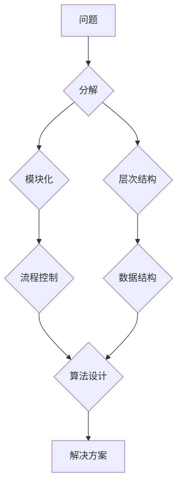

## 结构化思维的应用：从理论到实践

> 关键词：结构化思维、算法设计、数据结构、编程实践、软件架构、复杂系统、问题解决

### 1. 背景介绍

在当今科技日新月异的时代，面对日益复杂的软件系统和技术挑战，结构化思维已成为程序员、软件架构师和技术领导者必备的技能。它不仅能帮助我们更清晰地理解问题，更有效地设计解决方案，还能提升团队协作效率，降低开发成本。

传统的编程方法往往依赖于经验和直觉，容易陷入混乱和难以维护的代码结构。而结构化思维则提供了一种系统化的框架，引导我们以逻辑清晰、层次分明的方式进行思考和编程。它强调将问题分解成更小的、可管理的子问题，并通过明确的步骤和规则进行解决。

### 2. 核心概念与联系

结构化思维的核心概念包括：

* **模块化:** 将复杂系统分解成独立、可重用的模块，提高代码的可读性、可维护性和可扩展性。
* **层次结构:** 将问题分解成多个层次，从高层抽象到低层细节，逐步解决问题。
* **流程控制:** 使用条件语句和循环语句控制程序执行流程，实现逻辑判断和重复操作。
* **数据结构:** 选择合适的存储和组织数据的方式，提高数据访问效率和程序性能。

**Mermaid 流程图:**



### 3. 核心算法原理 & 具体操作步骤

#### 3.1 算法原理概述

算法是解决特定问题的指令序列，是结构化思维的核心。一个好的算法应该具有以下特点：

* **确定性:** 对于给定的输入，算法应该始终产生相同的输出。
* **有限性:** 算法应该在有限的时间内完成执行。
* **有效性:** 算法应该能够被实际计算机执行。

#### 3.2 算法步骤详解

算法设计通常遵循以下步骤：

1. **问题分析:** 仔细理解问题的本质，确定输入、输出和约束条件。
2. **算法设计:** 根据问题特点，选择合适的算法模型和数据结构。
3. **算法实现:** 将算法转化为具体的代码实现。
4. **算法测试:** 对算法进行测试，验证其正确性和效率。
5. **算法优化:** 根据测试结果，对算法进行优化，提高其性能。

#### 3.3 算法优缺点

不同的算法具有不同的优缺点，选择合适的算法取决于具体问题的需求。例如，排序算法中，冒泡排序简单易懂，但效率较低；快速排序效率较高，但需要额外的空间复杂度。

#### 3.4 算法应用领域

算法广泛应用于各个领域，例如：

* **搜索引擎:** 使用算法对海量数据进行索引和检索。
* **机器学习:** 使用算法从数据中学习模式和规律。
* **图像处理:** 使用算法对图像进行识别、分类和处理。
* **金融交易:** 使用算法进行风险管理和投资决策。

### 4. 数学模型和公式 & 详细讲解 & 举例说明

#### 4.1 数学模型构建

数学模型可以用来描述算法的运行过程和性能。例如，时间复杂度和空间复杂度是常用的数学模型，用来衡量算法的效率。

#### 4.2 公式推导过程

时间复杂度通常用大O符号表示，例如O(n)表示算法的时间复杂度与输入数据大小n成正比。空间复杂度表示算法使用的内存空间大小。

#### 4.3 案例分析与讲解

例如，冒泡排序算法的时间复杂度为O(n^2)，空间复杂度为O(1)。这意味着算法的执行时间随着输入数据大小的增加而呈平方增长，但使用的内存空间相对较小。

### 5. 项目实践：代码实例和详细解释说明

#### 5.1 开发环境搭建

选择合适的编程语言和开发环境，例如Python和VS Code。

#### 5.2 源代码详细实现

```python
def bubble_sort(arr):
  n = len(arr)
  for i in range(n):
    for j in range(0, n-i-1):
      if arr[j] > arr[j+1]:
        arr[j], arr[j+1] = arr[j+1], arr[j]
  return arr

# 测试代码
arr = [64, 34, 25, 12, 22, 11, 90]
sorted_arr = bubble_sort(arr)
print("排序后的数组:", sorted_arr)
```

#### 5.3 代码解读与分析

这段代码实现了一个冒泡排序算法。

* 外层循环控制排序的轮数，每次循环将最大的元素“冒泡”到数组末尾。
* 内层循环比较相邻元素，如果顺序错误则交换位置。
* 循环结束后，数组已经按照升序排列。

#### 5.4 运行结果展示

```
排序后的数组: [11, 12, 22, 25, 34, 64, 90]
```

### 6. 实际应用场景

结构化思维在软件开发各个阶段都有广泛应用，例如：

* **需求分析:** 将用户需求分解成具体的子功能，方便开发和测试。
* **系统设计:** 将系统分解成不同的模块，明确每个模块的功能和职责。
* **代码编写:** 使用模块化和层次结构，编写清晰、可维护的代码。
* **测试用例设计:** 将测试用例分解成不同的场景，覆盖所有功能模块。
* **问题排查:** 使用逻辑分析和调试工具，逐步定位问题根源。

### 6.4 未来应用展望

随着软件系统越来越复杂，结构化思维将变得更加重要。未来，结构化思维将与人工智能、云计算等新技术相结合，推动软件开发的自动化和智能化。

### 7. 工具和资源推荐

#### 7.1 学习资源推荐

* 书籍：《程序员修炼之道》、《代码大全》
* 在线课程：Coursera、edX、Udemy

#### 7.2 开发工具推荐

* 编程语言：Python、Java、C++
* 代码编辑器：VS Code、Sublime Text
* 版本控制系统：Git

#### 7.3 相关论文推荐

* 《The Art of Computer Programming》
* 《Introduction to Algorithms》

### 8. 总结：未来发展趋势与挑战

#### 8.1 研究成果总结

结构化思维已成为软件开发领域的重要理论和实践，它提高了代码质量、开发效率和团队协作能力。

#### 8.2 未来发展趋势

未来，结构化思维将与人工智能、云计算等新技术相结合，推动软件开发的自动化和智能化。

#### 8.3 面临的挑战

* 如何将结构化思维应用于更复杂、更动态的软件系统。
* 如何提高团队成员的结构化思维能力。
* 如何将结构化思维与其他软件开发方法相结合。

#### 8.4 研究展望

未来研究将重点关注以下方面：

* 开发更适合复杂系统结构化思维的方法。
* 设计更有效的结构化思维培训课程。
* 研究结构化思维与人工智能的结合。

### 9. 附录：常见问题与解答

* **什么是结构化思维？**

结构化思维是一种系统化的思考方式，它强调将问题分解成更小的、可管理的子问题，并通过明确的步骤和规则进行解决。

* **结构化思维有什么好处？**

结构化思维可以帮助我们更清晰地理解问题，更有效地设计解决方案，还能提升代码可读性、可维护性和可扩展性。

* **如何培养结构化思维能力？**

可以通过学习相关书籍和课程，练习分解问题和设计算法，以及使用结构化思维工具来培养结构化思维能力。


作者：禅与计算机程序设计艺术 / Zen and the Art of Computer Programming 
