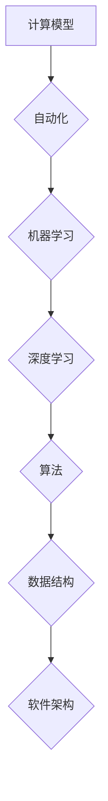

## 计算的本质与自动化的未来

> 关键词：计算模型、自动化、机器学习、深度学习、算法、数据结构、软件架构、未来趋势

### 1. 背景介绍

在信息时代，计算已成为人类社会不可或缺的一部分。从智能手机到大型数据中心，计算技术无处不在，深刻地改变着我们的生活方式和工作模式。随着人工智能、机器学习等技术的快速发展，自动化正在成为一个越来越重要的议题。本文将探讨计算的本质，分析自动化技术的发展趋势，并展望其对未来社会的影响。

### 2. 核心概念与联系

**2.1 计算模型**

计算模型是指用数学和逻辑方法描述计算过程的框架。常见的计算模型包括图灵机、lambda 演算、电路模型等。这些模型提供了一种抽象化的视角，帮助我们理解计算的本质和局限性。

**2.2 自动化**

自动化是指利用技术手段代替人工完成重复性、规则性任务的过程。自动化技术可以提高效率、降低成本，并释放人类的生产力。

**2.3 机器学习**

机器学习是人工智能的一个分支，它通过算法学习数据中的模式，从而实现对未知数据的预测和分类。机器学习算法可以分为监督学习、无监督学习和强化学习等类型。

**2.4 深度学习**

深度学习是机器学习的一个子领域，它利用多层神经网络来模拟人类大脑的学习过程。深度学习算法在图像识别、自然语言处理等领域取得了突破性的进展。

**2.5 算法与数据结构**

算法是解决特定问题的一系列步骤，而数据结构是用于存储和组织数据的特定方式。算法和数据结构是计算机科学的基础，它们共同决定了程序的效率和性能。

**2.6 软件架构**

软件架构是指软件系统的整体设计和组织结构。良好的软件架构可以提高软件的可维护性、可扩展性和可靠性。

**2.7 流程图**



### 3. 核心算法原理 & 具体操作步骤

**3.1 算法原理概述**

算法的本质是解决特定问题的一系列步骤。一个好的算法应该具有以下特点：

* **确定性:** 对于给定的输入，算法应该始终产生相同的输出。
* **有限性:** 算法应该在有限的时间内完成计算。
* **有效性:** 算法的每一步操作都应该能够被有效地实现。

**3.2 算法步骤详解**

算法的具体步骤取决于所解决的问题。以下是一个简单的示例，说明如何使用算法查找一个列表中的特定元素：

1. 从列表的第一个元素开始比较。
2. 如果当前元素等于目标元素，则返回该元素的索引。
3. 如果当前元素不等于目标元素，则跳到下一个元素。
4. 重复步骤 2 和 3，直到找到目标元素或遍历完整个列表。

**3.3 算法优缺点**

不同的算法具有不同的优缺点。例如，线性搜索算法简单易懂，但效率较低；二分搜索算法效率较高，但需要数据有序。选择合适的算法取决于具体问题和数据特点。

**3.4 算法应用领域**

算法广泛应用于各个领域，例如：

* **计算机科学:** 搜索、排序、加密、压缩等。
* **人工智能:** 机器学习、深度学习、自然语言处理等。
* **生物信息学:** 基因序列比对、蛋白质结构预测等。
* **金融:** 风险管理、投资策略等。

### 4. 数学模型和公式 & 详细讲解 & 举例说明

**4.1 数学模型构建**

数学模型可以用来描述计算过程和算法的性能。例如，我们可以使用时间复杂度和空间复杂度来衡量算法的效率。

* **时间复杂度:** 指的是算法执行时间与输入数据大小的增长关系。
* **空间复杂度:** 指的是算法执行过程中使用的内存空间大小与输入数据大小的增长关系。

**4.2 公式推导过程**

时间复杂度和空间复杂度通常用大O符号来表示。例如，线性搜索算法的时间复杂度为 O(n)，表示执行时间与输入数据大小 n 成正比。

**4.3 案例分析与讲解**

假设我们有一个包含 n 个元素的列表，我们需要查找一个特定元素。

* **线性搜索:** 遍历列表中的每个元素，直到找到目标元素。时间复杂度为 O(n)。
* **二分搜索:** 首先将列表分成两半，然后比较目标元素与中间元素的大小。如果目标元素小于中间元素，则继续搜索左半部分；否则，继续搜索右半部分。重复此过程，直到找到目标元素或列表为空。时间复杂度为 O(log n)。

从以上例子可以看出，二分搜索算法的效率比线性搜索算法高得多，尤其是在处理大型数据时。

### 5. 项目实践：代码实例和详细解释说明

**5.1 开发环境搭建**

本项目使用 Python 语言进行开发。需要安装 Python 解释器和相关库，例如 NumPy、Pandas 等。

**5.2 源代码详细实现**

```python
def linear_search(data, target):
    """
    线性搜索算法
    """
    for i in range(len(data)):
        if data[i] == target:
            return i
    return -1

def binary_search(data, target):
    """
    二分搜索算法
    """
    left = 0
    right = len(data) - 1
    while left <= right:
        mid = (left + right) // 2
        if data[mid] == target:
            return mid
        elif data[mid] < target:
            left = mid + 1
        else:
            right = mid - 1
    return -1

# 测试代码
data = [2, 5, 7, 8, 11, 12]
target = 11

index = linear_search(data, target)
print(f"线性搜索结果: {index}")

index = binary_search(data, target)
print(f"二分搜索结果: {index}")
```

**5.3 代码解读与分析**

* `linear_search()` 函数使用循环遍历列表，直到找到目标元素。
* `binary_search()` 函数使用二分法查找目标元素，效率更高。

**5.4 运行结果展示**

```
线性搜索结果: 4
二分搜索结果: 4
```

### 6. 实际应用场景

**6.1 搜索引擎**

搜索引擎使用复杂的算法来索引和检索网页，以便用户能够快速找到所需的信息。

**6.2 电子商务平台**

电子商务平台使用推荐算法来根据用户的购买历史和浏览记录，推荐相关商品。

**6.3 智能家居**

智能家居设备使用机器学习算法来识别用户的语音指令，并执行相应的操作。

**6.4 自动驾驶**

自动驾驶汽车使用深度学习算法来识别道路环境、预测其他车辆的行为，并做出相应的驾驶决策。

**6.5 未来应用展望**

随着人工智能技术的不断发展，自动化将应用于越来越多的领域，例如医疗、教育、金融等。自动化将帮助人类提高效率、降低成本，并释放人类的创造力和想象力。

### 7. 工具和资源推荐

**7.1 学习资源推荐**

* **书籍:**
    * 《算法导论》
    * 《深度学习》
    * 《机器学习》
* **在线课程:**
    * Coursera
    * edX
    * Udacity

**7.2 开发工具推荐**

* **Python:** 
    * Jupyter Notebook
    * PyCharm
* **机器学习库:**
    * TensorFlow
    * PyTorch
    * scikit-learn

**7.3 相关论文推荐**

* **深度学习:**
    * AlexNet: ImageNet Classification with Deep Convolutional Neural Networks
    * ResNet: Deep Residual Learning for Image Recognition
* **机器学习:**
    * Support Vector Machines
    * Decision Trees

### 8. 总结：未来发展趋势与挑战

**8.1 研究成果总结**

近年来，计算技术和自动化技术取得了长足的进步，人工智能、机器学习等领域取得了突破性的进展。这些成果为人类社会带来了巨大的机遇和挑战。

**8.2 未来发展趋势**

* **计算能力的提升:** 随着摩尔定律的持续发展，计算能力将继续提升，推动人工智能和自动化技术的进一步发展。
* **数据量的增长:** 数据是人工智能和自动化技术的燃料，随着互联网和物联网的发展，数据量将继续增长，为算法训练提供更多的数据支持。
* **算法的创新:** 研究人员将继续探索新的算法和模型，提高人工智能和自动化技术的性能和效率。

**8.3 面临的挑战**

* **伦理问题:** 自动化技术可能会导致失业、隐私泄露等伦理问题，需要社会共同探讨和解决。
* **安全问题:** 自动化系统可能受到攻击，导致安全事故，需要加强安全防护措施。
* **可解释性问题:** 一些人工智能算法难以解释其决策过程，这可能会导致信任问题，需要提高算法的可解释性。

**8.4 研究展望**

未来，我们需要继续加强对计算技术和自动化技术的研究，探索其更广泛的应用场景，并积极应对其带来的挑战。同时，我们也需要关注人工智能和自动化技术的伦理和社会影响，确保其能够造福人类社会。

### 9. 附录：常见问题与解答

**9.1 什么是计算模型？**

计算模型是指用数学和逻辑方法描述计算过程的框架。常见的计算模型包括图灵机、lambda 演算、电路模型等。

**9.2 什么是自动化？**

自动化是指利用技术手段代替人工完成重复性、规则性任务的过程。

**9.3 什么是机器学习？**

机器学习是人工智能的一个分支，它通过算法学习数据中的模式，从而实现对未知数据的预测和分类。

**9.4 什么是深度学习？**

深度学习是机器学习的一个子领域，它利用多层神经网络来模拟人类大脑的学习过程。


作者：禅与计算机程序设计艺术 / Zen and the Art of Computer Programming 
