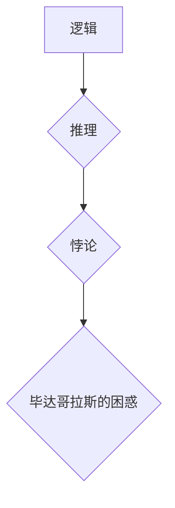

## 计算：第一部分 计算的诞生 第 1 章 毕达哥拉斯的困惑 悖论：推理的暗面

> 关键词：计算、逻辑、悖论、推理、毕达哥拉斯、集合论、无限、算法

### 1. 背景介绍

在人类文明的漫长历史中，对“计算”的理解和追求始终如一。从古代的算盘到现代的超级计算机，我们不断地探索着计算的本质和边界。然而，在计算的道路上，也存在着许多令人困惑的悖论，它们挑战着我们对逻辑和推理的认知。

毕达哥拉斯，这位古希腊数学家，以其对数字的热爱和对和谐的追求而闻名。他相信数字是宇宙的基石，一切事物都可以用数字来表达。然而，即使是这位伟大的数学家，也无法完全逃脱逻辑悖论的困扰。

### 2. 核心概念与联系

**2.1 逻辑与推理**

逻辑是思维的基石，它提供了一种严密的推理方法，帮助我们从已知的事实出发，推导出新的结论。推理则是运用逻辑规则，从已知前提出发，得出新的推论的过程。

**2.2 悖论的本质**

悖论是指看似合理的论证，却导致自相矛盾或荒谬结论的逻辑错误。它们往往揭示了我们对某些概念的理解存在缺陷，或者逻辑体系本身存在漏洞。

**2.3 毕达哥拉斯的困惑**

毕达哥拉斯相信数字是宇宙的基石，但他也意识到数字的无限性。他试图用数字来描述宇宙的结构，却遇到了一个难题：无限集合的悖论。

**2.4  Mermaid 流程图**



### 3. 核心算法原理 & 具体操作步骤

**3.1 算法原理概述**

在计算机科学中，算法是指解决特定问题的一系列步骤。算法的本质是逻辑的表达，它通过一系列的指令，将输入数据转化为输出结果。

**3.2 算法步骤详解**

1. **输入数据:** 算法首先需要接收输入数据。
2. **数据处理:** 算法对输入数据进行一系列的处理操作，例如计算、比较、排序等。
3. **输出结果:** 算法最终输出处理后的结果。

**3.3 算法优缺点**

* **优点:** 算法可以使计算过程更加高效、准确和可重复。
* **缺点:** 算法的复杂性可能会导致理解和实现困难。

**3.4 算法应用领域**

算法广泛应用于各个领域，例如：

* **计算机科学:** 搜索引擎、数据结构、人工智能等。
* **工程学:** 控制系统、信号处理、优化设计等。
* **生物学:** 基因序列分析、蛋白质结构预测等。

### 4. 数学模型和公式 & 详细讲解 & 举例说明

**4.1 数学模型构建**

我们可以用数学模型来描述算法的逻辑关系。例如，我们可以用集合论来描述算法的输入和输出数据，用逻辑公式来描述算法的处理步骤。

**4.2 公式推导过程**

例如，我们可以用以下逻辑公式来描述一个简单的算法：

```latex
如果 A 并且 B，那么 C
```

这个公式表示，如果两个条件 A 和 B 都满足，那么结论 C 就成立。

**4.3 案例分析与讲解**

例如，我们可以用这个公式来描述一个简单的判断算法：

* A: 输入数字大于 0
* B: 输入数字小于 10
* C: 输出数字在 0 和 10 之间

如果输入数字同时满足 A 和 B 的条件，那么算法就会输出 C。

### 5. 项目实践：代码实例和详细解释说明

**5.1 开发环境搭建**

我们可以使用 Python 语言来实现这个简单的判断算法。

**5.2 源代码详细实现**

```python
def judge_number(num):
  if num > 0 and num < 10:
    return "数字在 0 和 10 之间"
  else:
    return "数字不在 0 和 10 之间"

# 测试代码
number = 5
result = judge_number(number)
print(f"输入数字 {number}，结果：{result}")
```

**5.3 代码解读与分析**

这段代码定义了一个名为 `judge_number` 的函数，该函数接受一个数字作为输入，并根据输入数字是否在 0 和 10 之间返回不同的结果。

**5.4 运行结果展示**

```
输入数字 5，结果：数字在 0 和 10 之间
```

### 6. 实际应用场景

这个简单的判断算法可以应用于各种场景，例如：

* **游戏开发:** 判断玩家输入的数字是否在允许范围内。
* **数据分析:** 判断数据是否符合预期的范围。
* **自动化测试:** 判断程序的输出结果是否符合预期。

**6.4 未来应用展望**

随着人工智能和机器学习的发展，算法将扮演更加重要的角色。例如，我们可以使用算法来训练机器学习模型，使它们能够自动学习和决策。

### 7. 工具和资源推荐

**7.1 学习资源推荐**

* **书籍:** 《算法导论》
* **在线课程:** Coursera 上的算法课程

**7.2 开发工具推荐**

* **Python:** 一种广泛使用的编程语言，适合学习和实践算法。
* **Jupyter Notebook:** 一种交互式编程环境，方便算法的调试和测试。

**7.3 相关论文推荐**

* **图灵奖获奖论文:** 这些论文涵盖了算法学领域的重要进展。

### 8. 总结：未来发展趋势与挑战

**8.1 研究成果总结**

算法学是一个不断发展的领域，近年来取得了显著的进展。例如，我们已经开发出许多高效的算法，用于解决各种复杂问题。

**8.2 未来发展趋势**

* **人工智能:** 算法将成为人工智能的核心技术，推动人工智能的快速发展。
* **量子计算:** 量子算法将为解决某些传统算法无法解决的问题提供新的思路。
* **大数据分析:** 大数据分析需要高效的算法来处理海量数据。

**8.3 面临的挑战**

* **算法复杂性:** 随着问题的复杂性增加，算法的开发和实现变得更加困难。
* **算法可解释性:** 一些复杂的算法难以解释其决策过程，这可能会导致信任问题。
* **算法伦理:** 算法的应用可能会带来伦理问题，例如算法偏见和隐私泄露。

**8.4 研究展望**

未来，算法学的研究将继续探索新的算法、新的应用领域，并解决算法带来的伦理挑战。


### 9. 附录：常见问题与解答

**9.1 什么是算法？**

算法是指解决特定问题的一系列步骤。

**9.2 如何设计一个好的算法？**

设计一个好的算法需要考虑以下因素：

* **效率:** 算法的执行时间和空间复杂度。
* **正确性:** 算法能够正确解决问题。
* **可读性:** 算法易于理解和维护。

**9.3 算法的应用领域有哪些？**

算法广泛应用于各个领域，例如：

* 计算机科学
* 工程学
* 生物学


作者：禅与计算机程序设计艺术 / Zen and the Art of Computer Programming 
