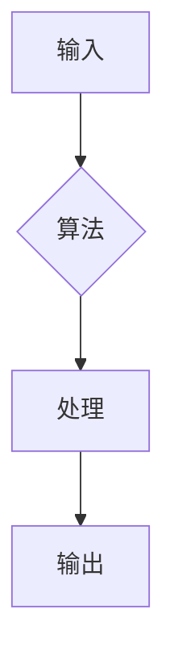

## 计算：第一部分 计算的诞生

> 关键词：计算、算法、逻辑、数学模型、计算机科学、程序设计、计算基础

### 1. 背景介绍

自人类诞生以来，对未知世界的探索和对复杂问题的解决一直是推动社会进步的强大动力。随着文明的发展，人们逐渐意识到，通过系统化的逻辑思维和重复性的操作，可以有效地处理信息、解决问题，并最终实现对世界的理解和控制。这种对信息处理和逻辑推理的追求，正是计算的起源。

从古代的算盘到现代的超级计算机，计算经历了漫长的演变过程。早期的人类依靠简单的工具和方法进行计算，例如使用手指、石块或刻痕来进行计数和运算。随着社会的发展，人们逐渐发明了更复杂的计算工具，例如算盘、机械计算器和差分机。这些工具虽然提高了计算效率，但仍然局限于简单的算术运算。

20世纪的到来标志着计算的真正飞跃。图灵机的概念诞生，为计算机科学奠定了坚实的基础。随后，电子计算机的出现彻底改变了人类的生活和工作方式。计算不再是简单的机械操作，而是通过电子信号和逻辑电路实现的复杂信息处理过程。

### 2. 核心概念与联系

计算的核心概念是**算法**。算法是一种解决特定问题的精确步骤序列，它可以被计算机理解和执行。算法的本质是逻辑推理和数据处理的系统化描述。

**计算的流程**可以概括为以下几个步骤：

1. **输入**: 从外部获取数据或信息。
2. **处理**: 根据算法对输入数据进行一系列操作。
3. **输出**: 将处理结果以某种形式呈现出来。

**计算与逻辑**有着密切的联系。算法的本质就是逻辑推理的表达，它通过一系列的逻辑判断和操作来处理数据。

**计算与数学模型**也息息相关。许多算法可以用数学公式来描述，数学模型可以帮助我们理解算法的原理和性能。

**Mermaid 流程图**



### 3. 核心算法原理 & 具体操作步骤

#### 3.1 算法原理概述

**排序算法**是一种将给定的数据按照特定顺序排列的算法。排序算法是计算机科学中应用广泛的算法之一，它在许多领域都有着重要的应用价值，例如数据检索、数据库管理和机器学习。

#### 3.2 算法步骤详解

**冒泡排序**是一种简单的排序算法，它通过反复比较相邻元素，并将较大的元素“冒泡”到排序后的末尾，从而实现数据排序。

1. 比较相邻元素，如果顺序错误，则交换它们的位置。
2. 重复步骤1，直到整个数据序列排序完成。

#### 3.3 算法优缺点

**优点:**

* 算法简单易懂，实现代码容易编写。
* 对于少量数据，效率相对较高。

**缺点:**

* 效率较低，时间复杂度为O(n^2)，对于大量数据排序效率极低。
* 稳定性较差，相同元素的相对顺序可能发生改变。

#### 3.4 算法应用领域

冒泡排序在实际应用中主要用于：

* **教育教学:** 用于讲解排序算法的基本原理。
* **小型数据排序:** 对于少量数据排序，冒泡排序的效率相对较高。
* **代码示例:** 用于演示简单排序算法的实现。

### 4. 数学模型和公式 & 详细讲解 & 举例说明

#### 4.1 数学模型构建

冒泡排序的数学模型可以描述为一个迭代过程，其中每个迭代步骤都比较相邻元素并进行交换。

#### 4.2 公式推导过程

设有n个元素的序列，则冒泡排序的迭代次数为n-1。每个迭代步骤的时间复杂度为O(n)，因此冒泡排序的时间复杂度为O(n^2)。

#### 4.3 案例分析与讲解

假设有一个序列： [5, 1, 4, 2, 8]

**第一次迭代:**

* 比较 5 和 1，交换位置，得到 [1, 5, 4, 2, 8]
* 比较 5 和 4，交换位置，得到 [1, 4, 5, 2, 8]
* 比较 5 和 2，交换位置，得到 [1, 4, 2, 5, 8]
* 比较 5 和 8，不交换位置

**第二次迭代:**

* 比较 1 和 4，不交换位置
* 比较 4 和 2，交换位置，得到 [1, 2, 4, 5, 8]
* 比较 4 和 5，不交换位置
* 比较 5 和 8，不交换位置

以此类推，直到整个序列排序完成。

### 5. 项目实践：代码实例和详细解释说明

#### 5.1 开发环境搭建

本项目使用 Python 语言进行开发，开发环境搭建如下：

* Python 3.x 版本
* VS Code 或其他文本编辑器

#### 5.2 源代码详细实现

```python
def bubble_sort(data):
    n = len(data)
    for i in range(n-1):
        for j in range(n-i-1):
            if data[j] > data[j+1]:
                data[j], data[j+1] = data[j+1], data[j]
    return data

# 测试代码
data = [5, 1, 4, 2, 8]
sorted_data = bubble_sort(data)
print(f"排序后的数据: {sorted_data}")
```

#### 5.3 代码解读与分析

* `bubble_sort(data)` 函数接收一个列表 `data` 作为输入，并返回排序后的列表。
* 外层循环 `for i in range(n-1)` 控制迭代次数，每次迭代将最大的元素“冒泡”到末尾。
* 内层循环 `for j in range(n-i-1)` 比较相邻元素，如果顺序错误，则交换位置。
* `if data[j] > data[j+1]:` 判断相邻元素的顺序是否正确。
* `data[j], data[j+1] = data[j+1], data[j]` 交换相邻元素的位置。

#### 5.4 运行结果展示

```
排序后的数据: [1, 2, 4, 5, 8]
```

### 6. 实际应用场景

冒泡排序在实际应用中主要用于：

* **教育教学:** 用于讲解排序算法的基本原理。
* **小型数据排序:** 对于少量数据排序，冒泡排序的效率相对较高。
* **代码示例:** 用于演示简单排序算法的实现。

### 6.4 未来应用展望

随着人工智能和机器学习的发展，排序算法在数据处理和分析领域将发挥越来越重要的作用。新的排序算法不断涌现，例如基于图的排序算法和基于深度学习的排序算法，这些算法将进一步提高排序效率和准确性。

### 7. 工具和资源推荐

#### 7.1 学习资源推荐

* **书籍:**
    * 《算法导论》
    * 《数据结构与算法分析》
* **在线课程:**
    * Coursera: 数据结构与算法
    * edX: 算法导论

#### 7.2 开发工具推荐

* **Python:** 
    * VS Code
    * PyCharm
* **其他语言:**
    * Java: Eclipse, IntelliJ IDEA
    * C++: Visual Studio, Code::Blocks

#### 7.3 相关论文推荐

* **The Analysis of Algorithms** by Thomas H. Cormen, Charles E. Leiserson, Ronald L. Rivest, and Clifford Stein
* **Introduction to Algorithms** by Cormen, Leiserson, Rivest, and Stein

### 8. 总结：未来发展趋势与挑战

#### 8.1 研究成果总结

计算科学的发展离不开算法的不断创新和完善。从简单的排序算法到复杂的机器学习算法，算法的不断演进推动着计算技术的进步。

#### 8.2 未来发展趋势

* **人工智能驱动的算法设计:** 人工智能技术将进一步推动算法设计，例如使用深度学习算法自动生成高效的排序算法。
* **并行和分布式算法:** 随着计算资源的不断增加，并行和分布式算法将成为主流，提高算法的效率和处理能力。
* **量子计算算法:** 量子计算技术的出现将带来全新的算法设计思路，例如量子排序算法，具有更高的效率和处理能力。

#### 8.3 面临的挑战

* **算法复杂度:** 随着数据规模的不断增长，算法的复杂度将成为一个重要的挑战，需要设计更高效的算法来应对大规模数据处理。
* **算法可解释性:** 随着人工智能算法的复杂性增加，算法的可解释性成为一个重要的研究方向，需要开发能够解释算法决策过程的方法。
* **算法安全性和隐私保护:** 算法的安全性和隐私保护也是一个重要的挑战，需要设计能够抵御攻击和保护用户隐私的算法。

#### 8.4 研究展望

未来，计算科学将继续朝着更高效、更智能、更安全的方向发展。算法设计将成为推动计算科学进步的关键因素，需要不断探索新的算法设计思路和技术方法，以应对未来计算领域的挑战。

### 9. 附录：常见问题与解答

**Q1: 冒泡排序的效率如何？**

A1: 冒泡排序的效率较低，时间复杂度为O(n^2)，对于大量数据排序效率极低。

**Q2: 冒泡排序的稳定性如何？**

A2: 冒泡排序的稳定性较差，相同元素的相对顺序可能发生改变。

**Q3: 冒泡排序有哪些应用场景？**

A3: 冒泡排序主要用于教育教学、小型数据排序和代码示例。


作者：禅与计算机程序设计艺术 / Zen and the Art of Computer Programming 
