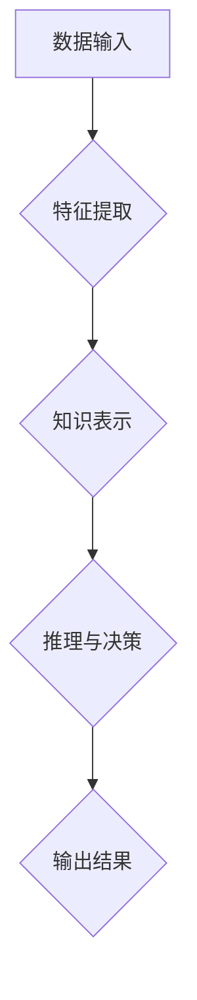

## 认知过程中的深刻化演变

> 关键词：深度学习、神经网络、认知科学、人工智能、强化学习、迁移学习、泛化能力

### 1. 背景介绍

人工智能（AI）的蓬勃发展，特别是深度学习技术的突破，为我们构建更智能、更接近人类认知的机器系统提供了前所未有的机遇。然而，现有的AI系统仍然面临着许多挑战，例如缺乏泛化能力、对新知识的学习能力有限以及难以理解和解释其决策过程。这些问题都与AI系统认知能力的局限性密切相关。

认知过程是人类获取、处理和利用信息以理解世界并做出决策的复杂过程。它涉及感知、记忆、推理、语言理解和决策等多个方面。传统AI系统主要依靠规则和符号逻辑进行推理，而深度学习则通过模仿大脑神经网络的结构和功能，学习从数据中提取特征和模式。尽管深度学习取得了显著的成果，但它仍然难以完全模拟人类的复杂认知过程。

### 2. 核心概念与联系

**2.1 深度学习与认知科学**

深度学习的核心概念是多层神经网络，它能够学习数据中的复杂特征和模式。神经网络的结构和功能灵感来源于大脑神经元网络，通过连接和权重调整，网络能够学习并处理信息。

认知科学研究人类的思维、学习、记忆、语言和感知等认知过程。深度学习与认知科学的结合，旨在利用深度学习的强大能力来模拟和理解人类的认知过程。

**2.2 深刻化演变**

“深刻化演变”是指深度学习在认知能力方面不断提升的趋势。它包括以下几个方面：

* **模型深度和复杂度增加:** 深度学习模型的层数和参数数量不断增加，能够学习更复杂的数据特征。
* **多模态学习:** 深度学习模型能够处理多种类型的数据，例如文本、图像、音频和视频，从而更全面地理解世界。
* **迁移学习:** 深度学习模型能够将已学习到的知识迁移到新的任务和领域，提高学习效率和泛化能力。
* **强化学习:** 深度学习模型能够通过与环境交互学习，并根据奖励信号优化其行为，从而更接近人类的决策过程。

**2.3 深刻化演变的架构**



### 3. 核心算法原理 & 具体操作步骤

**3.1 算法原理概述**

深度学习的核心算法是反向传播算法，它通过调整神经网络的权重来最小化模型预测误差。

反向传播算法的工作原理是：

1. 将输入数据输入到神经网络中，并计算输出结果。
2. 计算输出结果与真实值的误差。
3. 根据误差反向传播，调整神经网络各层的权重。
4. 重复步骤1-3，直到模型预测误差达到最小值。

**3.2 算法步骤详解**

1. **初始化权重:** 为神经网络中的每个连接赋予一个随机权重。
2. **前向传播:** 将输入数据逐层传递到神经网络中，计算每个神经元的激活值。
3. **计算损失函数:** 计算模型预测结果与真实值的误差，使用损失函数来量化误差。
4. **反向传播:** 计算损失函数对每个权重的梯度，即权重调整的方向和幅度。
5. **更新权重:** 使用梯度下降算法更新每个权重，使其朝着减小损失函数的方向调整。
6. **重复步骤2-5:** 重复前向传播、计算损失函数和反向传播的过程，直到模型预测误差达到最小值。

**3.3 算法优缺点**

**优点:**

* 能够学习数据中的复杂特征和模式。
* 泛化能力强，能够应用于不同的任务和领域。
* 自动特征提取，无需人工特征工程。

**缺点:**

* 训练时间长，需要大量的计算资源。
* 容易过拟合，需要使用正则化技术来防止。
* 模型解释性差，难以理解模型的决策过程。

**3.4 算法应用领域**

深度学习算法广泛应用于以下领域：

* **计算机视觉:** 图像识别、物体检测、图像分割、人脸识别等。
* **自然语言处理:** 文本分类、情感分析、机器翻译、对话系统等。
* **语音识别:** 语音转文本、语音合成等。
* **推荐系统:** 商品推荐、内容推荐等。
* **医疗诊断:** 病理图像分析、疾病预测等。

### 4. 数学模型和公式 & 详细讲解 & 举例说明

**4.1 数学模型构建**

深度学习模型通常由多个神经网络层组成，每个层包含多个神经元。神经元之间通过连接和权重进行信息传递。

**4.2 公式推导过程**

* **激活函数:** 激活函数用于将神经元的输入转换为输出，常用的激活函数包括 sigmoid 函数、ReLU 函数和 tanh 函数。

* **损失函数:** 损失函数用于衡量模型预测结果与真实值的误差，常用的损失函数包括均方误差 (MSE) 和交叉熵损失 (Cross-Entropy Loss)。

* **梯度下降算法:** 梯度下降算法用于更新神经网络的权重，使其朝着减小损失函数的方向调整。

**4.3 案例分析与讲解**

以图像分类为例，假设我们有一个包含猫和狗的图像数据集。深度学习模型可以学习到猫和狗的特征，并根据这些特征对新的图像进行分类。

* **输入数据:** 图像数据经过预处理后，转换为一个多维向量。
* **特征提取:** 神经网络的卷积层和池化层用于提取图像的特征，例如边缘、纹理和形状。
* **分类:** 全连接层将提取的特征映射到不同的类别，例如猫和狗。
* **损失函数:** 使用交叉熵损失函数来衡量模型预测结果与真实标签之间的差异。
* **梯度下降:** 使用梯度下降算法更新神经网络的权重，使其能够更好地分类图像。

### 5. 项目实践：代码实例和详细解释说明

**5.1 开发环境搭建**

* 安装 Python 语言和相关库，例如 TensorFlow 或 PyTorch。
* 设置开发环境，例如使用 Jupyter Notebook 或 VS Code。

**5.2 源代码详细实现**

```python
import tensorflow as tf

# 定义模型结构
model = tf.keras.models.Sequential([
    tf.keras.layers.Conv2D(32, (3, 3), activation='relu', input_shape=(28, 28, 1)),
    tf.keras.layers.MaxPooling2D((2, 2)),
    tf.keras.layers.Conv2D(64, (3, 3), activation='relu'),
    tf.keras.layers.MaxPooling2D((2, 2)),
    tf.keras.layers.Flatten(),
    tf.keras.layers.Dense(10, activation='softmax')
])

# 编译模型
model.compile(optimizer='adam',
              loss='sparse_categorical_crossentropy',
              metrics=['accuracy'])

# 加载数据集
(x_train, y_train), (x_test, y_test) = tf.keras.datasets.mnist.load_data()

# 训练模型
model.fit(x_train, y_train, epochs=5)

# 评估模型
loss, accuracy = model.evaluate(x_test, y_test)
print('Test loss:', loss)
print('Test accuracy:', accuracy)
```

**5.3 代码解读与分析**

* 代码定义了一个简单的卷积神经网络模型，用于图像分类。
* 模型包含卷积层、池化层和全连接层。
* 使用 Adam 优化器、交叉熵损失函数和准确率作为评估指标。
* 使用 MNIST 手写数字数据集进行训练和评估。

**5.4 运行结果展示**

训练完成后，模型能够对新的手写数字图像进行分类。

### 6. 实际应用场景

**6.1 医疗诊断**

深度学习可以用于分析医学图像，例如 X 光片、CT 扫描和 MRI 图像，帮助医生诊断疾病。

**6.2 自动驾驶**

深度学习可以用于训练自动驾驶汽车的感知系统，识别道路、交通标志和行人。

**6.3 金融风险管理**

深度学习可以用于分析金融数据，识别欺诈交易和预测市场风险。

**6.4 未来应用展望**

随着深度学习技术的不断发展，其应用场景将更加广泛，例如：

* **个性化教育:** 根据学生的学习情况提供个性化的学习内容和教学方法。
* **智能客服:** 使用深度学习构建更智能的聊天机器人，提供更人性化的服务。
* **科学发现:** 利用深度学习分析海量科学数据，加速科学发现。

### 7. 工具和资源推荐

**7.1 学习资源推荐**

* **书籍:**
    * 深度学习 (Deep Learning) - Ian Goodfellow, Yoshua Bengio, Aaron Courville
    * 深度学习实践 (Deep Learning with Python) - Francois Chollet
* **在线课程:**
    * Coursera: 深度学习 Specialization
    * Udacity: 深度学习 Nanodegree
    * fast.ai: 深度学习课程

**7.2 开发工具推荐**

* **TensorFlow:** Google 开发的开源深度学习框架。
* **PyTorch:** Facebook 开发的开源深度学习框架。
* **Keras:** TensorFlow 的高层API，简化深度学习模型的构建。

**7.3 相关论文推荐**

* **AlexNet:** ImageNet Classification with Deep Convolutional Neural Networks
* **VGGNet:** Very Deep Convolutional Networks for Large-Scale Image Recognition
* **ResNet:** Deep Residual Learning for Image Recognition

### 8. 总结：未来发展趋势与挑战

**8.1 研究成果总结**

深度学习在过去几年取得了显著的成果，在图像识别、自然语言处理、语音识别等领域取得了突破。

**8.2 未来发展趋势**

* **模型规模和复杂度进一步提升:** 训练更大的模型，学习更复杂的数据特征。
* **多模态学习:** 融合不同类型的数据，例如文本、图像、音频和视频，构建更全面的认知模型。
* **迁移学习:** 提高模型的泛化能力，使其能够更有效地迁移到新的任务和领域。
* **可解释性:** 提高模型的解释性，使其决策过程更加透明和可理解。

**8.3 面临的挑战**

* **数据获取和标注:** 深度学习模型需要大量的训练数据，数据获取和标注成本高昂。
* **计算资源:** 训练大型深度学习模型需要大量的计算资源，成本高昂。
* **模型安全性和可靠性:** 深度学习模型容易受到攻击和操纵，需要提高其安全性和可靠性。

**8.4 研究展望**

未来，深度学习研究将继续朝着更智能、更安全、更可靠的方向发展。

### 9. 附录：常见问题与解答

* **什么是深度学习？**

深度学习是一种机器学习的子领域，它使用多层神经网络来学习数据中的复杂特征和模式。

* **深度学习的优势是什么？**

深度学习能够学习数据中的复杂特征和模式，泛化能力强，自动特征提取。

* **深度学习的应用场景有哪些？**

深度学习广泛应用于图像识别、自然语言处理、语音识别、推荐系统等领域。


作者：禅与计算机程序设计艺术 / Zen and the Art of Computer Programming 
