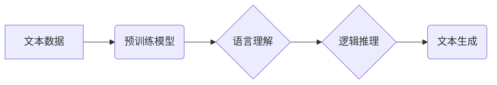

## 语言与推理：大模型的认知瓶颈

> 关键词：大语言模型、推理能力、认知瓶颈、知识表示、逻辑推理、常识推理

### 1. 背景介绍

近年来，大语言模型（Large Language Models，LLMs）在自然语言处理领域取得了令人瞩目的成就。从文本生成、翻译到问答和代码编写，LLMs展现出强大的能力，甚至在某些方面超越了人类的表现。然而，尽管LLMs在处理语言数据方面取得了巨大进步，但它们在推理能力方面仍然存在着显著的局限性。

传统的AI系统通常依赖于明确定义的规则和逻辑程序，而LLMs则通过学习海量文本数据来获得语言理解和生成能力。这种学习方式使得LLMs能够处理更复杂和灵活的语言任务，但也导致了它们在推理方面的挑战。

LLMs主要依赖于统计模式识别，而非真正的理解和推理。它们能够识别文本中的相关性，并根据训练数据预测最可能的输出，但缺乏人类一样的逻辑思维和常识推理能力。

### 2. 核心概念与联系

**2.1 核心概念**

* **大语言模型 (LLMs):** 训练于海量文本数据的大型神经网络模型，能够理解和生成人类语言。
* **推理能力:**  根据已知信息和逻辑规则，推导出新的结论的能力。
* **认知瓶颈:**  指AI系统在模拟人类认知能力方面面临的挑战和局限性。

**2.2  架构关系**



### 3. 核心算法原理 & 具体操作步骤

**3.1 算法原理概述**

LLMs通常基于Transformer架构，利用自注意力机制学习文本中的长距离依赖关系。训练过程主要包括以下步骤：

1. **预训练:** 在海量文本数据上进行无监督学习，学习语言的语法、语义和上下文关系。
2. **微调:**  针对特定任务进行训练，例如文本分类、问答或机器翻译。

**3.2 算法步骤详解**

1. **词嵌入:** 将文本中的每个词转换为向量表示，捕捉词语的语义信息。
2. **自注意力机制:**  计算每个词与其他词之间的相关性，学习文本中的长距离依赖关系。
3. **多层编码器-解码器:**  通过多层神经网络结构，对文本进行编码和解码，学习更深层次的语义表示。
4. **输出层:**  根据训练数据和模型的输出，生成预测结果。

**3.3 算法优缺点**

* **优点:** 
    * 能够处理长文本序列。
    * 学习能力强，能够捕捉复杂的语言关系。
    * 在多种自然语言处理任务上取得了优异的性能。
* **缺点:** 
    * 训练成本高，需要大量的计算资源和数据。
    * 缺乏真正的理解和推理能力，容易受到训练数据偏差的影响。
    * 对输入数据格式敏感，难以处理结构化数据。

**3.4 算法应用领域**

* 文本生成
* 机器翻译
* 问答系统
* 代码生成
* 文本摘要
* 情感分析

### 4. 数学模型和公式 & 详细讲解 & 举例说明

**4.1 数学模型构建**

LLMs通常使用概率模型来表示语言的生成过程。一个常见的模型是基于条件概率分布的语言模型，其目标是最大化给定输入序列的输出序列的概率。

**4.2 公式推导过程**

假设我们有一个训练数据集 D，包含一系列文本序列 (x1, x2,..., xn)。语言模型的目标是学习一个概率分布 P(y|x)，其中 x 是输入序列，y 是输出序列。

可以使用最大似然估计 (MLE) 方法来学习这个概率分布。MLE 的目标是找到参数 θ，使得模型在训练数据上生成的概率最大化：

```latex
\theta = \arg \max_{ \theta } \prod_{ (x, y) \in D } P(y|x; \theta)
```

**4.3 案例分析与讲解**

例如，假设我们有一个简单的语言模型，它预测下一个词的概率。给定输入序列 "The cat sat on the", 模型需要预测下一个词是 "mat" 还是 "chair"。

如果模型学习到的概率分布是 P("mat"| "The cat sat on the") = 0.8, P("chair"| "The cat sat on the") = 0.2，则模型会预测下一个词是 "mat"。

### 5. 项目实践：代码实例和详细解释说明

**5.1 开发环境搭建**

* Python 3.7+
* PyTorch 或 TensorFlow
* CUDA 和 cuDNN (可选，用于GPU加速)

**5.2 源代码详细实现**

```python
import torch
import torch.nn as nn

class SimpleLM(nn.Module):
    def __init__(self, vocab_size, embedding_dim, hidden_dim):
        super(SimpleLM, self).__init__()
        self.embedding = nn.Embedding(vocab_size, embedding_dim)
        self.lstm = nn.LSTM(embedding_dim, hidden_dim)
        self.fc = nn.Linear(hidden_dim, vocab_size)

    def forward(self, x):
        embedded = self.embedding(x)
        output, (hidden, cell) = self.lstm(embedded)
        output = self.fc(output[:, -1, :])
        return output

#... (其他代码，例如数据加载、模型训练等)
```

**5.3 代码解读与分析**

* `SimpleLM` 类定义了一个简单的语言模型。
* `embedding` 层将词语转换为向量表示。
* `lstm` 层是一个循环神经网络，用于学习文本中的长距离依赖关系。
* `fc` 层是一个全连接层，用于预测下一个词的概率。

**5.4 运行结果展示**

* 模型训练完成后，可以将其用于文本生成任务。
* 例如，可以输入一个文本序列，模型会根据训练数据预测下一个词，并生成新的文本。

### 6. 实际应用场景

* **聊天机器人:** LLMs 可以用于构建更自然和流畅的聊天机器人，能够理解用户的意图并提供更相关的回复。
* **文本摘要:** LLMs 可以自动生成文本摘要，提取文本的关键信息。
* **机器翻译:** LLMs 可以用于机器翻译，将文本从一种语言翻译成另一种语言。

**6.4 未来应用展望**

* **更强大的推理能力:** 研究人员正在探索新的方法来增强 LLMs 的推理能力，例如结合逻辑推理和常识知识。
* **更广泛的应用场景:** LLMs 的应用场景将不断扩展，例如在科学研究、医疗诊断和法律领域。
* **更安全和可靠的 LLMs:** 研究人员正在致力于开发更安全和可靠的 LLMs，以防止它们被用于恶意目的。

### 7. 工具和资源推荐

**7.1 学习资源推荐**

* **书籍:**
    * 《深度学习》 by Ian Goodfellow, Yoshua Bengio, and Aaron Courville
    * 《自然语言处理》 by Dan Jurafsky and James H. Martin
* **在线课程:**
    * Coursera: Natural Language Processing Specialization
    * Stanford CS224N: Natural Language Processing with Deep Learning

**7.2 开发工具推荐**

* **PyTorch:**  https://pytorch.org/
* **TensorFlow:** https://www.tensorflow.org/
* **Hugging Face Transformers:** https://huggingface.co/transformers/

**7.3 相关论文推荐**

* **BERT:** https://arxiv.org/abs/1810.04805
* **GPT-3:** https://openai.com/blog/gpt-3/
* **T5:** https://arxiv.org/abs/1910.10683

### 8. 总结：未来发展趋势与挑战

**8.1 研究成果总结**

近年来，LLMs 在自然语言处理领域取得了显著进展，展现出强大的语言理解和生成能力。

**8.2 未来发展趋势**

* **更强大的推理能力:**  研究人员将继续探索新的方法来增强 LLMs 的推理能力，使其能够更好地理解和解决复杂问题。
* **更广泛的应用场景:** LLMs 的应用场景将不断扩展，例如在科学研究、医疗诊断和法律领域。
* **更安全和可靠的 LLMs:** 研究人员将致力于开发更安全和可靠的 LLMs，以防止它们被用于恶意目的。

**8.3 面临的挑战**

* **数据偏差:** LLMs 的训练数据可能存在偏差，导致模型产生不公平或有偏见的输出。
* **可解释性:** LLMs 的决策过程通常是不可解释的，这使得很难理解模型是如何做出预测的。
* **计算成本:** 训练大型 LLMs 需要大量的计算资源，这对于资源有限的机构来说是一个挑战。

**8.4 研究展望**

未来，LLMs 将继续朝着更强大、更安全、更可靠的方向发展。研究人员将继续探索新的算法、模型架构和训练方法，以克服 LLMs 的认知瓶颈，使其能够更好地模拟人类的认知能力。

### 9. 附录：常见问题与解答

* **Q: LLMs 能理解人类语言吗？**

A: LLMs 能够识别和生成人类语言，但它们并不真正理解语言的含义。它们通过学习语言的统计模式来预测最可能的输出，而不是像人类一样理解语言的语义和逻辑关系。

* **Q: LLMs 可以进行逻辑推理吗？**

A: LLMs 在逻辑推理方面仍然存在局限性。尽管一些研究尝试将逻辑推理融入 LLMs 的训练过程中，但它们仍然难以解决复杂逻辑问题。

* **Q: LLMs 会被用于恶意目的吗？**

A: LLMs 可以被用于恶意目的，例如生成虚假信息、进行网络攻击或进行身份盗窃。因此，开发安全和可靠的 LLMs 至关重要。


作者：禅与计算机程序设计艺术 / Zen and the Art of Computer Programming 
