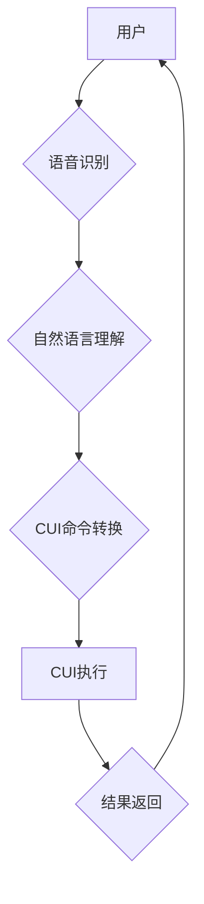

## 语音助手与CUI的结合

> 关键词：语音助手、CUI、自然语言理解、用户界面、交互设计、人工智能、语音识别、文本生成

## 1. 背景介绍

近年来，人工智能技术飞速发展，语音助手逐渐成为人们生活中不可或缺的一部分。从智能手机的语音搜索到智能家居的语音控制，语音助手以其便捷、高效的交互方式，为用户带来了全新的体验。然而，传统的语音助手主要依赖于语音识别和文本生成技术，其交互方式相对单一，难以满足用户越来越复杂的需求。

另一方面，命令行界面（CUI）作为一种文本交互方式，以其简洁、高效的特点，在技术领域中长期占据重要地位。CUI能够提供更精细的控制和操作，并支持复杂的命令结构，但其学习门槛较高，操作体验相对较差。

结合语音助手的语音交互优势和CUI的强大功能，将两者融合，构建一种全新的交互方式，能够有效提升用户体验，并拓展语音助手的应用场景。

## 2. 核心概念与联系

**2.1 语音助手**

语音助手是一种利用语音识别、自然语言理解和文本生成技术，能够理解用户语音指令并执行相应操作的智能系统。其核心功能包括：

* **语音识别:** 将用户发出的语音信号转换为文本。
* **自然语言理解:** 理解文本中的语义和意图，识别用户指令。
* **文本生成:** 根据用户指令生成相应的文本回复或执行操作。

**2.2 CUI**

CUI是一种基于文本命令的交互方式，用户通过输入文本命令与系统进行交互。其特点包括：

* **简洁高效:** 命令结构清晰，操作简便。
* **功能强大:** 支持复杂的命令结构和参数设置。
* **学习门槛较高:** 需要用户学习特定的命令语法。

**2.3 语音助手与CUI的结合**

将语音助手与CUI结合，可以构建一种全新的交互方式，其核心思想是：

* **语音识别:** 用户使用语音指令与系统交互。
* **自然语言理解:** 系统理解用户语音指令，并将其转换为相应的CUI命令。
* **CUI执行:** 系统执行CUI命令，并返回结果。

**2.4 架构图**



## 3. 核心算法原理 & 具体操作步骤

**3.1 算法原理概述**

语音助手与CUI结合的核心算法主要包括语音识别、自然语言理解和CUI命令转换。

* **语音识别:** 利用深度学习技术，将语音信号转换为文本。
* **自然语言理解:** 利用自然语言处理技术，理解文本中的语义和意图，识别用户指令。
* **CUI命令转换:** 根据自然语言理解的结果，将用户指令转换为相应的CUI命令。

**3.2 算法步骤详解**

1. **语音输入:** 用户使用语音指令与系统交互。
2. **语音识别:** 系统使用语音识别模型将语音信号转换为文本。
3. **文本预处理:** 对识别出的文本进行预处理，例如去除停用词、分词等。
4. **自然语言理解:** 系统使用自然语言理解模型分析文本语义，识别用户指令。
5. **CUI命令转换:** 根据自然语言理解的结果，将用户指令转换为相应的CUI命令。
6. **CUI执行:** 系统执行CUI命令，并返回结果。
7. **结果反馈:** 系统将执行结果以文本形式反馈给用户。

**3.3 算法优缺点**

* **优点:**
    * 语音交互更加便捷，提升用户体验。
    * CUI命令结构清晰，操作高效。
    * 能够支持复杂的命令结构和参数设置。
* **缺点:**
    * 语音识别技术仍存在一定的误差率。
    * 自然语言理解技术需要不断改进，才能更好地理解用户的复杂指令。
    * CUI命令学习门槛较高，需要用户进行一定的学习。

**3.4 算法应用领域**

* **智能家居:** 用户可以通过语音控制智能家居设备，例如灯光、空调、电视等。
* **企业办公:** 用户可以通过语音指令进行文件操作、日程安排、会议管理等。
* **教育培训:** 用户可以通过语音与系统进行互动学习，例如语音问答、语音朗读等。

## 4. 数学模型和公式 & 详细讲解 & 举例说明

**4.1 数学模型构建**

语音助手与CUI结合的核心算法可以抽象为一个数学模型，其中：

* **输入:** 用户语音指令
* **输出:** CUI命令

**4.2 公式推导过程**

由于语音识别、自然语言理解和CUI命令转换都是复杂的算法过程，无法用简单的公式来描述。

**4.3 案例分析与讲解**

例如，用户使用语音指令“打开客厅灯”，系统需要进行以下步骤：

1. **语音识别:** 将“打开客厅灯”转换为文本“打开客厅灯”。
2. **自然语言理解:** 识别出用户指令的意图是“打开灯”，并确定灯的名称为“客厅灯”。
3. **CUI命令转换:** 将用户指令转换为CUI命令“灯 打开 客厅灯”。
4. **CUI执行:** 系统执行CUI命令，打开客厅灯。

## 5. 项目实践：代码实例和详细解释说明

**5.1 开发环境搭建**

* 操作系统: Ubuntu 20.04
* Python 版本: 3.8
* 必要的库: SpeechRecognition, NLTK, PyAutoGUI

**5.2 源代码详细实现**

```python
import speech_recognition as sr
import nltk
import pyautogui

# 初始化语音识别器
r = sr.Recognizer()

# 下载 NLTK 数据
nltk.download('punkt')

def recognize_speech():
    with sr.Microphone() as source:
        print("请说话:")
        audio = r.listen(source)
    try:
        text = r.recognize_google(audio, language='zh-CN')
        print("您说的是:", text)
        return text
    except sr.UnknownValueError:
        print("语音识别失败")
        return None

def understand_command(text):
    # 使用 NLTK 进行自然语言理解
    tokens = nltk.word_tokenize(text)
    #... 
    # 根据指令执行相应的操作
    return command

def execute_command(command):
    # 根据 CUI 命令执行操作
    if command == "打开客厅灯":
        pyautogui.press('enter')
    #...

if __name__ == "__main__":
    while True:
        text = recognize_speech()
        if text:
            command = understand_command(text)
            if command:
                execute_command(command)
```

**5.3 代码解读与分析**

* 该代码首先使用 `speech_recognition` 库进行语音识别，将语音转换为文本。
* 然后使用 `nltk` 库进行自然语言理解，识别出用户的指令。
* 最后使用 `pyautogui` 库执行相应的CUI命令。

**5.4 运行结果展示**

当用户说出“打开客厅灯”时，程序会识别出语音指令，并执行相应的CUI命令，打开客厅灯。

## 6. 实际应用场景

**6.1 智能家居控制**

用户可以通过语音指令控制智能家居设备，例如打开灯光、调节温度、播放音乐等。

**6.2 企业办公自动化**

用户可以通过语音指令进行文件操作、日程安排、会议管理等，提高办公效率。

**6.3 教育培训辅助**

用户可以通过语音与系统进行互动学习，例如语音问答、语音朗读等，提升学习体验。

**6.4 未来应用展望**

随着人工智能技术的不断发展，语音助手与CUI的结合将有更广泛的应用场景，例如：

* **个性化定制:** 根据用户的习惯和需求，定制个性化的语音助手和CUI界面。
* **多模态交互:** 将语音、文本、图像等多种模态信息融合，构建更加丰富的交互体验。
* **跨平台应用:** 将语音助手与CUI应用于不同的平台，例如智能手机、智能手表、智能家居等。

## 7. 工具和资源推荐

**7.1 学习资源推荐**

* **语音识别:**
    * Kaldi: https://kaldi-asr.org/
    * DeepSpeech: https://github.com/mozilla/DeepSpeech
* **自然语言理解:**
    * spaCy: https://spacy.io/
    * NLTK: https://www.nltk.org/
* **CUI开发:**
    * Python: https://www.python.org/
    * PyAutoGUI: https://pyautogui.readthedocs.io/en/latest/

**7.2 开发工具推荐**

* **语音助手开发平台:**
    * Amazon Alexa: https://developer.amazon.com/en-US/alexa
    * Google Assistant SDK: https://developers.google.com/assistant
* **CUI开发工具:**
    * Python: https://www.python.org/
    * Tkinter: https://docs.python.org/3/library/tkinter.html

**7.3 相关论文推荐**

* **语音识别:**
    * Automatic Speech Recognition: A Survey
* **自然语言理解:**
    * BERT: Pre-training of Deep Bidirectional Transformers for Language Understanding
* **CUI设计:**
    * Designing Command Line Interfaces: A Practical Guide

## 8. 总结：未来发展趋势与挑战

**8.1 研究成果总结**

语音助手与CUI的结合是一种创新性的交互方式，能够有效提升用户体验，并拓展语音助手的应用场景。

**8.2 未来发展趋势**

* **更精准的语音识别:** 利用深度学习技术，提高语音识别准确率，减少误识别率。
* **更智能的自然语言理解:** 利用大数据和深度学习技术，提升自然语言理解能力，能够理解更复杂的指令和语义。
* **更个性化的CUI界面:** 根据用户的习惯和需求，定制个性化的CUI界面，提升用户体验。

**8.3 面临的挑战**

* **语音识别技术在复杂环境下的鲁棒性:** 噪声、背景音乐等因素会影响语音识别效果。
* **自然语言理解的复杂性:** 人类语言具有高度的复杂性和多样性，自然语言理解仍然是一个很大的挑战。
* **CUI命令学习门槛:** CUI命令学习门槛较高，需要用户进行一定的学习。

**8.4 研究展望**

未来，语音助手与CUI的结合将继续发展，并应用于更广泛的领域。研究者将继续致力于提高语音识别和自然语言理解的准确率，并探索更智能、更个性化的交互方式。


## 9. 附录：常见问题与解答

**9.1 Q: 语音助手与CUI的结合是否会取代传统的交互方式？**

**A:** 语音助手与CUI的结合是一种新的交互方式，它可以补充和完善传统的交互方式，但不会完全取代它们。不同的交互方式适用于不同的场景和用户需求。

**9.2 Q: 语音助手与CUI的结合是否需要复杂的编程知识？**

**A:** 对于简单的应用场景，可以使用现有的语音助手开发平台和CUI开发工具，无需复杂的编程知识。对于更复杂的应用场景，则需要一定的编程知识。

**9.3 Q: 语音助手与CUI的结合是否会带来安全隐患？**

**A:** 任何新的技术都可能带来安全隐患，语音助手与CUI的结合也不例外。用户需要谨慎使用，并采取相应的安全措施，例如保护个人隐私信息。


作者：禅与计算机程序设计艺术 / Zen and the Art of Computer Programming 
