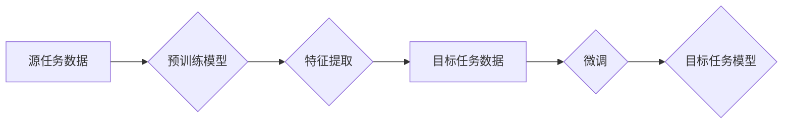

## 迁移学习 (Transfer Learning) 原理与代码实例讲解

> 关键词：迁移学习、深度学习、预训练模型、特征提取、领域适应、Fine-tuning、图像分类、自然语言处理

## 1. 背景介绍

在深度学习领域，训练一个强大的模型通常需要大量的 labeled 数据和大量的计算资源。然而，在许多实际应用场景中，获取大量 labeled 数据往往非常困难和昂贵。迁移学习 (Transfer Learning) 应运而生，它是一种利用已训练好的模型在新的任务或领域上进行训练的学习策略。

迁移学习的核心思想是：在解决新任务时，可以利用之前在其他相关任务上学习到的知识，从而减少对新任务数据的需求，提高模型的训练效率和性能。

## 2. 核心概念与联系

迁移学习的核心概念包括：

* **源任务 (Source Task):**  预训练模型在该任务上进行训练，积累了丰富的知识和特征表示。
* **目标任务 (Target Task):**  希望利用迁移学习策略在该任务上进行训练，通常与源任务存在一定的相关性。
* **特征提取 (Feature Extraction):**  将预训练模型的特征提取层作为固定层，提取源任务的特征，用于目标任务的训练。
* **微调 (Fine-tuning):**  对预训练模型的部分或全部参数进行微调，使其适应目标任务的数据分布。

**迁移学习流程图:**



## 3. 核心算法原理 & 具体操作步骤

### 3.1  算法原理概述

迁移学习的算法原理主要基于以下几个方面：

* **知识共享:**  源任务和目标任务之间存在一定的知识共享关系，预训练模型在源任务上学习到的特征表示可以部分地适用于目标任务。
* **参数初始化:**  利用预训练模型的参数作为目标任务模型的初始参数，可以加速目标任务模型的训练过程。
* **数据增强:**  通过对目标任务数据进行一定的增强操作，可以提高模型的泛化能力，减少对数据量的依赖。

### 3.2  算法步骤详解

1. **选择预训练模型:**  根据目标任务的特点选择合适的预训练模型，例如图像分类任务可以选择ResNet、VGG等模型，自然语言处理任务可以选择BERT、GPT等模型。
2. **特征提取:**  将预训练模型的特征提取层作为固定层，提取源任务的特征，作为目标任务的输入特征。
3. **微调:**  对预训练模型的部分或全部参数进行微调，使其适应目标任务的数据分布。
4. **评估:**  使用目标任务的数据对微调后的模型进行评估，并根据评估结果进行模型调整。

### 3.3  算法优缺点

**优点:**

* **提高训练效率:**  利用预训练模型可以减少对新任务数据的需求，加速模型的训练过程。
* **提高模型性能:**  预训练模型已经学习了大量的知识和特征表示，可以提高目标任务模型的性能。
* **减少过拟合:**  预训练模型可以帮助目标任务模型泛化到新的数据，减少过拟合现象。

**缺点:**

* **选择合适的预训练模型:**  选择合适的预训练模型对于迁移学习的成功至关重要，需要根据目标任务的特点进行选择。
* **微调参数:**  微调预训练模型的参数需要谨慎进行，过多的微调可能会导致模型性能下降。
* **数据分布差异:**  如果源任务和目标任务的数据分布差异较大，迁移学习的效果可能会下降。

### 3.4  算法应用领域

迁移学习在各个领域都有广泛的应用，例如：

* **图像分类:**  利用预训练的图像分类模型进行目标检测、图像识别等任务。
* **自然语言处理:**  利用预训练的语言模型进行文本分类、情感分析、机器翻译等任务。
* **语音识别:**  利用预训练的语音识别模型进行语音转文本、语音合成等任务。
* **医疗诊断:**  利用预训练的医疗图像模型进行疾病诊断、病灶检测等任务。

## 4. 数学模型和公式 & 详细讲解 & 举例说明

### 4.1  数学模型构建

迁移学习的数学模型通常基于深度学习框架，例如TensorFlow、PyTorch等。模型的结构通常由以下几个部分组成：

* **特征提取层:**  用于提取输入数据的特征表示，通常采用卷积神经网络 (CNN) 或循环神经网络 (RNN) 等结构。
* **全连接层:**  用于将特征表示映射到目标任务的输出空间。
* **损失函数:**  用于衡量模型预测结果与真实值的差异。
* **优化器:**  用于更新模型参数，使模型的损失函数最小化。

### 4.2  公式推导过程

迁移学习的训练过程本质上是优化模型参数的过程，目标是找到一组参数，使得模型在目标任务上的损失函数最小化。

损失函数通常采用交叉熵损失函数或均方误差损失函数等。

优化器通常采用梯度下降算法或其变种算法，例如Adam、RMSprop等。

### 4.3  案例分析与讲解

例如，在图像分类任务中，我们可以利用预训练的ResNet模型进行迁移学习。

1. 将ResNet模型的特征提取层作为固定层，提取源任务图像的特征表示。
2. 将特征表示作为输入，连接一个新的全连接层，用于分类目标任务图像。
3. 使用目标任务图像数据进行微调，更新全连接层的参数。

## 5. 项目实践：代码实例和详细解释说明

### 5.1  开发环境搭建

* Python 3.6+
* TensorFlow 2.0+
* Keras

### 5.2  源代码详细实现

```python
import tensorflow as tf
from tensorflow.keras.applications import ResNet50
from tensorflow.keras.layers import Dense, GlobalAveragePooling2D
from tensorflow.keras.models import Model

# 加载预训练模型
base_model = ResNet50(weights='imagenet', include_top=False)

# 冻结预训练模型的权重
base_model.trainable = False

# 添加新的全连接层
x = base_model.output
x = GlobalAveragePooling2D()(x)
x = Dense(1024, activation='relu')(x)
predictions = Dense(num_classes, activation='softmax')(x)

# 创建新的模型
model = Model(inputs=base_model.input, outputs=predictions)

# 编译模型
model.compile(optimizer='adam',
              loss='categorical_crossentropy',
              metrics=['accuracy'])

# 训练模型
model.fit(train_data, train_labels, epochs=10)

# 评估模型
loss, accuracy = model.evaluate(test_data, test_labels)
print('Test Loss:', loss)
print('Test Accuracy:', accuracy)
```

### 5.3  代码解读与分析

*  首先，我们加载预训练的ResNet50模型，并将其 `include_top=False` 设置为 False，表示不包含原有的分类层。
*  然后，我们冻结预训练模型的权重，防止其在训练过程中被更新。
*  接着，我们添加新的全连接层，将特征表示映射到目标任务的输出空间。
*  最后，我们创建新的模型，并使用目标任务的数据进行微调。

### 5.4  运行结果展示

训练完成后，我们可以使用测试数据评估模型的性能。

## 6. 实际应用场景

迁移学习在各个领域都有广泛的应用，例如：

* **医疗诊断:**  利用预训练的医疗图像模型进行疾病诊断、病灶检测等任务。
* **金融风险评估:**  利用预训练的文本模型进行金融风险评估、欺诈检测等任务。
* **智能客服:**  利用预训练的对话模型进行智能客服、聊天机器人等任务。

### 6.4  未来应用展望

随着深度学习技术的不断发展，迁移学习的应用场景将会更加广泛。

## 7. 工具和资源推荐

### 7.1  学习资源推荐

* **书籍:**
    * Deep Learning with Python by Francois Chollet
    * Transfer Learning in Natural Language Processing by Sebastian Ruder
* **在线课程:**
    * Coursera: Deep Learning Specialization
    * Udacity: Deep Learning Nanodegree

### 7.2  开发工具推荐

* **TensorFlow:**  https://www.tensorflow.org/
* **PyTorch:**  https://pytorch.org/
* **Keras:**  https://keras.io/

### 7.3  相关论文推荐

* **ImageNet Classification with Deep Convolutional Neural Networks** by Alex Krizhevsky, Ilya Sutskever, and Geoffrey E. Hinton
* **Transfer Learning** by Pan, S. J., & Yang, Q.

## 8. 总结：未来发展趋势与挑战

### 8.1  研究成果总结

迁移学习在近年来取得了显著的进展，在图像分类、自然语言处理等领域取得了优异的性能。

### 8.2  未来发展趋势

* **更有效的迁移学习算法:**  研究更有效的迁移学习算法，例如主动学习、联邦学习等。
* **跨模态迁移学习:**  研究跨模态迁移学习，例如将图像特征迁移到文本任务中。
* **可解释性迁移学习:**  研究可解释性迁移学习，使得迁移学习过程更加透明和可理解。

### 8.3  面临的挑战

* **数据分布差异:**  不同任务的数据分布可能存在较大差异，如何有效地解决数据分布差异仍然是一个挑战。
* **模型复杂度:**  迁移学习模型通常比较复杂，训练和部署成本较高。
* **公平性与可解释性:**  迁移学习模型可能存在公平性问题，需要研究如何提高模型的可解释性和公平性。

### 8.4  研究展望

未来，迁移学习将会在更多领域得到应用，并推动深度学习技术的进一步发展。


## 9. 附录：常见问题与解答

* **Q: 如何选择合适的预训练模型？**

A: 选择预训练模型需要根据目标任务的特点进行选择。例如，图像分类任务可以选择ResNet、VGG等模型，自然语言处理任务可以选择BERT、GPT等模型。

* **Q: 如何进行微调？**

A: 微调过程通常需要调整目标任务模型的部分或全部参数。可以根据任务需求选择不同的微调策略，例如冻结预训练模型的某些层，只微调最后一层等。

* **Q: 迁移学习的性能是否总是优于从头训练？**

A: 迁移学习的性能不一定总是优于从头训练，这取决于源任务和目标任务之间的相关性，以及数据量的多少等因素。

作者：禅与计算机程序设计艺术 / Zen and the Art of Computer Programming


