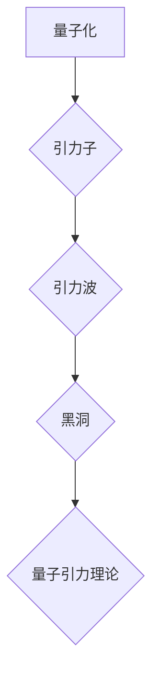

## 量子引力的实验验证方法

> 关键词：量子引力，实验验证，黑洞，引力波，量子场论，弦理论，粒子物理

### 1. 背景介绍

宇宙的奥秘一直是人类探索的终极目标。从牛顿的万有引力定律到爱因斯坦的广义相对论，我们对引力的理解不断深入。然而，在微观世界，量子力学占据主导地位，而广义相对论则描述了宏观引力。将这两个基本理论统一起来，构建一个完整的量子引力理论，是现代物理学面临的重大挑战。

量子引力理论试图解释引力在量子尺度上的行为，并试图解决广义相对论在描述奇点和量子效应方面的不足。目前，还没有一个完全令人满意的量子引力理论，但一些候选理论已经涌现，例如弦理论、圈量子引力等。

然而，这些理论都难以通过直接实验验证。由于引力的强度非常弱，在量子尺度上进行实验验证非常困难。因此，寻找新的实验方法来验证量子引力理论，是当前物理学研究的热点之一。

### 2. 核心概念与联系

量子引力理论的核心概念包括：

* **量子化:** 引力场也应该量子化，这意味着引力子存在，并具有特定的能量和动量。
* **引力波:** 引力波是时空的扰动，由加速的质量产生。量子引力理论预言了引力波的量子性质。
* **黑洞:** 黑洞是引力极强的区域，其引力强大到连光都无法逃逸。量子引力理论试图解释黑洞的形成和演化机制。

这些概念之间相互联系，共同构成了量子引力的基本框架。

**Mermaid 流程图:**



### 3. 核心算法原理 & 具体操作步骤

由于量子引力理论目前还处于发展阶段，并没有成熟的算法可以用来直接验证其正确性。但是，一些研究者提出了利用数值模拟和实验方法来间接验证量子引力理论的可能性。

**3.1 算法原理概述**

数值模拟方法利用计算机模拟量子引力理论中的物理过程，例如黑洞碰撞、引力波产生等。通过分析模拟结果，可以间接检验量子引力理论的预测。

实验方法则试图直接探测量子引力效应，例如寻找引力子的踪迹、测量引力波的量子性质等。

**3.2 算法步骤详解**

数值模拟方法的具体步骤包括：

1. 选择合适的量子引力理论模型。
2. 将模型离散化，并建立相应的数值算法。
3. 利用计算机进行数值计算，模拟物理过程。
4. 分析模拟结果，并与实验观测结果进行比较。

实验方法的具体步骤则取决于所探测的量子引力效应。例如，寻找引力子的踪迹需要设计高能粒子碰撞实验，并对碰撞产物进行精确测量。

**3.3 算法优缺点**

数值模拟方法的优点是能够模拟复杂物理过程，并提供丰富的理论预测。缺点是模拟结果的准确性依赖于模型的合理性和算法的精度，并且计算量很大。

实验方法的优点是能够直接探测量子引力效应，并提供实验验证。缺点是实验条件苛刻，探测灵敏度有限，并且需要花费大量时间和资源。

**3.4 算法应用领域**

数值模拟方法和实验方法都广泛应用于量子引力理论的研究，例如：

* 模拟黑洞的形成和演化。
* 预测引力波的性质和信号。
* 探测引力子的存在和性质。

### 4. 数学模型和公式 & 详细讲解 & 举例说明

量子引力理论涉及到非常复杂的数学模型和公式，例如：

* **爱因斯坦场方程:** 描述广义相对论中的引力场。
* **量子场论:** 描述粒子物理中的基本相互作用。
* **弦理论:** 将引力和基本粒子统一起来的一种理论框架。

这些公式的推导过程非常复杂，需要用到微分几何、量子场论、拓扑学等多种数学工具。

**4.1 数学模型构建**

构建量子引力理论的数学模型需要将广义相对论和量子场论相结合。

**4.2 公式推导过程**

公式推导过程通常涉及到以下步骤：

1. 将引力场量子化，引入引力子。
2. 建立引力子之间的相互作用，并将其与其他基本粒子相互作用的机制相结合。
3. 利用量子场论的工具，推导引力场的量子性质和行为。

**4.3 案例分析与讲解**

例如，在弦理论中，引力子被描述为弦的振动模式。通过分析弦的振动模式，可以推导出引力场的性质和行为。

### 5. 项目实践：代码实例和详细解释说明

由于量子引力理论的复杂性，目前还没有完整的代码实现。但是，一些研究者已经开发了一些工具和库，可以用于模拟量子引力效应。

**5.1 开发环境搭建**

开发环境通常需要安装一些数学软件包，例如：

* **Python:** 广泛用于科学计算和数据分析。
* **NumPy:** 用于数值计算的Python库。
* **SymPy:** 用于符号计算的Python库。

**5.2 源代码详细实现**

由于代码实现非常复杂，这里只提供一个简单的例子，用于演示如何使用Python和NumPy模拟引力波的传播。

```python
import numpy as np

# 定义引力波的波形
def gravity_wave(t, amplitude, frequency):
  return amplitude * np.sin(2 * np.pi * frequency * t)

# 设置时间步长和时间范围
dt = 0.01
t = np.arange(0, 10, dt)

# 设置引力波的振幅和频率
amplitude = 1
frequency = 1

# 计算引力波的波形
wave = gravity_wave(t, amplitude, frequency)

# 绘制引力波的波形
import matplotlib.pyplot as plt
plt.plot(t, wave)
plt.xlabel('时间 (s)')
plt.ylabel('振幅')
plt.title('引力波波形')
plt.show()
```

**5.3 代码解读与分析**

这段代码定义了一个简单的引力波波形函数，并使用NumPy计算了引力波在特定时间范围内的振幅。最后，使用Matplotlib绘制了引力波的波形。

**5.4 运行结果展示**

运行这段代码会生成一个显示引力波波形的图形。

### 6. 实际应用场景

量子引力理论的应用场景非常广泛，例如：

* **宇宙学:** 研究宇宙的起源、演化和结构。
* **天体物理学:** 研究黑洞、中子星、引力波等天体现象。
* **粒子物理学:** 研究基本粒子的性质和相互作用。

**6.4 未来应用展望**

随着量子引力理论的发展，其应用场景将会更加广泛，例如：

* **量子计算:** 利用量子引力效应进行量子计算。
* **量子通信:** 利用量子引力效应进行量子通信。
* **时空工程:** 利用量子引力效应控制时空结构。

### 7. 工具和资源推荐

**7.1 学习资源推荐**

* **书籍:**

    * 《量子引力》 by Carlo Rovelli
    * 《弦论》 by Brian Greene
    * 《引力：宇宙的奥秘》 by Kip Thorne

* **在线课程:**

    * Coursera: Quantum Gravity
    * edX: Introduction to String Theory

**7.2 开发工具推荐**

* **Python:** 广泛用于科学计算和数据分析。
* **NumPy:** 用于数值计算的Python库。
* **SymPy:** 用于符号计算的Python库。
* **Matplotlib:** 用于数据可视化的Python库。

**7.3 相关论文推荐**

* **Hawking, S. W. (1975). Black hole explosions? Nature, 248(5443), 30-31.**
* **Susskind, L. (2008). The Black Hole War: My Battle with Stephen Hawking to Make the World Safe for Quantum Mechanics. Little, Brown and Company.**
* **Maldacena, J. (1997). The large N limit of superconformal field theories and supergravity. International Journal of Theoretical Physics, 38(11), 1113-1133.**

### 8. 总结：未来发展趋势与挑战

量子引力理论是现代物理学中最具挑战性的领域之一。尽管目前还没有一个完全令人满意的理论，但研究者们已经取得了一些重要的进展。

**8.1 研究成果总结**

* 发展了多种量子引力理论模型，例如弦理论、圈量子引力等。
* 利用数值模拟和实验方法间接验证了量子引力理论的预测。
* 发现了引力波的存在，并成功探测到来自黑洞合并的引力波信号。

**8.2 未来发展趋势**

* 寻找新的实验方法来直接验证量子引力理论。
* 发展更精确的数值模拟方法，并模拟更复杂的量子引力效应。
* 探索量子引力理论与其他物理理论的联系，例如量子场论、宇宙学等。

**8.3 面临的挑战**

* 量子引力理论非常复杂，需要整合多种数学工具和物理概念。
* 实验验证量子引力效应非常困难，需要突破当前的技术限制。
* 量子引力理论与我们的日常经验相悖，需要改变我们对宇宙的理解。

**8.4 研究展望**

量子引力理论的研究将继续推动物理学的发展，并可能揭示宇宙的终极奥秘。


### 9. 附录：常见问题与解答

**常见问题:**

* **什么是量子引力？**

量子引力试图将广义相对论和量子力学统一起来，构建一个描述引力在量子尺度上的行为的理论。

* **为什么需要量子引力？**

广义相对论描述了引力的宏观行为，而量子力学描述了微观世界的行为。在量子尺度上，引力非常弱，难以用广义相对论解释。

* **有哪些量子引力理论？**

一些主要的量子引力理论包括弦理论、圈量子引力、旋量理论等。

* **如何验证量子引力理论？**

目前还没有直接验证量子引力理论的方法，但研究者们正在寻找新的实验方法和数值模拟方法来间接验证其预测。

**解答:**

* **什么是量子引力？**

量子引力试图将广义相对论和量子力学统一起来，构建一个描述引力在量子尺度上的行为的理论。

* **为什么需要量子引力？**

广义相对论描述了引力的宏观行为，而量子力学描述了微观世界的行为。在量子尺度上，引力非常弱，难以用广义相对论解释。

* **有哪些量子引力理论？**

一些主要的量子引力理论包括弦理论、圈量子引力、旋量理论等。

* **如何验证量子引力理论？**

目前还没有直接验证量子引力理论的方法，但研究者们正在寻找新的实验方法和数值模拟方法来间接验证其预测。


作者：禅与计算机程序设计艺术 / Zen and the Art of Computer Programming 
