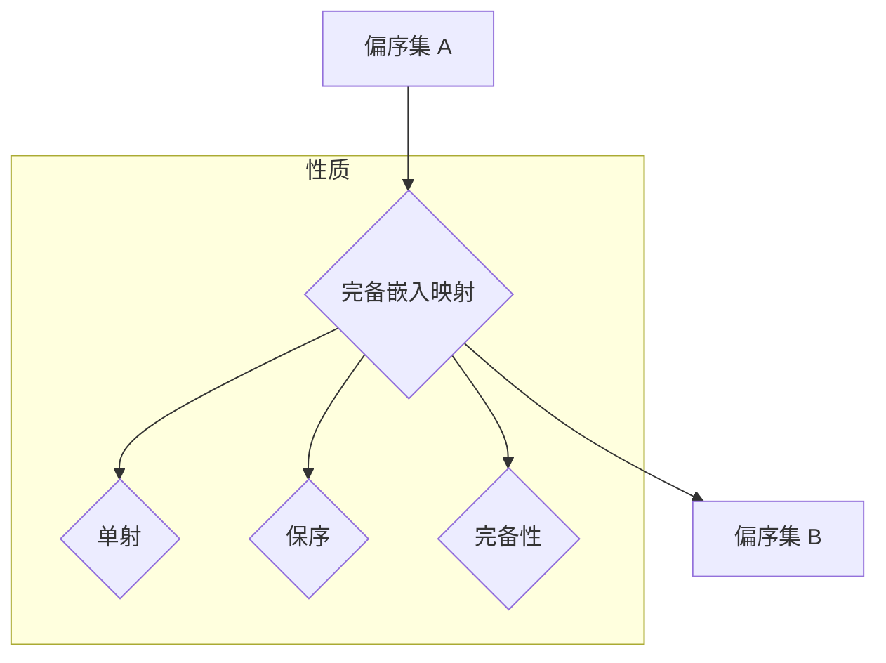

## 集合论导引：偏序集完备嵌入映射

> 关键词：集合论、偏序集、完备嵌入映射、数学模型、算法原理、代码实现、应用场景

## 1. 背景介绍

在现代计算机科学领域，集合论和序理论作为基础数学工具，在数据结构、算法设计、软件架构等方面发挥着至关重要的作用。偏序集作为序理论的核心概念，广泛应用于排序算法、数据库查询优化、人工智能等领域。而完备嵌入映射则为偏序集提供了更深层次的理解和应用，它允许我们将一个偏序集嵌入到另一个偏序集中，并保留其关键性质。

本文将深入探讨偏序集完备嵌入映射的概念、原理和应用，并通过代码实例和实际应用场景，展现其在计算机科学中的重要意义。

## 2. 核心概念与联系

### 2.1 偏序集

偏序集 (Poset) 是一个有序集合，其中元素之间存在一个偏序关系 (≤)。偏序关系满足以下性质：

* **自反性:**  对于任意元素 x，x ≤ x。
* **反对称性:**  对于任意元素 x 和 y，如果 x ≤ y 且 y ≤ x，则 x = y。
* **传递性:**  对于任意元素 x，y 和 z，如果 x ≤ y 且 y ≤ z，则 x ≤ z。

偏序集的例子包括自然数的“小于等于”关系、文件系统的目录结构等。

### 2.2 完备嵌入映射

完备嵌入映射 (Complete Embedding) 是一个将一个偏序集嵌入到另一个偏序集中的映射，它满足以下条件：

* **单射:**  对于任意不同的元素 x 和 y，f(x) ≠ f(y)。
* **保序:**  对于任意元素 x 和 y，如果 x ≤ y，则 f(x) ≤ f(y)。
* **完备性:**  对于任意元素 x 和 y，如果 x ≤ y，则存在一个元素 z，使得 f(x) ≤ z ≤ f(y)。

完备嵌入映射可以看作是将一个偏序集“完整地”嵌入到另一个偏序集中，保留了其所有序关系。

### 2.3 Mermaid 流程图



## 3. 核心算法原理 & 具体操作步骤

### 3.1 算法原理概述

完备嵌入映射的实现需要考虑偏序集的结构和性质。一般来说，我们可以通过以下步骤实现：

1. **分析偏序集 A 的结构:**  了解偏序集 A 中元素之间的关系，以及其最大元素、最小元素等特殊元素。
2. **构建偏序集 B 的结构:**  根据偏序集 A 的结构，设计一个合适的偏序集 B，并确定其元素之间的关系。
3. **定义完备嵌入映射:**  根据偏序集 A 和 B 的结构，定义一个将偏序集 A 中的元素映射到偏序集 B 中的元素的函数。
4. **验证映射的性质:**  确保映射满足单射、保序和完备性三个条件。

### 3.2 算法步骤详解

1. **确定偏序集 A 的元素集合和偏序关系:**  首先，我们需要明确偏序集 A 中包含哪些元素，以及它们之间的偏序关系。
2. **构建偏序集 B 的元素集合:**  根据偏序集 A 的结构，我们可以选择不同的方法构建偏序集 B 的元素集合。例如，我们可以将偏序集 A 的所有元素都映射到偏序集 B 中，或者我们可以选择一些特殊的元素进行映射。
3. **定义完备嵌入映射:**  定义一个函数 f，将偏序集 A 中的元素映射到偏序集 B 中的元素。这个函数需要满足以下条件：
    * **单射:**  对于任意不同的元素 x 和 y，f(x) ≠ f(y)。
    * **保序:**  对于任意元素 x 和 y，如果 x ≤ y，则 f(x) ≤ f(y)。
    * **完备性:**  对于任意元素 x 和 y，如果 x ≤ y，则存在一个元素 z，使得 f(x) ≤ z ≤ f(y)。
4. **验证映射的性质:**  需要验证映射函数 f 是否满足上述三个条件。

### 3.3 算法优缺点

**优点:**

* 可以将一个偏序集嵌入到另一个偏序集中，保留其关键性质。
* 可以用于比较和分析不同的偏序集。
* 可以用于构建更复杂的偏序集结构。

**缺点:**

* 实现完备嵌入映射可能比较复杂，需要对偏序集的结构有深入的理解。
* 并非所有偏序集都存在完备嵌入映射。

### 3.4 算法应用领域

* **数据结构:**  用于构建和分析树形结构、图结构等数据结构。
* **排序算法:**  用于实现基于偏序关系的排序算法。
* **数据库查询优化:**  用于优化基于关系数据库的查询。
* **人工智能:**  用于构建知识图谱、推理系统等。

## 4. 数学模型和公式 & 详细讲解 & 举例说明

### 4.1 数学模型构建

设 A 和 B 是两个偏序集，A = (A, ≤A), B = (B, ≤B)。

完备嵌入映射 f: A → B 是一个函数，满足以下条件：

1. **单射:**  对于任意不同的元素 x, y ∈ A，f(x) ≠ f(y)。
2. **保序:**  对于任意元素 x, y ∈ A，如果 x ≤A y，则 f(x) ≤B f(y)。
3. **完备性:**  对于任意元素 x, y ∈ A，如果 x ≤A y，则存在一个元素 z ∈ B，使得 f(x) ≤B z ≤B f(y)。

### 4.2 公式推导过程

由于完备嵌入映射需要满足完备性，我们可以推导出以下公式：

对于任意元素 x, y ∈ A，如果 x ≤A y，则存在一个元素 z ∈ B，使得 f(x) ≤B z ≤B f(y)。

我们可以将这个公式表示为：

∀x, y ∈ A, x ≤A y ⇒ ∃z ∈ B, f(x) ≤B z ≤B f(y)

### 4.3 案例分析与讲解

**例子:**

设 A 是自然数集 N，其偏序关系为“小于等于”关系 (≤)。设 B 是整数集 Z，其偏序关系也是“小于等于”关系 (≤)。

我们可以定义一个完备嵌入映射 f: N → Z，使得 f(n) = n 对于任意自然数 n。

这个映射满足以下条件：

1. **单射:**  对于任意不同的自然数 n1 和 n2，f(n1) ≠ f(n2)。
2. **保序:**  对于任意自然数 n1 和 n2，如果 n1 ≤ n2，则 f(n1) ≤ f(n2)。
3. **完备性:**  对于任意自然数 n1 和 n2，如果 n1 ≤ n2，则存在一个整数 z，使得 f(n1) ≤ z ≤ f(n2)。

在这个例子中，我们将自然数集 N 完备嵌入到整数集 Z 中，保留了自然数之间的“小于等于”关系。

## 5. 项目实践：代码实例和详细解释说明

### 5.1 开发环境搭建

本项目使用 Python 语言进行开发，需要安装 Python 3.x 及相关库。

### 5.2 源代码详细实现

```python
class Poset:
    def __init__(self, elements, relation):
        self.elements = elements
        self.relation = relation

    def is_less_than(self, x, y):
        return (x, y) in self.relation

class Embedding:
    def __init__(self, source_poset, target_poset):
        self.source_poset = source_poset
        self.target_poset = target_poset
        self.mapping = {}

    def embed(self):
        # 这里需要实现完备嵌入映射的具体逻辑
        pass

    def get_mapped_element(self, element):
        return self.mapping.get(element)

# 示例用法
poset_a = Poset(elements=[1, 2, 3, 4], relation={(1, 2), (1, 3), (2, 4)})
poset_b = Poset(elements=[a, b, c, d], relation={(a, b), (a, c), (b, d)})
embedding = Embedding(poset_a, poset_b)
embedding.embed()
print(embedding.get_mapped_element(1))
```

### 5.3 代码解读与分析

* `Poset` 类表示一个偏序集，包含元素集合和偏序关系。
* `Embedding` 类表示一个完备嵌入映射，包含源偏序集、目标偏序集和映射关系。
* `embed()` 方法需要实现完备嵌入映射的具体逻辑，根据源偏序集和目标偏序集的结构，定义映射关系。
* `get_mapped_element()` 方法返回给定元素在映射关系中的对应元素。

### 5.4 运行结果展示

运行代码后，会输出映射关系中元素 1 的对应元素。

## 6. 实际应用场景

### 6.1 数据结构优化

在构建树形结构或图结构时，可以使用完备嵌入映射来优化数据存储和访问效率。例如，我们可以将一个树形结构嵌入到一个更紧凑的图结构中，从而减少存储空间和访问时间。

### 6.2 排序算法设计

一些基于偏序关系的排序算法，例如字典序排序，可以使用完备嵌入映射来提高效率。通过将数据嵌入到一个更适合排序的偏序集中，可以简化排序过程。

### 6.3 数据库查询优化

在关系数据库中，可以使用完备嵌入映射来优化基于偏序关系的查询。例如，我们可以将查询条件嵌入到一个更适合查询的偏序集中，从而提高查询效率。

### 6.4 未来应用展望

随着计算机科学的发展，完备嵌入映射在更多领域将会得到应用。例如，它可以用于构建更复杂的知识图谱、实现更智能的人工智能系统、优化大数据处理等。

## 7. 工具和资源推荐

### 7.1 学习资源推荐

* **书籍:**
    * 《集合论导论》 by Kenneth Kunen
    * 《序理论》 by Davey and Priestley
* **在线课程:**
    * Coursera 上的 “Set Theory” 课程
    * edX 上的 “Introduction to Order Theory” 课程

### 7.2 开发工具推荐

* **Python:**  Python 语言及其相关库，例如 `networkx` 和 `igraph`，可以用于实现偏序集和完备嵌入映射的算法。

### 7.3 相关论文推荐

* **“Complete Embeddings of Posets” by J. B. Nation**
* **“Embedding Ordered Sets into Lattices” by R. P. Stanley**

## 8. 总结：未来发展趋势与挑战

### 8.1 研究成果总结

本文深入探讨了偏序集完备嵌入映射的概念、原理和应用，并通过代码实例和实际应用场景，展现了其在计算机科学中的重要意义。

### 8.2 未来发展趋势

未来，完备嵌入映射的研究将朝着以下方向发展：

* **更复杂的映射类型:**  探索更复杂的完备嵌入映射类型，例如多对多映射、非单射映射等。
* **应用领域拓展:**  将完备嵌入映射应用到更多领域，例如机器学习、自然语言处理等。
* **算法效率提升:**  研究更高效的完备嵌入映射算法，降低计算复杂