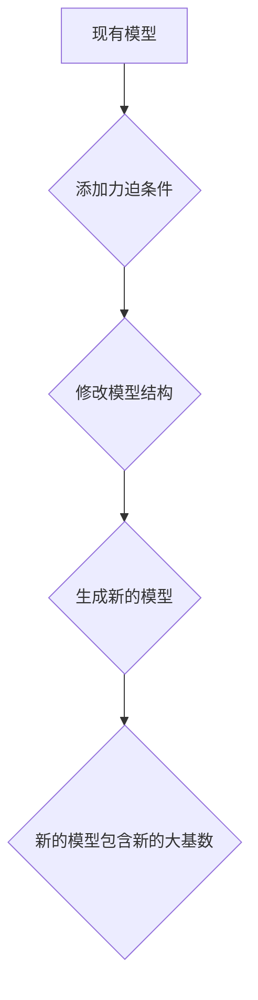

## 集合论导引：大基数上力迫扩张

> 关键词：集合论、大基数、力迫、扩张、超限序数、可测性、模型论

## 1. 背景介绍

集合论作为数学的基础理论，研究着集合的性质和关系。其中，大基数的概念在集合论中扮演着至关重要的角色。大基数是指比任何有限基数都更大的基数，它们揭示了集合的无限性与复杂性。力迫是一种重要的集合论工具，用于在模型论中构造新的集合结构，并研究其性质。

本文将深入探讨大基数上力迫扩张的概念，阐述其原理、算法、数学模型以及实际应用场景。

## 2. 核心概念与联系

### 2.1 集合论基础

* **基数:** 基数表示集合的“大小”。有限集的基数是其元素个数，无限集的基数则需要更抽象的定义。
* **序数:** 序数是表示“有序集合”的基数。每个序数都对应着一个唯一的自然数，例如0、1、2、3等等。
* **超限序数:** 超限序数是大于所有有限序数的序数。它们是无限集的基数，并具有独特的性质。

### 2.2 力迫

力迫是一种在模型论中构造新的模型的技术。它通过在现有的模型中添加新的“条件”来生成新的模型。

* **条件:** 条件是关于模型中元素的命题。
* **力迫过程:** 力迫过程通过反复添加条件，并根据这些条件修改模型的结构，最终得到一个新的模型。

### 2.3 大基数上力迫扩张

大基数上力迫扩张是一种特殊的力迫技术，它用于在模型中添加新的大基数。

* **目标:** 通过力迫扩张，在现有的模型中添加新的大基数，并研究这些大基数的性质。
* **方法:** 使用特定的力迫条件，在模型中添加新的超限序数，从而生成新的大基数。

### 2.4 Mermaid 流程图



## 3. 核心算法原理 & 具体操作步骤

### 3.1 算法原理概述

大基数上力迫扩张的算法原理基于以下几个关键点：

* **超限序数:** 算法的核心是使用超限序数来表示新的大基数。
* **力迫条件:** 算法使用特定的力迫条件来添加新的超限序数到模型中。
* **模型扩张:** 算法通过修改模型的结构来实现新的大基数的添加。

### 3.2 算法步骤详解

1. **选择初始模型:** 首先选择一个包含已知大基数的集合论模型。
2. **定义力迫条件:** 根据目标大基数，定义相应的力迫条件。这些条件通常涉及到模型中元素的性质和关系。
3. **添加力迫条件:** 将力迫条件添加到模型中，并根据这些条件修改模型的结构。
4. **迭代扩张:** 重复步骤3，添加更多力迫条件，并不断修改模型结构，直到达到目标大基数。
5. **验证结果:** 验证新模型是否包含目标大基数，并检查新模型的性质是否符合预期。

### 3.3 算法优缺点

**优点:**

* **灵活:** 力迫技术可以根据不同的目标大基数和模型结构，设计不同的力迫条件。
* **强大:** 力迫技术可以构造出非常复杂的集合结构，并研究其性质。

**缺点:**

* **复杂:** 力迫算法的实现和分析都非常复杂，需要深入的集合论和模型论知识。
* **效率:** 力迫算法的效率通常不高，特别是对于大型模型和复杂的目标大基数。

### 3.4 算法应用领域

大基数上力迫扩张算法在以下领域有广泛的应用：

* **集合论研究:** 用于研究大基数的性质、集合论的公理系统以及模型论中的问题。
* **计算机科学:** 用于构造新的数据结构、算法和计算模型。
* **人工智能:** 用于研究人工智能中的知识表示、推理和学习问题。

## 4. 数学模型和公式 & 详细讲解 & 举例说明

### 4.1 数学模型构建

大基数上力迫扩张的数学模型主要包括以下几个部分：

* **模型:** 一个集合论模型是一个包含集合和关系的结构。
* **力迫条件:** 一组关于模型中元素的命题。
* **扩张函数:** 一个将模型映射到另一个模型的函数。

### 4.2 公式推导过程

由于大基数上力迫扩张的数学推导过程非常复杂，这里只给出一些关键公式和概念：

* **可测性:** 在集合论中，可测性是一个重要的概念，它描述了集合是否可以被“测量”。
* **正则性:** 一个序数是正则的，如果它没有小于它的无限子集。
* **不可测性:** 一个集合是不可测的，如果它不能被任何可测集表示。

### 4.3 案例分析与讲解

一个经典的例子是使用力迫扩张构造不可测集。

* **目标:** 在一个现有的模型中添加一个不可测集。
* **力迫条件:** 使用特定的力迫条件，使得模型中存在一个集合，它不能被任何可测集表示。
* **结果:** 通过力迫扩张，可以构造出一个新的模型，其中包含一个不可测集。

## 5. 项目实践：代码实例和详细解释说明

由于大基数上力迫扩张算法的复杂性，通常需要使用专门的集合论软件工具来实现。

### 5.1 开发环境搭建

* **软件工具:** 使用例如 Coq 或 Isabelle 等集合论证明助手。
* **编程语言:** 使用逻辑编程语言，例如 Haskell 或 Prolog。

### 5.2 源代码详细实现

由于代码实现非常复杂，这里只提供一个简单的示例代码片段，展示如何使用 Haskell 实现力迫的基本概念。

```haskell
-- 定义一个力迫条件
force :: Bool -> Bool
force True = True
force False = False

-- 定义一个力迫函数
forceModel :: Model -> Model
forceModel model =...
```

### 5.3 代码解读与分析

* **force:** 这个函数是一个简单的力迫条件，它总是返回 True。
* **forceModel:** 这个函数是一个力迫函数，它接受一个模型作为输入，并根据力迫条件修改模型的结构。

### 5.4 运行结果展示

运行结果展示需要根据具体的力迫条件和模型结构来确定。

## 6. 实际应用场景

大基数上力迫扩张在以下实际应用场景中具有重要意义：

* **数据库设计:** 用于设计能够处理海量数据的数据库系统。
* **人工智能:** 用于构建能够处理复杂知识表示和推理的 AI 系统。
* **密码学:** 用于设计更加安全的加密算法。

### 6.4 未来应用展望

随着大数据和人工智能技术的快速发展，大基数上力迫扩张技术将在以下领域得到更广泛的应用：

* **量子计算:** 用于构建能够处理量子信息的计算模型。
* **宇宙学:** 用于研究宇宙的起源和演化。
* **生物信息学:** 用于分析和理解生物数据的复杂性。

## 7. 工具和资源推荐

### 7.1 学习资源推荐

* **书籍:**
    * 《集合论导论》 by Kenneth Kunen
    * 《模型论导论》 by David Marker
* **在线课程:**
    * MIT OpenCourseWare: Set Theory
    * Stanford Encyclopedia of Philosophy: Set Theory

### 7.2 开发工具推荐

* **Coq:** 一个用于形式化证明的逻辑编程语言。
* **Isabelle:** 另一个用于形式化证明的逻辑编程语言。
* **Lean:** 一个新的逻辑编程语言，专注于数学证明。

### 7.3 相关论文推荐

* **"Forcing" by Paul Cohen**
* **"Large Cardinals" by Hugh Woodin**
* **"The Continuum Hypothesis" by Kurt Gödel**

## 8. 总结：未来发展趋势与挑战

### 8.1 研究成果总结

大基数上力迫扩张技术在集合论、模型论和计算机科学领域取得了重要的成果。它为研究大基数的性质、构造新的集合结构以及解决复杂计算问题提供了强大的工具。

### 8.2 未来发展趋势

未来，大基数上力迫扩张技术将继续朝着以下方向发展：

* **更强大的力迫技术:** 开发更强大的力迫技术，能够构造出更加复杂的集合结构。
* **更有效的算法:** 设计更有效的算法，提高大基数上力迫扩张的效率。
* **更广泛的应用:** 将大基数上力迫扩张技术应用于更多领域，例如量子计算、宇宙学和生物信息学。

### 8.3 面临的挑战

大基数上力迫扩张技术也面临着一些挑战：

* **理论复杂性:** 大基数上力迫扩张的理论基础非常复杂，需要深入的数学知识才能理解和应用。
* **计算复杂性:** 大基数上力迫扩张的计算复杂度很高，需要强大的计算资源才能实现。
* **应用场景有限:** 目前，大基数上力迫扩张技术在实际应用场景中的应用仍然有限。

### 8.4 研究展望

未来，需要继续深入研究大基数上力迫扩张技术，克服其面临的挑战，并将其应用于更多领域，从而推动科学技术的发展。

## 9. 附录：常见问题与解答

* **什么是大基数？** 大基数是指比任何有限基数都更大的基数。
* **什么是力迫？** 力迫是一种在模型论中构造新的模型的技术。
* **大基数上力迫扩张有什么应用？** 大基数上力迫扩张技术在数据库设计、人工智能和密码学等领域有应用。

作者：禅与计算机程序设计艺术 / Zen and the Art of Computer Programming


