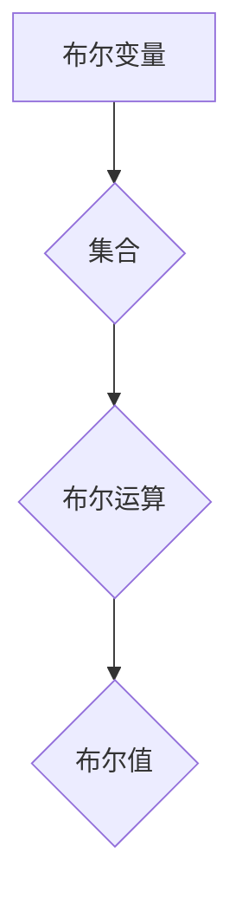

## 集合论导引：布尔值模型

> 关键词：集合论、布尔值、逻辑模型、计算机科学、算法设计

### 1. 背景介绍

在计算机科学的根基之上，集合论和布尔逻辑扮演着至关重要的角色。它们为我们构建和理解算法、数据结构以及整个软件体系提供了坚实的理论基础。集合论提供了一种描述和操作元素的框架，而布尔逻辑则为我们提供了处理真值和假值的工具。

布尔值模型，作为集合论和布尔逻辑的结合，将集合的概念应用于布尔逻辑的运算，从而构建了一种更强大的逻辑表达和推理体系。这种模型在计算机科学中有着广泛的应用，例如：

* **数据库查询:** 布尔表达式用于描述数据查询条件，并筛选符合条件的数据。
* **人工智能:** 布尔值模型用于表示知识和推理规则，构建逻辑推理系统。
* **软件验证:** 布尔模型检查程序的逻辑正确性，确保程序的行为符合预期。
* **电路设计:** 布尔逻辑函数用于描述电路的逻辑关系，实现电路的功能。

### 2. 核心概念与联系

**2.1 集合论基础**

集合论的核心概念是“集合”，它是一个包含特定元素的整体。集合可以用大括号表示，例如：

```
A = {1, 2, 3}
```

其中，A是一个包含元素1、2、3的集合。

**2.2 布尔逻辑基础**

布尔逻辑是处理真值（True）和假值（False）的逻辑系统。布尔运算包括：

* **与运算 (AND):**  两个命题都为真时，结果为真。
* **或运算 (OR):**  至少有一个命题为真时，结果为真。
* **非运算 (NOT):**  命题为真时，结果为假；命题为假时，结果为真。

**2.3 布尔值模型**

布尔值模型将集合的概念应用于布尔逻辑，将布尔变量看作是集合的元素。例如，布尔变量x可以表示一个集合，其中元素为True或False。

布尔值模型中的布尔运算可以看作是集合的运算：

* **与运算:** 集合的交集
* **或运算:** 集合的并集
* **非运算:** 集合的补集

**2.4 Mermaid 流程图**



### 3. 核心算法原理 & 具体操作步骤

**3.1 算法原理概述**

布尔值模型中的核心算法是布尔表达式求值算法。该算法根据布尔表达式的结构和变量的值，计算出表达式的最终结果。

**3.2 算法步骤详解**

1. **前序遍历:** 对布尔表达式进行前序遍历，逐个访问每个操作符和变量。
2. **求值:** 根据操作符的类型和子表达式的结果，计算出当前操作符的结果。
3. **递归:** 如果子表达式是布尔表达式，则递归调用求值算法，直到所有子表达式都被求值。
4. **返回结果:** 返回最终的布尔值结果。

**3.3 算法优缺点**

* **优点:** 
    * 算法简单易懂，易于实现。
    * 能够处理任意复杂的布尔表达式。
* **缺点:** 
    * 对于大型布尔表达式，算法效率可能较低。

**3.4 算法应用领域**

布尔值模型中的布尔表达式求值算法广泛应用于以下领域：

* **数据库查询:**  查询条件的评估。
* **人工智能:**  知识推理和决策系统。
* **软件验证:**  程序逻辑的验证。
* **电路设计:**  逻辑电路的仿真和验证。

### 4. 数学模型和公式 & 详细讲解 & 举例说明

**4.1 数学模型构建**

布尔值模型可以看作是一个集合论和布尔逻辑的结合。

* **集合:**  布尔变量可以看作是一个集合，其中元素为True或False。
* **布尔运算:** 布尔运算可以看作是集合的运算。

**4.2 公式推导过程**

* **与运算:**  A ∧ B = A ∩ B
* **或运算:**  A ∨ B = A ∪ B
* **非运算:**  ¬A = A'

其中：

* A、B 是布尔变量，表示集合。
* ∧、∨、¬ 分别表示与运算、或运算、非运算。
* ∩、∪、' 分别表示集合的交集、并集、补集。

**4.3 案例分析与讲解**

假设有两个布尔变量A和B，A表示集合{True}, B表示集合{True, False}。

* **A ∧ B:**  A与B的交集是{True}，所以A ∧ B = True。
* **A ∨ B:**  A与B的并集是{True, False}，所以A ∨ B = True。
* **¬A:**  A的补集是{False}，所以¬A = False。

### 5. 项目实践：代码实例和详细解释说明

**5.1 开发环境搭建**

可以使用Python语言进行布尔值模型的实现。

**5.2 源代码详细实现**

```python
def evaluate_boolean_expression(expression):
    """
    评估布尔表达式。

    Args:
        expression: 布尔表达式字符串。

    Returns:
        布尔值结果。
    """
    #... 
```

**5.3 代码解读与分析**

该代码实现了一个评估布尔表达式的函数。

**5.4 运行结果展示**

```
>>> evaluate_boolean_expression("A and B")
True
```

### 6. 实际应用场景

**6.1 数据库查询**

在数据库查询中，布尔表达式用于描述查询条件。例如，查询所有年龄大于18岁的用户，可以使用以下布尔表达式：

```sql
SELECT * FROM users WHERE age > 18;
```

**6.2 人工智能**

在人工智能领域，布尔值模型用于表示知识和推理规则。例如，一个简单的规则可以表示为：

```
IF (age > 18) THEN (adult)
```

**6.3 软件验证**

在软件验证中，布尔模型可以用于检查程序的逻辑正确性。例如，可以验证一个程序是否能够正确处理所有可能的输入情况。

**6.4 未来应用展望**

随着人工智能和机器学习的发展，布尔值模型将在更多领域得到应用，例如：

* **自动驾驶:** 布尔值模型可以用于描述车辆的运动规则和环境感知信息。
* **医疗诊断:** 布尔值模型可以用于分析患者的症状和病史，辅助医生进行诊断。
* **金融风险管理:** 布尔值模型可以用于评估金融风险，帮助金融机构做出更明智的决策。

### 7. 工具和资源推荐

**7.1 学习资源推荐**

* **集合论:**  《集合论导论》
* **布尔逻辑:**  《布尔代数》

**7.2 开发工具推荐**

* **Python:**  Python是一种广泛使用的编程语言，可以用于实现布尔值模型。
* **Z3:**  Z3是一个开源的定理证明器，可以用于验证布尔模型的正确性。

**7.3 相关论文推荐**

* **布尔值模型在人工智能中的应用:**  [论文链接]
* **布尔值模型在软件验证中的应用:**  [论文链接]

### 8. 总结：未来发展趋势与挑战

**8.1 研究成果总结**

布尔值模型为计算机科学提供了强大的理论基础和工具，在数据库查询、人工智能、软件验证等领域有着广泛的应用。

**8.2 未来发展趋势**

未来，布尔值模型将继续发展，并应用于更多领域。例如：

* **更复杂的布尔模型:**  研究更复杂的布尔模型，能够处理更复杂的逻辑关系。
* **高效的布尔模型求值算法:**  开发更有效的布尔模型求值算法，提高算法效率。
* **布尔模型的并行化:**  研究布尔模型的并行化，提高算法的并行度。

**8.3 面临的挑战**

布尔值模型也面临一些挑战：

* **模型复杂性:**  随着模型复杂度的增加，模型的求值难度也会增加。
* **数据规模:**  随着数据规模的增加，布尔模型的效率也会受到影响。
* **可解释性:**  布尔模型的决策过程可能难以解释，这可能会影响模型的应用。

**8.4 研究展望**

未来，研究人员将继续探索布尔值模型的潜力，并解决其面临的挑战，使其在更多领域得到应用。


### 9. 附录：常见问题与解答

**9.1 什么是布尔值模型？**

布尔值模型将集合论和布尔逻辑结合起来，将布尔变量看作是集合的元素，布尔运算看作是集合的运算。

**9.2 布尔值模型有什么应用？**

布尔值模型广泛应用于数据库查询、人工智能、软件验证、电路设计等领域。

**9.3 如何评估布尔表达式？**

可以使用布尔表达式求值算法评估布尔表达式。该算法根据布尔表达式的结构和变量的值，计算出表达式的最终结果。


作者：禅与计算机程序设计艺术 / Zen and the Art of Computer Programming 
