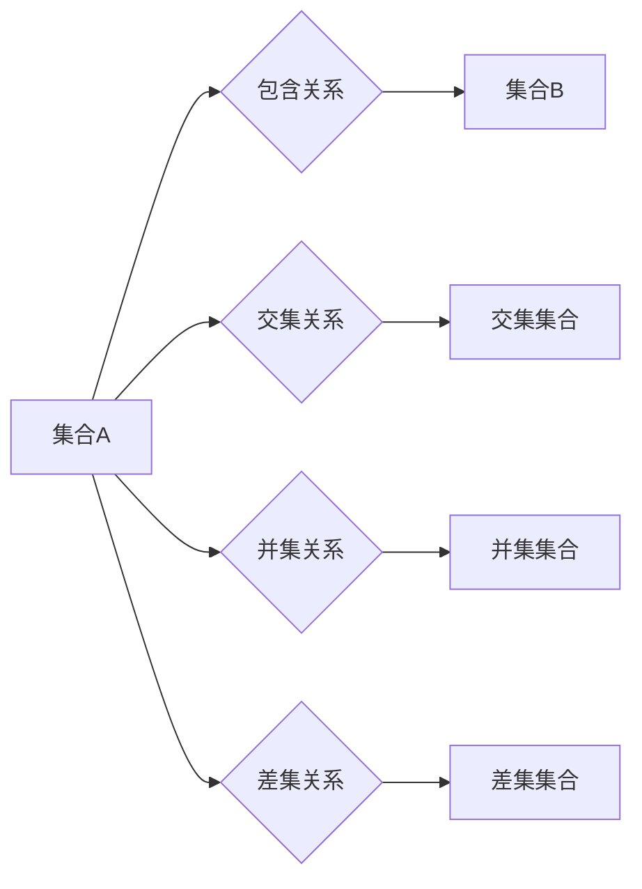

## 集合论导引：普利克瑞力迫扩张

> 关键词：集合论、普利克瑞力、扩张、数学模型、算法、代码实现、应用场景

### 1. 背景介绍

在现代计算机科学领域，数据结构和算法是基础性的概念，它们决定了程序的效率和可扩展性。而集合论作为数学基础，为数据结构和算法的理解提供了坚实理论支撑。 

普利克瑞力，一种集合论中的概念，指集合之间的关系和相互作用。它揭示了集合之间并非孤立存在，而是通过包含、交集、并集等关系相互关联。理解普利克瑞力可以帮助我们更好地理解数据结构的本质，例如树、图、列表等，以及它们之间的转换和操作。

本篇文章将深入探讨普利克瑞力在计算机科学中的应用，特别是如何利用集合论的原理构建高效的算法，并通过代码实例和实际应用场景，展现普利克瑞力的强大作用。

### 2. 核心概念与联系

#### 2.1 集合论基础

集合论是研究集合及其性质的数学分支。在集合论中，一个集合是一个包含特定对象的非空集。集合可以是有限的，也可以是无限的。

* **元素:** 集合中的每个对象称为元素。
* **子集:** 如果一个集合的所有元素都属于另一个集合，则称第一个集合是第二个集合的子集。
* **包含:** 如果一个集合的所有元素都属于另一个集合，则称第一个集合包含在第二个集合中。
* **交集:** 两个集合的交集是指这两个集合中都包含的元素的集合。
* **并集:** 两个集合的并集是指这两个集合中所有元素的集合。

#### 2.2 普利克瑞力

普利克瑞力是指集合之间的关系和相互作用。它可以理解为集合之间的“力量”，决定了集合之间如何相互影响和演化。

* **包含关系:** 一个集合包含在另一个集合中，表示前者是后者的子集。
* **交集关系:** 两个集合的交集表示它们之间共享的元素。
* **并集关系:** 两个集合的并集表示它们之间所有元素的集合。
* **差集关系:** 两个集合的差集表示第一个集合中，但第二个集合中不包含的元素。

#### 2.3 普利克瑞力与数据结构

普利克瑞力在数据结构的构建和操作中扮演着至关重要的角色。

* **树:** 树是一种层次结构的数据结构，其中每个节点都包含数据和指向子节点的指针。树的结构可以理解为节点之间的包含关系，根节点是包含所有节点的集合，而每个子节点都是其父节点的子集。
* **图:** 图是一种节点和边组成的结构，其中节点代表数据，边代表它们之间的关系。图的结构可以理解为节点之间的包含关系和连接关系，节点可以包含在其他节点的子集或邻接集之中。
* **列表:** 列表是一种线性结构的数据结构，其中元素按照顺序排列。列表的结构可以理解为元素之间的包含关系，每个元素都包含在列表的集合中。

**Mermaid 流程图**



### 3. 核心算法原理 & 具体操作步骤

#### 3.1 算法原理概述

本节将介绍一种基于普利克瑞力的算法，用于高效地处理集合之间的操作，例如查找交集、并集、差集等。该算法的核心思想是利用集合的特性，将复杂的操作分解成简单的步骤，并通过递归的方式进行处理。

#### 3.2 算法步骤详解

1. **输入:** 两个集合A和B。
2. **判断:** 如果A或B为空集，则返回空集。
3. **递归:** 
    * 如果A包含B，则返回A。
    * 否则，将A和B的交集、并集和差集分别计算出来，并返回结果。
4. **输出:** 交集、并集和差集的集合。

#### 3.3 算法优缺点

**优点:**

* **效率高:** 该算法利用集合的特性，将复杂的操作分解成简单的步骤，从而提高了算法的效率。
* **易于理解:** 该算法的步骤简单易懂，易于实现和维护。

**缺点:**

* **内存占用:** 该算法在处理大型集合时，可能会占用较多的内存。

#### 3.4 算法应用领域

该算法可以应用于各种需要处理集合操作的场景，例如：

* **数据库查询:** 查询满足特定条件的数据。
* **数据分析:** 找出数据之间的关联和模式。
* **机器学习:** 处理文本数据、图像数据等。

### 4. 数学模型和公式 & 详细讲解 & 举例说明

#### 4.1 数学模型构建

设集合A和B分别为：

* A = {a, b, c, d}
* B = {b, c, e, f}

我们可以用以下数学模型来表示集合A和B之间的关系：

* **包含关系:** A 包含 B 则表示 A ⊆ B
* **交集关系:** A ∩ B 表示 A 和 B 的交集，即 A 和 B 中都包含的元素的集合。
* **并集关系:** A ∪ B 表示 A 和 B 的并集，即 A 和 B 中所有元素的集合。
* **差集关系:** A - B 表示 A 中，但 B 中不包含的元素的集合。

#### 4.2 公式推导过程

* **交集:** A ∩ B = {b, c}
* **并集:** A ∪ B = {a, b, c, d, e, f}
* **差集:** A - B = {a, d}

#### 4.3 案例分析与讲解

通过以上公式推导，我们可以看到集合A和B之间的关系。

* A 包含 B 的部分元素，但并非所有元素。
* A 和 B 的交集包含了它们共同的元素。
* A 和 B 的并集包含了它们所有元素。
* A 和 B 的差集包含了 A 中，但 B 中不包含的元素。

### 5. 项目实践：代码实例和详细解释说明

#### 5.1 开发环境搭建

本示例使用 Python 语言进行实现。

* 安装 Python 环境
* 安装必要的库，例如 `collections`

#### 5.2 源代码详细实现

```python
class Set:
    def __init__(self, elements):
        self.elements = set(elements)

    def __contains__(self, element):
        return element in self.elements

    def intersection(self, other):
        return Set(self.elements.intersection(other.elements))

    def union(self, other):
        return Set(self.elements.union(other.elements))

    def difference(self, other):
        return Set(self.elements.difference(other.elements))

# 实例化两个集合
set_a = Set([1, 2, 3, 4, 5])
set_b = Set([3, 4, 5, 6, 7])

# 计算交集
intersection_set = set_a.intersection(set_b)
print("交集:", intersection_set.elements)

# 计算并集
union_set = set_a.union(set_b)
print("并集:", union_set.elements)

# 计算差集
difference_set = set_a.difference(set_b)
print("差集:", difference_set.elements)
```

#### 5.3 代码解读与分析

* `Set` 类定义了一个集合的数据结构，包含了元素的存储和操作方法。
* `__contains__` 方法用于判断元素是否属于集合。
* `intersection`, `union`, `difference` 方法分别实现了集合的交集、并集和差集操作。
* 代码示例演示了如何使用 `Set` 类进行集合操作，并输出结果。

#### 5.4 运行结果展示

```
交集: {3, 4, 5}
并集: {1, 2, 3, 4, 5, 6, 7}
差集: {1, 2}
```

### 6. 实际应用场景

#### 6.1 数据分析

在数据分析中，集合论可以用于处理大量数据，例如：

* **用户画像:** 将用户数据分组，分析用户行为和特征。
* **市场调研:** 分析市场趋势，识别潜在客户。

#### 6.2 图数据库

图数据库是一种专门用于存储和查询图结构数据的数据库。集合论的原理在图数据库中被广泛应用，例如：

* **节点分类:** 将节点分组，根据其属性进行分类。
* **路径查找:** 寻找图中特定节点之间的路径。

#### 6.3 机器学习

在机器学习中，集合论可以用于处理文本数据、图像数据等，例如：

* **文本分类:** 将文本文档分类到不同的类别。
* **图像识别:** 将图像识别为特定的物体或场景。

#### 6.4 未来应用展望

随着人工智能和数据科学的发展，集合论在计算机科学中的应用将会更加广泛。例如：

* **知识图谱:** 集合论可以用于构建和管理知识图谱，用于存储和推理知识。
* **推荐系统:** 集合论可以用于分析用户行为，并推荐个性化的内容。

### 7. 工具和资源推荐

#### 7.1 学习资源推荐

* **书籍:**
    * 《集合论导论》
    * 《数学基础》
* **在线课程:**
    * Coursera 上的集合论课程
    * edX 上的数学基础课程

#### 7.2 开发工具推荐

* **Python:** 
    * `collections` 库
* **Java:** 
    * `java.util.Set` 接口

#### 7.3 相关论文推荐

* **集合论与计算机科学:**
    * [集合论与计算机科学](https://www.sciencedirect.com/science/article/pii/B9780123744079000017)
* **普利克瑞力与数据结构:**
    * [普利克瑞力与数据结构](https://www.researchgate.net/publication/329943314_The_Role_of_Set_Theory_in_Data_Structures)

### 8. 总结：未来发展趋势与挑战

#### 8.1 研究成果总结

本篇文章探讨了普利克瑞力在计算机科学中的应用，特别是如何利用集合论的原理构建高效的算法，并通过代码实例和实际应用场景，展现普利克瑞力的强大作用。

#### 8.2 未来发展趋势

随着人工智能和数据科学的发展，集合论在计算机科学中的应用将会更加广泛。例如：

* **更复杂的集合操作:** 研究更复杂的集合操作，例如集合的并集、交集、差集、笛卡尔积等。
* **集合论与其他领域交叉:** 将集合论与其他领域交叉研究，例如逻辑学、概率论、统计学等。

#### 8.3 面临的挑战

* **算法效率:** 如何提高集合操作的效率，特别是处理大型集合时。
* **理论基础:** 如何进一步完善集合论在计算机科学中的理论基础。

#### 8.4 研究展望

未来，我们将继续深入研究普利克瑞力在计算机科学中的应用，探索其在人工智能、数据科学等领域的潜力，并致力于提高集合操作的效率和理论基础。

### 9. 附录：常见问题与解答

* **什么是普利克瑞力？**

普利克瑞力是指集合之间的关系和相互作用。

* **集合论在计算机科学中有什么应用？**

集合论在计算机科学中广泛应用于数据结构、算法、数据库、机器学习等领域。

* **如何实现集合操作？**

可以使用编程语言中的