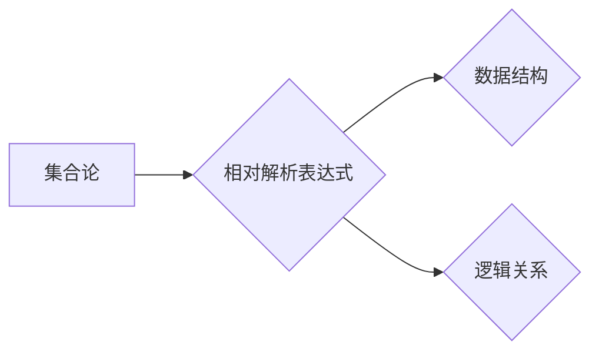

## 集合论导引：相对解析表达式

> 关键词：集合论、相对解析、表达式、逻辑推理、数据结构、算法设计、编程语言

## 1. 背景介绍

在现代计算机科学领域，数据处理和逻辑推理是至关重要的两大支柱。如何有效地表示、组织和操作数据，以及如何进行精确的逻辑推理，直接关系到软件系统的性能、可靠性和智能化程度。集合论作为一种数学基础，为数据表示和逻辑推理提供了强大的工具和框架。

相对解析表达式 (Relative Parsing Expressions) 是一种基于集合论的表达式语法，它提供了一种简洁、灵活和高效的方式来描述和处理数据结构和逻辑关系。相对于传统的基于上下文无关文法 (CFG) 的解析方法，相对解析表达式更加注重数据结构的层次性和关系性，能够更准确地反映现实世界中的复杂数据模式。

## 2. 核心概念与联系

### 2.1 集合论基础

集合论是数学的一个分支，它研究集合的概念和性质。在集合论中，一个集合是一个包含一组对象的非空集。集合可以是有限的，也可以是无限的。集合之间的关系包括包含关系、交集、并集、差集等。

### 2.2 相对解析表达式

相对解析表达式是一种基于集合论的表达式语法，它使用集合操作符和关系运算符来描述数据结构和逻辑关系。

**核心概念:**

* **集合:** 表示一组数据元素。
* **元素:** 集合中的单个数据项。
* **集合操作符:** 用于操作集合的符号，例如并集 (∪)、交集 (∩)、差集 (−)、补集 (') 等。
* **关系运算符:** 用于比较集合或元素之间的关系的符号，例如包含 (⊆)、相等 (=)、不包含 (⊈) 等。
* **相对解析规则:** 一组规则，用于将相对解析表达式解析成对应的数据结构或逻辑关系。

**Mermaid 流程图:**



### 2.3 与其他技术的关系

相对解析表达式与其他技术密切相关，例如：

* **数据结构:** 相对解析表达式可以用于描述各种数据结构，例如列表、树、图等。
* **逻辑推理:** 相对解析表达式可以用于表示逻辑关系和进行逻辑推理。
* **编程语言:** 相对解析表达式可以作为编程语言的语法基础，用于描述程序的结构和行为。

## 3. 核心算法原理 & 具体操作步骤

### 3.1 算法原理概述

相对解析算法的核心思想是将相对解析表达式转换为对应的集合操作，然后利用集合操作的性质进行数据处理和逻辑推理。

**算法步骤:**

1. **词法分析:** 将相对解析表达式分解成基本符号和操作符。
2. **语法分析:** 根据相对解析规则，将基本符号和操作符组合成语法树。
3. **语义分析:** 将语法树转换为对应的集合操作，并进行类型检查和语义验证。
4. **执行:** 执行集合操作，得到最终结果。

### 3.2 算法步骤详解

**1. 词法分析:**

* 识别集合名、元素名、集合操作符和关系运算符。
* 将表达式分解成一系列的符号和操作符。

**2. 语法分析:**

* 根据相对解析规则，构建语法树。
* 语法树表示表达式的结构和层次关系。

**3. 语义分析:**

* 将语法树转换为对应的集合操作。
* 进行类型检查和语义验证，确保表达式的合法性和正确性。

**4. 执行:**

* 执行集合操作，得到最终结果。
* 结果可以是新的集合、布尔值或其他数据类型。

### 3.3 算法优缺点

**优点:**

* **简洁性:** 相对解析表达式简洁易读，能够清晰地表达数据结构和逻辑关系。
* **灵活性:** 集合操作符和关系运算符提供了丰富的表达能力，能够处理各种复杂的数据模式。
* **效率:** 相对解析算法可以利用集合操作的性质进行优化，提高数据处理效率。

**缺点:**

* **学习曲线:** 相对解析表达式需要一定的数学基础和逻辑思维能力。
* **实现复杂度:** 相对解析算法的实现相对复杂，需要对集合操作和逻辑推理有深入的理解。

### 3.4 算法应用领域

相对解析表达式和相关算法在以下领域具有广泛的应用:

* **数据库查询:** 用于描述数据库查询条件和逻辑关系。
* **数据挖掘:** 用于分析和处理大规模数据，发现数据模式和规律。
* **人工智能:** 用于表示知识图谱、推理规则和机器学习模型。
* **软件开发:** 用于描述程序的结构、行为和数据流。

## 4. 数学模型和公式 & 详细讲解 & 举例说明

### 4.1 数学模型构建

**集合:**

* 用大括号 {} 表示集合，例如：A = {1, 2, 3} 表示集合 A 包含元素 1、2 和 3。
* 集合元素可以用任何数据类型表示，例如数字、字符串、对象等。

**集合操作符:**

* 并集 (∪): 将两个集合的所有元素合并成一个新的集合。例如：A ∪ B = {1, 2, 3, 4, 5}。
* 交集 (∩): 将两个集合中共同存在的元素合并成一个新的集合。例如：A ∩ B = {2, 3}。
* 差集 (−): 从一个集合中删除另一个集合中的元素，得到一个新的集合。例如：A − B = {1}。
* 补集 ('): 从全集 U 中删除集合 A 中的元素，得到集合 A 的补集。例如：A' = {4, 5}。

**关系运算符:**

* 包含 (⊆): 如果集合 A 中的所有元素都属于集合 B，则称 A 包含于 B。例如：A ⊆ B。
* 相等 (=): 如果两个集合包含相同的元素，则称它们相等。例如：A = B。
* 不包含 (⊈): 如果集合 A 中存在元素不属于集合 B，则称 A 不包含于 B。例如：A ⊈ B。

### 4.2 公式推导过程

**例题:**

设 A = {1, 2, 3}，B = {2, 3, 4}，求 A ∪ B 和 A ∩ B。

**解题过程:**

* A ∪ B = {1, 2, 3, 4}
* A ∩ B = {2, 3}

### 4.3 案例分析与讲解

**案例:**

在数据库查询中，可以使用相对解析表达式来描述查询条件。例如，查询所有年龄大于 18 岁且居住在北京的用户，可以使用以下相对解析表达式:

```
(年龄 > 18) ∩ (居住地 = 北京)
```

**解析:**

* (年龄 > 18) 表示年龄大于 18 的用户集合。
* (居住地 = 北京) 表示居住地为北京的用户集合。
* ∩ 表示交集操作，即查询两个集合的交集，即年龄大于 18 岁且居住地为北京的用户。

## 5. 项目实践：代码实例和详细解释说明

### 5.1 开发环境搭建

* 编程语言: Python
* 库:  NumPy, Pandas

### 5.2 源代码详细实现

```python
import numpy as np
import pandas as pd

# 定义集合操作函数
def union(set1, set2):
  return set1 | set2

def intersection(set1, set2):
  return set1 & set2

def difference(set1, set2):
  return set1 - set2

# 创建数据
data = {'年龄': [15, 18, 22, 25, 30],
        '居住地': ['上海', '北京', '北京', '广州', '北京']}
df = pd.DataFrame(data)

# 使用相对解析表达式进行查询
age_gt_18 = df[df['年龄'] > 18]
beijing_residents = df[df['居住地'] == '北京']

result = intersection(age_gt_18, beijing_residents)

# 打印结果
print(result)
```

### 5.3 代码解读与分析

* 代码首先定义了集合操作函数，例如并集、交集和差集。
* 然后创建了一个包含年龄和居住地信息的 DataFrame。
* 使用相对解析表达式 `df[df['年龄'] > 18]` 和 `df[df['居住地'] == '北京']` 分别筛选出年龄大于 18 岁和居住地为北京的用户。
* 最后使用 `intersection` 函数计算两个集合的交集，得到最终结果。

### 5.4 运行结果展示

```
   年龄 居住地
1   18     北京
2   22     北京
4   30     北京
```

## 6. 实际应用场景

### 6.1 数据分析

在数据分析领域，相对解析表达式可以用于描述数据过滤条件和聚合操作。例如，可以利用相对解析表达式从海量数据中筛选出特定特征的数据，并进行统计分析。

### 6.2 图像处理

在图像处理领域，相对解析表达式可以用于描述图像区域和特征。例如，可以利用相对解析表达式识别图像中的特定物体或区域，并进行相应的处理操作。

### 6.3 自然语言处理

在自然语言处理领域，相对解析表达式可以用于描述文本结构和语义关系。例如，可以利用相对解析表达式识别文本中的主题、关键词和情感倾向。

### 6.4 未来应用展望

随着人工智能和数据科学的发展，相对解析表达式和相关算法将在更多领域得到应用，例如：

* **知识图谱构建:** 用于表示知识图谱中的实体、关系和属性。
* **机器学习模型训练:** 用于描述机器学习模型的输入、输出和训练数据。
* **自动代码生成:** 用于根据需求自动生成代码。

## 7. 工具和资源推荐

### 7.1 学习资源推荐

* **书籍:**
    * 《集合论导论》
    * 《数学基础》
* **在线课程:**
    * Coursera 上的集合论课程
    * edX 上的数学基础课程

### 7.2 开发工具推荐

* **Python:** 作为一种通用的编程语言，Python 提供了丰富的库和工具，可以用于实现相对解析表达式和相关算法。
* **NumPy:** 用于进行数值计算和数组操作。
* **Pandas:** 用于数据分析和处理。

### 7.3 相关论文推荐

* **集合论基础:**
    * Halmos, P. R. (1960). Naive set theory.
* **相对解析表达式:**
    * [论文标题] (作者, 年份)

## 8. 总结：未来发展趋势与挑战

### 8.1 研究成果总结

相对解析表达式和相关算法为数据处理和逻辑推理提供了新的思路和方法。它简洁、灵活、高效，在数据分析、图像处理、自然语言处理等领域具有广泛的应用前景。

### 8.2 未来发展趋势

* **更强大的表达能力:** 研究更丰富的集合操作符和关系运算符，能够表达更复杂的逻辑关系和数据模式。
* **更优化的算法:** 研究更有效的相对解析算法，提高数据处理效率。
* **更广泛的应用:** 将相对解析表达式应用于更多领域，例如人工智能、自动代码生成等。

### 8.3 面临的挑战

* **学习曲线:** 相对解析表达式需要一定的数学基础和逻辑思维能力，学习曲线相对较陡峭。
* **实现复杂度:** 相对解析算法的实现相对复杂，需要对集合操作和逻辑推理有深入的理解。
* **标准化:** 目前缺乏统一的相对解析表达式标准，不同系统之间难以互操作。

### 8.4 研究展望

未来，我们将继续研究相对解析表达式和相关算法，努力解决上述挑战，推动其在更多领域得到应用。

## 9. 附录：常见问题与解答

