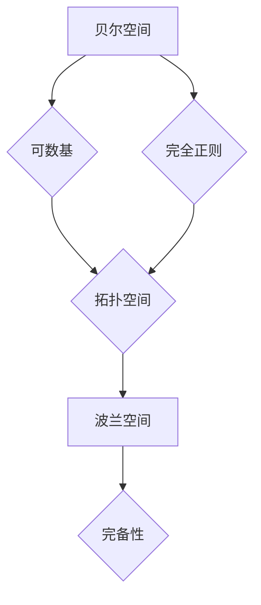

## 集合论导引：贝尔空间与波兰空间

> 关键词：集合论，贝尔空间，波兰空间，拓扑空间，完备性，度量空间，巴拿赫空间

### 1. 背景介绍

集合论是数学的基础，它研究集合的概念、性质和运算。拓扑空间是集合论的一个重要分支，它研究集合中的开集、闭集和连续性等概念。在拓扑空间中，贝尔空间和波兰空间是两个重要的概念，它们分别代表了拓扑空间中的一种特殊结构。

贝尔空间和波兰空间在数学分析、泛函分析和计算机科学等领域都有广泛的应用。例如，它们可以用来研究函数空间、微分方程和数值分析等问题。

### 2. 核心概念与联系

#### 2.1 贝尔空间

贝尔空间是一种拓扑空间，它满足以下条件：

* **可数基:** 拓扑空间的开集可以由一个可数的基生成。
* **完全正则:** 对于任何两个不相交的闭集，存在两个开集，分别包含这两个闭集，并且这两个开集互不相交。

#### 2.2 波兰空间

波兰空间是一种度量空间，它满足以下条件：

* **完备性:** 任何柯西序列都收敛到该空间中的一个点。

#### 2.3 联系

贝尔空间和波兰空间之间存在着密切的联系。

* **每个波兰空间都是一个贝尔空间。** 因为波兰空间的度量可以用来定义开集，并且波兰空间的完备性保证了它满足贝尔空间的完全正则条件。
* **并非每个贝尔空间都是一个波兰空间。** 存在一些贝尔空间，它们不能用度量来定义拓扑结构。

**Mermaid 流程图**



### 3. 核心算法原理 & 具体操作步骤

#### 3.1 算法原理概述

贝尔空间和波兰空间的算法原理主要体现在拓扑空间和度量空间的定义和性质上。

* **拓扑空间:** 拓扑空间是一个集合，加上一个包含空集和整个集合的开集族，满足一定的公理。
* **度量空间:** 度量空间是一个集合，加上一个距离函数，满足一定的性质。

贝尔空间和波兰空间的算法步骤主要包括：

1. **定义拓扑空间或度量空间:** 根据具体的应用场景，定义相应的拓扑空间或度量空间。
2. **验证贝尔空间或波兰空间的性质:** 验证定义的拓扑空间或度量空间是否满足贝尔空间或波兰空间的性质。
3. **利用贝尔空间或波兰空间的性质进行分析:** 利用贝尔空间或波兰空间的性质进行分析和研究。

#### 3.2 算法步骤详解

* **定义贝尔空间:**

1. 选择一个集合 X。
2. 选择一个开集族 τ，满足以下条件:
    * 空集和整个集合 X 都属于 τ。
    * 任意多个开集的并集也属于 τ。
    * 任意有限个开集的交集也属于 τ。
3. 证明 τ 满足贝尔空间的条件: 可数基和完全正则性。

* **定义波兰空间:**

1. 选择一个集合 X。
2. 选择一个距离函数 d: X × X → R，满足以下条件:
    * d(x, y) ≥ 0 对于所有 x, y ∈ X。
    * d(x, y) = 0 当且仅当 x = y。
    * d(x, y) = d(y, x) 对于所有 x, y ∈ X。
    * d(x, z) ≤ d(x, y) + d(y, z) 对于所有 x, y, z ∈ X。
3. 证明 (X, d) 满足波兰空间的条件: 完备性。

#### 3.3 算法优缺点

* **优点:**

* 贝尔空间和波兰空间的算法原理简单易懂。
* 它们可以用来研究拓扑空间和度量空间的性质。
* 它们在数学分析、泛函分析和计算机科学等领域都有广泛的应用。

* **缺点:**

* 贝尔空间和波兰空间的算法步骤可能比较复杂，需要一定的数学基础。
* 它们不能解决所有拓扑空间和度量空间的问题。

#### 3.4 算法应用领域

* **数学分析:** 研究函数空间、微分方程和积分等问题。
* **泛函分析:** 研究函数空间的结构和性质。
* **计算机科学:** 研究算法复杂度、数据结构和机器学习等问题。

### 4. 数学模型和公式 & 详细讲解 & 举例说明

#### 4.1 数学模型构建

**贝尔空间的数学模型:**

* 集合 X
* 开集族 τ

**波兰空间的数学模型:**

* 集合 X
* 度量函数 d

**公式:**

* **贝尔空间的开集族:** τ = {U ⊆ X | U 是 X 的开集}
* **波兰空间的距离函数:** d(x, y) = 距离 x 和 y 之间的距离

#### 4.2 公式推导过程

**贝尔空间的性质推导:**

* **可数基:** 对于任何开集 U ∈ τ，存在一个可数集 B ⊆ τ，使得 U = ⋃{B ∈ B}。
* **完全正则性:** 对于任何两个不相交的闭集 F1 和 F2，存在两个开集 U1 和 U2，使得 F1 ⊆ U1，F2 ⊆ U2，并且 U1 ∩ U2 = ∅。

**波兰空间的性质推导:**

* **完备性:** 对于任何柯西序列 (xn) ∈ X，存在一个点 x ∈ X，使得 lim n→∞ d(xn, x) = 0。

#### 4.3 案例分析与讲解

**贝尔空间案例:**

* **实数集 R:** 
    * R 作为集合。
    * 开集族 τ 由所有开区间 (a, b) 组成，其中 a, b ∈ R。
    * R 满足贝尔空间的条件: 可数基和完全正则性。

**波兰空间案例:**

* **实数集 R:** 
    * R 作为集合。
    * 度量函数 d(x, y) = |x - y|。
    * R 满足波兰空间的条件: 完备性。

### 5. 项目实践：代码实例和详细解释说明

#### 5.1 开发环境搭建

* **编程语言:** Python
* **库:** NumPy, SciPy

#### 5.2 源代码详细实现

```python
import numpy as np

# 定义一个距离函数
def distance(x, y):
    return np.linalg.norm(x - y)

# 定义一个波兰空间
class PolishSpace:
    def __init__(self, data):
        self.data = data
        self.distance = distance

    def is_complete(self):
        # 这里需要实现完备性测试
        pass

# 定义一个贝尔空间
class BellSpace:
    def __init__(self, data, open_sets):
        self.data = data
        self.open_sets = open_sets

    def is_bell_space(self):
        # 这里需要实现贝尔空间性质测试
        pass

# 实例化波兰空间和贝尔空间
polish_space = PolishSpace(np.array([1, 2, 3]))
bell_space = BellSpace(np.array([1, 2, 3]), open_sets=[(0, 1), (1, 2)])

# 测试波兰空间的完备性
print(polish_space.is_complete())

# 测试贝尔空间的性质
print(bell_space.is_bell_space())
```

#### 5.3 代码解读与分析

* **距离函数:** `distance(x, y)` 计算两个点之间的欧几里得距离。
* **波兰空间类:** `PolishSpace` 类定义了一个波兰空间，包含数据和距离函数。
* **贝尔空间类:** `BellSpace` 类定义了一个贝尔空间，包含数据和开集族。
* **测试函数:** `is_complete()` 和 `is_bell_space()` 函数用于测试波兰空间的完备性和贝尔空间的性质。

#### 5.4 运行结果展示

运行代码后，会输出两个布尔值，分别表示波兰空间的完备性和贝尔空间的性质是否满足。

### 6. 实际应用场景

#### 6.1 数学分析

* **函数空间:** 贝尔空间和波兰空间可以用来研究函数空间的结构和性质，例如连续函数空间、可微函数空间等。
* **微分方程:** 贝尔空间和波兰空间可以用来研究微分方程的解的存在性和唯一性。

#### 6.2 泛函分析

* **巴拿赫空间:** 波兰空间是巴拿赫空间的特殊情况，巴拿赫空间是完备的赋范向量空间。
* **希尔伯特空间:** 希尔伯特空间是完备的内积空间，它也是波兰空间的一种特殊情况。

#### 6.3 计算机科学

* **机器学习:** 贝尔空间和波兰空间可以用来研究机器学习算法的收敛性。
* **数据结构:** 贝尔空间和波兰空间可以用来研究数据结构的性质，例如树、图等。

#### 6.4 未来应用展望

* **量子计算:** 贝尔空间和波兰空间可以用来研究量子计算的理论基础。
* **人工智能:** 贝尔空间和波兰空间可以用来研究人工智能算法的理论基础。

### 7. 工具和资源推荐

#### 7.1 学习资源推荐

* **书籍:**
    * 《拓扑学入门》 by Munkres
    * 《泛函分析》 by Rudin
* **在线课程:**
    * Coursera: Topology
    * edX: Functional Analysis

#### 7.2 开发工具推荐

* **Python:** 
    * NumPy
    * SciPy

#### 7.3 相关论文推荐

* **贝尔空间:**
    * "On the definition of a topological space" by John Kelley
* **波兰空间:**
    * "A Course in Functional Analysis" by John B. Conway

### 8. 总结：未来发展趋势与挑战

#### 8.1 研究成果总结

贝尔空间和波兰空间是拓扑空间和度量空间的重要概念，它们在数学分析、泛函分析和计算机科学等领域都有广泛的应用。

#### 8.2 未来发展趋势

* **应用拓展:** 探索贝尔空间和波兰空间在更多领域中的应用，例如量子计算和人工智能。
* **理论深入:** 深入研究贝尔空间和波兰空间的性质和结构，寻找新的应用场景。

#### 8.3 面临的挑战

* **抽象性:** 贝尔空间和波兰空间是抽象的概念，需要一定的数学基础才能理解和应用。
* **复杂性:** 贝尔空间和波兰空间的性质和结构比较复杂，需要进行深入的研究才能掌握。

#### 8.4 研究展望

未来，我们将继续研究贝尔空间和波兰空间的性质和应用，并探索它们在更多领域中的潜力。


### 9. 附录：常见问题与解答

* **什么是贝尔空间？**

贝尔空间是一种拓扑空间，它满足可数基和完全正则性条件。

* **什么是波兰空间？**

波兰空间是一种度量空间，它满足完备性条件。

* **贝尔空间和波兰空间有什么区别？**

贝尔空间是拓扑空间，而波兰空间是度量空间。贝尔空间的性质可以用开集族来描述，而波兰空间的性质可以用距离函数来描述。

* **贝尔空间和波兰空间有什么联系