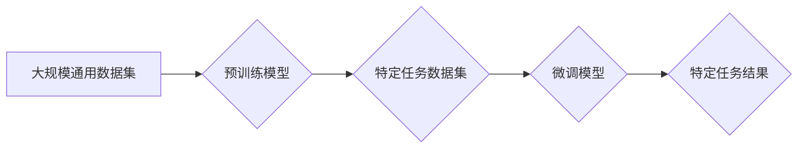

## 预训练与微调的实用技巧

> 关键词：预训练模型、微调、深度学习、自然语言处理、计算机视觉、迁移学习、模型压缩

## 1. 背景介绍

深度学习近年来取得了令人瞩目的成就，在自然语言处理、计算机视觉等领域取得了突破性进展。然而，训练一个强大的深度学习模型需要大量的计算资源和数据。为了解决这个问题，预训练与微调技术应运而生。

预训练与微调是一种训练深度学习模型的策略，它首先在一个大规模数据集上预训练一个通用模型，然后在特定任务的数据集上进行微调。这种方法可以有效地利用现有的知识，减少训练时间和数据需求，同时提高模型性能。

## 2. 核心概念与联系

**2.1 预训练模型**

预训练模型是指在大量通用数据上进行训练的深度学习模型。这些模型学习了数据的普遍特征和模式，例如语言的语法规则、图像的结构等。

**2.2 微调**

微调是指在预训练模型的基础上，对模型进行进一步的训练，使其能够适应特定任务。微调通常只需要使用少量特定任务的数据，就可以有效地提高模型性能。

**2.3 迁移学习**

迁移学习是预训练与微调的一种特殊情况，它指的是将一个任务的知识迁移到另一个相关任务中。例如，一个在图像分类任务上预训练的模型可以被微调到其他图像相关任务，例如目标检测或图像分割。

**2.4 流程图**



## 3. 核心算法原理 & 具体操作步骤

**3.1 算法原理概述**

预训练与微调的核心思想是利用迁移学习的原理。预训练模型已经学习了大量的通用知识，这些知识可以被迁移到特定任务中，从而提高模型的性能。微调的过程就是通过调整预训练模型的参数，使其能够更好地适应特定任务的数据分布和目标。

**3.2 算法步骤详解**

1. **选择预训练模型:** 选择一个在相关领域已经预训练好的模型，例如BERT、GPT-3、ResNet等。
2. **数据准备:** 准备特定任务的数据集，并进行预处理，例如文本分词、图像裁剪等。
3. **模型微调:** 将预训练模型加载到训练环境中，并对模型的某些层进行微调，例如调整最后一层全连接层的权重。
4. **训练与评估:** 使用微调后的模型训练特定任务的数据集，并定期评估模型的性能。
5. **模型部署:** 将训练好的模型部署到实际应用场景中。

**3.3 算法优缺点**

**优点:**

* **提高模型性能:** 利用预训练模型的知识可以显著提高模型的性能。
* **减少训练时间和数据需求:** 微调只需要使用少量特定任务的数据，可以大大减少训练时间和数据需求。
* **提高模型泛化能力:** 预训练模型已经学习了大量的通用知识，可以提高模型在不同数据集上的泛化能力。

**缺点:**

* **选择合适的预训练模型:** 选择一个与特定任务相关的预训练模型很重要，否则可能会降低模型性能。
* **微调参数的设置:** 微调参数的设置需要根据具体任务进行调整，否则可能会导致模型过拟合或欠拟合。
* **计算资源需求:** 尽管微调比从头训练模型需要更少的计算资源，但仍然需要一定的计算资源。

**3.4 算法应用领域**

预训练与微调技术广泛应用于以下领域:

* **自然语言处理:** 文本分类、情感分析、机器翻译、问答系统等。
* **计算机视觉:** 图像分类、目标检测、图像分割、图像生成等。
* **语音识别:** 语音转文本、语音合成等。
* **推荐系统:** 商品推荐、用户画像等。

## 4. 数学模型和公式 & 详细讲解 & 举例说明

**4.1 数学模型构建**

预训练与微调的数学模型通常基于深度神经网络。深度神经网络由多个层组成，每一层都包含多个神经元。神经元之间通过权重连接，权重决定了神经元之间的信息传递强度。

**4.2 公式推导过程**

预训练与微调的训练过程本质上是通过优化模型参数来最小化损失函数的过程。损失函数衡量模型预测结果与真实结果之间的差异。常用的损失函数包括交叉熵损失函数、均方误差损失函数等。

**4.3 案例分析与讲解**

例如，在文本分类任务中，可以使用BERT预训练模型进行微调。BERT模型的输出是一个词向量的序列，每个词向量代表一个词的语义信息。在微调过程中，会将BERT模型的输出连接到一个全连接层，该层输出每个类别的概率。损失函数是交叉熵损失函数，它衡量模型预测结果与真实类别之间的差异。通过优化模型参数，可以使模型预测结果与真实类别之间的差异最小化。

## 5. 项目实践：代码实例和详细解释说明

**5.1 开发环境搭建**

使用Python语言和深度学习框架TensorFlow或PyTorch进行开发。

**5.2 源代码详细实现**

```python
# 使用TensorFlow进行BERT模型微调

import tensorflow as tf
from transformers import BertTokenizer, BertModel

# 加载预训练模型和词典
tokenizer = BertTokenizer.from_pretrained('bert-base-uncased')
model = BertModel.from_pretrained('bert-base-uncased')

# 定义训练数据
train_data =...

# 定义损失函数和优化器
loss_fn = tf.keras.losses.SparseCategoricalCrossentropy()
optimizer = tf.keras.optimizers.Adam(learning_rate=1e-5)

# 定义训练循环
def train_step(inputs):
    with tf.GradientTape() as tape:
        outputs = model(inputs)
        loss = loss_fn(labels, outputs.logits)
    gradients = tape.gradient(loss, model.trainable_variables)
    optimizer.apply_gradients(zip(gradients, model.trainable_variables))

# 训练模型
for epoch in range(num_epochs):
    for batch in train_data:
        train_step(batch)

# 保存模型
model.save_pretrained('my_bert_model')
```

**5.3 代码解读与分析**

代码首先加载预训练的BERT模型和词典。然后定义训练数据、损失函数和优化器。训练循环中，将输入数据输入模型，计算损失，并使用优化器更新模型参数。最后，保存训练好的模型。

**5.4 运行结果展示**

训练完成后，可以使用训练好的模型进行预测，并评估模型的性能。常用的评估指标包括准确率、召回率、F1-score等。

## 6. 实际应用场景

预训练与微调技术在实际应用场景中具有广泛的应用前景。

**6.1 自然语言处理**

* **文本分类:** 可以用于分类新闻文章、社交媒体帖子、电子邮件等。
* **情感分析:** 可以用于分析文本的情感倾向，例如判断用户对产品的评价是正面还是负面。
* **机器翻译:** 可以用于将文本从一种语言翻译成另一种语言。

**6.2 计算机视觉**

* **图像分类:** 可以用于识别图像中的物体，例如猫、狗、汽车等。
* **目标检测:** 可以用于定位图像中的物体，并识别物体的类别。
* **图像分割:** 可以用于将图像分割成不同的区域，例如将图像中的前景和背景分开。

**6.3 其他领域**

* **语音识别:** 可以用于将语音转成文本。
* **推荐系统:** 可以用于推荐用户可能感兴趣的商品或服务。
* **医疗诊断:** 可以用于辅助医生进行疾病诊断。

**6.4 未来应用展望**

随着预训练模型和微调技术的不断发展，预训练与微调技术将在更多领域得到应用。例如，可以用于个性化教育、智能家居、自动驾驶等。

## 7. 工具和资源推荐

**7.1 学习资源推荐**

* **论文:**
    * Devlin et al. (2018). BERT: Pre-training of Deep Bidirectional Transformers for Language Understanding.
    * Radford et al. (2019). Language Models are Few-Shot Learners.
* **博客文章:**
    * https://huggingface.co/blog/bert-explained
    * https://towardsdatascience.com/transfer-learning-with-bert-a-practical-guide-for-beginners-a7419611421c

**7.2 开发工具推荐**

* **TensorFlow:** https://www.tensorflow.org/
* **PyTorch:** https://pytorch.org/
* **Hugging Face Transformers:** https://huggingface.co/docs/transformers/index

**7.3 相关论文推荐**

* **迁移学习:**
    * Pan, S. J., & Yang, Q. (2010). A survey on transfer learning. IEEE Transactions on Knowledge and Data Engineering, 22(10), 1345-1359.
* **预训练语言模型:**
    * Peters, M. E., Neumann, M., Iyyer, M., Gardner, M., Clark, C., Lee, K.,... & Zettlemoyer, L. (2018). Deep contextualized word representations. arXiv preprint arXiv:1802.05365.

## 8. 总结：未来发展趋势与挑战

**8.1 研究成果总结**

预训练与微调技术取得了显著的成果，在自然语言处理、计算机视觉等领域取得了突破性进展。

**8.2 未来发展趋势**

* **更大的预训练模型:** 预训练模型的规模不断扩大，例如GPT-3、PaLM等，这将进一步提高模型的性能。
* **更广泛的应用场景:** 预训练与微调技术将应用于更多领域，例如医疗诊断、自动驾驶等。
* **更有效的微调方法:** 研究更有效的微调方法，例如参数效率微调、知识蒸馏等，可以进一步降低微调成本。

**8.3 面临的挑战**

* **数据偏见:** 预训练模型可能存在数据偏见，这可能会导致模型在某些任务上表现不佳。
* **模型可解释性:** 预训练模型的决策过程难以解释，这可能会阻碍模型的应用。
* **公平性与伦理:** 预训练与微调技术可能存在公平性与伦理问题，例如模型可能被用于歧视或操纵用户。

**8.4 研究展望**

未来研究将集中在解决上述挑战，例如开发更公平、更可解释、更安全的预训练与微调技术。


## 9. 附录：常见问题与解答

**9.1 如何选择合适的预训练模型？**

选择合适的预训练模型取决于具体的任务和数据。例如，对于文本分类任务，可以使用BERT、RoBERTa等预训练语言模型；对于图像分类任务，可以使用ResNet、EfficientNet等预训练图像模型。

**9.2 如何设置微调参数？**

微调参数的设置需要根据具体的任务和数据进行调整。常用的参数包括学习率、批处理大小、训练 epochs 等。

**9.3 如何评估模型性能？**

常用的评估指标包括准确率、召回率、F1-score等。

**9.4 预训练模型的训练数据是什么？**

预训练模型通常使用大量的公开数据集进行训练，例如维基百科、书籍、网页等。

**9.5 预训练与微调技术有哪些局限性？**

预训练与微调技术仍然存在一些局限性，例如数据偏见、模型可解释性、公平性与伦理问题等。


作者：禅与计算机程序设计艺术 / Zen and the Art of Computer Programming 
