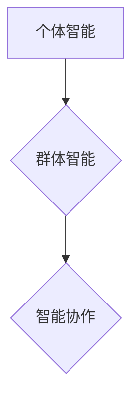

## AI Agent“三驾马车”：个体智能、群体智能和智能协作

> 关键词：人工智能代理、个体智能、群体智能、智能协作、机器学习、深度学习、强化学习、分布式计算、算法设计

### 1. 背景介绍

人工智能代理 (AI Agent) 作为人工智能领域的核心概念，是指能够感知环境、做出决策并采取行动以实现特定目标的智能实体。随着人工智能技术的快速发展，AI代理在各个领域都展现出巨大的应用潜力，例如自动驾驶、机器人控制、医疗诊断、金融交易等。

传统的AI代理主要基于个体智能，即单个代理通过自身学习和推理能力完成任务。然而，随着任务复杂度的增加，个体智能的局限性逐渐显现。为了应对更复杂的环境和任务，研究者们开始探索群体智能和智能协作的范式。

群体智能是指多个个体通过相互协作和信息共享，实现超越单个个体能力的智能行为。智能协作则是指不同类型或能力的代理之间进行协同工作，共同完成复杂任务。

### 2. 核心概念与联系

**2.1 个体智能**

个体智能是指单个代理通过自身学习和推理能力完成任务的能力。常见的个体智能算法包括：

* **机器学习 (Machine Learning)**：通过数据训练模型，使模型能够从数据中学习规律并做出预测或决策。
* **深度学习 (Deep Learning)**：一种更高级的机器学习方法，利用多层神经网络模拟人类大脑的学习过程。
* **强化学习 (Reinforcement Learning)**：通过奖励和惩罚机制，训练代理在环境中学习最优策略。

**2.2 群体智能**

群体智能是指多个个体通过相互协作和信息共享，实现超越单个个体能力的智能行为。常见的群体智能算法包括：

* **粒子群优化 (Particle Swarm Optimization)**：模拟鸟群觅食的行为，通过粒子之间的相互吸引和协作，找到最优解。
* **蚁群算法 (Ant Colony Optimization)**：模拟蚂蚁寻找食物路径的行为，通过蚂蚁之间的信息共享，找到最优路径。
* **蜂群算法 (Bee Colony Optimization)**：模拟蜜蜂寻找花蜜的行为，通过蜜蜂之间的信息共享，找到最优资源。

**2.3 智能协作**

智能协作是指不同类型或能力的代理之间进行协同工作，共同完成复杂任务。常见的智能协作框架包括：

* **多代理系统 (Multi-Agent System)**：由多个独立的代理组成，每个代理都有自己的目标和行为策略，通过通信和协作完成共同任务。
* **机器人团队 (Robot Team)**：由多个机器人组成，每个机器人具有不同的功能和能力，通过协作完成复杂任务。

**2.4 三驾马车关系**

个体智能、群体智能和智能协作是相互关联、相互促进的。个体智能是群体智能和智能协作的基础，群体智能可以增强个体智能的效率和鲁棒性，智能协作可以将多个个体智能的优势结合起来，完成更复杂的任务。

### 3. 核心算法原理 & 具体操作步骤

**3.1 算法原理概述**

本节将介绍个体智能、群体智能和智能协作的典型算法原理。

* **个体智能算法**: 

    * **机器学习**: 基于数据训练模型，通过调整模型参数来最小化预测误差。常见的机器学习算法包括线性回归、逻辑回归、决策树、支持向量机、神经网络等。
    * **深度学习**: 利用多层神经网络模拟人类大脑的学习过程，通过训练网络参数来学习复杂数据模式。常见的深度学习算法包括卷积神经网络 (CNN)、循环神经网络 (RNN)、生成对抗网络 (GAN) 等。
    * **强化学习**: 通过奖励和惩罚机制，训练代理在环境中学习最优策略。代理通过与环境交互，获得奖励或惩罚，并根据这些反馈调整自己的行为策略，最终学习到最优策略。

* **群体智能算法**: 

    * **粒子群优化**: 模拟鸟群觅食的行为，每个粒子代表一个解，通过粒子之间的相互吸引和协作，找到最优解。
    * **蚁群算法**: 模拟蚂蚁寻找食物路径的行为，通过蚂蚁之间的信息共享，找到最优路径。
    * **蜂群算法**: 模拟蜜蜂寻找花蜜的行为，通过蜜蜂之间的信息共享，找到最优资源。

* **智能协作算法**: 

    * **多代理系统**: 通过通信和协作机制，使多个代理能够共同完成任务。常见的协作机制包括任务分配、资源共享、知识共享等。
    * **机器人团队**: 通过协调控制和任务分配机制，使多个机器人能够协同工作完成任务。

**3.2 算法步骤详解**

* **机器学习**: 
    1. 数据收集和预处理
    2. 模型选择
    3. 模型训练
    4. 模型评估
    5. 模型部署

* **深度学习**: 
    1. 数据收集和预处理
    2. 网络结构设计
    3. 模型训练
    4. 模型评估
    5. 模型调优
    6. 模型部署

* **强化学习**: 
    1. 环境建模
    2. 代理设计
    3. 奖励函数设计
    4. 策略训练
    5. 策略评估
    6. 策略部署

* **粒子群优化**: 
    1. 初始化粒子群
    2. 计算粒子适应度
    3. 更新粒子速度和位置
    4. 迭代更新粒子群
    5. 选择最优解

* **蚁群算法**: 
    1. 初始化蚂蚁路径
    2. 计算蚂蚁路径适应度
    3. 更新蚂蚁路径信息素
    4. 迭代更新蚂蚁路径
    5. 选择最优路径

* **蜂群算法**: 
    1. 初始化蜂群
    2. 计算蜂群适应度
    3. 更新蜂群行为
    4. 迭代更新蜂群
    5. 选择最优资源

* **多代理系统**: 
    1. 代理设计
    2. 环境建模
    3. 通信协议设计
    4. 协作策略设计
    5. 系统仿真和评估

* **机器人团队**: 
    1. 机器人设计
    2. 任务分配策略设计
    3. 协调控制算法设计
    4. 系统仿真和评估

**3.3 算法优缺点**

* **机器学习**: 优点：能够从数据中学习规律，适应性强；缺点：需要大量数据训练，容易过拟合。
* **深度学习**: 优点：能够学习复杂数据模式，性能优异；缺点：需要大量计算资源，训练时间长，解释性差。
* **强化学习**: 优点：能够学习最优策略，适应性强；缺点：训练过程复杂，容易陷入局部最优。
* **粒子群优化**: 优点：简单易实现，收敛速度快；缺点：容易陷入局部最优，参数设置影响性能。
* **蚁群算法**: 优点：能够找到全局最优解，适应性强；缺点：计算复杂度高，参数设置影响性能。
* **蜂群算法**: 优点：能够找到全局最优解，适应性强；缺点：计算复杂度高，参数设置影响性能。
* **多代理系统**: 优点：能够解决复杂问题，提高效率；缺点：系统设计复杂，通信成本高。
* **机器人团队**: 优点：能够完成复杂任务，提高效率；缺点：系统设计复杂，协调控制难度大。

**3.4 算法应用领域**

* **机器学习**: 图像识别、自然语言处理、推荐系统、欺诈检测等。
* **深度学习**: 自动驾驶、语音识别、机器翻译、医疗诊断等。
* **强化学习**: 游戏人工智能、机器人控制、自动交易等。
* **粒子群优化**: 工程优化、金融优化、调度优化等。
* **蚁群算法**: 路径规划、资源分配、网络路由等。
* **蜂群算法**: 寻址、资源管理、图像处理等。
* **多代理系统**: 智能交通系统、智能家居系统、协同工作平台等。
* **机器人团队**: 工业自动化、灾害救援、环境监测等。

### 4. 数学模型和公式 & 详细讲解 & 举例说明

**4.1 数学模型构建**

本节将介绍个体智能、群体智能和智能协作的数学模型。

* **个体智能**: 

    * **机器学习**: 使用损失函数来衡量模型预测误差，通过梯度下降算法来更新模型参数，最小化损失函数。
    * **深度学习**: 使用反向传播算法来更新神经网络参数，最小化损失函数。
    * **强化学习**: 使用价值函数来评估代理在不同状态下的预期回报，通过策略梯度算法来更新策略参数，最大化预期回报。

* **群体智能**: 

    * **粒子群优化**: 使用粒子速度和位置更新公式来模拟粒子运动，粒子适应度由目标函数决定。
    * **蚁群算法**: 使用信息素更新公式来模拟蚂蚁路径选择，信息素浓度与路径适应度相关。
    * **蜂群算法**: 使用蜂群行为更新公式来模拟蜂群觅食行为，蜂群适应度由资源丰度决定。

* **智能协作**: 

    * **多代理系统**: 使用通信协议和协作策略来描述代理之间的交互，代理目标函数由任务需求和环境约束决定。
    * **机器人团队**: 使用协调控制算法来控制机器人运动，机器人任务分配策略由任务优先级和机器人能力决定。

**4.2 公式推导过程**

* **粒子群优化**: 粒子速度和位置更新公式如下：

$$
v_i(t+1) = w * v_i(t) + c_1 * r_1 * (pbest_i - x_i(t)) + c_2 * r_2 * (gbest - x_i(t))
$$

$$
x_i(t+1) = x_i(t) + v_i(t+1)
$$

其中：

* $v_i(t)$ 是粒子 $i$ 在时间 $t$ 的速度
* $x_i(t)$ 是粒子 $i$ 在时间 $t$ 的位置
* $w$ 是惯性权重
* $c_1$ 和 $c_2$ 是学习因子
* $r_1$ 和 $r_2$ 是随机数
* $pbest_i$ 是粒子 $i$ 的最佳位置
* $gbest$ 是全局最佳位置

* **蚁群算法**: 信息素更新公式如下：

$$
\tau_{ij}(t+1) = (1 - \rho) * \tau_{ij}(t) + \Delta \tau_{ij}
$$

其中：

* $\tau_{ij}(t)$ 是时间 $t$ 时路径 $ij$ 上的信息素浓度
* $\rho$ 是信息素挥发率
* $\Delta \tau_{ij}$ 是路径 $ij$ 上添加的信息素量

**4.3 案例分析与讲解**

* **机器学习**: 使用线性回归模型预测房价，损失函数为均方误差，通过梯度下降算法更新模型参数，最小化损失函数。
* **深度学习**: 使用卷积神经网络识别图像中的物体，损失函数为交叉熵损失，通过反向传播算法更新神经网络参数，最小化损失函数。
* **强化学习**: 使用 Q-学习算法训练一个代理玩游戏，奖励函数为获得分数，通过策略梯度算法更新策略参数，最大化预期奖励。
* **粒子群优化**: 使用粒子群优化算法求解一个工程优化问题，目标函数为最小化成本，粒子速度和位置更新公式根据目标函数值进行调整。
* **蚁群算法**: 使用蚁群算法求解一个路径规划问题，目标函数为最小化路径长度，信息素更新公式根据路径长度进行调整。

### 5. 项目实践：代码实例和详细解释说明