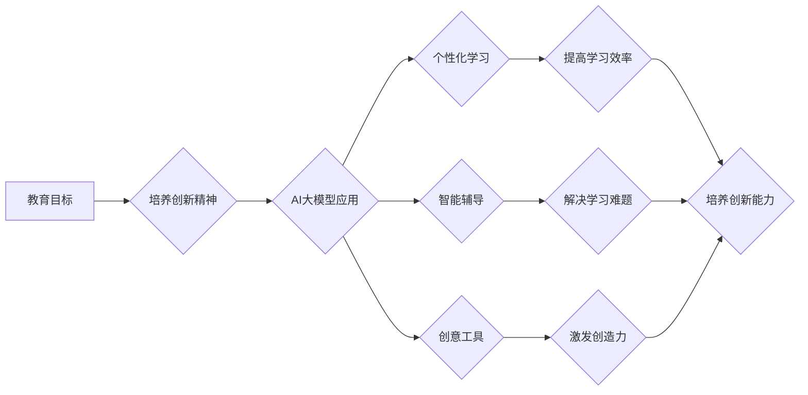

## AI 大模型时代：教育怎样实现对创新精神的培养和包容

> 关键词：人工智能大模型、创新精神、教育改革、包容性教育、未来人才培养

### 1. 背景介绍

人工智能（AI）技术近年来突飞猛进，特别是大模型的出现，为人类社会带来了前所未有的变革。这些拥有海量参数和强大学习能力的大模型，能够在自然语言处理、图像识别、代码生成等领域展现出惊人的能力，深刻地影响着我们的生活、工作和学习方式。

教育作为培养人才、推动社会进步的重要引擎，也面临着由AI大模型带来的巨大挑战和机遇。一方面，AI大模型可以极大地提高教育效率，个性化学习、智能辅导等应用正在逐步落地，为学生提供更便捷、更有效的学习体验。另一方面，AI大模型也可能导致一些负面影响，例如加剧教育资源分配不均、降低学生的批判性思维能力等。因此，如何在AI大模型时代，培养学生的创新精神，实现教育的包容性发展，成为摆在我们面前的重大课题。

### 2. 核心概念与联系

**2.1 AI大模型概述**

AI大模型是指参数规模庞大、训练数据海量的人工智能模型。它们通过深度学习算法，从海量数据中学习复杂的模式和规律，从而能够执行各种复杂的任务，例如：

* **自然语言处理 (NLP)：** 文本生成、翻译、摘要、问答等。
* **计算机视觉 (CV)：** 图像识别、分类、物体检测、图像生成等。
* **代码生成：** 根据自然语言描述生成代码。
* **语音识别：** 将语音转换为文本。
* **音乐生成：** 生成新的音乐作品。

**2.2 创新精神的定义**

创新精神是指个体能够独立思考、提出新想法、解决问题、创造新价值的能力。它是一个多维度的概念，包括创造力、想象力、批判性思维、解决问题的能力、行动力等方面。

**2.3 教育与创新精神的联系**

教育是培养创新精神的重要途径。通过学习知识、掌握技能、培养思维能力，教育可以帮助学生形成创新思维模式，激发他们的创造力，并为他们提供实践机会，让他们能够将想法付诸实践。

**2.4 AI大模型与创新精神的关联**

AI大模型可以成为培养创新精神的工具。它们可以帮助学生：

* **探索新知识：** AI大模型可以提供海量信息，帮助学生快速了解各种领域，激发他们的求知欲和探索精神。
* **激发创造力：** AI大模型可以生成各种创意内容，例如故事、诗歌、音乐等，为学生提供灵感，激发他们的想象力和创造力。
* **锻炼解决问题的能力：** AI大模型可以帮助学生解决各种问题，例如编程、设计、写作等，锻炼他们的逻辑思维和解决问题的能力。

**2.5  Mermaid 流程图**



### 3. 核心算法原理 & 具体操作步骤

**3.1 算法原理概述**

AI大模型的核心算法是深度学习，它是一种模仿人类大脑神经网络结构的机器学习算法。深度学习模型由多层神经元组成，每层神经元都连接着上一层的输出，并进行复杂的计算。通过训练大量的样本数据，模型能够学习到数据的复杂模式和规律，从而实现各种任务。

**3.2 算法步骤详解**

1. **数据收集和预处理:** 收集大量相关数据，并进行清洗、格式化、编码等预处理工作。
2. **模型构建:** 根据任务需求，选择合适的深度学习模型架构，例如卷积神经网络 (CNN)、循环神经网络 (RNN) 或 Transformer 等。
3. **模型训练:** 使用训练数据训练模型，通过调整模型参数，使模型的预测结果与真实值尽可能接近。
4. **模型评估:** 使用测试数据评估模型的性能，例如准确率、召回率、F1-score 等。
5. **模型调优:** 根据评估结果，调整模型参数、训练策略等，提高模型性能。
6. **模型部署:** 将训练好的模型部署到实际应用场景中，例如云平台、边缘设备等。

**3.3 算法优缺点**

**优点:**

* **强大的学习能力:** 深度学习模型能够学习到数据的复杂模式和规律，实现高精度预测和识别。
* **自动化程度高:** 深度学习模型的训练和部署过程可以高度自动化，降低人工成本。
* **应用领域广泛:** 深度学习模型可以应用于各种领域，例如图像识别、自然语言处理、语音识别等。

**缺点:**

* **数据依赖性强:** 深度学习模型需要大量的训练数据，否则性能会下降。
* **计算资源需求高:** 深度学习模型的训练需要大量的计算资源，例如GPU等。
* **可解释性差:** 深度学习模型的决策过程比较复杂，难以解释其决策依据。

**3.4 算法应用领域**

* **图像识别:** 人脸识别、物体检测、图像分类等。
* **自然语言处理:** 文本分类、情感分析、机器翻译等。
* **语音识别:** 语音转文本、语音助手等。
* **推荐系统:** 商品推荐、内容推荐等。
* **医疗诊断:** 病情诊断、疾病预测等。

### 4. 数学模型和公式 & 详细讲解 & 举例说明

**4.1 数学模型构建**

深度学习模型的数学基础是神经网络。神经网络由多个层组成，每层包含多个神经元。每个神经元接收来自上一层的输入信号，并通过激活函数进行处理，输出到下一层。

**4.2 公式推导过程**

神经网络的训练过程是通过反向传播算法来实现的。反向传播算法的核心思想是通过计算误差，并反向传播到各层神经元，调整神经元的权重和偏置，使得模型的预测结果与真实值尽可能接近。

**损失函数:** 用于衡量模型预测结果与真实值的差距。常见的损失函数包括均方误差 (MSE)、交叉熵损失 (Cross-Entropy Loss) 等。

**梯度下降:** 用于更新神经网络参数的优化算法。梯度下降算法通过计算损失函数的梯度，沿着梯度负方向更新参数，从而降低损失函数的值。

**4.3 案例分析与讲解**

例如，在图像分类任务中，我们可以使用卷积神经网络 (CNN) 模型。CNN模型通过卷积层和池化层来提取图像特征，并通过全连接层进行分类。

**损失函数:** 可以使用交叉熵损失函数，用于衡量模型预测类别与真实类别的差距。

**梯度下降:** 可以使用随机梯度下降 (SGD) 算法，通过随机选择一小批数据进行训练，并更新模型参数。

### 5. 项目实践：代码实例和详细解释说明

**5.1 开发环境搭建**

* Python 3.x
* TensorFlow 或 PyTorch 等深度学习框架
* GPU (可选)

**5.2 源代码详细实现**

```python
# 使用 TensorFlow 实现一个简单的图像分类模型

import tensorflow as tf

# 定义模型结构
model = tf.keras.models.Sequential([
    tf.keras.layers.Conv2D(32, (3, 3), activation='relu', input_shape=(28, 28, 1)),
    tf.keras.layers.MaxPooling2D((2, 2)),
    tf.keras.layers.Conv2D(64, (3, 3), activation='relu'),
    tf.keras.layers.MaxPooling2D((2, 2)),
    tf.keras.layers.Flatten(),
    tf.keras.layers.Dense(10, activation='softmax')
])

# 编译模型
model.compile(optimizer='adam',
              loss='sparse_categorical_crossentropy',
              metrics=['accuracy'])

# 训练模型
model.fit(x_train, y_train, epochs=5)

# 评估模型
loss, accuracy = model.evaluate(x_test, y_test)
print('Test loss:', loss)
print('Test accuracy:', accuracy)
```

**5.3 代码解读与分析**

这段代码定义了一个简单的卷积神经网络模型，用于图像分类任务。

* `tf.keras.models.Sequential` 创建了一个顺序模型，即层级结构。
* `tf.keras.layers.Conv2D` 定义了卷积层，用于提取图像特征。
* `tf.keras.layers.MaxPooling2D` 定义了池化层，用于降低特征图的尺寸，提高模型的鲁棒性。
* `tf.keras.layers.Flatten` 将多维特征图转换为一维向量。
* `tf.keras.layers.Dense` 定义了全连接层，用于分类。
* `model.compile` 编译模型，指定优化器、损失函数和评价指标。
* `model.fit` 训练模型，使用训练数据进行训练。
* `model.evaluate` 评估模型，使用测试数据评估模型的性能。

**5.4 运行结果展示**

训练完成后，模型会输出测试集上的损失值和准确率。

### 6. 实际应用场景

**6.1 个性化学习**

AI大模型可以根据学生的学习进度、知识掌握情况、学习风格等信息，定制个性化的学习内容和学习路径，提高学习效率和效果。

**6.2 智能辅导**

AI大模型可以作为智能辅导系统，为学生提供24小时在线解答、个性化指导和学习建议，帮助学生解决学习难题。

**6.3 创意工具**

AI大模型可以作为创意工具，帮助学生生成故事、诗歌、音乐等创意内容，激发他们的想象力和创造力。

**6.4 未来应用展望**

在未来，AI大模型将更加广泛地应用于教育领域，例如：

* **自动批改作业:** AI大模型可以自动批改学生的作业，节省教师的时间和精力。
* **个性化教学计划:** AI大模型可以根据学生的学习情况，自动生成个性化的教学计划。
* **虚拟教师:** AI大模型可以作为虚拟教师，为学生提供个性化的教学和辅导。

### 7. 工具和资源推荐

**7.1 学习资源推荐**

* **在线课程:** Coursera、edX、Udacity 等平台提供丰富的深度学习课程。
* **书籍:** 《深度学习》、《动手学深度学习》等书籍是深度学习入门的好选择。
* **开源代码:** TensorFlow、PyTorch 等深度学习框架提供了大量的开源代码，可以供学习和参考。

**7.2 开发工具推荐**

* **TensorFlow:** Google开发的开源深度学习框架。
* **PyTorch:** Facebook开发的开源深度学习框架。
* **Keras:** TensorFlow的高级API，易于使用。

**7.3 相关论文推荐**

* **《ImageNet Classification with Deep Convolutional Neural Networks》**
* **《Attention Is All You Need》**
* **《BERT: Pre-training of Deep Bidirectional Transformers for Language Understanding》**

### 8. 总结：未来发展趋势与挑战

**8.1 研究成果总结**

近年来，AI大模型在图像识别、自然语言处理、语音识别等领域取得了显著的成果，为教育领域带来了新的机遇。

**8.2 未来发展趋势**

* **模型规模和能力的提升:** 未来，AI大模型的规模和能力将会进一步提升，能够处理更复杂的任务，提供更精准的预测和识别。
* **模型解释性和可控性的增强:** 研究者将致力于提高AI大模型的解释性和可控性，使其决策过程更加透明，更容易被理解和控制。
* **模型的个性化定制:** 未来，AI