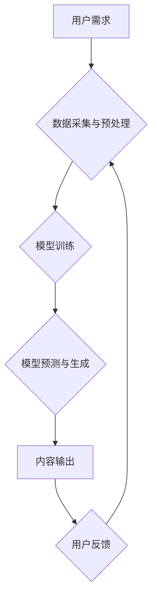

## AIGC从入门到实战：AIGC 在电商行业的创新场景—“人、货、场”全面升级催生新业态、新范式

> 关键词：AIGC、电商、人工智能、自然语言处理、图像生成、个性化推荐、智能客服、内容创作

## 1. 背景介绍

近年来，人工智能技术（尤其是深度学习）取得了飞速发展，催生了强大的通用人工智能模型，例如GPT-3、DALL-E 2等。这些模型能够理解和生成人类语言、图像、音频等多种数据形式，为各行各业带来了革命性的变革。其中，AIGC（人工智能生成内容）作为人工智能技术的重要应用场景之一，正在深刻地改变着内容创作、营销推广、客户服务等领域。

电商行业作为信息化和数字化程度极高的行业，对内容创作、用户体验、运营效率等方面有着极高的需求。AIGC技术为电商行业提供了全新的解决方案，能够帮助电商企业提升运营效率、个性化用户体验、打造更具吸引力的营销内容，从而实现业务增长和竞争优势。

## 2. 核心概念与联系

**2.1 AIGC 的核心概念**

AIGC（Artificial Intelligence Generated Content）是指利用人工智能技术自动生成各种类型的文本、图像、音频、视频等内容。AIGC技术的核心是深度学习算法，通过训练海量数据，模型能够学习到内容创作的规律和模式，并根据输入的指令或提示自动生成新的内容。

**2.2 AIGC 与电商行业的联系**

AIGC技术与电商行业有着密切的联系，能够在“人、货、场”三个关键环节带来革命性的变革：

* **人：** AIGC可以帮助电商企业提升用户体验，例如：
    * **个性化推荐：** 基于用户的浏览历史、购买记录等数据，AIGC可以生成个性化的商品推荐，提高用户转化率。
    * **智能客服：** AIGC可以训练出智能客服机器人，能够24小时在线解答用户疑问，提高客户服务效率。
    * **内容创作：** AIGC可以帮助电商企业自动生成产品描述、促销文案、社交媒体内容等，节省人力成本，提高内容生产效率。
* **货：** AIGC可以帮助电商企业提升商品的吸引力和价值，例如：
    * **虚拟试衣间：** AIGC可以根据用户的体型和喜好，生成虚拟试衣效果图，帮助用户更直观地了解商品的穿着效果。
    * **3D商品展示：** AIGC可以生成3D商品模型，让用户在虚拟空间中体验商品，提升用户购物体验。
    * **个性化商品设计：** AIGC可以根据用户的需求，生成个性化的商品设计方案，满足用户的定制化需求。
* **场：** AIGC可以帮助电商企业打造更具吸引力的线上线下购物体验，例如：
    * **个性化营销：** AIGC可以根据用户的兴趣爱好，生成个性化的营销内容，提高营销效果。
    * **沉浸式购物体验：** AIGC可以生成虚拟现实场景，让用户在虚拟空间中体验购物，提升用户购物体验。
    * **智能门店运营：** AIGC可以帮助电商企业优化门店布局、商品陈列、人员调度等，提高门店运营效率。

**2.3 AIGC 架构流程图**



## 3. 核心算法原理 & 具体操作步骤

**3.1 算法原理概述**

AIGC的核心算法主要包括：

* **自然语言处理（NLP）：** 用于理解和生成人类语言，例如文本分类、情感分析、机器翻译、文本摘要等。
* **计算机视觉（CV）：** 用于理解和生成图像，例如图像识别、物体检测、图像分割、图像生成等。
* **语音识别与合成（ASR/TTS）：** 用于将语音转换为文本，并将文本转换为语音。

这些算法通常基于深度学习模型，例如Transformer、GAN等，通过训练海量数据，模型能够学习到内容创作的规律和模式，并根据输入的指令或提示自动生成新的内容。

**3.2 算法步骤详解**

AIGC内容生成过程一般包括以下步骤：

1. **数据采集与预处理：** 收集相关数据，例如文本、图像、音频等，并进行清洗、格式化、标注等预处理工作。
2. **模型训练：** 使用深度学习算法训练模型，例如使用Transformer模型训练文本生成模型，使用GAN模型训练图像生成模型。
3. **模型预测与生成：** 将输入的指令或提示输入到训练好的模型中，模型根据训练数据和输入信息进行预测，并生成新的内容。
4. **内容输出：** 将生成的文本、图像、音频等内容输出到用户界面或其他应用系统。
5. **用户反馈：** 收集用户对生成内容的反馈，并将其用于模型的进一步训练和优化。

**3.3 算法优缺点**

**优点：**

* **自动化生成：** 可以自动生成大量内容，节省人力成本和时间。
* **个性化定制：** 可以根据用户的需求生成个性化的内容，提高用户体验。
* **内容质量提升：** 通过训练海量数据，模型能够生成高质量的内容。

**缺点：**

* **数据依赖：** 模型的生成质量依赖于训练数据的质量和数量。
* **缺乏创造力：** 目前AIGC技术仍然缺乏人类的创造力和想象力。
* **伦理风险：** AIGC技术可能被用于生成虚假信息、恶意内容等，存在一定的伦理风险。

**3.4 算法应用领域**

AIGC技术在各个领域都有广泛的应用，例如：

* **内容创作：** 自动生成新闻报道、广告文案、社交媒体内容等。
* **营销推广：** 个性化营销、生成营销素材、自动回复客户咨询等。
* **教育培训：** 自动生成学习内容、个性化学习方案、智能答疑等。
* **娱乐休闲：** 生成游戏剧情、小说故事、音乐作品等。

## 4. 数学模型和公式 & 详细讲解 & 举例说明

**4.1 数学模型构建**

AIGC算法通常基于深度学习模型，例如Transformer、GAN等。这些模型的数学基础是神经网络，通过多层神经元网络进行数据处理和特征提取。

**4.2 公式推导过程**

深度学习模型的训练过程涉及到大量的数学公式，例如梯度下降算法、激活函数、损失函数等。这些公式的推导过程比较复杂，需要一定的数学基础和机器学习知识。

**4.3 案例分析与讲解**

以文本生成模型为例，其训练过程可以概括为以下步骤：

1. **输入文本序列：** 将文本序列输入到模型中。
2. **词嵌入：** 将每个词转换为向量表示，以便模型进行处理。
3. **编码器：** 使用编码器网络对输入文本序列进行编码，提取文本的语义信息。
4. **解码器：** 使用解码器网络根据编码后的语义信息生成新的文本序列。
5. **损失函数：** 计算生成文本序列与真实文本序列之间的差异，作为模型训练的依据。
6. **梯度下降：** 使用梯度下降算法更新模型参数，降低损失函数的值。

## 5. 项目实践：代码实例和详细解释说明

**5.1 开发环境搭建**

AIGC项目开发通常需要以下环境：

* **操作系统：** Linux、macOS、Windows
* **编程语言：** Python
* **深度学习框架：** TensorFlow、PyTorch
* **硬件资源：** GPU

**5.2 源代码详细实现**

由于篇幅限制，这里只提供一个简单的文本生成模型的代码示例：

```python
import tensorflow as tf

# 定义模型结构
model = tf.keras.Sequential([
    tf.keras.layers.Embedding(input_dim=10000, output_dim=128),
    tf.keras.layers.LSTM(units=128),
    tf.keras.layers.Dense(units=10000, activation='softmax')
])

# 编译模型
model.compile(loss='sparse_categorical_crossentropy', optimizer='adam')

# 训练模型
model.fit(x_train, y_train, epochs=10)

# 生成文本
text = model.predict(x_test)
```

**5.3 代码解读与分析**

* **Embedding层：** 将每个词转换为向量表示。
* **LSTM层：** 使用长短期记忆网络对文本序列进行编码。
* **Dense层：** 使用全连接层生成新的文本序列。
* **损失函数：** 使用稀疏类别交叉熵损失函数。
* **优化器：** 使用Adam优化器。

**5.4 运行结果展示**

训练完成后，模型可以用于生成新的文本序列。生成的文本序列的质量取决于训练数据的质量和模型的复杂度。

## 6. 实际应用场景

**6.1 个性化商品推荐**

AIGC可以根据用户的浏览历史、购买记录、兴趣爱好等数据，生成个性化的商品推荐，提高用户转化率。例如，电商平台可以利用AIGC技术生成个性化的商品推荐列表，并根据用户的点击和购买行为进行动态调整，从而提高用户购物体验和转化率。

**6.2 智能客服**

AIGC可以训练出智能客服机器人，能够24小时在线解答用户疑问，提高客户服务效率。例如，电商平台可以利用AIGC技术开发智能客服机器人，帮助用户解决常见问题，例如订单查询、退换货流程、商品信息等，从而提高客户服务效率和用户满意度。

**6.3 内容创作**

AIGC可以帮助电商企业自动生成产品描述、促销文案、社交媒体内容等，节省人力成本，提高内容生产效率。例如，电商平台可以利用AIGC技术自动生成产品描述，并根据不同的促销活动生成相应的促销文案，从而节省人力成本，提高内容生产效率。

**6.4 未来应用展望**

随着AIGC技术的不断发展，其在电商行业的应用场景将会更加广泛，例如：

* **虚拟试衣间：** AIGC可以根据用户的体型和喜好，生成虚拟试衣效果图，帮助用户更直观地了解商品的穿着效果。
* **3D商品展示：** AIGC可以生成3D商品模型，让用户在虚拟空间中体验商品，提升用户购物体验。
* **个性化商品设计：** AIGC可以根据用户的需求，生成个性化的商品设计方案，满足用户的定制化需求。
* **沉浸式购物体验：** AIGC可以生成虚拟现实场景，让用户在虚拟空间中体验购物，提升用户购物体验。

## 7. 工具和资源推荐

**7.1 学习资源推荐**

* **书籍：**
    * 《深度学习》
    * 《自然语言处理》
    * 《计算机视觉》
* **在线课程：**
    * Coursera
    * edX
    * Udacity

**7.2 开发工具推荐**

* **深度学习框架：** TensorFlow、PyTorch
* **编程语言：** Python
* **云平台：** AWS、Google Cloud、Azure

**7.3 相关论文推荐**

* **Transformer：** Attention Is All You Need
* **GAN：** Generative Adversarial Networks
* **BERT：** BERT: Pre-training of Deep Bidirectional Transformers for Language Understanding

## 8. 总结：未来发展趋势与挑战

**8.1 研究成果总结**

AIGC技术近年来取得了显著进展，能够生成高质量的文本、图像、音频等内容，为电商行业带来了新的机遇。

**8.2 未来发展趋势**

* **