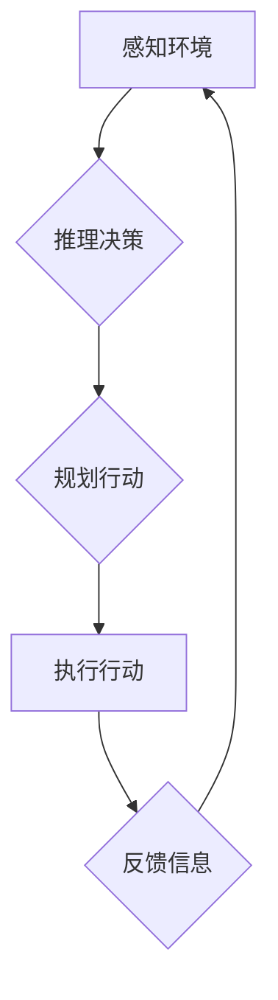

## AI人工智能 Agent：对国家安全的影响

> 关键词：人工智能、AI Agent、国家安全、威胁、机遇、伦理、监管、未来趋势

## 1. 背景介绍

人工智能（AI）技术近年来发展迅速，其应用领域不断拓展，对社会生活产生了深远影响。其中，AI Agent作为AI技术的核心应用之一，其自主学习、决策和执行能力使其在国家安全领域展现出巨大的潜力和挑战。

AI Agent是指能够感知环境、理解信息、制定决策并执行行动的智能软件实体。它可以独立完成任务，并根据环境变化进行动态调整。在国家安全领域，AI Agent可以应用于各种场景，例如：

* **网络安全：**识别和防御网络攻击，监测网络流量，分析恶意代码。
* **情报分析：**处理海量情报数据，识别潜在威胁，预测事件发生。
* **军事指挥：**辅助指挥决策，控制无人机和武器系统，提高作战效率。
* **边境安全：**识别非法入境人员，监控边境活动，预防跨境犯罪。

然而，AI Agent的强大能力也带来了新的安全风险。其自主性、学习能力和数据依赖性可能被恶意利用，导致国家安全受到威胁。

## 2. 核心概念与联系

**2.1 AI Agent 的核心概念**

AI Agent的核心概念包括：

* **感知：**通过传感器或数据接口获取环境信息。
* **推理：**分析和理解获取的信息，做出判断和决策。
* **规划：**制定执行任务的计划和策略。
* **行动：**执行决策，与环境交互。

**2.2 AI Agent 与国家安全的关系**

AI Agent可以被视为国家安全领域的新型工具，它可以帮助国家安全部门提高效率、增强能力，但同时也带来了新的挑战和风险。

**Mermaid 流程图**



**2.3 国家安全面临的挑战**

AI Agent带来的挑战包括：

* **算法偏差：**AI算法可能存在偏差，导致AI Agent做出不公平或歧视性的决策。
* **数据安全：**AI Agent依赖大量数据进行训练和运行，数据泄露或被篡改可能导致安全漏洞。
* **攻击性利用：**恶意攻击者可能利用AI Agent进行网络攻击、信息操纵或其他犯罪活动。
* **责任归属：**AI Agent的决策是否具有法律责任，以及谁来承担责任，是一个需要解决的伦理问题。

## 3. 核心算法原理 & 具体操作步骤

**3.1 算法原理概述**

AI Agent的核心算法包括：

* **机器学习：**通过训练数据，使AI Agent能够自动学习和改进其决策能力。
* **深度学习：**一种更高级的机器学习方法，利用多层神经网络模拟人类大脑的学习过程。
* **强化学习：**通过奖励和惩罚机制，训练AI Agent在特定环境中做出最优决策。

**3.2 算法步骤详解**

以机器学习为例，其基本步骤包括：

1. **数据收集和预处理：**收集相关数据，并进行清洗、转换和特征提取。
2. **模型选择：**根据任务需求选择合适的机器学习模型，例如线性回归、决策树、支持向量机等。
3. **模型训练：**利用训练数据，调整模型参数，使模型能够准确预测或分类。
4. **模型评估：**使用测试数据评估模型的性能，例如准确率、召回率、F1-score等。
5. **模型部署：**将训练好的模型部署到实际应用场景中，用于进行预测或分类。

**3.3 算法优缺点**

**优点：**

* 自动化决策，提高效率。
* 能够处理海量数据，发现隐藏模式。
* 持续学习和改进，适应不断变化的环境。

**缺点：**

* 依赖大量数据，数据质量直接影响模型性能。
* 算法可能存在偏差，导致不公平或歧视性决策。
* 黑盒效应，难以解释模型决策过程。

**3.4 算法应用领域**

* **网络安全：**入侵检测、恶意软件识别、网络流量分析。
* **情报分析：**事件预测、威胁评估、信息挖掘。
* **军事指挥：**目标识别、无人机控制、作战决策支持。
* **金融领域：**欺诈检测、风险评估、投资决策。

## 4. 数学模型和公式 & 详细讲解 & 举例说明

**4.1 数学模型构建**

AI Agent的决策过程可以抽象为一个数学模型，例如马尔可夫决策过程（MDP）。

MDP模型包含以下要素：

* **状态空间：**AI Agent可能处于的各种状态。
* **动作空间：**AI Agent可以执行的各种动作。
* **转移概率：**从一个状态到另一个状态的概率。
* **奖励函数：**AI Agent在不同状态下执行不同动作获得的奖励。

**4.2 公式推导过程**

MDP模型的目标是找到一个最优策略，使得AI Agent在长期内获得最大的总奖励。

最优策略可以使用动态规划算法或强化学习算法来求解。

**4.3 案例分析与讲解**

例如，在玩游戏场景中，AI Agent可以将游戏状态作为状态空间，游戏动作作为动作空间，游戏规则作为转移概率，游戏得分作为奖励函数。

通过学习和训练，AI Agent可以找到一个最优策略，使得自己在游戏中获得最高的得分。

## 5. 项目实践：代码实例和详细解释说明

**5.1 开发环境搭建**

* Python 3.x
* TensorFlow 或 PyTorch 等深度学习框架
* Jupyter Notebook 或 VS Code 等代码编辑器

**5.2 源代码详细实现**

```python
import tensorflow as tf

# 定义模型结构
model = tf.keras.models.Sequential([
    tf.keras.layers.Dense(128, activation='relu', input_shape=(input_dim,)),
    tf.keras.layers.Dense(64, activation='relu'),
    tf.keras.layers.Dense(output_dim)
])

# 编译模型
model.compile(optimizer='adam', loss='mse', metrics=['accuracy'])

# 训练模型
model.fit(X_train, y_train, epochs=10, batch_size=32)

# 评估模型
loss, accuracy = model.evaluate(X_test, y_test)
print('Loss:', loss)
print('Accuracy:', accuracy)
```

**5.3 代码解读与分析**

* 代码定义了一个简单的深度学习模型，用于分类任务。
* 模型包含三层全连接神经网络，使用ReLU激活函数。
* 模型使用Adam优化器，均方误差损失函数，并使用准确率作为评估指标。
* 代码训练了模型10个 epochs，每次训练32个样本。
* 最后，代码评估了模型在测试集上的性能。

**5.4 运行结果展示**

运行结果将显示模型在训练和测试集上的损失值和准确率。

## 6. 实际应用场景

**6.1 网络安全**

AI Agent可以用于识别网络攻击，例如：

* **入侵检测系统：**AI Agent可以分析网络流量，识别异常行为，并发出警报。
* **恶意软件检测：**AI Agent可以分析程序代码，识别恶意软件特征，并进行隔离。

**6.2 情报分析**

AI Agent可以用于处理海量情报数据，识别潜在威胁，例如：

* **事件预测：**AI Agent可以分析历史事件数据，预测未来事件发生可能性。
* **威胁评估：**AI Agent可以评估不同威胁的严重程度，帮助决策者制定应对策略。

**6.3 军事指挥**

AI Agent可以辅助军事指挥决策，例如：

* **目标识别：**AI Agent可以识别目标，并提供相关信息，例如位置、类型、威胁等级。
* **无人机控制：**AI Agent可以控制无人机，执行任务，例如侦察、监视、攻击。

**6.4 未来应用展望**

AI Agent在国家安全领域还有巨大的潜力，未来可能应用于：

* **人脸识别：**识别嫌疑人，预防犯罪。
* **语音识别：**识别威胁信息，进行实时监控。
* **自然语言处理：**分析社交媒体数据，识别潜在威胁。

## 7. 工具和资源推荐

**7.1 学习资源推荐**

* **书籍：**
    * 《人工智能：现代方法》
    * 《深度学习》
    * 《机器学习》
* **在线课程：**
    * Coursera
    * edX
    * Udacity

**7.2 开发工具推荐**

* **Python：**
    * TensorFlow
    * PyTorch
    * scikit-learn
* **其他工具：**
    * Jupyter Notebook
    * VS Code
    * Git

**7.3 相关论文推荐**

* **Reinforcement Learning: An Introduction**
* **Deep Learning**
* **Machine Learning: A Probabilistic Perspective**

## 8. 总结：未来发展趋势与挑战

**8.1 研究成果总结**

AI Agent在国家安全领域取得了显著成果，例如：

* **提高了网络安全防御能力。**
* **增强了情报分析能力。**
* **辅助了军事指挥决策。**

**8.2 未来发展趋势**

未来AI Agent的发展趋势包括：

* **更强大的学习能力：**利用更先进的机器学习算法，使AI Agent能够学习更复杂的任务。
* **更强的解释性：**提高AI Agent决策过程的可解释性，增强用户信任。
* **更广泛的应用场景：**将AI Agent应用于更多国家安全领域，例如人脸识别、语音识别、自然语言处理等。

**8.3 面临的挑战**

AI Agent发展也面临着一些挑战：

* **算法偏差：**解决算法偏差问题，确保AI Agent做出公平、公正的决策。
* **数据安全：**保护AI Agent训练和运行所依赖的数据安全。
* **攻击性利用：**防止恶意攻击者利用AI Agent进行攻击。
* **伦理问题：**解决AI Agent决策过程中的伦理问题，例如责任归属、隐私保护等。

**8.4 研究展望**

未来研究方向包括：

* **开发更鲁棒、更安全的AI Agent算法。**
* **建立完善的AI Agent监管机制。**
* **加强AI Agent伦理研究，制定相关规范和标准。**


## 9. 附录：常见问题与解答

**9.1 AI Agent是否会取代人类工作？**

AI Agent可以自动化许多任务，但它并不会完全取代人类工作。AI Agent更像是人类的助手，可以帮助人类提高效率，完成更复杂的任务。

**9.2 AI Agent的决策是否可以完全信任？**

AI Agent的决策基于训练数据和算法，但它并不能完全信任。需要人类进行监督和评估，确保AI Agent做出正确的决策。

**9.3 如何防止AI Agent被恶意利用？**

需要采取多种措施防止AI Agent被恶意利用，例如：

* 开发更安全的AI Agent算法。
* 加强数据安全保护。
* 建立完善的AI Agent监管机制。

**9.4 AI Agent的伦理问题如何解决？**

AI Agent的伦理问题需要多方共同努力解决，例如：

* 政府制定相关法律法规。
* 学术界进行深入研究，提出解决方案。
* 企业承担社会责任，开发安全、可信赖的AI Agent产品。


作者：禅与计算机程序设计艺术 / Zen and the Art of Computer Programming 
