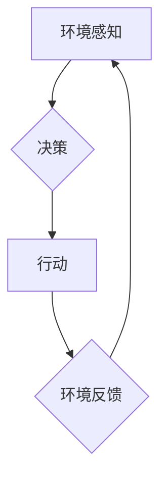

## AI人工智能 Agent：对生活的影响

> 关键词：人工智能、Agent、智能体、决策、学习、交互、应用场景、伦理

### 1. 背景介绍

人工智能（AI）正以惊人的速度发展，其影响力正在深刻地改变着我们的生活。其中，人工智能 Agent 作为 AI 的核心组成部分，扮演着越来越重要的角色。Agent 是一个能够感知环境、做出决策并采取行动的智能体。它可以独立学习、适应环境变化，并与人类或其他智能体进行交互。

从简单的聊天机器人到复杂的自动驾驶系统，AI Agent 已经渗透到我们生活的各个方面。随着技术的不断进步，AI Agent 的能力将更加强大，其应用场景也将更加广泛。

### 2. 核心概念与联系

**2.1  人工智能 Agent 的定义**

人工智能 Agent 是一个能够感知环境、做出决策并采取行动的智能体。它具有以下关键特征：

* **感知环境:** Agent 可以通过传感器获取环境信息，例如图像、声音、文本等。
* **做出决策:** 基于感知到的环境信息，Agent 可以使用算法和知识库做出决策。
* **采取行动:** Agent 可以通过执行器与环境进行交互，例如移动、控制设备、生成文本等。
* **学习和适应:** Agent 可以通过学习从经验中获得知识，并根据环境变化调整其行为策略。

**2.2  Agent 的类型**

根据 Agent 的能力和应用场景，可以将其分为以下几种类型：

* **简单反射 Agent:** 仅根据当前环境状态做出反应，缺乏记忆和学习能力。
* **模型-基于 Agent:** 建立环境模型，并根据模型预测未来状态做出决策。
* **基于规则 Agent:** 基于预先定义的规则做出决策。
* **基于学习 Agent:** 通过学习从数据中获得知识，并根据知识做出决策。

**2.3  Agent 与其他 AI 概念的关系**

AI Agent 与其他 AI 概念密切相关，例如：

* **机器学习:** 机器学习是 Agent 学习和适应环境的关键技术。
* **深度学习:** 深度学习是一种更高级的机器学习方法，可以处理更复杂的数据和任务。
* **自然语言处理:** 自然语言处理使 Agent 可以理解和生成人类语言。
* **计算机视觉:** 计算机视觉使 Agent 可以理解图像和视频。

**2.4  Mermaid 流程图**



### 3. 核心算法原理 & 具体操作步骤

**3.1  算法原理概述**

AI Agent 的核心算法原理是基于**强化学习**。强化学习是一种机器学习方法，其中 Agent 通过与环境交互，学习如何最大化累积奖励。

**3.2  算法步骤详解**

1. **环境初始化:** 环境被初始化，Agent 处于初始状态。
2. **感知环境:** Agent 感知环境状态，并获取奖励信号。
3. **决策选择:** Agent 根据当前状态和奖励信号，选择一个行动。
4. **执行行动:** Agent 执行选择的行动，并进入新的环境状态。
5. **更新策略:** Agent 根据奖励信号更新其行为策略，以提高未来获得奖励的概率。
6. **重复步骤2-5:** Agent 持续与环境交互，不断更新其策略，直到达到目标或终止条件。

**3.3  算法优缺点**

**优点:**

* 可以学习复杂的行为策略。
* 不需要明确的规则和知识库。
* 可以适应不断变化的环境。

**缺点:**

* 训练过程可能需要大量时间和数据。
* 难以解释 Agent 的决策过程。
* 可能存在奖励信号设计不当导致 Agent 学习错误的行为。

**3.4  算法应用领域**

强化学习算法广泛应用于以下领域:

* **游戏 AI:** 训练游戏 AI 玩家，例如 AlphaGo、AlphaStar。
* **机器人控制:** 训练机器人执行复杂的任务，例如自动驾驶、工业机器人。
* **推荐系统:** 建立个性化推荐系统，例如 Netflix、Amazon。
* **医疗保健:** 辅助医生诊断疾病、制定治疗方案。

### 4. 数学模型和公式 & 详细讲解 & 举例说明

**4.1  数学模型构建**

强化学习模型通常由以下几个关键要素组成:

* **状态空间 (S):** 环境可能存在的全部状态集合。
* **动作空间 (A):** Agent 可以采取的所有动作集合。
* **奖励函数 (R):** 评估 Agent 行动的奖励函数。
* **价值函数 (V):** 评估状态或状态序列的价值函数。
* **策略 (π):** 决定 Agent 在给定状态下采取动作的策略。

**4.2  公式推导过程**

强化学习的目标是找到一个最优策略，使得 Agent 在长期的交互过程中获得最大的累积奖励。

常用的价值函数估计方法包括:

* **蒙特卡罗方法:** 使用历史经验数据估计价值函数。
* **时间差分学习 (TD learning):** 使用当前状态和奖励信号更新价值函数。

**4.3  案例分析与讲解**

例如，在玩游戏时，Agent 的状态空间可以是游戏中的地图和角色信息，动作空间可以是移动、攻击、使用道具等，奖励函数可以是获得分数、击杀敌人等。

Agent 通过与环境交互，不断更新其价值函数和策略，最终学习到如何玩好游戏。

### 5. 项目实践：代码实例和详细解释说明

**5.1  开发环境搭建**

* Python 3.x
* TensorFlow 或 PyTorch
* OpenAI Gym

**5.2  源代码详细实现**

```python
import gym
import numpy as np

# 定义环境
env = gym.make('CartPole-v1')

# 定义 Agent
class Agent:
    def __init__(self, state_size, action_size):
        self.state_size = state_size
        self.action_size = action_size
        self.q_table = np.zeros((state_size, action_size))

    def choose_action(self, state):
        return np.argmax(self.q_table[state])

    def update_q_table(self, state, action, reward, next_state):
        self.q_table[state, action] = (1 - learning_rate) * self.q_table[state, action] + learning_rate * (reward + gamma * np.max(self.q_table[next_state]))

# 训练 Agent
learning_rate = 0.1
gamma = 0.99
episodes = 1000

for episode in range(episodes):
    state = env.reset()
    done = False
    total_reward = 0

    while not done:
        action = agent.choose_action(state)
        next_state, reward, done, _ = env.step(action)
        agent.update_q_table(state, action, reward, next_state)
        state = next_state
        total_reward += reward

    print(f"Episode {episode+1}, Total Reward: {total_reward}")

```

**5.3  代码解读与分析**

* 该代码实现了一个简单的 Q-learning Agent，用于玩 CartPole 游戏。
* Agent 使用一个 Q 表存储每个状态下每个动作的价值估计。
* 在训练过程中，Agent 通过与环境交互，不断更新 Q 表，以学习最优策略。

**5.4  运行结果展示**

训练完成后，Agent 应该能够成功地控制 CartPole 保持平衡，获得较高的奖励。

### 6. 实际应用场景

**6.1  智能客服**

AI Agent 可以作为智能客服，通过自然语言处理技术理解用户需求，并提供自动回复和解决方案。

**6.2  个性化推荐**

AI Agent 可以根据用户的历史行为和偏好，提供个性化的商品、内容或服务推荐。

**6.3  自动驾驶**

AI Agent 可以作为自动驾驶系统的核心，感知周围环境，做出驾驶决策，并控制车辆行驶。

**6.4  未来应用展望**

随着 AI 技术的不断发展，AI Agent 的应用场景将更加广泛，例如:

* **医疗诊断:** AI Agent 可以辅助医生诊断疾病，并提供个性化的治疗方案。
* **教育辅助:** AI Agent 可以作为个性化学习助手，根据学生的学习进度和能力提供定制化的学习内容和辅导。
* **金融风险管理:** AI Agent 可以分析金融数据，识别潜在的风险，并采取相应的措施。

### 7. 工具和资源推荐

**7.1  学习资源推荐**

* **书籍:**
    * Reinforcement Learning: An Introduction by Richard S. Sutton and Andrew G. Barto
    * Deep Reinforcement Learning Hands-On by Maxim Lapan
* **在线课程:**
    * Coursera: Reinforcement Learning Specialization
    * Udacity: Deep Reinforcement Learning Nanodegree

**7.2  开发工具推荐**

* **TensorFlow:** 开源深度学习框架
* **PyTorch:** 开源深度学习框架
* **OpenAI Gym:** 机器学习算法测试环境

**7.3  相关论文推荐**

* Deep Q-Network (DQN)
* Proximal Policy Optimization (PPO)
* Trust Region Policy Optimization (TRPO)

### 8. 总结：未来发展趋势与挑战

**8.1  研究成果总结**

近年来，AI Agent 研究取得了显著进展，例如:

* 强化学习算法取得了突破性进展，在游戏、机器人控制等领域取得了优异的成绩。
* 深度学习技术被应用于 Agent 的训练，使得 Agent 可以处理更复杂的数据和任务。
* 理论研究不断深入，对 Agent 的行为决策机制和学习能力有了更深入的理解。

**8.2  未来发展趋势**

* **更强大的学习能力:** 研究更强大的强化学习算法，使 Agent 可以学习更复杂的任务和环境。
* **更安全的 Agent:** 研究 Agent 的安全性问题，确保 Agent 的行为符合人类的期望和伦理规范。
* **更广泛的应用场景:** 将 AI Agent 应用于更多领域，例如医疗、教育、金融等。

**8.3  面临的挑战**

* **数据获取和标注:** 强化学习算法需要大量的数据进行训练，数据获取和标注成本较高。
* **算法效率:** 训练大型 AI Agent 需要大量的计算资源和时间。
* **解释性和透明度:** 强化学习算法的决策过程难以解释，缺乏透明度。

**8.4  研究展望**

未来，AI Agent 研究将继续朝着更智能、更安全、更广泛应用的方向发展。

### 9. 附录：常见问题与解答

**9.1  什么是 Agent 的奖励信号？**

奖励信号是 Agent 与环境交互后获得的反馈信息，用于评估 Agent 行动的优劣。

**9.2  什么是价值函数？**

价值函数评估状态或状态序列的价值，即 Agent 在该状态下获得的预期累积奖励。

**9.3  什么是策略？**

策略决定 Agent 在给定状态下采取动作的概率分布。

**9.4  如何评估 AI Agent 的性能？**

常用的评估指标包括奖励总和、成功率、平均时间等。

**9.5  AI Agent 会取代人类吗？**

目前，AI Agent 仍然无法完全取代人类，但它可以帮助人类完成许多重复性、危险性或需要高精度的任务。


作者：禅与计算机程序设计艺术 / Zen and the Art of Computer Programming 
