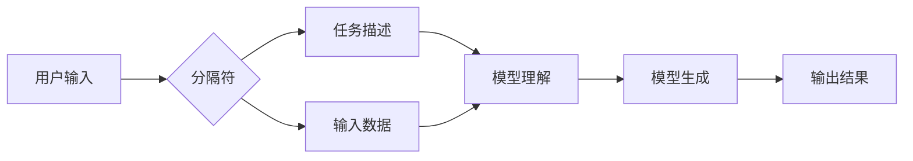

## AI大模型Prompt提示词最佳实践：使用分隔符

> 关键词：AI大模型、Prompt提示词、分隔符、最佳实践、自然语言处理、文本生成

### 1. 背景介绍

近年来，大语言模型（LLM）在自然语言处理（NLP）领域取得了令人瞩目的成就。从文本生成、翻译到问答和代码编写，LLM展现出强大的能力，为我们带来了许多新的可能性。然而，LLM的性能很大程度上取决于输入的Prompt提示词的质量。一个精心设计的Prompt可以引导模型生成更准确、更相关的输出，而一个模糊不清的Prompt则可能导致模型产生混乱或无关的回复。

Prompt提示词是与LLM交互的关键环节，它决定了模型的理解和生成方向。然而，如何设计一个有效的Prompt仍然是一个挑战。传统的Prompt设计方法往往依赖于人工经验和试错，效率低下且难以规模化。

为了解决这个问题，研究者们提出了各种Prompt优化技术，其中使用分隔符作为一种结构化方式来组织Prompt信息，逐渐成为一种主流趋势。分隔符可以帮助明确Prompt的不同部分，例如任务描述、输入数据和输出期望，从而提高模型的理解能力和生成质量。

### 2. 核心概念与联系

#### 2.1 Prompt提示词

Prompt提示词是指用户向LLM输入的一系列文本，用于引导模型完成特定任务。它可以包含任务描述、输入数据、上下文信息等。

#### 2.2 分隔符

分隔符是一种特殊的符号或字符串，用于将Prompt中的不同部分进行分割。常见的分隔符包括：

* **换行符:**  `\
`
* **分号:** `;`
* **冒号:** `:`
* **空格:** ` `
* **特定标记:** `[START]`, `[END]`, `[TASK]`, `[INPUT]`, `[OUTPUT]` 等

#### 2.3  分隔符在Prompt中的作用

使用分隔符可以将Prompt结构化，使其更易于理解和处理。

* **明确任务:** 分隔符可以将任务描述与输入数据分开，帮助模型明确需要完成的任务。
* **提供上下文:** 分隔符可以用于组织上下文信息，例如对话历史或背景知识，帮助模型更好地理解输入。
* **规范输出:** 分隔符可以指定输出格式，例如将多个回复分隔开，或将输出结果标记为特定类型。

#### 2.4  Mermaid 流程图



### 3. 核心算法原理 & 具体操作步骤

#### 3.1  算法原理概述

使用分隔符优化Prompt的算法原理基于以下几个方面：

* **结构化表示:** 将Prompt转化为结构化的格式，例如键值对或列表，方便模型解析和处理。
* **注意力机制:** 利用注意力机制，引导模型关注重要信息，例如任务描述和关键输入数据。
* **模板化设计:** 使用模板化Prompt，将常见任务结构化，提高Prompt设计效率。

#### 3.2  算法步骤详解

1. **Prompt预处理:** 将用户输入的Prompt进行预处理，例如去除停用词、规范化格式等。
2. **分隔符识别:** 使用正则表达式或其他方法识别Prompt中的分隔符。
3. **结构化转换:** 将Prompt按照分隔符进行分割，并将不同部分转化为结构化的格式，例如列表或字典。
4. **注意力机制:** 利用注意力机制，将模型的注意力集中在任务描述和关键输入数据上。
5. **模型生成:** 将结构化的Prompt输入到LLM模型中，进行文本生成。
6. **输出处理:** 将模型生成的输出进行后处理，例如去除冗余信息、格式化输出等。

#### 3.3  算法优缺点

**优点:**

* **提高模型理解能力:** 结构化的Prompt可以帮助模型更好地理解任务和输入数据。
* **增强生成质量:** 注意力机制可以引导模型关注重要信息，提高生成质量。
* **提高效率:** 模板化Prompt可以提高Prompt设计效率。

**缺点:**

* **需要设计合适的分隔符:** 分隔符的选择需要根据具体任务和模型进行调整。
* **可能增加模型复杂度:** 使用注意力机制等技术可能会增加模型的复杂度。

#### 3.4  算法应用领域

使用分隔符优化Prompt的算法可以应用于各种NLP任务，例如：

* 文本生成
* 机器翻译
* 问答系统
* 代码生成
* 文本摘要

### 4. 数学模型和公式 & 详细讲解 & 举例说明

#### 4.1  数学模型构建

使用分隔符优化Prompt的数学模型可以基于概率论和统计学原理构建。例如，可以使用贝叶斯网络来表示Prompt中的不同部分之间的关系，并计算每个部分出现的概率。

#### 4.2  公式推导过程

由于Prompt优化算法涉及多个因素，例如分隔符类型、注意力机制参数等，其数学模型推导过程较为复杂。一般来说，需要结合具体算法和任务进行推导。

#### 4.3  案例分析与讲解

假设我们使用分隔符 `;` 来组织一个文本生成Prompt，其中任务描述为 `写一首关于春天的诗`，输入数据为 `春天万物复苏`。

我们可以将Prompt表示为：

```
任务描述;输入数据
写一首关于春天的诗;春天万物复苏
```

模型可以根据分隔符将Prompt解析为两个部分，并分别处理。

### 5. 项目实践：代码实例和详细解释说明

#### 5.1  开发环境搭建

* Python 3.7+
* TensorFlow 或 PyTorch
* 其他必要的库，例如 NLTK、spaCy 等

#### 5.2  源代码详细实现

```python
import tensorflow as tf

# 定义一个简单的文本生成模型
model = tf.keras.Sequential([
    tf.keras.layers.Embedding(input_dim=vocab_size, output_dim=embedding_dim),
    tf.keras.layers.LSTM(units=lstm_units),
    tf.keras.layers.Dense(units=vocab_size, activation='softmax')
])

# 定义一个使用分隔符组织Prompt的函数
def create_prompt(task, input_data):
    prompt = f"{task};{input_data}"
    return prompt

# 使用Prompt生成文本
task = "写一首关于春天的诗"
input_data = "春天万物复苏"
prompt = create_prompt(task, input_data)
generated_text = model.predict(prompt)
```

#### 5.3  代码解读与分析

* 代码首先定义了一个简单的文本生成模型，可以使用 TensorFlow 或 PyTorch 的其他模型架构。
* `create_prompt` 函数用于组织Prompt，使用分隔符 `;` 将任务描述和输入数据分开。
* `model.predict` 函数使用训练好的模型生成文本。

#### 5.4  运行结果展示

运行代码后，模型将根据Prompt生成一首关于春天的诗。

### 6. 实际应用场景

#### 6.1  聊天机器人

使用分隔符可以将用户输入的对话历史和当前问题组织在一起，帮助聊天机器人更好地理解用户意图。

#### 6.2  问答系统

使用分隔符可以将问题和相关背景知识分开，帮助问答系统更准确地回答问题。

#### 6.3  代码生成

使用分隔符可以将代码任务描述和输入数据分开，帮助代码生成模型生成更准确的代码。

#### 6.4  未来应用展望

随着大语言模型的不断发展，使用分隔符优化Prompt的应用场景将会更加广泛。例如，可以用于个性化教育、自动写作、创意设计等领域。

### 7. 工具和资源推荐

#### 7.1  学习资源推荐

* **论文:**

    * "Prompt Engineering for Large Language Models"
    * "Prompt Tuning for Language Understanding"

* **博客:**

    * OpenAI Blog
    * Hugging Face Blog

#### 7.2  开发工具推荐

* **Hugging Face Transformers:** 提供了各种预训练的LLM模型和Prompt工程工具。
* **LangChain:** 提供了构建应用的框架，支持多种LLM模型和Prompt设计。

#### 7.3  相关论文推荐

* "Prompt Engineering for Text Classification"
* "Prompt Engineering for Question Answering"

### 8. 总结：未来发展趋势与挑战

#### 8.1  研究成果总结

使用分隔符优化Prompt的算法取得了显著的成果，提高了LLM的理解能力和生成质量。

#### 8.2  未来发展趋势

* **更智能的Prompt生成:** 研究更智能的Prompt生成算法，例如基于用户需求和上下文自动生成Prompt。
* **跨模态Prompt:** 研究跨模态Prompt，例如将文本、图像、音频等多种模态信息结合起来。
* **可解释性:** 研究更可解释的Prompt优化算法，帮助用户理解模型的决策过程。

#### 8.3  面临的挑战

* **分隔符选择:** 不同任务和模型需要不同的分隔符，如何选择合适的分隔符仍然是一个挑战。
* **模型复杂度:** 使用注意力机制等技术可能会增加模型的复杂度，影响模型的效率。
* **数据标注:** 需要大量的标注数据来训练Prompt优化算法。

#### 8.4  研究展望

未来，Prompt优化技术将继续发展，为LLM的应用带来更多可能性。


### 9. 附录：常见问题与解答

#### 9.1  常见问题

* **如何选择合适的分隔符？**

    选择合适的分隔符需要根据具体任务和模型进行调整。可以尝试不同的分隔符，并通过实验评估效果。

* **如何设计一个有效的Prompt？**

    设计一个有效的Prompt需要清晰地描述任务，提供足够的上下文信息，并使用合适的语言风格。

* **Prompt优化算法的复杂度如何？**

    Prompt优化算法的复杂度取决于具体的算法和模型。使用注意力机制等技术可能会增加模型的复杂度。

#### 9.2  解答

* **如何评估Prompt的质量？**

    Prompt的质量可以通过评估模型生成的输出质量来判断。可以使用BLEU、ROUGE等指标来衡量文本生成质量。

* **Prompt优化技术与其他NLP技术的关系？**

    Prompt优化技术可以与其他NLP技术结合使用，例如词嵌入、序列标注等，进一步提高模型的性能。


作者：禅与计算机程序设计艺术 / Zen and the Art of Computer Programming 
