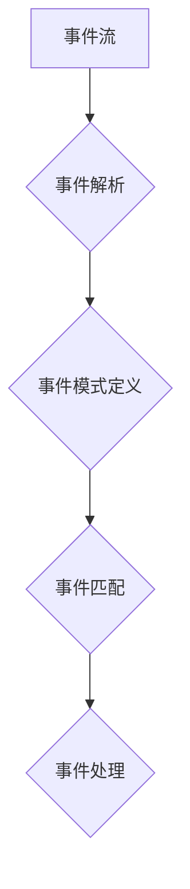

## Flink CEP原理与代码实例讲解

> 关键词：Flink, CEP, 事件处理, 流式计算, Pattern Detection, 代码实例, 实时分析

## 1. 背景介绍

在当今数据爆炸的时代，实时数据分析已成为各行各业的关键技术。传统的批处理模式难以满足对实时性、低延迟和高吞吐量的需求。为了应对这一挑战，流式计算框架应运而生，其中Apache Flink作为一款高性能、分布式流式计算框架，在实时数据处理领域占据着重要地位。

CEP（Complex Event Processing，复杂事件处理）是流式计算的一个重要子领域，它专注于从不断流动的事件数据中识别出复杂的事件模式。CEP引擎能够实时地分析事件序列，发现隐藏的关联性和趋势，并触发相应的业务逻辑。

Flink 提供了强大的 CEP 功能，允许用户定义复杂的事件模式，并对匹配的事件进行实时处理。本文将深入讲解 Flink CEP 的原理、核心算法、数学模型以及代码实例，帮助读者理解 Flink CEP 的工作机制，并掌握其应用技巧。

## 2. 核心概念与联系

Flink CEP 的核心概念包括事件、事件流、事件模式和事件匹配。

* **事件:**  CEP 中的基本单位，通常表示一个发生在特定时间和地点的特定情况。事件通常包含多个属性，例如时间戳、事件类型、相关数据等。
* **事件流:**  事件的连续序列，表示一个数据源不断产生的事件数据流。
* **事件模式:**  定义了特定事件序列的规则，例如连续发生的事件、时间间隔内的事件、特定事件类型的组合等。
* **事件匹配:**  根据定义的事件模式，从事件流中识别出匹配的事件序列。

Flink CEP 的工作流程可以概括为以下步骤：



**事件解析:** 将接收到的原始数据转换为 Flink CEP 可以理解的事件格式。

**事件模式定义:** 用户使用 Flink CEP 提供的 DSL（Domain Specific Language）定义事件模式。

**事件匹配:** Flink CEP 引擎根据定义的事件模式，实时地从事件流中识别出匹配的事件序列。

**事件处理:** 当匹配的事件序列被识别后，Flink CEP 引擎会触发相应的业务逻辑，例如发送报警、更新数据库、执行其他操作等。

## 3. 核心算法原理 & 具体操作步骤

### 3.1  算法原理概述

Flink CEP 的核心算法是基于状态机和窗口机制的事件匹配算法。

* **状态机:**  每个事件模式对应一个状态机，状态机维护着事件匹配的状态信息，例如当前匹配的事件序列、事件计数等。
* **窗口机制:**  Flink CEP 使用窗口机制来分组事件，以便于进行事件匹配。窗口可以根据时间、事件数量或其他条件进行划分。

### 3.2  算法步骤详解

1. **事件接收:** Flink CEP 引擎接收来自数据源的事件数据流。
2. **事件解析:** 将接收到的事件数据转换为 Flink CEP 可以理解的事件格式。
3. **事件分配:** 将解析后的事件分配到相应的窗口中。
4. **状态机更新:**  根据事件内容和当前状态机状态，更新状态机的状态信息。
5. **事件匹配:**  当状态机满足特定条件时，认为事件匹配成功，触发相应的业务逻辑。

### 3.3  算法优缺点

**优点:**

* **高性能:**  基于状态机和窗口机制的事件匹配算法具有高性能，能够处理海量事件数据流。
* **灵活:**  Flink CEP 提供丰富的 DSL，用户可以定义各种复杂的事件模式。
* **可扩展:**  Flink 是一个分布式框架，可以根据需要扩展计算资源。

**缺点:**

* **复杂性:**  定义复杂的事件模式可能需要一定的学习成本。
* **资源消耗:**  处理大量事件数据可能需要消耗较多的计算资源。

### 3.4  算法应用领域

Flink CEP 的应用领域非常广泛，例如：

* **金融领域:**  欺诈检测、风险管理、交易监控
* **物联网领域:**  设备故障预测、异常行为检测、智能家居
* **交通领域:**  交通流量预测、拥堵预警、公共交通调度
* **电商领域:**  用户行为分析、商品推荐、营销活动监测

## 4. 数学模型和公式 & 详细讲解 & 举例说明

### 4.1  数学模型构建

Flink CEP 中的事件匹配可以抽象为一个状态机模型。状态机由状态集合、输入集合、输出集合和状态转换函数组成。

* **状态集合:**  表示状态机的所有可能状态。
* **输入集合:**  表示状态机可以接受的事件类型。
* **输出集合:**  表示状态机可以输出的事件类型。
* **状态转换函数:**  定义了状态机在接受特定事件输入时的状态转换规则。

### 4.2  公式推导过程

状态转换函数可以表示为一个逻辑表达式，例如：

```
状态转换 = 条件表达式 -> 新状态
```

其中，条件表达式表示状态机从当前状态到新状态的转换条件，例如事件类型、事件属性值等。

### 4.3  案例分析与讲解

例如，定义一个事件模式，检测连续出现两次“温度异常”事件。

* **状态集合:**  {初始状态, 温度异常1, 温度异常2}
* **输入集合:**  {温度正常, 温度异常}
* **输出集合:**  {连续温度异常}
* **状态转换函数:**

```
初始状态 -> 温度异常1  if 事件类型 = 温度异常
温度异常1 -> 温度异常2  if 事件类型 = 温度异常
温度异常2 -> 初始状态  if 事件类型 = 温度正常
```

当连续出现两次“温度异常”事件时，状态机会从初始状态到温度异常2状态，并触发“连续温度异常”事件输出。

## 5. 项目实践：代码实例和详细解释说明

### 5.1  开发环境搭建

* Java JDK 11 或更高版本
* Apache Flink 1.13 或更高版本
* Maven 或 Gradle 构建工具

### 5.2  源代码详细实现

```java
import org.apache.flink.api.common.functions.MapFunction;
import org.apache.flink.streaming.api.datastream.DataStream;
import org.apache.flink.streaming.api.environment.StreamExecutionEnvironment;
import org.apache.flink.streaming.api.windowing.time.Time;

public class FlinkCepExample {

    public static void main(String[] args) throws Exception {

        // 创建 Flink 流式执行环境
        StreamExecutionEnvironment env = StreamExecutionEnvironment.getExecutionEnvironment();

        // 定义事件数据源
        DataStream<String> eventStream = env.fromElements(
                "temperature:25",
                "temperature:28",
                "temperature:26",
                "temperature:27",
                "temperature:30",
                "temperature:32",
                "temperature:29"
        );

        // 将事件数据转换为 TemperatureEvent 对象
        DataStream<TemperatureEvent> temperatureEventStream = eventStream.map(new MapFunction<String, TemperatureEvent>() {
            @Override
            public TemperatureEvent map(String value) throws Exception {
                String[] parts = value.split(":");
                return new TemperatureEvent(Integer.parseInt(parts[1]));
            }
        });

        // 定义温度异常事件模式
        DataStream<String> anomalyStream = temperatureEventStream
               .keyBy("temperature")
               .timeWindow(Time.seconds(5))
               .apply(new TempAnomalyDetector());

        // 打印异常事件
        anomalyStream.print();

        // 执行流式计算任务
        env.execute("Flink CEP Example");
    }
}

// 定义 TemperatureEvent 事件类
class TemperatureEvent {
    private int temperature;

    public TemperatureEvent(int temperature) {
        this.temperature = temperature;
    }

    public int getTemperature() {
        return temperature;
    }
}

// 定义温度异常检测器
class TempAnomalyDetector extends AbstractWindowFunction<TemperatureEvent, String, Integer, TimeWindow> {

    @Override
    public void apply(Integer key, TimeWindow window, Iterable<TemperatureEvent> input, Collector<String> out) throws Exception {
        int count = 0;
        for (TemperatureEvent event : input) {
            if (event.getTemperature() > 30) {
                count++;
            }
        }
        if (count >= 2) {
            out.collect("连续出现两次温度异常事件");
        }
    }
}
```

### 5.3  代码解读与分析

* **事件数据源:**  代码中使用 `env.fromElements()` 方法创建了一个事件数据源，模拟温度传感器发送的温度数据。
* **事件转换:**  使用 `map()` 方法将字符串类型的事件数据转换为 `TemperatureEvent` 对象，方便后续处理。
* **事件窗口:**  使用 `keyBy()` 和 `timeWindow()` 方法将事件数据分组到时间窗口中，以便于检测连续事件。
* **事件匹配:**  使用 `apply()` 方法定义温度异常检测器，检测连续出现两次温度异常事件。
* **事件输出:**  使用 `print()` 方法打印匹配的异常事件。

### 5.4  运行结果展示

当代码运行时，如果连续出现两次温度超过30度的事件，则会输出“连续出现两次温度异常事件”的消息。

## 6. 实际应用场景

Flink CEP 在实际应用场景中具有广泛的应用价值，例如：

* **金融领域:**  
    * **欺诈检测:**  检测信用卡交易中的异常行为，例如重复交易、高额交易、跨境交易等。
    * **风险管理:**  实时监控客户账户活动，识别潜在的风险，例如资金流出、账户异常登录等。
    * **交易监控:**  监控交易市场中的异常波动，例如价格暴涨、交易量异常等。
* **物联网领域:**  
    * **设备故障预测:**  分析设备运行数据，预测设备故障，及时进行维护。
    * **异常行为检测:**  监控设备运行状态，检测异常行为，例如设备超温、设备掉线等。
    * **智能家居:**  根据用户行为和环境数据，智能控制家居设备，例如灯光、空调、窗帘等。
* **交通领域:**  
    * **交通流量预测:**  分析道路交通数据，预测交通流量，优化交通信号灯控制。
    * **拥堵预警:**  实时监控道路拥堵情况，及时发出拥堵预警，引导车辆避开拥堵路段。
    * **公共交通调度:**  根据乘客需求和实时交通状况，优化公共交通线路和调度方案。
* **电商领域:**  
    * **用户行为分析:**  分析用户浏览、购买、评价等行为数据，了解用户需求和偏好。
    * **商品推荐:**  根据用户历史购买记录和浏览记录，推荐相关商品。
    * **营销活动监测:**  监控营销活动效果，及时调整营销策略。

### 6.4  未来应用展望

随着物联网、大数据、人工智能等技术的快速发展，Flink CEP 的应用场景将更加广泛。未来，Flink CEP 可能在以下领域得到更深入的应用：

* **工业互联网:**  实时监控工业设备运行状态，预测设备故障，实现智能制造。
* **智慧城市:**  分析城市数据，优化城市管理，提升城市服务水平。
* **医疗健康:**  分析患者数据，辅助医生诊断，提高医疗效率。
* **金融科技:**  开发更智能、更安全的金融产品和服务。

## 7. 工具和资源推荐

### 7.1  学习资源推荐

* **Apache Flink 官方文档:** https://flink.apache.org/docs/stable/
* **Flink CEP 官方指南:** https://flink.apache.org/docs/stable/cep.html