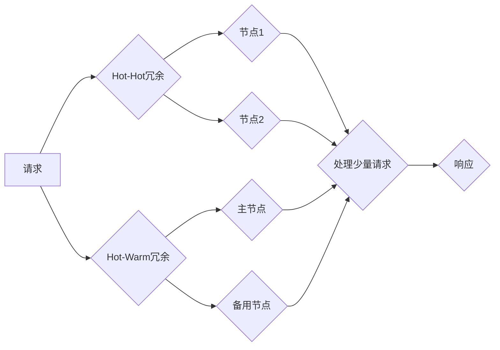

## Hot-Hot与Hot-Warm冗余设计最佳实践

> 关键词：冗余设计、Hot-Hot、Hot-Warm、高可用性、数据一致性、性能优化、云计算、分布式系统

## 1. 背景介绍

随着云计算、大数据、人工智能等技术的蓬勃发展，对系统的高可用性和性能要求越来越高。传统的单机架构已经难以满足这些需求，分布式系统成为主流架构。然而，分布式系统也带来了新的挑战，例如数据一致性、故障容错等问题。为了提高系统的可靠性和性能，冗余设计成为一种重要的技术手段。

冗余设计是指在系统中增加备份组件，以应对单个组件故障而确保系统正常运行。常见的冗余设计模式包括：

* **Active-Passive冗余:**  其中一个组件处于活动状态，负责处理请求，另一个组件处于被动状态，等待活动组件故障后接管工作。
* **Active-Active冗余:**  两个组件都处于活动状态，并同时处理请求，提高系统吞吐量和可用性。

Hot-Hot和Hot-Warm冗余设计是两种常见的Active-Active冗余模式，它们在应用场景和性能特点上有所区别。

## 2. 核心概念与联系

**Hot-Hot冗余**是指两个或多个节点都处于高负载状态，并同时处理请求。这种模式的特点是：

* **高可用性:**  如果一个节点发生故障，另一个节点可以立即接管工作，保证系统持续运行。
* **高性能:**  多个节点并行处理请求，提高系统吞吐量和响应速度。

**Hot-Warm冗余**是指一个节点处于高负载状态，负责处理大部分请求，另一个节点处于低负载状态，负责处理少量请求或备用工作。这种模式的特点是：

* **成本效益:**  相比Hot-Hot冗余，Hot-Warm冗余可以降低硬件成本，因为备用节点的资源配置可以更低。
* **灵活性和可扩展性:**  可以根据实际需求动态调整节点的负载，提高系统灵活性和可扩展性。

**Mermaid 流程图:**



## 3. 核心算法原理 & 具体操作步骤

### 3.1  算法原理概述

Hot-Hot和Hot-Warm冗余设计的核心算法原理是负载均衡和故障转移。

* **负载均衡:**  将请求分配到多个节点，避免单个节点过载，提高系统吞吐量和响应速度。常见的负载均衡算法包括轮询、加权轮询、IP哈希等。
* **故障转移:**  当一个节点发生故障时，将该节点的请求转移到其他可用节点，保证系统持续运行。故障转移机制通常采用心跳机制或监控机制来检测节点状态，并自动触发故障转移操作。

### 3.2  算法步骤详解

**Hot-Hot冗余:**

1.  **请求到达:**  请求到达系统时，首先由负载均衡器进行处理。
2.  **负载均衡:**  负载均衡器根据负载均衡算法将请求分配到两个或多个活跃节点。
3.  **节点处理:**  节点接收到请求后，进行相应的处理操作，并返回响应。
4.  **响应返回:**  响应返回给客户端。

**Hot-Warm冗余:**

1.  **请求到达:**  请求到达系统时，首先由负载均衡器进行处理。
2.  **主节点处理:**  负载均衡器将大部分请求分配到主节点。
3.  **备用节点处理:**  少量请求或备用工作分配到备用节点。
4.  **故障转移:**  当主节点发生故障时，负载均衡器将主节点的请求转移到备用节点。
5.  **备用节点接管:**  备用节点接管主节点的工作，并继续处理请求。

### 3.3  算法优缺点

**Hot-Hot冗余:**

* **优点:**  高可用性、高性能。
* **缺点:**  成本高，资源利用率低。

**Hot-Warm冗余:**

* **优点:**  成本效益高、灵活性和可扩展性强。
* **缺点:**  可用性相对较低，性能可能不如Hot-Hot冗余。

### 3.4  算法应用领域

* **Hot-Hot冗余:**  适用于对高可用性和高性能要求极高的系统，例如金融交易系统、电商平台等。
* **Hot-Warm冗余:**  适用于对成本敏感度高，但对可用性和性能要求相对较低的系统，例如网站服务器、数据库服务器等。

## 4. 数学模型和公式 & 详细讲解 & 举例说明

### 4.1  数学模型构建

假设一个系统有N个节点，其中M个节点处于活动状态，请求到达率为λ，每个节点的处理能力为μ。

* **Hot-Hot冗余:**  系统吞吐量为Mμ，平均响应时间为1/(Mμ)。
* **Hot-Warm冗余:**  主节点处理能力为μ1，备用节点处理能力为μ2，主节点处理请求比例为p，备用节点处理请求比例为(1-p)。系统吞吐量为pμ1+(1-p)μ2，平均响应时间为p/(μ1)+(1-p)/(μ2)。

### 4.2  公式推导过程

* **Hot-Hot冗余:**  系统吞吐量等于每个节点处理能力的总和，平均响应时间等于请求处理时间倒数。
* **Hot-Warm冗余:**  系统吞吐量等于主节点处理请求数量乘以主节点处理能力加上备用节点处理请求数量乘以备用节点处理能力。平均响应时间等于主节点处理请求时间倒数加上备用节点处理请求时间倒数，并根据请求分配比例进行加权平均。

### 4.3  案例分析与讲解

**案例:**  一个电商平台需要设计冗余系统，系统请求到达率为10000个/秒，每个节点处理能力为5000个/秒。

* **Hot-Hot冗余:**  如果使用Hot-Hot冗余，需要部署两个节点，系统吞吐量为10000个/秒，平均响应时间为0.2秒。
* **Hot-Warm冗余:**  如果使用Hot-Warm冗余，可以部署一个主节点和一个备用节点，主节点处理能力为5000个/秒，备用节点处理能力为2500个/秒，主节点处理请求比例为0.8，系统吞吐量为6000个/秒，平均响应时间为0.25秒。

在这个案例中，Hot-Hot冗余可以提供更高的吞吐量和更低的响应时间，但成本也更高。Hot-Warm冗余可以降低成本，但吞吐量和响应时间相对较低。

## 5. 项目实践：代码实例和详细解释说明

### 5.1  开发环境搭建

*  操作系统：Linux
*  编程语言：Python
*  框架：Flask
*  数据库：MySQL

### 5.2  源代码详细实现

```python
from flask import Flask, request, jsonify
from threading import Thread

app = Flask(__name__)

# 模拟数据库操作
def process_request(data):
    print(f"Processing request: {data}")
    # 模拟数据库查询操作
    result = f"Data: {data}"
    return result

# 两个节点实例
node1 = Thread(target=app.run, kwargs={'host': '0.0.0.0', 'port': 5000})
node2 = Thread(target=app.run, kwargs={'host': '0.0.0.0', 'port': 5001})

@app.route('/api/data', methods=['POST'])
def handle_request():
    data = request.get_json()
    result = process_request(data)
    return jsonify({'result': result})

if __name__ == '__main__':
    node1.start()
    node2.start()
```

### 5.3  代码解读与分析

*  代码使用Flask框架构建了一个简单的API接口。
*  `process_request`函数模拟数据库操作，实际应用中可以替换为真实的数据库操作。
*  两个节点实例分别运行在不同的端口上，实现Hot-Hot冗余。
*  当请求到达时，负载均衡器会将请求分配到两个节点之一。

### 5.4  运行结果展示

启动两个节点后，可以使用curl命令发送请求到两个节点的API接口。

```bash
curl -X POST -H "Content-Type: application/json" -d '{"data": "test"}' http://localhost:5000/api/data
curl -X POST -H "Content-Type: application/json" -d '{"data": "test"}' http://localhost:5001/api/data
```

## 6. 实际应用场景

### 6.1  电商平台

电商平台需要处理大量的用户请求，例如商品浏览、下单、支付等。Hot-Hot冗余可以保证系统的高可用性和高性能，避免因单个节点故障导致系统瘫痪。

### 6.2  金融交易系统

金融交易系统对高可用性和数据一致性要求极高。Hot-Hot冗余可以确保交易的实时性和安全性，避免因系统故障导致资金损失。

### 6.3  社交媒体平台

社交媒体平台需要处理大量的用户数据和消息，Hot-Warm冗余可以降低成本，同时保证系统基本可用性。

### 6.4  未来应用展望

随着云计算、大数据、人工智能等技术的不断发展，Hot-Hot和Hot-Warm冗余设计将应用于更多领域，例如：

*  物联网
*  工业互联网
*  边缘计算

## 7. 工具和资源推荐

### 7.1  学习资源推荐

*  《分布式系统的设计与实现》
*  《高可用性系统设计》
*  Kubernetes官方文档

### 7.2  开发工具推荐

*  Docker
*  Kubernetes
*  Consul

### 7.3  相关论文推荐

*  Paxos算法
*  Raft算法
*  一致性哈希算法

## 8. 总结：未来发展趋势与挑战

### 8.1  研究成果总结

Hot-Hot和Hot-Warm冗余设计是分布式系统中重要的技术手段，可以提高系统的可用性和性能。

### 8.2  未来发展趋势

*  更加智能的负载均衡算法
*  更加高效的故障转移机制
*  更加灵活的资源调度策略

### 8.3  面临的挑战

*  复杂性增加
*  成本控制
*  数据一致性保证

### 8.4  研究展望

未来研究方向包括：

*  开发更加智能、高效的冗余设计算法
*  研究更加灵活、可扩展的冗余架构
*  探索新的冗余模式，例如混合冗余、动态冗余等

## 9. 附录：常见问题与解答

*  **Q1:**  Hot-Hot冗余和Hot-Warm冗余哪个更好？

*  **A1:**  没有绝对的好坏之分，选择哪种模式取决于具体的应用场景和需求。

*  **Q2:**  如何实现Hot-Hot和Hot-Warm冗余？

*  **A2:**  可以使用负载均衡器、心跳机制、监控机制等技术实现。

*  **Q3:**  如何评估冗余设计的效果？

*  **A3:**  可以评估系统的可用性、性能、成本等指标。


作者：禅与计算机程序设计艺术 / Zen and the Art of Computer Programming 
