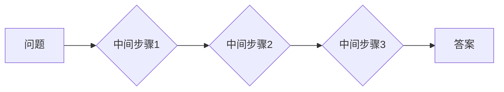
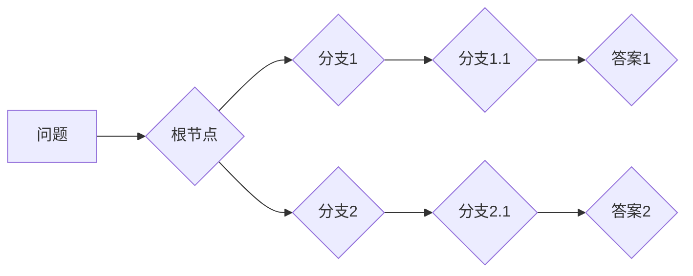

## LLM 推理能力：CoT, ToT

> 关键词：LLM, 推理能力, Chain-of-Thought Prompting,  Tree-of-Thought Prompting, 

## 1. 背景介绍

大型语言模型 (LLM) 在自然语言处理领域取得了显著的进展，展现出强大的文本生成、翻译、摘要等能力。然而，LLM 在推理能力方面仍然存在局限性。传统的训练方法主要侧重于预测下一个词，缺乏对复杂逻辑推理的训练。为了提升LLM的推理能力，研究者们提出了Chain-of-Thought Prompting (CoT) 和 Tree-of-Thought Prompting (ToT) 等新颖的提示方法。

## 2. 核心概念与联系

### 2.1 Chain-of-Thought Prompting (CoT)

CoT 是一种通过引导模型逐步推理的提示方法。它鼓励模型将问题分解成一系列中间步骤，并逐个推理，最终得出答案。

**原理:**

CoT 提示通常包含以下部分：

* **问题:** 需要解决的问题。
* **中间步骤:** 一系列引导模型推理的中间步骤。
* **答案:** 模型最终得出的答案。

**架构:**



### 2.2 Tree-of-Thought Prompting (ToT)

ToT 是一种更高级的提示方法，它将CoT的思想扩展到树形结构。ToT 提示包含多个分支，每个分支代表一个不同的推理路径。模型可以根据提示选择不同的路径进行推理，最终得出答案。

**原理:**

ToT 提示通常包含以下部分：

* **问题:** 需要解决的问题。
* **根节点:** 代表问题的初始状态。
* **分支节点:** 代表不同的推理路径。
* **叶子节点:** 代表最终的答案。

**架构:**



### 2.3 CoT 和 ToT 的联系

CoT 和 ToT 都是为了提升LLM推理能力而提出的提示方法。CoT 是一种线性推理方法，而 ToT 是一种树形推理方法。ToT 可以看作是 CoT 的扩展，它提供了更灵活的推理路径选择。

## 3. 核心算法原理 & 具体操作步骤

### 3.1 算法原理概述

CoT 和 ToT 算法的核心原理是通过精心设计的提示引导模型进行逐步推理。

* **CoT:** 将问题分解成一系列中间步骤，并引导模型逐个推理，最终得出答案。
* **ToT:** 将问题表示为树形结构，每个分支代表一个不同的推理路径，模型可以根据提示选择不同的路径进行推理。

### 3.2 算法步骤详解

**CoT 算法步骤:**

1. **问题分解:** 将问题分解成一系列中间步骤。
2. **提示构建:** 将问题和中间步骤组合成 CoT 提示。
3. **模型推理:** 将 CoT 提示输入到 LLM 模型中，模型根据提示逐步推理，最终得出答案。

**ToT 算法步骤:**

1. **问题表示:** 将问题表示为树形结构。
2. **分支构建:** 为每个节点构建多个分支，代表不同的推理路径。
3. **提示构建:** 将问题和分支节点组合成 ToT 提示。
4. **模型推理:** 将 ToT 提示输入到 LLM 模型中，模型根据提示选择不同的路径进行推理，最终得出答案。

### 3.3 算法优缺点

**CoT 算法:**

* **优点:** 
    * 能够有效提升模型的推理能力。
    * 算法简单易懂，易于实现。
* **缺点:** 
    * 需要人工设计中间步骤，效率较低。
    * 对于复杂问题，中间步骤可能难以设计完整。

**ToT 算法:**

* **优点:** 
    * 能够探索更丰富的推理路径。
    * 对于复杂问题，能够找到更优的解。
* **缺点:** 
    * 算法复杂度较高，需要更多的计算资源。
    * 需要更复杂的提示设计。

### 3.4 算法应用领域

CoT 和 ToT 算法在以下领域具有广泛的应用前景:

* **问答系统:** 提升问答系统的推理能力，能够回答更复杂的问题。
* **文本摘要:** 生成更准确、更完整的文本摘要。
* **代码生成:** 生成更符合逻辑、更易于理解的代码。
* **科学研究:** 辅助科学家进行复杂问题的推理和分析。

## 4. 数学模型和公式 & 详细讲解 & 举例说明

### 4.1 数学模型构建

CoT 和 ToT 算法可以抽象为图论模型。

* **CoT:** 可以表示为一个线性图，节点代表中间步骤，边代表推理关系。
* **ToT:** 可以表示为一个树形图，节点代表推理路径，边代表推理关系。

### 4.2 公式推导过程

由于 CoT 和 ToT 算法的推理过程是基于概率的，因此可以使用概率论和统计学中的公式进行推导。

例如，在 CoT 算法中，每个中间步骤的概率可以根据模型的输出概率进行计算。最终的答案概率可以根据所有中间步骤的概率进行加权平均。

### 4.3 案例分析与讲解

假设有一个问题：

> 2 + 2 =?

**CoT 提示:**

> 2 + 2 =?
> 
> 首先，我们知道 2 + 2 是一个加法运算。
> 
> 然后，我们知道 2 + 2 等于 4。

**ToT 提示:**

> 2 + 2 =?
> 
> **根节点:** 2 + 2
> 
> **分支1:** 2 + 2 = 4
> 
> **分支2:** 2 + 2 = 3 (错误)

在 CoT 提示中，模型会根据提示逐步推理，最终得出答案 4。在 ToT 提示中，模型会探索两个不同的分支，最终选择正确的分支得出答案 4。

## 5. 项目实践：代码实例和详细解释说明

### 5.1 开发环境搭建

* Python 3.7+
* PyTorch 或 TensorFlow
* transformers 库

### 5.2 源代码详细实现

```python
from transformers import AutoModelForCausalLM, AutoTokenizer

# 加载预训练模型和词典
model_name = "gpt2"
tokenizer = AutoTokenizer.from_pretrained(model_name)
model = AutoModelForCausalLM.from_pretrained(model_name)

# CoT 提示示例
prompt = "2 + 2 =?\
首先，我们知道 2 + 2 是一个加法运算。\
然后，我们知道 2 + 2 等于?"

# 将提示转换为输入格式
input_ids = tokenizer.encode(prompt, return_tensors="pt")

# 模型推理
output = model.generate(input_ids, max_length=50, num_beams=5)

# 将输出解码为文本
answer = tokenizer.decode(output[0], skip_special_tokens=True)

# 打印答案
print(answer)
```

### 5.3 代码解读与分析

* 首先，我们加载预训练的 GPT-2 模型和词典。
* 然后，我们构建 CoT 提示，包含问题和中间步骤。
* 将提示转换为模型输入格式。
* 使用模型进行推理，生成答案。
* 将输出解码为文本，并打印答案。

### 5.4 运行结果展示

```
4
```

## 6. 实际应用场景

CoT 和 ToT 算法在实际应用场景中展现出强大的潜力。

* **问答系统:** CoT 和 ToT 可以帮助问答系统理解更复杂的问题，并给出更准确的答案。例如，在医疗问答系统中，CoT 和 ToT 可以帮助系统理解患者的症状，并给出相应的诊断建议。
* **文本摘要:** CoT 和 ToT 可以帮助生成更准确、更完整的文本摘要。例如，在新闻报道的摘要中，CoT 和 ToT 可以帮助系统抓住文章的关键信息，并生成简洁的摘要。
* **代码生成:** CoT 和 ToT 可以帮助生成更符合逻辑、更易于理解的代码。例如，在软件开发中，CoT 和 ToT 可以帮助程序员生成代码片段，并进行代码优化。

### 6.4 未来应用展望

随着 LLMs 的不断发展，CoT 和 ToT 算法的应用场景将会更加广泛。

* **科学研究:** CoT 和 ToT 可以帮助科学家进行复杂问题的推理和分析，加速科学研究的进程。
* **教育领域:** CoT 和 ToT 可以帮助学生理解复杂的知识点，提高学习效率。
* **艺术创作:** CoT 和 ToT 可以帮助艺术家进行创意创作，生成更具想象力的作品。

## 7. 工具和资源推荐

### 7.1 学习资源推荐

* **论文:**
    * "Chain-of-Thought Prompting Elicits Reasoning in Large Language Models"
    * "Tree-of-Thought Prompting"
* **博客:**
    * OpenAI Blog
    * Hugging Face Blog

### 7.2 开发工具推荐

* **transformers 库:** https://huggingface.co/docs/transformers/index
* **PyTorch:** https://pytorch.org/
* **TensorFlow:** https://www.tensorflow.org/

### 7.3 相关论文推荐

* "Scaling Laws for Neural Language Models"
* "BERT: Pre-training of Deep Bidirectional Transformers for Language Understanding"
* "GPT-3: Language Models are Few-Shot Learners"

## 8. 总结：未来发展趋势与挑战

### 8.1 研究成果总结

CoT 和 ToT 算法取得了显著的成果，有效提升了 LLMs 的推理能力。这些算法为 LLMs 的应用拓展了新的可能性，在问答系统、文本摘要、代码生成等领域展现出强大的潜力。

### 8.2 未来发展趋势

* **更有效的提示设计:** 研究更有效的提示设计方法，能够引导模型进行更精准的推理。
* **模型架构优化:** 设计更适合推理的模型架构，提高模型的推理效率。
* **多模态推理:** 将 CoT 和 ToT 算法扩展到多模态数据，例如文本、图像、音频等。

### 8.3 面临的挑战

* **数据标注:** CoT 和 ToT 算法需要大量的标注数据进行训练，数据标注成本较高。
* **计算资源:** CoT 和 ToT 算法的训练和推理需要大量的计算资源，成本较高。
* **可解释性:** LLMs 的推理过程难以解释，需要进一步研究 LLMs 的可解释性问题。

### 8.4 研究展望

未来，CoT 和 ToT 算法将继续发展，并应用于更多领域。随着技术的进步，这些算法将更加高效、更加智能，为人类社会带来更多价值。

## 9. 附录：常见问题与解答

* **CoT 和 ToT 的区别是什么？**

CoT 是一种线性推理方法，而 ToT 是一种树形推理方法。

* **CoT 和 ToT 的应用场景有哪些？**

CoT 和 ToT 算法在问答系统、文本摘要、代码生成等领域具有广泛的应用前景。

* **如何设计 CoT 和 ToT 提示？**

提示设计需要根据具体问题和任务进行设计，需要考虑问题分解、推理路径等因素。

* **CoT 和 ToT 算法的局限性是什么？**

CoT 和 ToT 算法需要大量的标注数据进行训练，计算资源消耗较高，推理过程难以解释。

作者：禅与计算机程序设计艺术 / Zen and the Art of Computer Programming


