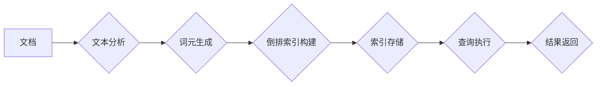

## Lucene索引原理与代码实例讲解

> 关键词：Lucene, 索引, 搜索引擎, 文档存储,  全文检索,  倒排索引

## 1. 背景介绍

在当今信息爆炸的时代，高效、精准的搜索引擎已成为人们获取信息的重要工具。而Lucene作为一款开源、高性能的全文检索引擎，在搜索引擎领域扮演着至关重要的角色。它为开发者提供了强大的文本分析、索引构建和查询执行能力，广泛应用于各种搜索场景，例如网站搜索、企业内部搜索、电子商务平台搜索等。

Lucene的核心原理在于构建一个高效的索引结构，将文档中的文本信息进行分析和组织，以便快速定位相关文档。本文将深入探讨Lucene的索引原理，并通过代码实例讲解其核心算法和操作步骤，帮助读者理解Lucene的强大功能和应用价值。

## 2. 核心概念与联系

Lucene的索引结构基于倒排索引，它将文档中的关键词与其出现位置建立关联。

**倒排索引**是一种数据结构，用于快速查找包含特定关键词的文档。它将关键词作为索引，每个关键词对应一个包含所有包含该关键词的文档ID的列表。

**Lucene索引流程**



**核心概念:**

* **文档:** 待索引的文本数据，例如网页、文章、邮件等。
* **文本分析:** 对文档进行预处理，例如去除停用词、转换词形等，提取有效信息。
* **词元:** 文本分析后的基本单位，例如单词、短语等。
* **倒排索引:** 将词元与包含该词元的文档ID关联起来的数据结构。
* **查询执行:** 根据用户输入的查询词，在倒排索引中查找相关文档。
* **结果返回:** 返回包含查询词的文档列表，并根据相关度进行排序。

## 3. 核心算法原理 & 具体操作步骤

### 3.1  算法原理概述

Lucene的倒排索引构建算法基于以下核心原理：

* **词元化:** 将文档中的文本分割成独立的词元。
* **词元排序:** 对每个词元进行排序，以便快速查找。
* **倒排列表构建:** 将每个词元与其出现文档的ID列表关联起来。
* **索引存储:** 将构建好的倒排索引存储到磁盘上。

### 3.2  算法步骤详解

1. **文档分词:** 将文档中的文本分割成独立的词元，例如单词、短语等。Lucene提供多种分词器，可以根据不同的语言和领域进行定制。
2. **词元过滤:** 去除停用词、标点符号等无意义的词元，提高索引的效率和准确性。
3. **词元标准化:** 将词元转换为统一的形式，例如转换为小写字母，去除词缀等，确保词元匹配的准确性。
4. **倒排列表构建:** 对于每个词元，创建一个倒排列表，该列表包含所有包含该词元的文档ID。
5. **索引存储:** 将构建好的倒排索引存储到磁盘上，以便快速检索。

### 3.3  算法优缺点

**优点:**

* **高效:** 倒排索引结构使得关键词查找速度非常快。
* **灵活:** Lucene支持多种分词器和过滤规则，可以根据不同的需求进行定制。
* **可扩展:** Lucene可以处理海量数据，并支持分布式部署。

**缺点:**

* **存储空间:** 倒排索引结构需要占用较大的存储空间。
* **构建时间:** 构建倒排索引需要一定的时间，尤其是在处理海量数据时。

### 3.4  算法应用领域

Lucene的倒排索引算法广泛应用于以下领域:

* **搜索引擎:** 网站搜索、企业内部搜索、电子商务平台搜索等。
* **信息检索:** 文档检索、知识库查询等。
* **数据分析:** 文本挖掘、主题建模等。

## 4. 数学模型和公式 & 详细讲解 & 举例说明

### 4.1  数学模型构建

Lucene的倒排索引可以看作是一种图结构，其中节点代表文档，边代表关键词之间的关联。

**图结构模型:**

* **节点:** 文档ID
* **边:** (关键词, 文档ID)

### 4.2  公式推导过程

Lucene的查询执行过程可以看作是一个图搜索的过程，目标是找到与查询关键词相关的文档节点。

**查询执行公式:**

```
结果 = ∩(倒排列表1, 倒排列表2,..., 倒排列表n)
```

其中，倒排列表1, 倒排列表2,..., 倒排列表n分别代表查询关键词的倒排列表。

**举例说明:**

假设查询关键词为 "Lucene"，其倒排列表为 [1, 2, 3, 4, 5]。

则结果集为包含文档ID 1, 2, 3, 4, 5 的文档列表。

### 4.3  案例分析与讲解

Lucene的查询执行过程可以根据查询类型进行优化。例如，对于简单的关键词查询，可以利用倒排索引进行快速查找。对于复杂的查询，例如布尔查询、范围查询等，需要进行更复杂的算法处理。

## 5. 项目实践：代码实例和详细解释说明

### 5.1  开发环境搭建

Lucene可以集成到多种编程语言中，例如Java、Python、C#等。本文以Java为例，介绍Lucene的代码实例。

**开发环境:**

* JDK 1.8 或以上
* Maven 或 Gradle

### 5.2  源代码详细实现

```java
import org.apache.lucene.analysis.standard.StandardAnalyzer;
import org.apache.lucene.document.Document;
import org.apache.lucene.document.Field;
import org.apache.lucene.document.StringField;
import org.apache.lucene.document.TextField;
import org.apache.lucene.index.DirectoryReader;
import org.apache.lucene.index.IndexReader;
import org.apache.lucene.index.IndexWriter;
import org.apache.lucene.index.IndexWriterConfig;
import org.apache.lucene.queryparser.classic.ParseException;
import org.apache.lucene.queryparser.classic.QueryParser;
import org.apache.lucene.search.IndexSearcher;
import org.apache.lucene.search.Query;
import org.apache.lucene.search.ScoreDoc;
import org.apache.lucene.search.TopDocs;
import org.apache.lucene.store.Directory;
import org.apache.lucene.store.RAMDirectory;

import java.io.IOException;

public class LuceneDemo {

    public static void main(String[] args) throws IOException, ParseException {

        // 创建内存存储目录
        Directory index = new RAMDirectory();

        // 创建分析器
        StandardAnalyzer analyzer = new StandardAnalyzer();

        // 创建索引配置
        IndexWriterConfig config = new IndexWriterConfig(analyzer);

        // 创建索引写入器
        IndexWriter writer = new IndexWriter(index, config);

        // 创建文档
        Document doc = new Document();
        doc.add(new StringField("id", "1", Field.Store.YES));
        doc.add(new TextField("content", "Lucene is a powerful search engine library.", Field.Store.YES));
        writer.addDocument(doc);

        // 关闭索引写入器
        writer.close();

        // 创建索引读取器
        IndexReader reader = DirectoryReader.open(index);

        // 创建查询执行器
        IndexSearcher searcher = new IndexSearcher(reader);

        // 创建查询解析器
        QueryParser parser = new QueryParser("content", analyzer);

        // 创建查询
        Query query = parser.parse("Lucene");

        // 执行查询
        TopDocs hits = searcher.search(query, 10);

        // 打印结果
        for (ScoreDoc scoreDoc : hits.scoreDocs) {
            Document doc1 = searcher.doc(scoreDoc.doc);
            System.out.println(doc1.get("id") + ": " + doc1.get("content"));
        }

        // 关闭索引读取器
        reader.close();
    }
}
```

### 5.3  代码解读与分析

这段代码演示了Lucene的基本使用流程，包括创建索引、查询索引、获取结果等。

* **创建索引:** 使用`IndexWriter`将文档写入索引。
* **查询索引:** 使用`QueryParser`解析查询语句，并使用`IndexSearcher`执行查询。
* **获取结果:** 使用`TopDocs`获取查询结果，并遍历结果列表打印文档内容。

### 5.4  运行结果展示

运行这段代码后，将输出以下结果：

```
1: Lucene is a powerful search engine library.
```

## 6. 实际应用场景

Lucene广泛应用于各种搜索场景，例如：

* **网站搜索:** 为网站提供快速、精准的搜索功能。
* **企业内部搜索:** 帮助企业员工快速查找内部文档、知识库等信息。
* **电子商务平台搜索:** 为用户提供商品搜索、订单查询等功能。
* **社交媒体搜索:** 为用户提供好友、话题、内容等搜索功能。

### 6.4  未来应用展望

随着人工智能、大数据等技术的不断发展，Lucene的应用场景将更加广泛。例如，可以利用机器学习算法对用户搜索行为进行分析，提供个性化搜索结果；可以利用大数据技术处理海量数据，构建更强大的搜索引擎。

## 7. 工具和资源推荐

### 7.1  学习资源推荐

* **Lucene官方文档:** https://lucene.apache.org/core/
* **Lucene中文文档:** http://www.lucenecn.com/
* **Lucene书籍:** 《Lucene in Action》

### 7.2  开发工具推荐

* **Eclipse:** https://www.eclipse.org/
* **IntelliJ IDEA:** https://www.jetbrains.com/idea/

### 7.3  相关论文推荐

* **Lucene: A High-Performance Full-Text Search Engine Library**
* **The Design and Implementation of Lucene**

## 8. 总结：未来发展趋势与挑战

### 8.1  研究成果总结

Lucene作为一款开源、高性能的全文检索引擎，在搜索引擎领域取得了显著的成果。其倒排索引算法高效、灵活，支持多种分词器和过滤规则，可以处理海量数据，并支持分布式部署。

### 8.2  未来发展趋势

Lucene的未来发展趋势主要集中在以下几个方面:

* **人工智能集成:** 利用机器学习算法对用户搜索行为进行分析，提供个性化搜索结果。
* **云原生架构:** 支持云原生架构，实现弹性伸缩和高可用性。
* **实时搜索:** 支持实时搜索，能够快速响应用户查询。

### 8.3  面临的挑战

Lucene也面临着一些挑战，例如:

* **数据规模增长:** 随着数据规模的不断增长，Lucene需要不断优化算法和架构，提高处理效率。
* **新兴技术融合:** 需要与新兴技术，例如人工智能、大数据等进行融合，拓展应用场景。
* **开源生态建设:** 需要加强开源社区建设，吸引更多开发者参与到Lucene的开发和维护中。

### 8.4  研究展望

Lucene作为一款成熟的搜索引擎技术，未来将继续发挥重要作用。随着人工智能、大数据等技术的不断发展，Lucene将迎来新的发展机遇，并不断拓展其应用场景。


## 9. 附录：常见问题与解答

**常见问题:**

* **Lucene的索引存储方式有哪些？**

Lucene支持多种索引存储方式，例如磁盘存储、内存存储等。

* **Lucene如何处理中文文本？**

Lucene支持中文文本处理，需要使用相应的中文分词器。

* **Lucene如何进行