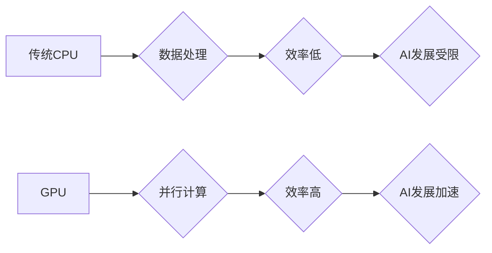

## NVIDIA在AI算力领域的创新

> 关键词：GPU、CUDA、Tensor Core、Deep Learning、AI算力、NVIDIA DGX、Transformer

## 1. 背景介绍

人工智能（AI）的蓬勃发展，对算力需求呈指数级增长。传统CPU架构在处理海量数据和复杂计算时存在瓶颈，无法满足AI训练和推理的快速发展需求。NVIDIA凭借其在GPU领域的领先地位，率先发力，构建了强大的AI算力平台，推动了AI技术的飞速发展。

## 2. 核心概念与联系

**2.1 GPU架构优势**

GPU（Graphics Processing Unit）最初设计用于处理图形渲染，其并行计算能力远超传统CPU。GPU拥有大量并行处理单元（CUDA cores），能够同时处理数千个数据，非常适合处理AI算法中的大量数据并行计算。

**2.2 CUDA平台**

NVIDIA CUDA（Compute Unified Device Architecture）是GPU并行计算平台，提供了一套完整的软件开发工具和编程模型，使开发者能够将应用程序移植到GPU上进行加速。CUDA通过编程接口（API）允许开发者访问GPU的计算资源，并利用GPU的并行计算能力加速算法执行。

**2.3 Tensor Core加速**

Tensor Core是NVIDIA最新一代GPU架构中引入的专用加速器，专门针对深度学习算法进行优化。Tensor Core通过高效的矩阵乘法运算和混合精度计算，大幅提升了深度学习模型的训练速度和推理效率。

**2.4 AI算力平台**

NVIDIA构建了完整的AI算力平台，包括硬件、软件和服务。

* **硬件:** NVIDIA推出了多个针对AI训练和推理的GPU产品线，例如Tesla、A100、H100等，提供不同性能和规模的算力选择。
* **软件:** NVIDIA提供了CUDA、cuDNN、TensorRT等软件工具，帮助开发者开发和部署AI应用程序。
* **服务:** NVIDIA还提供云计算服务、AI平台和专业服务，帮助企业加速AI应用落地。

**2.5 Mermaid流程图**



## 3. 核心算法原理 & 具体操作步骤

**3.1 算法原理概述**

深度学习算法的核心是多层神经网络，通过层层叠加的激活函数和权重参数，学习数据中的复杂模式和关系。

**3.2 算法步骤详解**

1. **数据预处理:** 将原始数据转换为深度学习模型可以理解的格式，例如归一化、编码等。
2. **模型构建:** 根据任务需求，选择合适的深度学习模型架构，例如卷积神经网络（CNN）、循环神经网络（RNN）、Transformer等。
3. **模型训练:** 使用训练数据，通过反向传播算法，调整模型参数，使模型输出与真实标签尽可能接近。
4. **模型评估:** 使用测试数据，评估模型的性能，例如准确率、召回率、F1-score等。
5. **模型部署:** 将训练好的模型部署到实际应用场景中，例如图像识别、自然语言处理等。

**3.3 算法优缺点**

* **优点:** 深度学习算法能够学习复杂数据模式，具有强大的泛化能力，在图像识别、自然语言处理等领域取得了突破性进展。
* **缺点:** 深度学习算法需要大量数据进行训练，训练时间长，计算资源消耗大，模型解释性差。

**3.4 算法应用领域**

深度学习算法广泛应用于各个领域，例如：

* **计算机视觉:** 图像识别、物体检测、图像分割、人脸识别等。
* **自然语言处理:** 文本分类、情感分析、机器翻译、对话系统等。
* **语音识别:** 语音转文本、语音合成等。
* **推荐系统:** 商品推荐、内容推荐等。
* **医疗诊断:** 病理图像分析、疾病预测等。

## 4. 数学模型和公式 & 详细讲解 & 举例说明

**4.1 数学模型构建**

深度学习模型通常由多个神经网络层组成，每一层包含多个神经元。每个神经元接收来自上一层的输入信号，经过激活函数处理后，输出到下一层。

**4.2 公式推导过程**

深度学习模型的训练过程基于反向传播算法，其核心是通过计算损失函数的梯度，更新模型参数。

* **损失函数:** 用于衡量模型预测结果与真实标签之间的差异。常见的损失函数包括均方误差（MSE）、交叉熵损失等。
* **梯度下降:** 用于更新模型参数，使其朝着降低损失函数的方向移动。

**4.3 案例分析与讲解**

假设我们有一个简单的线性回归模型，其目标是预测房屋价格。模型输入房屋面积，输出房屋价格。

* **模型公式:**  y = w * x + b

其中：

* y 是预测的房屋价格
* x 是房屋面积
* w 是权重参数
* b 是偏置参数

* **损失函数:** MSE = (y - y_true)^2

其中：

* y_true 是真实房屋价格

通过梯度下降算法，我们可以更新模型参数 w 和 b，使其最小化损失函数。

## 5. 项目实践：代码实例和详细解释说明

**5.1 开发环境搭建**

* 安装CUDA和cuDNN
* 安装Python和深度学习框架（例如TensorFlow、PyTorch）

**5.2 源代码详细实现**

```python
import tensorflow as tf

# 定义模型
model = tf.keras.Sequential([
    tf.keras.layers.Dense(units=1, input_shape=[1])
])

# 编译模型
model.compile(optimizer='sgd', loss='mse')

# 训练模型
model.fit(x_train, y_train, epochs=100)

# 评估模型
loss = model.evaluate(x_test, y_test)
```

**5.3 代码解读与分析**

* 使用TensorFlow框架定义一个简单的线性回归模型。
* 使用随机梯度下降（SGD）算法进行模型训练，损失函数为均方误差（MSE）。
* 训练模型100个epochs，并使用测试数据评估模型性能。

**5.4 运行结果展示**

训练完成后，可以查看模型的损失函数值，以及在测试数据上的预测准确率。

## 6. 实际应用场景

**6.1 图像识别**

NVIDIA GPU加速的深度学习算法广泛应用于图像识别领域，例如自动驾驶、医疗诊断、安防监控等。

**6.2 自然语言处理**

NVIDIA GPU加速的深度学习算法也应用于自然语言处理领域，例如机器翻译、文本摘要、对话系统等。

**6.3 科学计算**

NVIDIA GPU的并行计算能力也应用于科学计算领域，例如天气预报、药物发现、材料科学等。

**6.4 未来应用展望**

随着AI技术的不断发展，NVIDIA GPU在AI算力领域的应用将更加广泛，例如：

* **边缘计算:** 将AI模型部署到边缘设备，实现实时数据处理和决策。
* **工业自动化:** 利用AI技术提高工业生产效率和安全性。
* **个性化医疗:** 基于患者基因信息和病历数据，提供个性化医疗方案。

## 7. 工具和资源推荐

**7.1 学习资源推荐**

* NVIDIA官网：https://developer.nvidia.com/
* CUDA官方文档：https://docs.nvidia.com/cuda/
* 深度学习框架官方文档：TensorFlow：https://www.tensorflow.org/、PyTorch：https://pytorch.org/

**7.2 开发工具推荐**

* NVIDIA CUDA Toolkit
* NVIDIA cuDNN
* TensorFlow
* PyTorch

**7.3 相关论文推荐**

* AlexNet: ImageNet Classification with Deep Convolutional Neural Networks
* ImageNet Classification with Deep Convolutional Neural Networks
* Attention Is All You Need

## 8. 总结：未来发展趋势与挑战

**8.1 研究成果总结**

NVIDIA在AI算力领域的创新成果显著，其GPU架构、CUDA平台、Tensor Core加速器等技术，推动了深度学习算法的快速发展，并广泛应用于各个领域。

**8.2 未来发展趋势**

* **更高效的算力架构:** 继续探索新的GPU架构，提高算力密度和能源效率。
* **更强大的AI算法:** 开发更先进的深度学习算法，例如Transformer、Generative Adversarial Networks（GAN）等，提升AI模型的性能和泛化能力。
* **边缘计算和云计算的融合:** 将AI模型部署到边缘设备和云平台，实现灵活的算力部署和数据处理。

**8.3 面临的挑战**

* **算力需求的爆炸式增长:** AI算法的不断发展，对算力的需求呈指数级增长，需要持续开发更高效的算力平台。
* **数据隐私和安全:** AI模型的训练和应用需要大量数据，如何保障数据隐私和安全是一个重要的挑战。
* **AI伦理问题:** AI技术的快速发展，也带来了伦理问题，例如算法偏见、责任归属等，需要社会共同探讨和解决。

**8.4 研究展望**

未来，NVIDIA将继续致力于AI算力领域的创新，推动AI技术的进步，并将其应用于更多领域，为人类社会带来更多福祉。

## 9. 附录：常见问题与解答

**9.1 如何选择合适的GPU？**

选择合适的GPU需要根据具体的应用场景和算力需求进行评估。NVIDIA提供多种GPU产品线，例如Tesla、A100、H100等，性能和价格各不相同。

**9.2 如何使用CUDA开发AI应用程序？**

NVIDIA提供CUDA官方文档和教程，详细介绍了CUDA编程模型和开发流程。

**9.3 如何部署AI模型到实际应用场景？**

部署AI模型需要根据应用场景选择合适的部署方式，例如云端部署、边缘部署等。NVIDIA提供相应的平台和工具，帮助开发者进行模型部署。


作者：禅与计算机程序设计艺术 / Zen and the Art of Computer Programming 
