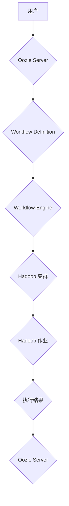

## Oozie原理与代码实例讲解

> 关键词：Oozie, Workflow, Hadoop, Apache, Workflow Management System, Big Data

## 1. 背景介绍

在海量数据时代，数据处理和分析任务日益复杂，传统的单机处理模式已难以满足需求。分布式计算框架，如 Hadoop，应运而生，为大规模数据处理提供了强大的处理能力。然而，Hadoop 的核心组件 MapReduce 侧重于单个任务的执行，缺乏对复杂数据处理流程的管理和调度能力。

为了解决这一问题，Apache Oozie 应运而生。Oozie 是一个开源的 Workflow Management System (WfMS)，专门为 Hadoop 生态系统设计，用于管理和调度 Hadoop 作业的复杂流程。它提供了一种可视化编排工具，使用户能够定义、提交和监控 Hadoop 作业的执行流程，从而简化大数据处理任务的管理和执行。

## 2. 核心概念与联系

Oozie 的核心概念包括 Workflow，Action，Coordinator 和 Bundle。

* **Workflow:**  一个 Workflow 代表一个由多个 Action 组成的执行流程。它定义了各个 Action 的执行顺序、依赖关系和错误处理机制。
* **Action:**  一个 Action 代表一个独立的 Hadoop 作业，例如 MapReduce 任务、Pig 任务、Hive 任务等。
* **Coordinator:**  Coordinator 用于调度重复性任务，例如每天执行一次数据备份任务。它可以根据预定义的调度策略，自动触发 Workflow 的执行。
* **Bundle:**  Bundle 是一个包含多个 Workflow 的集合，用于管理多个相关 Workflow 的执行。

**Oozie 架构流程图:**



## 3. 核心算法原理 & 具体操作步骤

### 3.1  算法原理概述

Oozie 的核心算法是基于状态机模型的 Workflow 执行引擎。它将 Workflow 定义转换为状态机图，并根据状态机的状态转换规则，控制各个 Action 的执行顺序和依赖关系。

### 3.2  算法步骤详解

1. **Workflow 定义:** 用户使用 Oozie 的编排工具定义 Workflow，包括 Action 的类型、参数、依赖关系和错误处理机制。
2. **Workflow 提交:** 用户将定义好的 Workflow 提交到 Oozie Server。
3. **Workflow 解析:** Oozie Server 解析 Workflow 定义，将其转换为状态机图。
4. **Workflow 调度:** Oozie Server 根据 Workflow 的调度策略，将 Workflow 提交到 Workflow Engine。
5. **Action 执行:** Workflow Engine 根据状态机图的规则，调度各个 Action 的执行。
6. **状态更新:** Action 执行完成后，Workflow Engine 会更新状态机图的状态，并根据状态转换规则，调度下一个 Action 的执行。
7. **执行结果:** 所有 Action 执行完成后，Workflow Engine 会汇总执行结果，并将其返回给 Oozie Server。

### 3.3  算法优缺点

**优点:**

* **可视化编排:** Oozie 提供了可视化编排工具，方便用户定义和管理 Hadoop 作业流程。
* **状态管理:** Oozie 基于状态机模型，可以有效地管理 Workflow 的执行状态，并提供错误处理机制。
* **调度策略:** Oozie 支持多种调度策略，可以根据实际需求灵活地调度 Workflow 的执行。
* **监控和日志:** Oozie 提供了完善的监控和日志功能，方便用户跟踪 Workflow 的执行进度和错误信息。

**缺点:**

* **复杂性:** Oozie 的配置和管理相对复杂，需要一定的学习成本。
* **性能:** Oozie 的执行性能可能不如直接使用 Hadoop 集群执行单个任务。
* **灵活性:** Oozie 的 Workflow 定义相对固定，缺乏对动态任务调整的灵活性。

### 3.4  算法应用领域

Oozie 广泛应用于各种大数据处理场景，例如：

* **数据 ETL:**  数据提取、转换和加载。
* **数据分析:**  数据清洗、聚合和分析。
* **机器学习:**  训练和部署机器学习模型。
* **实时数据处理:**  处理流式数据，例如日志分析和监控。

## 4. 数学模型和公式 & 详细讲解 & 举例说明

Oozie 的核心算法可以抽象为一个状态机模型，其中每个状态代表 Workflow 的执行阶段，每个状态转换代表一个 Action 的执行完成。

**4.1  数学模型构建**

我们可以用一个四元组 (S, I, T, R) 来表示状态机模型，其中：

* S: 状态集合，代表 Workflow 的所有执行阶段。
* I: 输入集合，代表每个状态可以接受的输入事件，例如 Action 的执行完成。
* T: 状态转换函数，将输入事件和当前状态映射到下一个状态。
* R: 输出集合，代表每个状态可以产生的输出结果，例如 Action 的执行结果。

**4.2  公式推导过程**

状态转换函数 T 可以用以下公式表示：

```latex
T(i, s) = s'
```

其中：

* i: 输入事件，例如 Action 的执行完成。
* s: 当前状态。
* s': 下一个状态。

**4.3  案例分析与讲解**

假设一个简单的 Workflow 包含两个 Action，A 和 B，其中 A 依赖于 B 的执行完成。我们可以用状态机模型来表示这个 Workflow：

* 状态集合 S = {初始状态, A 执行中, B 执行中, A 完成, B 完成, Workflow 完成}
* 输入集合 I = {B 完成, A 完成}
* 状态转换函数 T:

```
T(B 完成, 初始状态) = B 执行中
T(A 完成, A 执行中) = A 完成
T(B 完成, B 执行中) = B 完成
```

## 5. 项目实践：代码实例和详细解释说明

### 5.1  开发环境搭建

* **Hadoop 集群:**  安装和配置 Hadoop 集群。
* **Oozie Server:**  安装和配置 Oozie Server。
* **开发工具:**  使用 IDE (例如 Eclipse) 或文本编辑器编写 Oozie Workflow 定义文件。

### 5.2  源代码详细实现

```xml
<?xml version="1.0" encoding="UTF-8"?>
<workflow-app xmlns="uri:oozie:workflow:0.4">
  <description>A simple Oozie workflow</description>
  <name>my-workflow</name>
  <start to="action1"/>
  <action name="action1">
    <java>
      <main-class>com.example.MyAction</main-class>
      <arg>arg1</arg>
      <arg>arg2</arg>
    </java>
  </action>
  <kill>
    <message>Workflow failed</message>
  </kill>
  <end/>
</workflow-app>
```

**代码解读:**

* `<workflow-app>`:  定义 Workflow 的根节点。
* `<description>`:  Workflow 的描述信息。
* `<name>`:  Workflow 的名称。
* `<start>`:  Workflow 的开始节点。
* `<to>`:  指定下一个节点。
* `<action>`:  定义一个 Hadoop 作业。
* `<java>`:  指定 Java 作业的类名和参数。
* `<kill>`:  定义 Workflow 失败时的消息。
* `<end>`:  Workflow 的结束节点。

### 5.3  代码解读与分析

这个代码实例定义了一个简单的 Oozie Workflow，包含一个 Java 作业。Workflow 的执行流程如下：

1. 从 `<start>` 节点开始执行。
2. 执行 `<action1>` 节点，运行 Java 作业 `com.example.MyAction`，并传递参数 `arg1` 和 `arg2`。
3. Java 作业执行完成后，Workflow 结束。

### 5.4  运行结果展示

Oozie Server 会将 Workflow 提交到 Hadoop 集群执行，并返回执行结果。用户可以通过 Oozie Web UI 监控 Workflow 的执行进度和结果。

## 6. 实际应用场景

Oozie 在实际应用场景中具有广泛的应用价值，例如：

* **数据 ETL:**  Oozie 可以用于构建数据 ETL 流程，将数据从多个来源提取、转换和加载到目标数据仓库。
* **数据分析:**  Oozie 可以用于调度和管理数据分析任务，例如数据清洗、聚合和分析。
* **机器学习:**  Oozie 可以用于训练和部署机器学习模型，并调度模型的在线预测任务。
* **实时数据处理:**  Oozie 可以用于处理流式数据，例如日志分析和监控。

### 6.4  未来应用展望

随着大数据技术的不断发展，Oozie 的应用场景将更加广泛。未来，Oozie 可能将支持更复杂的 Workflow 定义，并集成更多新的数据处理技术，例如 Spark 和 Flink。

## 7. 工具和资源推荐

### 7.1  学习资源推荐

* **Oozie 官方文档:** https://oozie.apache.org/docs/
* **Oozie 用户指南:** https://oozie.apache.org/docs/4.3.0/user-guide/index.html
* **Oozie 教程:** https://www.tutorialspoint.com/oozie/index.htm

### 7.2  开发工具推荐

* **Eclipse:** https://www.eclipse.org/
* **IntelliJ IDEA:** https://www.jetbrains.com/idea/

### 7.3  相关论文推荐

* **Oozie: A Workflow Management System for Hadoop:** https://www.usenix.org/system/files/conference/osdi10/osdi10-paper-jain.pdf

## 8. 总结：未来发展趋势与挑战

### 8.1  研究成果总结

Oozie 作为 Apache 生态系统中重要的组件，为 Hadoop 生态系统提供了强大的 Workflow 管理和调度能力，推动了大数据处理的自动化和效率提升。

### 8.2  未来发展趋势

* **支持更复杂的 Workflow 定义:**  支持更复杂的逻辑控制、数据流处理和任务依赖关系。
* **集成新兴数据处理技术:**  支持 Spark、Flink 等新兴数据处理技术的集成，提高 Workflow 的执行效率和灵活性。
* **增强可视化编排功能:**  提供更直观、易用的可视化编排工具，降低用户学习成本。
* **提升安全性:**  加强 Workflow 的安全控制，防止数据泄露和恶意攻击。

### 8.3  面临的挑战

* **性能优化:**  Oozie 的执行性能仍然存在提升空间，需要进一步优化算法和架构。
* **灵活性不足:**  Oozie 的 Workflow 定义相对固定，缺乏对动态任务调整的灵活性。
* **复杂性管理:**  Oozie 的配置和管理相对复杂，需要不断简化和优化。

### 8.4  研究展望

未来，Oozie 将继续朝着更强大、更灵活、更易用的方向发展，为大数据处理提供更完善的解决方案。


## 9. 附录：常见问题与解答

### 9.1  Oozie Workflow 的调度策略有哪些？

Oozie 支持多种调度策略，例如：

* **cron:**  根据 cron 表达式调度 Workflow 执行。
* **time:**  根据指定的时间点调度 Workflow 执行。
* **date:**  根据指定日期调度 Workflow 执行。
* **trigger:**  根据其他事件触发 Workflow 执行。

### 9.2  如何监控 Oozie Workflow 的执行进度？

Oozie 提供了 Web UI，用户可以通过 Web UI 监控 Workflow 的执行进度和结果。

### 9.3  如何处理 Oozie Workflow 中的错误？

Oozie 支持多种错误处理机制，例如：

* **retry:**  在指定次数内重试失败的 Action。
* **kill:**  终止 Workflow 的执行。
* **email:**  发送邮件通知错误信息。


作者：禅与计算机程序设计艺术 / Zen and the Art of Computer Programming 
