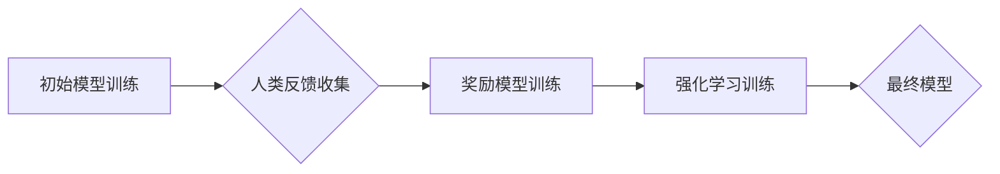

## RLHF的局限性:AI还需要自主学习能力

> 关键词：强化学习，人类反馈，RLHF，AI，自主学习，模型训练，数据依赖

## 1. 背景介绍

近年来，人工智能（AI）领域取得了令人瞩目的进展，尤其是基于深度学习的模型在自然语言处理、计算机视觉等领域展现出强大的能力。其中，强化学习（RL）作为一种学习方法，通过与环境交互，不断调整策略以最大化奖励，在解决复杂决策问题方面展现出巨大潜力。

强化学习人类反馈 (RLHF) 是一种结合人类反馈的强化学习方法，旨在通过人类对模型输出的评价，引导模型学习更符合人类期望的行为。RLHF 在许多应用场景中取得了成功，例如聊天机器人、文本生成等。然而，RLHF 也存在一些局限性，例如数据依赖性强、训练成本高、偏见放大等问题。

## 2. 核心概念与联系

RLHF 的核心概念是将人类反馈作为奖励信号，引导模型学习。其工作原理可以概括为以下步骤：

1. **初始模型训练:** 使用监督学习或无监督学习方法训练一个初始模型。
2. **人类反馈收集:** 让人类对模型的输出进行评价，例如打分、标注、排序等。
3. **奖励模型训练:** 使用收集到的人类反馈训练一个奖励模型，该模型能够预测人类对模型输出的评价。
4. **强化学习训练:** 使用奖励模型生成的奖励信号，训练强化学习模型，使其学习出能够获得高奖励的策略。

**Mermaid 流程图:**



## 3. 核心算法原理 & 具体操作步骤

### 3.1  算法原理概述

RLHF 的核心算法是基于强化学习的策略梯度方法。策略梯度方法通过计算策略参数的梯度，更新策略参数，使其朝着能够获得更高奖励的方向进行调整。

### 3.2  算法步骤详解

1. **初始化策略:** 选择一个初始策略，例如随机策略或基于预训练模型的策略。
2. **环境交互:** 使用策略与环境交互，收集状态、动作和奖励信息。
3. **计算策略梯度:** 使用策略梯度公式计算策略参数的梯度。
4. **更新策略参数:** 根据策略梯度更新策略参数，使其朝着能够获得更高奖励的方向进行调整。
5. **重复步骤2-4:** 重复以上步骤，直到策略收敛或达到预设的训练目标。

### 3.3  算法优缺点

**优点:**

* 可以学习到更符合人类期望的行为。
* 可以处理复杂决策问题。
* 可以通过不断与环境交互，不断改进策略。

**缺点:**

* 数据依赖性强，需要大量的标注数据。
* 训练成本高，需要大量的计算资源。
* 容易受到偏见的影响，需要进行数据清洗和模型调优。

### 3.4  算法应用领域

RLHF 在许多应用领域中取得了成功，例如：

* 聊天机器人
* 文本生成
* 代码生成
* 游戏AI
* 自动驾驶

## 4. 数学模型和公式 & 详细讲解 & 举例说明

### 4.1  数学模型构建

RLHF 的数学模型可以概括为一个马尔可夫决策过程 (MDP)，其中：

* 状态空间 S：模型可能处于的各种状态。
* 动作空间 A：模型可以采取的各种动作。
* 转移概率 P(s' | s, a)：从状态 s 执行动作 a 后转移到状态 s' 的概率。
* 奖励函数 R(s, a)：模型在状态 s 执行动作 a 后获得的奖励。
* 策略 π(a | s)：模型在状态 s 下选择动作 a 的概率分布。

### 4.2  公式推导过程

RLHF 的目标是学习一个能够最大化累积奖励的策略 π。可以使用策略梯度方法来实现这个目标。策略梯度公式如下：

```latex
\nabla_{\theta} J(\theta) = \mathbb{E}_{\tau \sim \pi_{\theta}} \left[ \nabla_{\theta} \log \pi_{\theta}(a_t | s_t) \cdot Q^{\pi_{\theta}}(s_t, a_t) \right]
```

其中：

* J(θ) 是策略 π 的价值函数。
* θ 是策略参数。
* τ 是一个轨迹，由一系列状态和动作组成。
* Q^π(s_t, a_t) 是状态 s_t 下执行动作 a_t 的价值函数。

### 4.3  案例分析与讲解

假设我们训练一个聊天机器人，其目标是与用户进行自然流畅的对话。可以使用 RLHF 方法来训练这个聊天机器人。

1. **初始模型训练:** 使用预训练语言模型作为初始模型。
2. **人类反馈收集:** 让人类对模型的对话回复进行评价，例如打分、标注、排序等。
3. **奖励模型训练:** 使用收集到的人类反馈训练一个奖励模型，该模型能够预测人类对模型对话回复的评价。
4. **强化学习训练:** 使用奖励模型生成的奖励信号，训练强化学习模型，使其学习出能够获得高奖励的对话策略。

通过这种方式，聊天机器人可以学习到更符合人类期望的对话风格和内容。

## 5. 项目实践：代码实例和详细解释说明

### 5.1  开发环境搭建

为了实现 RLHF 的项目实践，需要搭建一个合适的开发环境。

* **操作系统:** Linux 或 macOS
* **编程语言:** Python
* **深度学习框架:** TensorFlow 或 PyTorch
* **其他工具:** Git、Jupyter Notebook

### 5.2  源代码详细实现

以下是一个使用 TensorFlow 实现 RLHF 的简单代码示例：

```python
import tensorflow as tf

# 定义奖励模型
reward_model = tf.keras.Sequential([
    tf.keras.layers.Dense(64, activation='relu'),
    tf.keras.layers.Dense(1)
])

# 定义策略网络
policy_network = tf.keras.Sequential([
    tf.keras.layers.Dense(64, activation='relu'),
    tf.keras.layers.Dense(num_actions)
])

# 定义策略梯度更新函数
def update_policy(states, actions, rewards):
    # 计算策略梯度
    gradients = tf.gradients(
        tf.reduce_mean(rewards * tf.log(policy_network(states)[..., actions])),
        policy_network.trainable_variables
    )
    # 更新策略参数
    optimizer.apply_gradients(zip(gradients, policy_network.trainable_variables))

# 训练循环
for episode in range(num_episodes):
    # 与环境交互
    states = []
    actions = []
    rewards = []
    done = False
    while not done:
        # 选择动作
        action = tf.argmax(policy_network(state), axis=-1)
        # 执行动作
        next_state, reward, done = environment.step(action)
        # 记录状态、动作和奖励
        states.append(state)
        actions.append(action)
        rewards.append(reward)
        state = next_state
    # 更新策略
    update_policy(states, actions, rewards)
```

### 5.3  代码解读与分析

这段代码展示了 RLHF 的基本流程，包括奖励模型训练、策略网络训练和策略更新。

* 首先，定义了奖励模型和策略网络。
* 然后，使用策略梯度更新函数更新策略参数。
* 最后，在训练循环中与环境交互，收集状态、动作和奖励信息，并使用这些信息更新策略参数。

### 5.4  运行结果展示

运行这段代码后，可以观察到策略网络的性能随着训练的进行而逐渐提升。例如，聊天机器人的对话回复会越来越自然流畅。

## 6. 实际应用场景

RLHF 在许多实际应用场景中取得了成功，例如：

### 6.1  聊天机器人

RLHF 可以训练出更自然、更符合人类期望的聊天机器人。例如，OpenAI 的 ChatGPT 就使用了 RLHF 方法进行训练。

### 6.2  文本生成

RLHF 可以用于训练生成高质量文本的模型，例如文章、故事、诗歌等。

### 6.3  代码生成

RLHF 可以用于训练生成代码的模型，例如 GitHub Copilot 就使用了 RLHF 方法进行训练。

### 6.4  未来应用展望

RLHF 的应用前景广阔，未来可能在更多领域得到应用，例如：

* 自动驾驶
* 游戏AI
* 个性化推荐
* 医疗诊断

## 7. 工具和资源推荐

### 7.1  学习资源推荐

* **书籍:**

    * Reinforcement Learning: An Introduction by Richard S. Sutton and Andrew G. Barto
    * Deep Reinforcement Learning Hands-On by Maxim Lapan

* **在线课程:**

    * Deep Reinforcement Learning Specialization by DeepLearning.AI
    * Reinforcement Learning by David Silver

### 7.2  开发工具推荐

* **深度学习框架:** TensorFlow, PyTorch
* **环境模拟器:** OpenAI Gym, Unity ML-Agents

### 7.3  相关论文推荐

* **Human Feedback for Reinforcement Learning** by OpenAI
* **Reward Modeling with Human Feedback** by Google AI

## 8. 总结：未来发展趋势与挑战

### 8.1  研究成果总结

RLHF 是一种有效的训练 AI 模型的方法，能够学习到更符合人类期望的行为。它在许多应用领域取得了成功，并展现出巨大的潜力。

### 8.2  未来发展趋势

RLHF 的未来发展趋势包括：

* **更有效的奖励模型设计:** 探索新的奖励模型设计方法，能够更准确地反映人类期望。
* **更鲁棒的训练算法:** 开发更鲁棒的训练算法，能够应对更复杂的环境和任务。
* **更安全的 AI 模型:** 研究如何使用 RLHF 训练更安全、更可靠的 AI 模型。

### 8.3  面临的挑战

RLHF 也面临一些挑战，例如：

* **数据依赖性强:** RLHF 需要大量的标注数据，这在某些情况下可能难以获取。
* **训练成本高:** RLHF 的训练成本较高，需要大量的计算资源。
* **偏见放大:** RLHF 容易受到训练数据中的偏见影响，需要进行数据清洗和模型调优。

### 8.4  研究展望

未来，RLHF 将继续是一个重要的研究方向，需要进一步探索其理论基础、算法设计和应用场景。


## 9. 附录：常见问题与解答

### 9.1  Q1: RLHF 和监督学习有什么区别？

**A1:** RLHF 和监督学习都是机器学习方法，但它们的目标不同。监督学习的目标是学习一个能够将输入映射到输出的函数，而 RLHF 的目标是学习一个能够最大化累积奖励的策略。

### 9.2  Q2: RLHF 的训练过程需要多长时间？

**A2:** RLHF 的训练时间取决于许多因素，例如模型大小、环境复杂度和数据量。一般来说，训练时间可能需要几天到几周。

### 9.3  Q3: RLHF 是否可以用于所有类型的任务？

**A3:** RLHF 适用于许多类型的任务，但并非所有类型的任务都适合使用 RLHF。例如，对于需要精确预测的分类任务，监督学习可能更有效。


作者：禅与计算机程序设计艺术 / Zen and the Art of Computer Programming 
