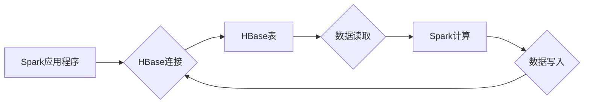

## Spark-HBase整合原理与代码实例讲解

> 关键词：Spark, HBase, 大数据处理, 数据分析, 集群计算, NoSQL, Java, Scala

## 1. 背景介绍

在当今数据爆炸的时代，海量数据的存储和处理成为各大企业面临的重大挑战。传统关系型数据库难以应对海量数据的存储和查询需求，而NoSQL数据库凭借其灵活的数据模型和高并发性能，逐渐成为大数据处理的首选。HBase作为一款基于分布式文件系统的NoSQL数据库，以其高吞吐量、高可用性和可扩展性，在处理海量数据方面展现出强大的优势。

Spark作为一款开源的分布式计算框架，以其高性能、易用性和丰富的生态系统，成为大数据处理的热门选择。Spark能够高效地处理各种类型的数据，包括结构化数据、半结构化数据和非结构化数据。

将Spark与HBase整合，可以充分发挥两者的优势，实现高效的实时数据处理和分析。Spark可以快速读取HBase中的数据，并进行复杂的计算和分析，而HBase可以提供海量数据的存储和管理。

## 2. 核心概念与联系

### 2.1 Spark与HBase

* **Spark:**  Apache Spark是一个开源的通用计算框架，支持批处理、流处理、机器学习等多种计算模式。Spark的核心是其分布式数据处理引擎，能够将任务分配到多个节点上并行执行，从而提高计算效率。

* **HBase:** Apache HBase是一个基于分布式文件系统的NoSQL数据库，提供类似关系型数据库的表结构和查询功能，但更适合处理海量数据。HBase采用键值存储模型，数据以键值对的形式存储，并通过行键进行组织，支持快速的数据访问和更新。

### 2.2 Spark-HBase整合

Spark-HBase整合是指将Spark和HBase集成在一起，实现数据从HBase到Spark的读取和写入，以及Spark对HBase数据的分析和处理。

**架构图:**



## 3. 核心算法原理 & 具体操作步骤

### 3.1 算法原理概述

Spark-HBase整合的核心算法原理是基于Spark的RDD（Resilient Distributed Datasets）和HBase的API接口。

* **RDD:** RDD是Spark的核心数据结构，是一个分布式数据集，可以进行各种数据操作，例如过滤、映射、聚合等。

* **HBase API:** HBase提供了一系列API接口，可以用于连接HBase集群、查询数据、插入数据等。

Spark-HBase整合利用HBase的API接口，将HBase中的数据读取到Spark的RDD中，然后对RDD进行计算和分析，最后将结果写入HBase。

### 3.2 算法步骤详解

1. **连接HBase集群:** 使用Spark提供的HBase连接器连接到HBase集群。
2. **读取HBase数据:** 使用HBase API接口，根据指定的表名和查询条件，从HBase中读取数据到Spark的RDD中。
3. **数据处理:** 对RDD中的数据进行各种数据操作，例如过滤、映射、聚合等，实现对数据的分析和处理。
4. **写入HBase:** 将处理后的数据写入HBase，更新或插入数据到指定的表中。

### 3.3 算法优缺点

**优点:**

* **高性能:** Spark的分布式计算引擎能够高效地处理海量数据。
* **易用性:** Spark提供了丰富的API接口，方便用户进行HBase数据处理。
* **可扩展性:** Spark和HBase都是可扩展的系统，可以根据需要增加节点数量，提高处理能力。

**缺点:**

* **复杂性:** Spark-HBase整合需要一定的开发经验和技术知识。
* **数据一致性:** 在数据写入HBase时，需要保证数据的一致性。

### 3.4 算法应用领域

Spark-HBase整合在以下领域具有广泛的应用场景:

* **实时数据分析:**  实时监控系统日志、用户行为数据等，进行实时数据分析和报警。
* **大规模数据处理:** 处理海量数据，例如电商平台的交易数据、社交媒体的数据等。
* **机器学习:** 使用Spark进行机器学习模型训练，并存储模型参数和训练数据到HBase。

## 4. 数学模型和公式 & 详细讲解 & 举例说明

### 4.1 数学模型构建

Spark-HBase整合的数学模型可以抽象为一个数据流处理模型，其中数据从HBase流入Spark，经过一系列计算和处理，最终流出到HBase。

**数据流模型:**

```
数据流 = 数据源 -> 数据处理 -> 数据存储
```

* **数据源:** HBase表
* **数据处理:** Spark计算任务
* **数据存储:** HBase表

### 4.2 公式推导过程

Spark-HBase整合的性能可以根据以下公式进行评估:

```
吞吐量 = 数据量 / 处理时间
```

其中:

* **数据量:** 从HBase读取的数据量
* **处理时间:** Spark计算任务完成的时间

### 4.3 案例分析与讲解

假设一个电商平台需要实时分析用户购买行为数据，数据存储在HBase中。

* **数据源:** HBase表，存储用户购买记录数据。
* **数据处理:** Spark任务读取HBase数据，计算每个用户的购买频率、平均购买金额等指标。
* **数据存储:** 计算结果存储回HBase，用于后续分析和决策。

通过Spark-HBase整合，电商平台可以实时分析用户购买行为数据，并根据分析结果进行个性化推荐、库存管理等操作。

## 5. 项目实践：代码实例和详细解释说明

### 5.1 开发环境搭建

* **Java Development Kit (JDK):**  安装JDK 8 或更高版本。
* **Apache Spark:** 下载并安装Spark 2.4 或更高版本。
* **Apache HBase:** 下载并安装HBase 2.0 或更高版本。
* **IDE:** 使用Eclipse、IntelliJ IDEA等IDE进行开发。

### 5.2 源代码详细实现

```java
import org.apache.hadoop.conf.Configuration;
import org.apache.hadoop.hbase.HBaseConfiguration;
import org.apache.hadoop.hbase.client.Connection;
import org.apache.hadoop.hbase.client.ConnectionFactory;
import org.apache.hadoop.hbase.client.Result;
import org.apache.hadoop.hbase.client.ResultScanner;
import org.apache.hadoop.hbase.client.Scan;
import org.apache.hadoop.hbase.client.Table;
import org.apache.spark.SparkConf;
import org.apache.spark.SparkContext;
import org.apache.spark.api.java.JavaRDD;
import org.apache.spark.api.java.JavaSparkContext;

import java.io.IOException;

public class SparkHBaseExample {

    public static void main(String[] args) throws IOException {
        // 配置Spark上下文
        SparkConf conf = new SparkConf().setAppName("SparkHBaseExample").setMaster("local");
        JavaSparkContext sc = new JavaSparkContext(conf);

        // 配置HBase连接
        Configuration hbaseConf = HBaseConfiguration.create();
        hbaseConf.set("hbase.zookeeper.quorum", "localhost");
        Connection connection = ConnectionFactory.createConnection(hbaseConf);
        Table table = connection.getTable(TableName.valueOf("mytable"));

        // 创建Scan对象，指定查询条件
        Scan scan = new Scan();
        scan.setStartRow(Bytes.toBytes("row1"));
        scan.setStopRow(Bytes.toBytes("row10"));

        // 使用HBase API读取数据
        ResultScanner scanner = table.getScanner(scan);
        for (Result result : scanner) {
            // 处理数据
            System.out.println(Bytes.toString(result.getRow()));
        }

        // 关闭连接
        scanner.close();
        table.close();
        connection.close();

        sc.stop();
    }
}
```

### 5.3 代码解读与分析

* **Spark配置:** 代码首先配置Spark上下文，设置应用程序名称和运行模式。
* **HBase配置:** 代码配置HBase连接信息，包括ZooKeeper地址等。
* **HBase连接:** 代码使用HBase API连接到HBase集群。
* **数据查询:** 代码使用Scan对象指定查询条件，并使用ResultScanner读取数据。
* **数据处理:** 代码遍历Result对象，获取数据并进行处理。
* **连接关闭:** 代码关闭HBase连接和Spark上下文。

### 5.4 运行结果展示

运行代码后，将打印出指定范围内的HBase数据。

## 6. 实际应用场景

### 6.1 实时用户行为分析

电商平台可以利用Spark-HBase整合，实时分析用户购买行为数据，例如用户购买频率、平均购买金额、热门商品等，并根据分析结果进行个性化推荐、库存管理等操作。

### 6.2 社交媒体数据分析

社交媒体平台可以利用Spark-HBase整合，分析用户发布的帖子、评论、点赞等数据，了解用户兴趣、舆情趋势等，并进行精准营销、内容推荐等操作。

### 6.3 金融交易数据分析

金融机构可以利用Spark-HBase整合，分析用户交易数据，例如交易金额、交易频率、交易类型等，进行风险控制、反欺诈等操作。

### 6.4 未来应用展望

随着大数据技术的不断发展，Spark-HBase整合将在更多领域得到应用，例如物联网数据分析、医疗数据分析、工业控制数据分析等。

## 7. 工具和资源推荐

### 7.1 学习资源推荐

* **Spark官方文档:** https://spark.apache.org/docs/latest/
* **HBase官方文档:** https://hbase.apache.org/book.html
* **Spark-HBase官方文档:** https://spark.apache.org/docs/latest/sql-hbase-integration.html

### 7.2 开发工具推荐

* **Eclipse:** https://www.eclipse.org/
* **IntelliJ IDEA:** https://www.jetbrains.com/idea/
* **Apache Maven:** https://maven.apache.org/

### 7.3 相关论文推荐

* **Spark-HBase Integration for Real-Time Data Processing:** https://arxiv.org/abs/1603.05472
* **Efficient Data Processing with Spark and HBase:** https://www.researchgate.net/publication/329114310_Efficient_Data_Processing_with_Spark_and_HBase

## 8. 总结：未来发展趋势与挑战

### 8.1 研究成果总结

Spark-HBase整合技术已经取得了显著的成果，能够高效地处理海量数据，并支持实时数据分析和处理。

### 8.2 未来发展趋势

* **更深入的集成:** Spark和HBase之间的集成将更加深入，例如支持更丰富的HBase数据类型和操作。
* **更强大的性能:** Spark-HBase整合的性能将进一步提升，例如支持更复杂的计算任务和更大的数据规模。
* **更易用的开发体验:** Spark-HBase整合的开发体验将更加友好，例如提供更丰富的API接口和工具支持。

### 8.3 面临的挑战

* **数据一致性:** 在数据写入HBase时，需要保证数据的一致性。
* **数据安全:** Spark-HBase整合需要考虑数据安全问题，例如数据加密和访问控制。
* **运维复杂性:** Spark-HBase整合的运维复杂性较高，需要专业的运维人员进行管理。

### 8.4 研究展望

未来，Spark-HBase整合技术将继续发展，并应用于更多领域。研究者将继续探索更有效的算法和架构，提高Spark-HBase整合的性能和效率。


## 9. 附录：常见问题与解答

