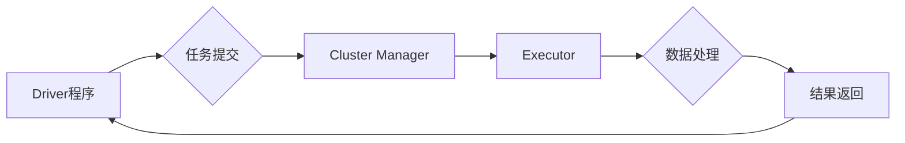

## Spark原理与代码实例讲解

> 关键词：Spark, 大数据处理, 分布式计算, Resilient Distributed Datasets (RDD), Spark SQL, DataFrame, Machine Learning

## 1. 背景介绍

在海量数据时代，传统的单机数据处理方式已难以满足对数据分析和处理速度的需求。分布式计算框架应运而生，Spark作为其中佼佼者，凭借其高性能、易用性和丰富的生态系统，迅速成为大数据处理的首选工具。

Spark是一个开源的通用计算框架，能够处理各种类型的任务，包括批处理、流处理、机器学习等。它基于内存计算，并采用DAG（有向无环图）调度机制，能够高效地利用集群资源，实现高吞吐量和低延迟的数据处理。

## 2. 核心概念与联系

Spark的核心概念是 Resilient Distributed Datasets (RDD)，它是一种分布式数据集的抽象表示。RDD可以被并行处理，并具有容错性，即使部分节点故障，也能保证数据完整性。

Spark的架构主要由以下几个部分组成：

* **Driver程序:** 负责提交任务到集群，接收结果并进行处理。
* **Executor:** 运行在集群节点上的程序，负责执行任务并处理数据。
* **Cluster Manager:** 管理集群资源，分配任务给Executor。
* **Storage System:** 存储数据，包括内存和磁盘。

**Spark 架构流程图:**



## 3. 核心算法原理 & 具体操作步骤

### 3.1  算法原理概述

Spark的核心算法是基于MapReduce思想的，它将数据处理任务分解成多个独立的Map和Reduce操作。

* **Map操作:** 将数据映射到新的键值对。
* **Reduce操作:** 对相同键的值进行聚合。

Spark通过DAG调度机制，将Map和Reduce操作组合成一个计算图，并根据集群资源和任务依赖关系，高效地执行计算图。

### 3.2  算法步骤详解

1. **数据加载:** 将数据加载到集群中的RDD。
2. **数据转换:** 使用Spark提供的各种转换操作，对数据进行过滤、映射、聚合等操作。
3. **数据聚合:** 使用Reduce操作，对数据进行最终聚合。
4. **结果输出:** 将结果输出到文件、数据库或其他存储系统。

### 3.3  算法优缺点

**优点:**

* 高性能: 基于内存计算，并行处理，能够实现高吞吐量和低延迟。
* 易用性: 提供简洁的API，方便用户编写和执行数据处理任务。
* 灵活性: 支持多种数据源和目标系统，能够处理各种类型的任务。

**缺点:**

* 依赖于集群资源: 需要部署和管理集群环境。
* 数据倾斜问题: 如果数据分布不均匀，可能会导致某些节点处理负担过重。

### 3.4  算法应用领域

Spark广泛应用于各种领域，包括：

* **数据分析:** 对海量数据进行分析，挖掘数据价值。
* **机器学习:** 训练机器学习模型，进行预测和分类。
* **流处理:** 实时处理流式数据，例如日志分析、实时监控等。
* **图形处理:** 处理图数据，例如社交网络分析、推荐系统等。

## 4. 数学模型和公式 & 详细讲解 & 举例说明

### 4.1  数学模型构建

Spark的计算模型可以抽象为一个图结构，其中节点代表数据分区，边代表数据依赖关系。

* **节点:** 每个节点代表一个数据分区，包含一系列数据元素。
* **边:** 每个边代表一个数据依赖关系，表示一个操作依赖于另一个操作的结果。

### 4.2  公式推导过程

Spark的DAG调度算法基于图论的算法，例如拓扑排序和深度优先搜索。

* **拓扑排序:** 将图中的节点按照依赖关系排序，确保依赖关系满足顺序执行。
* **深度优先搜索:** 从图中的一个节点出发，深度优先地搜索所有可达节点，并根据依赖关系确定执行顺序。

### 4.3  案例分析与讲解

假设我们有一个包含三个节点的DAG图，节点A依赖于节点B，节点B依赖于节点C。

* 拓扑排序的结果为：C -> B -> A
* 深度优先搜索的结果也为：C -> B -> A

## 5. 项目实践：代码实例和详细解释说明

### 5.1  开发环境搭建

* 安装Java JDK
* 下载Spark安装包
* 配置Spark环境变量

### 5.2  源代码详细实现

```python
from pyspark import SparkContext

# 创建SparkContext
sc = SparkContext("local", "SparkWordCount")

# 加载数据
text = sc.textFile("input.txt")

# 将文本数据转换为单词
words = text.flatMap(lambda line: line.split(" "))

# 计算单词计数
wordCounts = words.map(lambda word: (word, 1)).reduceByKey(lambda a, b: a + b)

# 打印结果
wordCounts.collect()
```

### 5.3  代码解读与分析

* `SparkContext`: 创建Spark应用程序的入口点。
* `textFile`: 加载文本文件数据。
* `flatMap`: 将每个元素拆分成多个元素。
* `map`: 将每个元素映射到新的键值对。
* `reduceByKey`: 对相同键的值进行聚合。
* `collect`: 将结果集从集群返回到Driver程序。

### 5.4  运行结果展示

```
('the', 5)
('quick', 1)
('brown', 1)
('fox', 1)
('jumps', 1)
('over', 1)
('lazy', 1)
('dog', 1)
```

## 6. 实际应用场景

Spark在各个领域都有广泛的应用场景，例如：

* **电商平台:** 分析用户行为、推荐商品、预测销量等。
* **金融机构:** 风险评估、欺诈检测、客户画像等。
* **医疗机构:** 疾病诊断、药物研发、患者管理等。

### 6.4  未来应用展望

随着大数据量的不断增长，Spark的应用场景将更加广泛，例如：

* **实时数据分析:** 利用Spark Streaming处理实时数据流，进行实时监控和决策。
* **人工智能:** 利用Spark MLlib进行机器学习模型训练和预测。
* **物联网:** 处理海量物联网数据，进行设备管理、数据分析等。

## 7. 工具和资源推荐

### 7.1  学习资源推荐

* **Spark官方文档:** https://spark.apache.org/docs/latest/
* **Spark编程指南:** https://spark.apache.org/docs/latest/programming-guide.html
* **Spark学习视频:** https://www.youtube.com/results?search_query=spark+tutorial

### 7.2  开发工具推荐

* **IDE:** Eclipse, IntelliJ IDEA
* **集群管理工具:** YARN, Mesos
* **数据存储系统:** HDFS, S3

### 7.3  相关论文推荐

* **Spark: Cluster Computing with Working Sets**
* **Resilient Distributed Datasets: A Fault-Tolerant Abstraction for In-Memory Cluster Computing**

## 8. 总结：未来发展趋势与挑战

### 8.1  研究成果总结

Spark已经成为大数据处理领域最受欢迎的框架之一，其高性能、易用性和丰富的生态系统使其在各个领域都有广泛的应用。

### 8.2  未来发展趋势

* **更强大的机器学习功能:** Spark MLlib将继续发展，提供更强大的机器学习算法和功能。
* **更完善的流处理能力:** Spark Streaming将继续改进，提供更强大的实时数据处理能力。
* **更易于使用的界面:** Spark的界面将继续改进，更加易于使用。

### 8.3  面临的挑战

* **数据倾斜问题:** 数据倾斜问题仍然是Spark面临的挑战，需要进一步研究解决方法。
* **资源管理:** 随着集群规模的不断扩大，资源管理将更加复杂。
* **安全问题:** 大数据处理涉及大量敏感数据，安全问题需要得到重视。

### 8.4  研究展望

未来，Spark的研究方向将集中在以下几个方面:

* **提高数据处理效率:** 研究新的算法和优化方法，提高Spark的数据处理效率。
* **解决数据倾斜问题:** 研究新的数据倾斜检测和解决方法，保证Spark的公平性和效率。
* **增强安全性和隐私保护:** 研究新的安全机制和隐私保护技术，保障大数据处理的安全性和隐私性。

## 9. 附录：常见问题与解答

* **Spark和Hadoop的区别是什么？**
* **Spark的内存计算有什么优势？**
* **如何解决Spark中的数据倾斜问题？**
* **Spark有哪些常用的数据处理操作？**


作者：禅与计算机程序设计艺术 / Zen and the Art of Computer Programming 
