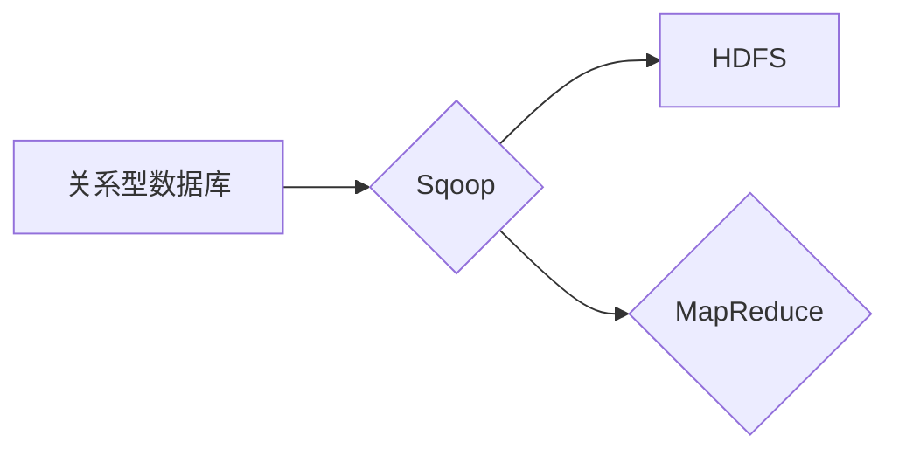

## Sqoop导入导出原理与代码实例讲解

> 关键词：Sqoop, Hadoop, 数据迁移, JDBC, MapReduce, ETL

## 1. 背景介绍

在如今数据爆炸的时代，海量数据存储和处理成为企业发展的重要挑战。Hadoop作为分布式存储和处理框架，为大数据提供了强大的处理能力。然而，Hadoop生态系统与传统关系型数据库之间的数据迁移仍然是一个难题。Sqoop作为Apache Hadoop生态系统中的一员，专门解决这一问题，它提供了一种高效、可靠的工具，用于将数据从关系型数据库导入和导出到Hadoop分布式文件系统（HDFS）。

Sqoop的出现，极大地简化了数据迁移过程，降低了开发门槛，使得Hadoop能够更好地与传统数据系统进行整合。本文将深入探讨Sqoop的原理、工作机制、核心算法以及代码实例，帮助读者全面理解Sqoop的使用方法和应用场景。

## 2. 核心概念与联系

Sqoop的核心功能是将数据从关系型数据库导入和导出到HDFS。它基于JDBC连接数据库，并利用MapReduce框架进行数据处理。

**Sqoop工作流程:**



**核心概念:**

* **关系型数据库:**  指使用关系模型进行数据组织和管理的数据库系统，例如MySQL、Oracle、PostgreSQL等。
* **Hadoop分布式文件系统 (HDFS):** Hadoop生态系统中的分布式文件系统，用于存储大数据。
* **JDBC (Java Database Connectivity):** Java语言用于连接和访问数据库的标准API。
* **MapReduce:** Hadoop的核心处理框架，用于对大数据进行并行处理。

**Sqoop与其他Hadoop组件的关系:**

Sqoop与其他Hadoop组件紧密集成，例如：

* **HDFS:** Sqoop将数据导入和导出到HDFS。
* **YARN:** Sqoop使用YARN资源管理系统调度MapReduce任务。
* **Hive:** Sqoop可以将数据导入Hive表，方便进行数据分析。

## 3. 核心算法原理 & 具体操作步骤

### 3.1  算法原理概述

Sqoop的核心算法基于MapReduce框架，将数据迁移任务分解成多个Map和Reduce任务。

**数据导入流程:**

1. **数据扫描:** Sqoop首先扫描数据库表，获取数据结构和元数据信息。
2. **数据分片:** Sqoop将数据按照一定的规则进行分片，每个分片对应一个Map任务。
3. **数据映射:** Map任务负责从数据库中读取数据，并将其转换为适合HDFS存储的格式。
4. **数据聚合:** Reduce任务负责将来自不同Map任务的数据进行聚合，并将其写入HDFS。

**数据导出流程:**

1. **数据读取:** Sqoop从HDFS读取数据。
2. **数据转换:** Sqoop将HDFS中的数据转换为适合关系型数据库存储的格式。
3. **数据插入:** Sqoop将数据插入到关系型数据库中。

### 3.2  算法步骤详解

**数据导入步骤:**

1. **配置Sqoop:** 使用Sqoop命令行工具配置数据导入任务，包括数据库连接信息、目标表信息、数据分片策略等。
2. **执行Sqoop:** 执行Sqoop命令，启动数据导入任务。
3. **监控任务:** 使用Sqoop命令行工具或Web界面监控任务执行进度和状态。

**数据导出步骤:**

1. **配置Sqoop:** 使用Sqoop命令行工具配置数据导出任务，包括HDFS数据路径、目标表信息、数据转换规则等。
2. **执行Sqoop:** 执行Sqoop命令，启动数据导出任务。
3. **监控任务:** 使用Sqoop命令行工具或Web界面监控任务执行进度和状态。

### 3.3  算法优缺点

**优点:**

* **高效:** 利用MapReduce框架进行并行处理，提高数据迁移速度。
* **可靠:** 支持数据校验和恢复机制，确保数据迁移的可靠性。
* **易用:** 提供命令行工具和Web界面，方便用户配置和管理数据迁移任务。
* **灵活:** 支持多种数据源和目标系统，以及多种数据分片策略。

**缺点:**

* **依赖Hadoop:** Sqoop依赖Hadoop生态系统，需要部署和维护Hadoop集群。
* **数据格式转换:** 需要进行数据格式转换，可能会增加数据处理时间和资源消耗。
* **性能瓶颈:** 数据迁移速度受限于网络带宽和数据库连接速度。

### 3.4  算法应用领域

Sqoop广泛应用于以下领域:

* **数据仓库建设:** 将数据从运营系统导入数据仓库，用于数据分析和报表生成。
* **数据集成:** 将数据从多个数据源整合到统一平台，实现数据共享和协同分析。
* **数据迁移:** 将数据从旧系统迁移到新系统，例如从关系型数据库迁移到NoSQL数据库。
* **数据备份和恢复:** 将数据从生产环境备份到HDFS，方便数据恢复和灾难恢复。

## 4. 数学模型和公式 & 详细讲解 & 举例说明

Sqoop的数据迁移算法涉及到数据分片、数据映射和数据聚合等环节，这些环节都与数学模型和公式密切相关。

### 4.1  数学模型构建

**数据分片模型:**

Sqoop使用哈希函数将数据分片到不同的Map任务。哈希函数将数据转换为一个整数，该整数作为分片标识。

**数据映射模型:**

Sqoop将数据从数据库表映射到HDFS文件，可以使用以下公式计算数据块大小:

```latex
数据块大小 = 数据总量 / 数量
```

其中，数据总量是指需要迁移的数据量，数量是指分片数量。

### 4.2  公式推导过程

**数据迁移时间模型:**

Sqoop的数据迁移时间取决于数据量、网络带宽、数据库连接速度和MapReduce任务执行时间等因素。

```latex
数据迁移时间 = 数据量 / 网络带宽 + 数据库连接时间 + MapReduce任务执行时间
```

其中，数据量是指需要迁移的数据量，网络带宽是指网络传输速度，数据库连接时间是指连接数据库所花费的时间，MapReduce任务执行时间是指MapReduce任务执行所花费的时间。

### 4.3  案例分析与讲解

假设需要将一个包含100GB数据的数据库表导入到HDFS，网络带宽为100Mbps，数据库连接时间为1分钟，MapReduce任务执行时间为1小时。

根据公式，数据迁移时间可以计算如下:

```latex
数据迁移时间 = 100GB / 100Mbps + 1分钟 + 1小时
```

其中，100GB / 100Mbps = 1000分钟。

因此，数据迁移时间为1000分钟 + 1分钟 + 60分钟 = 1061分钟，约为17.68小时。

## 5. 项目实践：代码实例和详细解释说明

### 5.1  开发环境搭建

* **Hadoop集群:** 需要部署一个Hadoop集群，用于存储和处理数据。
* **Sqoop工具:** 需要安装Sqoop工具，用于配置和执行数据迁移任务。
* **数据库驱动:** 需要安装数据库驱动，用于连接数据库。

### 5.2  源代码详细实现

以下是一个简单的Sqoop数据导入代码实例，用于将MySQL数据库表导入到HDFS:

```bash
sqoop import \
  --connect jdbc:mysql://localhost:3306/mydatabase \
  --username root \
  --password mypassword \
  --table mytable \
  --target-dir /user/myuser/mytable \
  --num-mappers 4
```

**代码解释:**

* `sqoop import`: 指示执行数据导入任务。
* `--connect`: 指定数据库连接信息。
* `--username`: 指定数据库用户名。
* `--password`: 指定数据库密码。
* `--table`: 指定目标数据库表名。
* `--target-dir`: 指定HDFS目标路径。
* `--num-mappers`: 指定Map任务数量。

### 5.3  代码解读与分析

该代码实例将MySQL数据库表`mytable`导入到HDFS路径`/user/myuser/mytable`。

* `--connect`参数指定了数据库连接信息，包括数据库类型、主机地址、端口号和数据库名称。
* `--username`和`--password`参数指定了数据库用户名和密码。
* `--table`参数指定了目标数据库表名。
* `--target-dir`参数指定了HDFS目标路径。
* `--num-mappers`参数指定了Map任务数量，可以根据数据量和集群资源进行调整。

### 5.4  运行结果展示

执行该代码后，Sqoop会将`mytable`表的数据导入到HDFS路径`/user/myuser/mytable`。

## 6. 实际应用场景

Sqoop在实际应用场景中具有广泛的应用价值，例如:

* **数据仓库建设:** 将电商平台的订单数据、用户数据、商品数据等从关系型数据库导入到数据仓库，方便进行数据分析和报表生成。
* **数据集成:** 将社交媒体平台的数据、网站日志数据、传感器数据等从不同数据源整合到统一平台，实现数据共享和协同分析。
* **数据迁移:** 将企业内部的 legacy 系统数据迁移到新的云平台，实现数据现代化和业务转型。

### 6.4  未来应用展望

随着大数据技术的不断发展，Sqoop的应用场景将会更加广泛。未来，Sqoop可能会支持更多的数据源和目标系统，并提供更强大的数据处理功能，例如数据清洗、数据转换和数据加密等。

## 7. 工具和资源推荐

### 7.1  学习资源推荐

* **Sqoop官方文档:** https://sqoop.apache.org/docs/
* **Hadoop官方文档:** https://hadoop.apache.org/docs/
* **数据迁移最佳实践:** https://www.cloudera.com/documentation/enterprise/latest/topics/cm_data_migration_best_practices.html

### 7.2  开发工具推荐

* **Sqoop命令行工具:** 用于配置和执行数据迁移任务。
* **Sqoop Web界面:** 用于监控数据迁移任务进度和状态。
* **IDE:** 例如Eclipse、IntelliJ IDEA等，用于开发Sqoop脚本。

### 7.3  相关论文推荐

* **Sqoop: A Tool for Efficiently Transferring Data Between Hadoop and Relational Databases:** https://www.usenix.org/system/files/conference/osdi10/osdi10-paper-deppeler.pdf

## 8. 总结：未来发展趋势与挑战

### 8.1  研究成果总结

Sqoop作为一种高效、可靠的数据迁移工具，为Hadoop生态系统提供了强大的数据处理能力，促进了数据仓库建设、数据集成和数据迁移等应用场景的发展。

### 8.2  未来发展趋势

未来，Sqoop可能会朝着以下方向发展:

* **支持更多数据源和目标系统:** 例如支持NoSQL数据库、云存储平台等。
* **提供更强大的数据处理功能:** 例如数据清洗、数据转换、数据加密等。
* **提高数据迁移效率:** 例如利用数据压缩、数据分片等技术。
* **增强数据安全性和可靠性:** 例如支持数据加密、数据校验等功能。

### 8.3  面临的挑战

Sqoop也面临一些挑战，例如:

* **数据格式转换:** 不同数据源和目标系统的格式差异较大，需要进行复杂的格式转换。
* **数据质量问题:** 数据迁移过程中可能会出现数据丢失、数据错误等问题，需要进行数据质量校验和修复。
* **数据安全问题:** 数据迁移过程中需要保护数据安全，防止数据泄露和数据篡改。

### 8.4  研究展望

未来，研究人员可以继续探索Sqoop的优化方法，例如:

* 研究更高效的数据格式转换算法。
* 开发更强大的数据质量校验和修复工具。
* 设计更安全的Sqoop数据迁移方案。


## 9. 附录：常见问题与