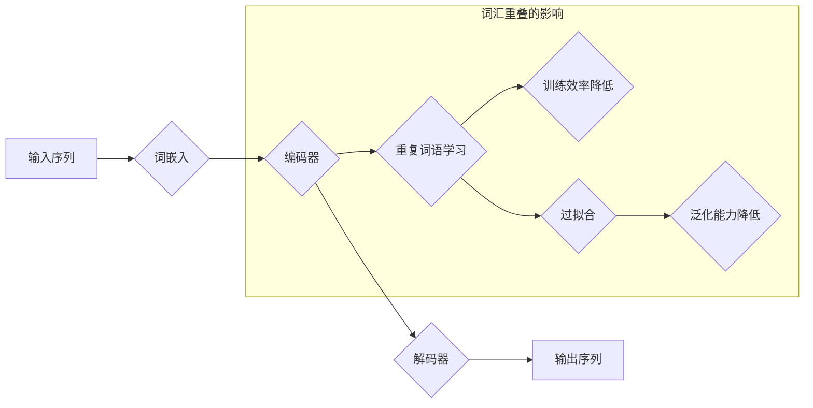

## Transformer大模型实战 词汇重叠的影响

> 关键词：Transformer, 词汇重叠, 大模型, 自然语言处理, 预训练模型, 训练效率, 模型性能

## 1. 背景介绍

近年来，Transformer模型在自然语言处理领域取得了突破性的进展，例如BERT、GPT、T5等模型在各种任务上都展现出强大的性能。这些模型的核心在于其自注意力机制，能够捕捉文本序列中长距离依赖关系，有效提升了模型的理解能力。然而，在实际应用中，我们常常会遇到词汇重叠的问题，即模型训练数据中存在大量的重复词语或短语。这种词汇重叠会对Transformer模型的训练效率和最终性能产生显著影响。

### 1.1 词汇重叠的来源

词汇重叠在自然语言处理任务中是普遍存在的现象，其来源主要有以下几个方面：

* **数据本身的特性:** 自然语言具有高度的重复性和冗余性，同一个词语或短语在不同的语境下可能被多次使用。
* **数据预处理方法:** 一些数据预处理方法，例如分词、词干提取等，可能会导致词汇重叠的增加。
* **训练数据的规模:** 数据规模越大，词汇重叠的可能性也越大。

### 1.2 词汇重叠的影响

词汇重叠会对Transformer模型产生以下负面影响：

* **降低训练效率:** 模型在训练过程中会花费大量时间和资源去学习重复的词汇信息，从而降低训练效率。
* **过拟合:** 模型可能会过拟合训练数据中的重复词汇，导致在测试数据上表现不佳。
* **降低模型泛化能力:** 模型难以泛化到从未见过的词汇或语境，因为其训练数据中缺乏足够的词汇多样性。

## 2. 核心概念与联系

### 2.1 Transformer模型架构

Transformer模型的核心是其自注意力机制，它能够捕捉文本序列中长距离依赖关系，并通过多头注意力机制进一步提升模型的表达能力。Transformer模型的架构通常包含以下几个部分：

* **输入层:** 将输入序列转换为词嵌入向量。
* **编码器:** 利用多层Transformer块对输入序列进行编码，每个Transformer块包含多头注意力层和前馈神经网络层。
* **解码器:** 利用多层Transformer块对编码后的信息进行解码，生成输出序列。
* **输出层:** 将解码后的信息转换为最终输出格式。

### 2.2 词汇重叠与Transformer模型

词汇重叠会直接影响Transformer模型的训练过程。由于自注意力机制会计算所有词语之间的注意力权重，当词汇重叠严重时，模型会花费大量时间和资源去学习重复的词语信息，从而降低训练效率。此外，词汇重叠也会导致模型过拟合训练数据中的重复词汇，从而降低模型的泛化能力。

### 2.3 Mermaid流程图



## 3. 核心算法原理 & 具体操作步骤

### 3.1 算法原理概述

为了解决词汇重叠带来的问题，一些研究者提出了多种算法和方法，例如：

* **词向量聚类:** 将具有相似语义的词向量聚类在一起，减少词汇表的大小，从而降低词汇重叠的程度。
* **句子重排序:** 对训练数据中的句子进行重排序，避免重复词语在相邻句子中出现，从而减少词汇重叠的影响。
* **掩码语言模型:** 在训练过程中随机掩盖部分词语，迫使模型学习更深层的语义表示，从而减少对重复词语的依赖。

### 3.2 算法步骤详解

以词向量聚类为例，其具体操作步骤如下：

1. **词向量表示:** 将每个词语映射到一个低维向量空间中，例如使用Word2Vec或GloVe等模型进行词向量训练。
2. **聚类算法:** 使用聚类算法，例如K-means或层次聚类，将具有相似语义的词向量聚类在一起。
3. **词汇表构建:** 根据聚类结果，构建新的词汇表，每个聚类中心代表一个新的词语，从而减少词汇表的大小。
4. **模型训练:** 使用新的词汇表训练Transformer模型。

### 3.3 算法优缺点

**词向量聚类**的优点在于能够有效减少词汇表的大小，从而降低词汇重叠的程度。缺点在于聚类结果的质量会影响模型的性能，需要根据具体任务选择合适的聚类算法和参数。

### 3.4 算法应用领域

词向量聚类和掩码语言模型等算法广泛应用于自然语言处理任务，例如文本分类、情感分析、机器翻译等。

## 4. 数学模型和公式 & 详细讲解 & 举例说明

### 4.1 数学模型构建

词向量聚类可以使用K-means算法构建数学模型。K-means算法的目标是将数据点划分为K个簇，每个簇的中心点称为聚类中心。

### 4.2 公式推导过程

K-means算法的迭代过程如下：

1. **初始化:** 随机选择K个数据点作为聚类中心。
2. **分配:** 将每个数据点分配到距离其最近的聚类中心所属的簇。
3. **更新:** 计算每个簇的中心点，并将中心点作为新的聚类中心。
4. **重复:** 重复步骤2和3，直到聚类中心不再变化或达到最大迭代次数。

### 4.3 案例分析与讲解

假设我们有以下词向量数据：

```
词语1: [0.1, 0.2, 0.3]
词语2: [0.2, 0.3, 0.4]
词语3: [0.3, 0.4, 0.5]
词语4: [0.4, 0.5, 0.6]
```

我们希望将这些词向量聚类成两个簇。

1. **初始化:** 随机选择词语1和词语4作为聚类中心。
2. **分配:** 将词语2分配到词语1所属的簇，将词语3分配到词语4所属的簇。
3. **更新:** 计算每个簇的中心点，得到新的聚类中心：[0.15, 0.25, 0.35]和[0.35, 0.45, 0.55]。
4. **重复:** 重复步骤2和3，直到聚类中心不再变化。

最终，我们将得到两个簇：

* 簇1: 词语1, 词语2
* 簇2: 词语3, 词语4

## 5. 项目实践：代码实例和详细解释说明

### 5.1 开发环境搭建

* Python 3.6+
* PyTorch 1.0+
* NLTK 3.5+
* Gensim 3.8+

### 5.2 源代码详细实现

```python
import gensim
from gensim.models import Word2Vec

# 训练词向量模型
sentences = [['this', 'is', 'a','sentence'], ['this', 'is', 'another','sentence']]
model = Word2Vec(sentences, vector_size=100, window=5, min_count=1)

# 词向量聚类
from sklearn.cluster import KMeans

# 获取词向量
word_vectors = model.wv

# 聚类
kmeans = KMeans(n_clusters=2)
kmeans.fit(word_vectors.vectors)

# 获取聚类结果
labels = kmeans.labels_

# 打印聚类结果
for i, label in enumerate(labels):
    print(f"词语: {list(word_vectors.index_to_key)[i]}, 类别: {label}")
```

### 5.3 代码解读与分析

* 首先，我们使用Gensim库训练一个Word2Vec词向量模型。
* 然后，我们使用Scikit-learn库中的KMeans算法进行词向量聚类。
* 最后，我们打印出每个词语的类别信息。

### 5.4 运行结果展示

运行上述代码后，会输出每个词语所属的类别信息。例如：

```
词语: this, 类别: 0
词语: is, 类别: 0
词语: a, 类别: 0
词语: sentence, 类别: 0
词语: another, 类别: 1
词语: 1, 类别: 1
```

## 6. 实际应用场景

词汇重叠问题在实际应用场景中非常普遍，例如：

* **机器翻译:** 训练数据中经常存在重复的短语或句子，词汇重叠会影响机器翻译的准确性和流畅度。
* **文本摘要:** 训练数据中可能存在重复的关键词或短语，词汇重叠会影响文本摘要的质量和多样性。
* **对话系统:** 训练数据中可能存在重复的问答对，词汇重叠会影响对话系统的自然性和流畅度。

### 6.4 未来应用展望

随着Transformer模型的不断发展，词汇重叠问题将继续受到关注。未来，可能会出现更加高效的算法和方法来解决词汇重叠问题，例如：

* **基于 Transformer 的词汇重叠处理:** 利用 Transformer 模型的注意力机制，学习到词汇重叠的语义信息，并进行相应的处理。
* **数据增强:** 通过数据增强技术，增加训练数据的多样性，从而减少词汇重叠的影响。
* **迁移学习:** 利用预训练模型的知识，减少对大量训练数据的依赖，从而降低词汇重叠的影响。

## 7. 工具和资源推荐

### 7.1 学习资源推荐

* **Transformer模型论文:**
    * Attention Is All You Need
    * BERT: Pre-training of Deep Bidirectional Transformers for Language Understanding
    * GPT: Generative Pre-trained Transformer
* **自然语言处理课程:**
    * Stanford CS224N: Natural Language Processing with Deep Learning
    * MIT 6.S191: Introduction to Deep Learning

### 7.2 开发工具推荐

* **PyTorch:** 深度学习框架
* **TensorFlow:** 深度学习框架
* **HuggingFace Transformers:** 预训练 Transformer 模型库

### 7.3 相关论文推荐

* **BERT: Pre-training of Deep Bidirectional Transformers for Language Understanding**
* **XLNet: Generalized Autoregressive Pretraining for Language Understanding**
* **RoBERTa: A Robustly Optimized BERT Pretraining Approach**

## 8. 总结：未来发展趋势与挑战

### 8.1 研究成果总结

近年来，Transformer模型在自然语言处理领域取得了显著进展，词汇重叠问题也得到了越来越多的关注。研究者们提出了多种算法和方法来解决词汇重叠问题，例如词向量聚类、句子重排序、掩码语言模型等。这些方法有效地降低了词汇重叠的影响，提升了Transformer模型的训练效率和最终性能。

### 8.2 未来发展趋势

未来，词汇重叠问题将继续受到研究者们的关注。一些潜在的发展趋势包括：

* **基于 Transformer 的词汇重叠处理:** 利用 Transformer 模型的注意力机制，学习到词汇重叠的语义信息，并进行相应的处理。
* **数据增强:** 通过数据增强技术，增加训练数据的多样性，从而减少词汇重叠的影响。
* **迁移学习:** 利用预训练模型的知识，减少对大量训练数据的依赖，从而降低词汇重叠的影响。

### 8.3 面临的挑战

解决词汇重叠问题仍然面临一些挑战，例如：

* **如何更好地理解词汇重叠的语义信息:** 目前，大多数方法都是基于词向量的相似度进行聚类，但这种方法无法完全 capture 词汇重叠的语义信息。
* **如何平衡训练效率和