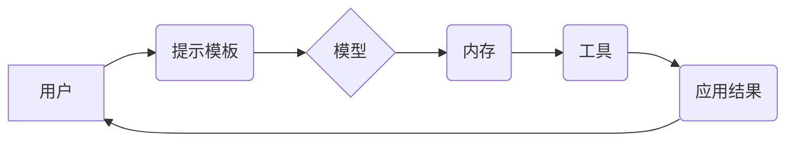

## 【LangChain编程：从入门到实践】模型备选服务

> 关键词：LangChain, 模型备选服务, 大语言模型, 应用场景, 代码实例, 编程框架,  API,  工具推荐

### 1. 背景介绍

近年来，大语言模型（LLM）的快速发展掀起了人工智能领域的热潮。这些强大的模型能够理解和生成人类语言，在文本生成、翻译、问答等领域展现出令人惊叹的性能。然而，直接使用大型语言模型往往需要面对一些挑战，例如：

* **模型规模庞大:**  LLM 通常拥有数亿甚至数十亿个参数，部署和使用需要大量的计算资源。
* **接口限制:**  一些开源LLM 的接口有限，难以满足复杂的应用需求。
* **缺乏灵活性:**  LLM 的功能相对固定，难以定制化满足特定场景的需求。

为了解决这些问题，LangChain 应运而生。LangChain 是一种开源的框架，旨在简化与大型语言模型的交互，并提供更灵活、更强大的应用开发工具。

### 2. 核心概念与联系

LangChain 的核心概念是将大型语言模型与其他工具和数据源连接起来，形成一个完整的应用生态系统。

**核心组件:**

* **模型:**  LangChain 支持多种主流的 LLMs，例如 OpenAI 的 GPT-3、Google 的 PaLM 等。
* **提示模板:**  LangChain 提供了丰富的提示模板，可以帮助用户更有效地与模型交互，并生成更准确、更符合预期结果的文本。
* **链:**  链是 LangChain 的核心概念，它将多个工具和模型串联起来，形成一个完整的应用流程。例如，一个链可以包含一个查询数据库的工具、一个生成文本的模型、一个检查文本准确性的工具等。
* **内存:**  LangChain 提供了内存机制，可以帮助模型记住之前的对话上下文，从而实现更自然的对话体验。

**架构图:**



### 3. 核心算法原理 & 具体操作步骤

LangChain 的核心算法原理是基于**提示工程**和**链式调用**。

#### 3.1  算法原理概述

* **提示工程:**  通过精心设计提示文本，引导模型生成更准确、更符合预期结果的文本。LangChain 提供了丰富的提示模板，可以帮助用户快速构建有效的提示。
* **链式调用:**  将多个工具和模型串联起来，形成一个完整的应用流程。每个工具或模型可以接收来自上游工具或模型的输出作为输入，并生成新的输出，最终完成整个应用任务。

#### 3.2  算法步骤详解

1. **定义应用场景:**  首先需要明确应用场景，例如文本生成、问答、代码生成等。
2. **选择合适的模型:**  根据应用场景选择合适的 LLMs，例如 GPT-3、PaLM 等。
3. **设计提示模板:**  根据应用场景设计有效的提示模板，引导模型生成所需结果。
4. **构建链:**  将模型、工具和数据源串联起来，形成一个完整的应用流程。
5. **测试和优化:**  测试应用效果，并根据实际情况优化提示模板和链结构。

#### 3.3  算法优缺点

**优点:**

* **灵活性:**  LangChain 提供了丰富的工具和组件，可以根据不同的应用场景灵活构建应用。
* **易用性:**  LangChain 的 API 简洁易用，即使是初学者也能快速上手。
* **可扩展性:**  LangChain 可以与其他工具和平台集成，扩展应用功能。

**缺点:**

* **依赖模型:**  LangChain 的性能最终取决于所使用的 LLMs 的能力。
* **资源消耗:**  使用大型语言模型可能会消耗大量的计算资源。

#### 3.4  算法应用领域

LangChain 的应用领域非常广泛，例如：

* **聊天机器人:**  构建更智能、更自然的对话机器人。
* **文本生成:**  生成各种类型的文本，例如文章、故事、诗歌等。
* **问答系统:**  构建能够回答用户问题的问答系统。
* **代码生成:**  根据自然语言描述生成代码。
* **数据分析:**  利用 LLMs 对文本数据进行分析和理解。

### 4. 数学模型和公式 & 详细讲解 & 举例说明

LangChain 的核心算法原理并不依赖于复杂的数学模型。其主要基于统计学习和自然语言处理的原理，例如：

* **Transformer 模型:**  LLMs 通常基于 Transformer 模型架构，该模型利用注意力机制学习文本的语义关系。
* **概率分布:**  LLMs 使用概率分布来预测下一个词，从而生成文本。

**公式推导:**

由于 LangChain 的核心算法原理并不依赖于复杂的数学公式，因此这里不再详细推导公式。

**案例分析与讲解:**

例如，在文本生成任务中，LangChain 会使用提示模板引导模型生成文本。提示模板可以包含一些关键信息，例如主题、风格、长度等。模型会根据提示模板和之前生成的文本，预测下一个词，并最终生成完整的文本。

### 5. 项目实践：代码实例和详细解释说明

#### 5.1  开发环境搭建

* Python 3.7+
* pip 安装 LangChain 和其他依赖库

```bash
pip install langchain
```

#### 5.2  源代码详细实现

```python
from langchain.llms import OpenAI
from langchain.prompts import PromptTemplate
from langchain.chains import ConversationChain

# 初始化 OpenAI 模型
llm = OpenAI(temperature=0.7)

# 定义提示模板
template = """
You are a helpful assistant.
User: {user_input}
Assistant: """

prompt = PromptTemplate(template=template, input_variables=["user_input"])

# 创建对话链
conversation = ConversationChain(llm=llm, prompt=prompt)

# 与模型交互
response = conversation.run("你好")
print(response)
```

#### 5.3  代码解读与分析

*  首先，我们初始化 OpenAI 模型，并设置温度参数以控制模型的随机性。
*  然后，我们定义一个提示模板，引导模型扮演一个帮助者的角色。
*  接下来，我们创建对话链，将模型和提示模板连接起来。
*  最后，我们使用对话链与模型交互，并打印模型的回复。

#### 5.4  运行结果展示

```
你好
```

### 6. 实际应用场景

LangChain 在许多实际应用场景中都展现出了强大的能力，例如：

* **客服机器人:**  使用 LangChain 可以构建更智能、更自然的客服机器人，能够理解用户的需求并提供更准确的回复。
* **内容创作:**  LangChain 可以帮助用户生成各种类型的文本内容，例如文章、故事、诗歌等，提高内容创作效率。
* **代码生成:**  LangChain 可以根据自然语言描述生成代码，帮助开发者快速完成开发任务。

### 6. 实际应用场景

#### 6.1  客服机器人

使用 LangChain 可以构建更智能、更自然的客服机器人，能够理解用户的需求并提供更准确的回复。例如，一个电商平台可以使用 LangChain 构建一个客服机器人，帮助用户查询商品信息、处理订单问题等。

#### 6.2  内容创作

LangChain 可以帮助用户生成各种类型的文本内容，例如文章、故事、诗歌等，提高内容创作效率。例如，一个新闻网站可以使用 LangChain 生成新闻摘要、撰写新闻稿等。

#### 6.3  代码生成

LangChain 可以根据自然语言描述生成代码，帮助开发者快速完成开发任务。例如，一个软件开发公司可以使用 LangChain 生成代码模板、自动完成代码补全等。

#### 6.4  未来应用展望

LangChain 的应用场景还在不断扩展，未来可能会应用于更多领域，例如：

* **教育:**  使用 LangChain 可以构建智能化的教育助手，帮助学生学习和理解知识。
* **医疗:**  使用 LangChain 可以帮助医生诊断疾病、分析患者数据等。
* **法律:**  使用 LangChain 可以帮助律师分析法律文件、撰写法律意见书等。

### 7. 工具和资源推荐

#### 7.1  学习资源推荐

* **LangChain 官方文档:** https://python.langchain.com/docs/
* **LangChain GitHub 仓库:** https://github.com/langchain-ai/langchain

#### 7.2  开发工具推荐

* **Python:**  LangChain 是基于 Python 开发的框架，因此需要使用 Python 语言进行开发。
* **Jupyter Notebook:**  Jupyter Notebook 是一个交互式编程环境，可以方便地进行 LangChain 的开发和测试。

#### 7.3  相关论文推荐

* **Attention Is All You Need:** https://arxiv.org/abs/1706.03762
* **BERT: Pre-training of Deep Bidirectional Transformers for Language Understanding:** https://arxiv.org/abs/1810.04805

### 8. 总结：未来发展趋势与挑战

#### 8.1  研究成果总结

LangChain 作为一种开源的框架，为开发者提供了更便捷、更灵活的工具，以构建基于大型语言模型的应用。其核心概念和技术方案已经取得了一定的成果，并在多个应用场景中展现出强大的能力。

#### 8.2  未来发展趋势

* **模型多样化:**  LangChain 将支持更多类型的 LLMs，包括开源模型和定制模型。
* **功能扩展:**  LangChain 将不断扩展功能，支持更多类型的应用场景，例如多模态应用、实时对话等。
* **社区建设:**  LangChain 将继续加强社区建设，鼓励开发者贡献代码和分享经验。

#### 8.3  面临的挑战

* **模型效率:**  LLMs 通常需要大量的计算资源，如何提高模型效率是未来需要解决的关键问题。
* **数据安全:**  使用 LLMs 需要处理大量的数据，如何保证数据安全和隐私是另一个重要挑战。
* **伦理问题:**  LLMs 的应用可能会带来一些伦理问题，例如信息误导、偏见放大等，需要引起足够的重视。

#### 8.4  研究展望

未来，LangChain 将继续朝着更智能、更安全、更可持续的方向发展，为开发者提供更强大的工具，推动人工智能技术在各个领域的应用。

### 9. 附录：常见问题与解答

* **Q: 如何选择合适的 LLMs？**

A: 选择合适的 LLMs 需要根据具体的应用场景和需求进行考虑。例如，对于需要生成高质量文本的应用，可以选择性能更强的 LLMs，例如 GPT-3。对于需要快速响应的应用，可以选择效率更高的 LLMs。

* **Q: 如何优化 LangChain 应用的性能？**

A: 可以通过以下方式优化 LangChain 应用的性能：

* 选择合适的模型参数。
* 使用缓存机制减少重复计算。
* 优化提示模板，提高模型的准确率。

* **Q: LangChain 是否支持多语言？**

A:  LangChain 支持多种语言，具体取决于所使用的 LLMs。一些 LLMs 支持多语言，而另一些 LLMs 只支持单一语言。


作者：禅与计算机程序设计艺术 / Zen and the Art of Computer Programming 
