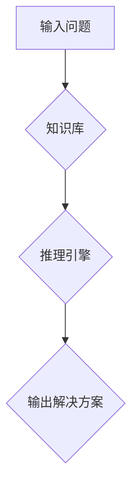

## 人工智能领域的早期探索

> 关键词：人工智能、图灵测试、逻辑推理、符号主义、专家系统、机器学习、深度学习

### 1. 背景介绍

人工智能（Artificial Intelligence，简称 AI）作为一项跨学科研究领域，旨在创建能够模拟人类智能行为的智能系统。其历史可以追溯到20世纪50年代，当时计算机科学和信息论的快速发展为 AI 的诞生提供了基础。

早期 AI 研究主要集中在逻辑推理、知识表示和问题解决等方面。研究者们试图通过构建基于符号主义的知识表示系统来模拟人类的思维过程。然而，由于符号主义方法的局限性，例如难以处理复杂、模糊的知识，以及缺乏对自然语言理解的能力，早期 AI 系统的应用范围有限。

### 2. 核心概念与联系

**2.1  图灵测试**

图灵测试是衡量机器智能水平的经典标准。由英国数学家艾伦·图灵于1950年提出，该测试通过人与机器之间的文本对话来判断机器是否具有与人类相似的智能。如果一个机器能够以足够自然的方式与人进行对话，以至于人类无法区分它与真人，那么它就被认为通过了图灵测试。

**2.2  逻辑推理**

逻辑推理是 AI 系统的核心能力之一，它指的是根据已知事实和规则进行推断和得出新的结论的能力。早期 AI 系统主要采用符号逻辑推理方法，例如基于规则的推理和基于知识图谱的推理。

**2.3  符号主义**

符号主义是早期 AI 研究的主要方法论，它认为智能可以被表示为符号和规则的组合。符号主义方法试图通过构建符号网络和推理机制来模拟人类的思维过程。

**2.4  专家系统**

专家系统是一种基于符号主义的 AI 系统，它通过模拟人类专家的知识和推理过程来解决特定领域的专业问题。专家系统通常包含一个知识库和一个推理引擎。知识库存储了专家在特定领域积累的知识和经验，而推理引擎则根据知识库中的规则和事实进行推理，并给出解决方案。

**Mermaid 流程图**



### 3. 核心算法原理 & 具体操作步骤

**3.1  算法原理概述**

早期 AI 算法主要集中在逻辑推理和搜索算法方面。逻辑推理算法用于根据已知事实和规则进行推断，而搜索算法用于在搜索空间中找到最优解。

**3.2  算法步骤详解**

**逻辑推理算法**

1.  **知识表示:** 将专家知识表示为符号形式，例如规则、事实和概念。
2.  **推理机制:** 设计推理机制，例如基于规则的推理或基于逻辑的推理，用于根据知识库中的规则和事实进行推断。
3.  **结论生成:** 根据推理结果生成新的结论或解决方案。

**搜索算法**

1.  **搜索空间定义:** 定义搜索空间，即所有可能的解决方案集合。
2.  **搜索策略选择:** 选择合适的搜索策略，例如深度优先搜索或广度优先搜索。
3.  **搜索过程:** 根据搜索策略，从搜索空间中逐步探索，直到找到目标解或搜索空间被穷尽。

**3.3  算法优缺点**

**逻辑推理算法**

*   **优点:** 可以处理精确的知识和逻辑关系，推理过程清晰可解释。
*   **缺点:** 难以处理复杂、模糊的知识，缺乏对自然语言理解的能力。

**搜索算法**

*   **优点:** 可以解决各种优化问题，例如路径规划和游戏策略。
*   **缺点:** 搜索空间可能非常庞大，搜索效率低。

**3.4  算法应用领域**

*   **逻辑推理算法:** 专家系统、自然语言理解、知识图谱构建。
*   **搜索算法:** 路径规划、游戏 AI、推荐系统。

### 4. 数学模型和公式 & 详细讲解 & 举例说明

**4.1  数学模型构建**

早期 AI 研究中常用的数学模型包括逻辑表达式、概率模型和决策树。

*   **逻辑表达式:** 用于表示知识和推理规则，例如命题逻辑和谓词逻辑。
*   **概率模型:** 用于表示知识的不确定性，例如贝叶斯网络和马尔可夫链。
*   **决策树:** 用于表示决策过程，例如分类和回归问题。

**4.2  公式推导过程**

例如，在逻辑推理中，可以使用推理规则，例如 Modus Ponens 和 Modus Tollens，来推导新的结论。

*   **Modus Ponens:** 如果我们知道前提 P 和规则 "如果 P，那么 Q"，那么我们可以推断出结论 Q。
*   **Modus Tollens:** 如果我们知道结论 ¬Q 和规则 "如果 P，那么 Q"，那么我们可以推断出前提 ¬P。

**4.3  案例分析与讲解**

例如，假设我们有一个知识库，其中包含以下规则和事实:

*   规则: 如果一个人是医生，那么他/她知道如何治疗疾病。
*   事实: John 是医生。

使用 Modus Ponens 规则，我们可以推断出结论: John 知道如何治疗疾病。

### 5. 项目实践：代码实例和详细解释说明

**5.1  开发环境搭建**

*   操作系统: Linux 或 macOS
*   编程语言: Python
*   开发工具: Jupyter Notebook 或 VS Code

**5.2  源代码详细实现**

```python
# 知识库
knowledge_base = {
    "医生": ["治疗疾病"],
}

# 推理规则
rules = {
    "如果 P，那么 Q": lambda p, q: p,
}

# 推理函数
def infer(fact, rule):
    if rule in rules:
        return rules[rule](fact)
    else:
        return None

# 案例分析
fact = "John 是医生"
rule = "如果一个人是医生，那么他/她知道如何治疗疾病"
conclusion = infer(fact, rule)
print(conclusion)
```

**5.3  代码解读与分析**

*   `knowledge_base` 存储了专家知识，例如医生可以治疗疾病。
*   `rules` 存储了推理规则，例如如果一个人是医生，那么他/她知道如何治疗疾病。
*   `infer` 函数根据事实和规则进行推理，并返回结论。
*   案例分析部分演示了如何使用代码进行推理。

**5.4  运行结果展示**

```
John 知道如何治疗疾病
```

### 6. 实际应用场景

早期 AI 系统在多个领域取得了成功，例如：

*   **医学诊断:** 专家系统可以辅助医生诊断疾病，例如诊断心脏病和癌症。
*   **金融分析:** 专家系统可以分析金融数据，例如预测股票价格和识别欺诈交易。
*   **法律推理:** 专家系统可以辅助律师进行法律推理，例如分析合同条款和预测案件结果。

### 7. 工具和资源推荐

**7.1  学习资源推荐**

*   **书籍:**
    *   《人工智能：现代方法》
    *   《人工智能导论》
*   **在线课程:**
    *   Coursera 上的《人工智能》课程
    *   edX 上的《机器学习》课程

**7.2  开发工具推荐**

*   **Python:** 广泛用于 AI 开发，拥有丰富的库和框架。
*   **TensorFlow:** 深度学习框架，用于构建和训练神经网络。
*   **PyTorch:** 深度学习框架，以其灵活性和易用性而闻名。

**7.3  相关论文推荐**

*   《Computing Machinery and Intelligence》
*   《A Logical Calculus of the Ideas Immanent in Nervous Activity》

### 8. 总结：未来发展趋势与挑战

**8.1  研究成果总结**

早期 AI 研究为现代 AI 奠定了基础，例如逻辑推理、符号主义和专家系统等概念。

**8.2  未来发展趋势**

*   **深度学习:** 深度学习算法在图像识别、自然语言处理等领域取得了突破性进展。
*   **强化学习:** 强化学习算法能够使 AI 系统通过与环境交互学习。
*   **迁移学习:** 迁移学习算法能够将已学习到的知识应用于新的任务。

**8.3  面临的挑战**

*   **数据获取和标注:** 深度学习算法需要大量数据进行训练，数据获取和标注成本高昂。
*   **算法解释性和可解释性:** 深度学习算法的决策过程难以解释，缺乏透明度。
*   **伦理和社会影响:** AI 技术的快速发展引发了伦理和社会问题，例如算法偏见和工作岗位替代。

**8.4  研究展望**

未来 AI 研究将继续探索更智能、更安全、更可解释的 AI 系统，并解决 AI 技术带来的伦理和社会挑战。

### 9. 附录：常见问题与解答

*   **什么是图灵测试？**

图灵测试是衡量机器智能水平的经典标准，通过人与机器之间的文本对话来判断机器是否具有与人类相似的智能。

*   **什么是符号主义？**

符号主义是早期 AI 研究的主要方法论，它认为智能可以被表示为符号和规则的组合。

*   **什么是专家系统？**

专家系统是一种基于符号主义的 AI 系统，它通过模拟人类专家的知识和推理过程来解决特定领域的专业问题。


作者：禅与计算机程序设计艺术 / Zen and the Art of Computer Programming 
