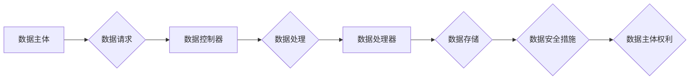

## 国际化：数据隐私与保护（以 GDPR 为例）

> 关键词：数据隐私，GDPR，国际化，数据保护，隐私权，数据安全，合规性

### 1. 背景介绍

随着互联网的快速发展和数字化转型进程的加速，个人数据在全球范围内被广泛收集、存储和利用。然而，数据收集和使用也带来了新的挑战，即数据隐私和安全问题。个人数据泄露、滥用和侵犯隐私事件频发，引发了全球范围内的关注和担忧。

为了保护个人数据隐私权，欧盟于2016年颁布了《通用数据保护条例》（GDPR），这是迄今为止最严格的数据隐私法规之一。GDPR旨在赋予欧盟公民对自身数据拥有和控制的权利，并对处理个人数据的组织和个人设定了严格的规则和义务。

GDPR的颁布对全球数据处理实践产生了深远影响，许多国家和地区纷纷制定或修订了自己的数据隐私法规，以应对日益复杂的数字环境。

### 2. 核心概念与联系

GDPR的核心概念包括：

* **个人数据：**任何可以识别特定自然人的信息，包括姓名、地址、电子邮件地址、IP地址、生物识别数据等。
* **数据主体：**拥有个人数据的自然人。
* **数据控制器：**决定个人数据如何被收集、处理和使用的组织或个人。
* **数据处理器：**根据数据控制器的指令处理个人数据的组织或个人。
* **数据处理目的：**收集、处理和使用个人数据的合法理由。
* **数据主体权利：**数据主体享有对自身数据的访问、更正、删除、限制处理、数据可移植性等权利。

**GDPR 架构流程图**

### 3. 核心算法原理 & 具体操作步骤

GDPR本身并不涉及具体的算法原理，而是通过制定法律法规和标准来规范数据处理行为。然而，在实际的实施过程中，一些算法和技术被用于实现GDPR的要求，例如：

* **数据匿名化算法：**用于去除个人识别信息，保护数据主体隐私。
* **数据加密算法：**用于保护数据在传输和存储过程中的安全。
* **访问控制算法：**用于控制对个人数据的访问权限。

**3.1 算法原理概述**

GDPR的核心算法原理是基于数据最小化、目的限定、透明度和数据主体控制等原则。

* **数据最小化：**仅收集和处理必要的个人数据，避免过度收集。
* **目的限定：**明确规定收集和处理个人数据的目的，不得用于其他目的。
* **透明度：**向数据主体公开数据处理的方式和目的，并获得其同意。
* **数据主体控制：**赋予数据主体对自身数据的访问、更正、删除等权利。

**3.2 算法步骤详解**

GDPR的实施步骤可以概括为以下几个阶段：

1. **风险评估：**数据控制器需要对数据处理活动进行风险评估，识别潜在的隐私风险。
2. **数据保护措施：**根据风险评估结果，制定相应的技术和组织措施，例如数据加密、访问控制、数据匿名化等。
3. **数据主体通知：**向数据主体提供关于数据处理方式和目的的通知，并获得其同意。
4. **数据主体权利：**提供数据主体访问、更正、删除、限制处理等权利的机制。
5. **数据安全事件处理：**制定数据安全事件处理机制，及时响应和处理数据泄露等事件。

**3.3 算法优缺点**

GDPR的算法原理和实施步骤具有以下优点：

* **保护个人隐私：**GDPR通过制定严格的规则和义务，有效保护个人数据的隐私权。
* **增强数据安全：**GDPR要求数据控制器采取相应的技术和组织措施，增强数据安全。
* **提高数据处理透明度：**GDPR要求数据控制器向数据主体公开数据处理方式和目的，提高数据处理透明度。

然而，GDPR也存在一些缺点：

* **实施成本高：**GDPR的实施需要投入大量的人力、物力和时间，对一些小型企业来说可能是一个负担。
* **复杂性高：**GDPR的规定非常复杂，需要专业人士进行解读和实施。
* **跨境数据处理挑战：**GDPR对跨境数据处理提出了挑战，需要协调不同国家和地区的法律法规。

**3.4 算法应用领域**

GDPR的算法原理和实施步骤适用于各种数据处理领域，例如：

* **电子商务：**保护客户个人信息，例如姓名、地址、信用卡信息等。
* **医疗保健：**保护患者医疗记录和个人健康信息。
* **金融服务：**保护客户金融账户信息和交易记录。
* **社交媒体：**保护用户个人信息和隐私。

### 4. 数学模型和公式 & 详细讲解 & 举例说明

GDPR本身并不涉及复杂的数学模型和公式，但一些相关的技术领域，例如数据匿名化和数据加密，会用到数学模型和算法。

**4.1 数学模型构建**

数据匿名化算法通常基于概率统计模型，例如：

* **k-匿名：**将数据划分为k个等价类，每个等价类中包含至少k条数据，使得无法识别出任何单个数据主体的身份。
* **l-多样性：**保证每个等价类中，每个属性的取值都具有多样性，使得无法通过属性组合推断出任何单个数据主体的身份。

**4.2 公式推导过程**

数据加密算法通常基于数学难题，例如：

* **RSA加密算法：**基于大数分解的难题，将明文转换为密文。

**4.3 案例分析与讲解**

例如，在医疗保健领域，可以使用k-匿名算法对患者医疗记录进行匿名化处理，保护患者隐私，同时允许研究人员对匿名化数据进行分析，促进医疗研究的发展。

### 5. 项目实践：代码实例和详细解释说明

由于GDPR是一个法律法规，而不是一个具体的软件项目，因此没有直接的代码实例可以展示。但是，我们可以通过一些开源项目来了解如何使用技术手段实现GDPR的要求。

**5.1 开发环境搭建**

需要根据具体的项目需求搭建相应的开发环境，例如：

* **编程语言：**Python、Java、C++等。
* **数据库：**MySQL、PostgreSQL、MongoDB等。
* **云服务平台：**AWS、Azure、GCP等。

**5.2 源代码详细实现**

例如，可以使用Python语言实现数据匿名化功能，可以使用开源库例如Pandas和Scikit-learn进行数据处理和模型训练。

**5.3 代码解读与分析**

需要对代码进行详细解读和分析，确保代码能够正确实现GDPR的要求，例如：

* **数据最小化：**只收集和处理必要的个人数据。
* **目的限定：**明确规定收集和处理个人数据的目的。
* **透明度：**向数据主体公开数据处理方式和目的。
* **数据主体控制：**提供数据主体访问、更正、删除等权利的机制。

**5.4 运行结果展示**

需要对代码的运行结果进行展示，例如：

* **匿名化后的数据：**确保匿名化后的数据无法识别出任何单个数据主体的身份。
* **数据安全措施：**展示数据加密、访问控制等安全措施的实施效果。

### 6. 实际应用场景

GDPR的实际应用场景非常广泛，例如：

* **电子商务平台：**收集用户个人信息，例如姓名、地址、信用卡信息等，并确保这些信息得到安全保护。
* **社交媒体平台：**收集用户个人信息，例如姓名、头像、兴趣爱好等，并确保用户能够控制自己的数据。
* **医疗保健机构：**收集患者医疗记录和个人健康信息，并确保这些信息得到安全保护。
* **金融机构：**收集客户金融账户信息和交易记录，并确保这些信息得到安全保护。

**6.4 未来应用展望**

随着人工智能、物联网等技术的快速发展，数据隐私和安全问题将更加突出。GDPR将继续发挥重要作用，引导数据处理实践朝着更加安全、透明和可控的方向发展。

### 7. 工具和资源推荐

**7.1 学习资源推荐**

* **欧盟官方网站：**https://gdpr.eu/
* **国际数据保护联盟：**https://www.dataprotection.org/
* **GDPR指南：**https://ico.org.uk/for-organisations/guide-to-data-protection/guide-to-the-general-data-protection-regulation-gdpr/

**7.2 开发工具推荐**

* **数据匿名化工具：**OpenRefine、DataMasker
* **数据加密工具：**PGP、GPG
* **访问控制工具：**IAM、RBAC

**7.3 相关论文推荐**

* **GDPR: A Comprehensive Overview:** https://arxiv.org/abs/1805.03934
* **Data Anonymization Techniques for GDPR Compliance:** https://www.researchgate.net/publication/329191104_Data_Anonymization_Techniques_for_GDPR_Compliance

### 8. 总结：未来发展趋势与挑战

**8.1 研究成果总结**

GDPR的颁布和实施推动了数据隐私和安全领域的进步，促进了相关技术的研发和应用。

**8.2 未来发展趋势**

未来，数据隐私和安全领域将继续发展，主要趋势包括：

* **人工智能和数据隐私的融合：**如何利用人工智能技术保护数据隐私，是一个重要的研究方向。
* **跨境数据处理的规范：**如何协调不同国家和地区的法律法规，规范跨境数据处理，是一个重要的挑战。
* **数据主体的赋能：**如何增强数据主体的控制权，让他们能够更好地管理自己的数据，是一个重要的目标。

**8.3 面临的挑战**

数据隐私和安全领域面临着许多挑战，例如：

* **技术复杂性：**数据隐私和安全技术不断发展，需要不断学习和更新。
* **法律法规的复杂性：**数据隐私和安全法律法规不断变化，需要及时了解和遵守。
* **社会认知的提升：**需要提高公众对数据隐私和安全问题的认识，增强数据安全意识。

**8.4 研究展望**

未来，需要继续加强数据隐私和安全领域的科研投入，探索新的技术和方法，应对不断变化的挑战，构建更加安全、可控的数据生态系统。

### 9. 附录：常见问题与解答

**常见问题：**

* **GDPR适用于哪些组织？**

GDPR适用于处理欧盟公民个人数据的任何组织，无论其位于何处。

* **GDPR有哪些主要要求？**

GDPR的主要要求包括数据最小化、目的限定、透明度、数据主体控制等。

* **如何确保GDPR合规？**

需要进行风险评估、制定数据保护措施、提供数据主体权利的机制等。

* **GDPR违反会有什么后果？**

GDPR违反可能会面临高额罚款和声誉损害。

**作者：禅与计算机程序设计艺术 / Zen and the Art of Computer Programming**

