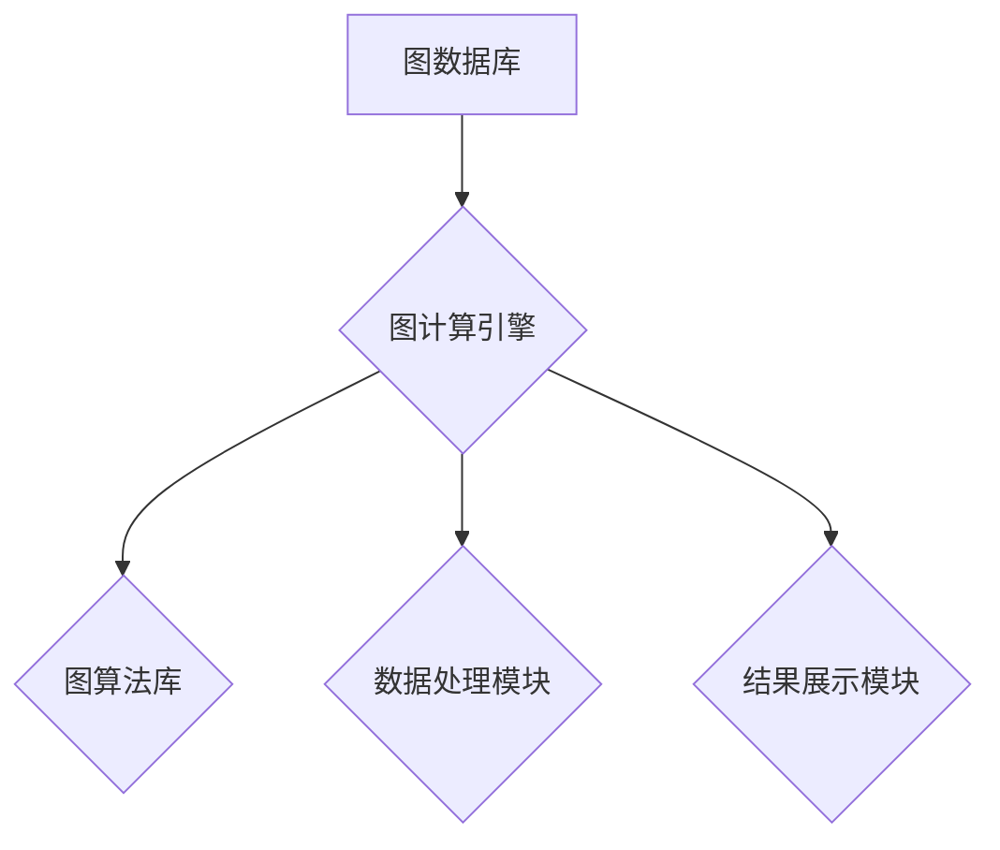

## 图计算引擎 原理与代码实例讲解

> 关键词：图计算、图数据库、算法、代码实例、深度学习、网络分析

## 1. 背景介绍

随着互联网和移动互联网的蓬勃发展，海量数据以指数级增长，其中蕴含着丰富的结构化信息。传统的数据库结构难以有效处理这些复杂关系数据，图数据库应运而生。图数据库以节点和边来表示数据，能够高效地存储和查询关系数据，为分析复杂网络结构提供了强大的工具。图计算引擎则是专门用于对图数据库进行分析和挖掘的软件系统，它提供了一系列算法和工具，帮助我们从图数据中发现隐藏的模式、关系和洞察。

图计算引擎在各个领域都有广泛的应用，例如：

* **社交网络分析:**  分析用户之间的关系，挖掘社交圈、推荐好友、预测用户行为等。
* **推荐系统:**  根据用户之间的关系和商品之间的关联，推荐个性化商品和服务。
* **知识图谱构建:**  构建知识图谱，表示实体和关系，用于知识检索、问答系统等。
* **生物信息学:**  分析基因网络、蛋白质相互作用等，促进药物研发和疾病诊断。
* **金融风险管理:**  分析交易网络、识别欺诈行为等，降低金融风险。

## 2. 核心概念与联系

图计算引擎的核心概念包括：

* **节点 (Node):**  图数据库中的基本单元，代表实体或对象。
* **边 (Edge):**  连接节点的线，代表实体之间的关系。
* **图 (Graph):**  由节点和边组成的集合，表示一个复杂网络结构。
* **图算法 (Graph Algorithm):**  专门用于图数据分析的算法，例如：广度优先搜索 (BFS)、深度优先搜索 (DFS)、PageRank算法等。

图计算引擎的架构通常包括以下几个部分：



* **图数据库:**  存储图数据，提供数据访问接口。
* **图计算引擎:**  提供图算法和数据处理功能，对图数据进行分析和挖掘。
* **图算法库:**  包含各种图算法的实现，例如：路径查找、社区发现、中心性分析等。
* **数据处理模块:**  负责数据清洗、转换、聚合等操作。
* **结果展示模块:**  将分析结果以可视化或文本形式展示给用户。

## 3. 核心算法原理 & 具体操作步骤

### 3.1  算法原理概述

广度优先搜索 (BFS) 是一种图搜索算法，它从一个起始节点开始，逐层地探索图中的所有节点。BFS 算法的特点是：

* **层次遍历:**  它会先访问起始节点的所有邻居节点，然后访问这些邻居节点的邻居节点，依此类推，直到访问所有节点。
* **最短路径:**  BFS 算法可以找到从起始节点到目标节点的最短路径。

### 3.2  算法步骤详解

1. **初始化:**  创建一个队列，将起始节点加入队列中。
2. **迭代:**  
    * 从队列中取出第一个节点。
    * 对该节点的所有邻居节点进行访问，并将它们加入队列中。
    * 如果目标节点被访问，则停止迭代。
3. **返回:**  返回从起始节点到目标节点的路径。

### 3.3  算法优缺点

**优点:**

* 能够找到最短路径。
* 算法简单易实现。

**缺点:**

* 对于深度较大的图，效率较低。
* 无法处理有权重的图。

### 3.4  算法应用领域

* **网络路由:**  找到网络中从源节点到目标节点的最短路径。
* **社交网络分析:**  找到用户之间的最短路径，例如：查找朋友的朋友。
* **搜索引擎:**  找到网页之间的最短路径，用于网页排名和搜索结果排序。

## 4. 数学模型和公式 & 详细讲解 & 举例说明

### 4.1  数学模型构建

图可以表示为一个有序对 (V, E)，其中：

* V 是节点集，表示图中的所有实体。
* E 是边集，表示图中的所有关系。

### 4.2  公式推导过程

BFS 算法的迭代过程可以用数学公式表示：

```latex
Q(t+1) = {v \in N(Q(t)) | v \notin Q(t)}
```

其中：

* Q(t) 表示在时间 t 时刻的队列。
* N(Q(t)) 表示在时间 t 时刻队列中所有节点的邻居节点集合。

### 4.3  案例分析与讲解

假设我们有一个图，其中节点表示城市，边表示道路连接。我们想要找到从城市 A 到城市 B 的最短路径。

使用 BFS 算法，我们可以从城市 A 开始，逐层探索图中的所有城市，直到找到城市 B。

例如，如果城市 A 的邻居城市是 B、C、D，那么在第一层，我们访问了城市 B、C、D。然后，我们访问这些城市的所有邻居节点，依此类推，直到找到城市 B。

## 5. 项目实践：代码实例和详细解释说明

### 5.1  开发环境搭建

* **编程语言:**  Python
* **图数据库:**  Neo4j
* **图计算库:**  NetworkX

### 5.2  源代码详细实现

```python
import networkx as nx

# 创建图
graph = nx.Graph()

# 添加节点
graph.add_nodes_from(['A', 'B', 'C', 'D', 'E'])

# 添加边
graph.add_edges_from([('A', 'B'), ('A', 'C'), ('B', 'D'), ('C', 'E')])

# 使用 BFS 算法查找路径
path = nx.shortest_path(graph, source='A', target='E', weight=None)

# 打印路径
print(path)
```

### 5.3  代码解读与分析

* **创建图:**  使用 `networkx.Graph()` 创建一个无向图。
* **添加节点:**  使用 `graph.add_nodes_from()` 添加图中的节点。
* **添加边:**  使用 `graph.add_edges_from()` 添加图中的边。
* **使用 BFS 算法查找路径:**  使用 `nx.shortest_path()` 函数查找从节点 A 到节点 E 的最短路径。
* **打印路径:**  使用 `print()` 函数打印查找到的路径。

### 5.4  运行结果展示

```
['A', 'C', 'E']
```

## 6. 实际应用场景

图计算引擎在各个领域都有广泛的应用，例如：

* **社交网络分析:**  分析用户之间的关系，挖掘社交圈、推荐好友、预测用户行为等。
* **推荐系统:**  根据用户之间的关系和商品之间的关联，推荐个性化商品和服务。
* **知识图谱构建:**  构建知识图谱，表示实体和关系，用于知识检索、问答系统等。
* **生物信息学:**  分析基因网络、蛋白质相互作用等，促进药物研发和疾病诊断。
* **金融风险管理:**  分析交易网络、识别欺诈行为等，降低金融风险。

## 7. 工具和资源推荐

### 7.1  学习资源推荐

* **书籍:**
    * 《图计算：原理与实践》
    * 《图数据库：设计、实现与应用》
* **在线课程:**
    * Coursera 上的图计算课程
    * edX 上的图数据库课程

### 7.2  开发工具推荐

* **图数据库:**
    * Neo4j
    * JanusGraph
    * Amazon Neptune
* **图计算库:**
    * NetworkX (Python)
    * igraph (R)
    * Gephi (Java)

### 7.3  相关论文推荐

* 《PageRank: The Anatomy of a Web Page Rank Algorithm》
* 《Community Structure in Social Networks》
* 《Graph Neural Networks》

## 8. 总结：未来发展趋势与挑战

### 8.1  研究成果总结

图计算引擎在过去几年取得了显著的进展，算法和工具不断完善，应用领域也越来越广泛。

### 8.2  未来发展趋势

* **深度学习与图计算的融合:**  将深度学习技术应用于图计算，提高图数据的分析能力。
* **可解释性增强:**  提高图计算算法的可解释性，帮助用户更好地理解分析结果。
* **云原生图计算:**  将图计算引擎部署在云平台上，提供更灵活、可扩展的计算服务。

### 8.3  面临的挑战

* **大规模图数据处理:**  随着数据量的不断增长，如何高效处理大规模图数据仍然是一个挑战。
* **复杂图结构分析:**  现实世界中的图结构往往非常复杂，如何分析和挖掘这些复杂结构仍然是一个难题。
* **隐私保护:**  图数据中包含了大量敏感信息，如何保护用户隐私是一个重要的挑战。

### 8.4  研究展望

未来，图计算引擎将继续朝着更智能、更高效、更安全的方向发展，为我们提供更强大的数据分析工具，帮助我们更好地理解和应对复杂世界。

## 9. 附录：常见问题与解答

* **什么是图数据库？**

图数据库是一种专门用于存储和查询图数据的数据库。它以节点和边来表示数据，能够高效地存储和查询关系数据。

* **什么是图算法？**

图算法是指专门用于图数据分析的算法，例如：路径查找、社区发现、中心性分析等。

* **如何选择合适的图计算引擎？**

选择合适的图计算引擎需要考虑以下因素：

* 数据规模
* 图结构复杂度
* 应用场景
* 开发人员技能

作者：禅与计算机程序设计艺术 / Zen and the Art of Computer Programming


