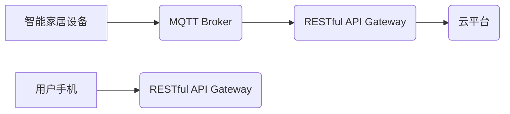

## 基于MQTT协议和RESTful API的智能家居设备远程控制与状态监测

> 关键词：智能家居、MQTT协议、RESTful API、远程控制、状态监测、物联网

## 1. 背景介绍

随着物联网技术的快速发展，智能家居已成为现代生活的重要组成部分。智能家居系统能够通过网络连接各种智能设备，实现对设备的远程控制和状态监测，为用户提供更加便捷、舒适的生活体验。然而，如何实现智能家居设备之间的可靠通信和数据交互，是构建智能家居系统面临的关键挑战。

传统的智能家居系统通常采用局域网或家庭网络进行通信，存在以下问题：

* **局限性强:**  局域网通信范围有限，无法实现远程控制和监测。
* **安全性不足:**  家庭网络安全性相对较低，容易受到攻击。
* **扩展性差:**  随着设备数量的增加，局域网的负担会越来越重，难以扩展。

为了解决这些问题，基于MQTT协议和RESTful API的智能家居系统应运而生。MQTT协议是一种轻量级、低功耗的物联网通信协议，能够实现设备之间可靠的双向数据传输，同时支持多种网络环境，例如Wi-Fi、蓝牙、蜂窝网络等。RESTful API是一种基于互联网标准的软件架构风格，能够实现不同系统之间的数据交互，并提供标准化的接口，方便开发人员进行集成。

## 2. 核心概念与联系

### 2.1 MQTT协议

MQTT（Message Queuing Telemetry Transport）是一种轻量级的消息传输协议，专门设计用于物联网应用场景。它采用发布/订阅模式进行通信，其中消息发布者（Publisher）将消息发布到特定的主题（Topic），消息订阅者（Subscriber）可以订阅感兴趣的主题，接收相关消息。

MQTT协议具有以下特点：

* **轻量级:**  协议本身非常简洁，占用资源少，适合资源受限的设备。
* **低功耗:**  MQTT协议采用断线重连机制，能够在网络不稳定时保持连接，降低功耗。
* **可靠性高:**  MQTT协议支持消息确认机制，确保消息可靠传输。
* **跨平台:**  MQTT协议支持多种平台和编程语言，方便开发人员进行集成。

### 2.2 RESTful API

RESTful API（Representational State Transfer Application Programming Interface）是一种基于互联网标准的软件架构风格，它使用HTTP协议进行数据交互，并遵循一系列约定，例如使用资源标识符（URI）、HTTP方法（GET、POST、PUT、DELETE）等。

RESTful API具有以下特点：

* **标准化:**  RESTful API遵循标准化的规范，方便不同系统之间进行集成。
* **可扩展性强:**  RESTful API可以轻松扩展，支持增加新的资源和功能。
* **安全性高:**  RESTful API支持多种安全机制，例如身份验证、授权等。
* **易于开发:**  RESTful API使用HTTP协议进行交互，开发人员熟悉HTTP协议即可开发RESTful API。

### 2.3 架构图



## 3. 核心算法原理 & 具体操作步骤

### 3.1 算法原理概述

本系统采用MQTT协议实现智能家居设备之间的通信，并使用RESTful API提供用户远程控制和状态监测的接口。

* **MQTT协议:**  智能家居设备通过MQTT协议发布和订阅消息，实现设备之间的实时数据交互。
* **RESTful API:**  RESTful API提供用户手机应用程序与云平台之间的接口，用户可以通过手机应用程序发送控制指令，并接收设备的状态信息。

### 3.2 算法步骤详解

1. **设备连接MQTT Broker:**  智能家居设备启动后，首先连接到MQTT Broker，并订阅和发布相关的主题。
2. **用户手机连接RESTful API Gateway:**  用户手机应用程序连接到RESTful API Gateway，并发送控制指令或请求状态信息。
3. **RESTful API Gateway处理请求:**  RESTful API Gateway接收用户手机应用程序的请求，并根据请求类型转发到相应的处理逻辑。
4. **处理逻辑执行:**  处理逻辑根据请求类型执行相应的操作，例如：
    * **控制指令:**  RESTful API Gateway将控制指令转换为MQTT消息，并发布到相应的主题。
    * **状态信息请求:**  RESTful API Gateway从MQTT Broker订阅设备的状态信息，并返回给用户手机应用程序。
5. **设备接收消息并执行操作:**  智能家居设备接收MQTT消息后，根据消息内容执行相应的操作，例如：
    * **控制指令:**  设备根据控制指令改变状态。
    * **状态信息:**  设备发布状态信息到相应的主题。

### 3.3 算法优缺点

**优点:**

* **可靠性高:**  MQTT协议支持消息确认机制，确保消息可靠传输。
* **低功耗:**  MQTT协议采用断线重连机制，降低功耗。
* **扩展性强:**  RESTful API可以轻松扩展，支持增加新的资源和功能。
* **安全性高:**  RESTful API支持多种安全机制，例如身份验证、授权等。

**缺点:**

* **复杂度较高:**  需要对MQTT协议和RESTful API有一定的了解。
* **部署成本较高:**  需要搭建MQTT Broker和RESTful API Gateway等基础设施。

### 3.4 算法应用领域

* **智能家居:**  远程控制和状态监测智能家居设备，例如灯光、空调、窗帘等。
* **工业自动化:**  实现工业设备的远程监控和控制，例如生产线设备、传感器数据采集等。
* **农业物联网:**  远程监控和控制农业设备，例如温湿度传感器、灌溉系统等。
* **医疗健康:**  远程监控患者健康状况，例如血压、血糖等数据采集。

## 4. 数学模型和公式 & 详细讲解 & 举例说明

### 4.1 数学模型构建

本系统中，我们可以使用状态机模型来描述智能家居设备的状态变化。状态机模型由状态集合、事件集合和状态转换函数组成。

* **状态集合:**  智能家居设备可以处于不同的状态，例如“开”、“关”、“待机”等。
* **事件集合:**  事件是导致状态变化的触发因素，例如“用户发送控制指令”、“设备状态发生变化”等。
* **状态转换函数:**  状态转换函数根据事件和当前状态，决定设备的下一个状态。

### 4.2 公式推导过程

状态转换函数可以表示为以下形式：

```
next_state = state_transition_function(current_state, event)
```

其中：

* `next_state`: 设备下一个状态
* `current_state`: 设备当前状态
* `event`: 导致状态变化的事件

例如，一个简单的灯光控制设备的状态机模型可以表示为：

* **状态集合:**  {"开", "关", "待机"}
* **事件集合:**  {"开灯", "关灯", "定时"}
* **状态转换函数:**

```
if current_state == "开" and event == "关灯":
    next_state = "关"
elif current_state == "关" and event == "开灯":
    next_state = "开"
elif current_state == "待机" and event == "开灯":
    next_state = "开"
else:
    next_state = current_state
```

### 4.3 案例分析与讲解

假设用户发送“开灯”指令，设备当前状态为“关”，则根据状态转换函数，设备下一个状态为“开”。

## 5. 项目实践：代码实例和详细解释说明

### 5.1 开发环境搭建

* **操作系统:**  Linux/Windows/macOS
* **编程语言:**  Python/Java/C++
* **MQTT Broker:**  Mosquitto/EMQX
* **RESTful API Framework:**  Flask/Django/Spring Boot

### 5.2 源代码详细实现

以下是一个使用Python和Flask框架实现RESTful API的简单示例：

```python
from flask import Flask, request, jsonify
import paho.mqtt.client as mqtt

app = Flask(__name__)

# MQTT Broker配置
mqtt_broker = "mqtt.example.com"
mqtt_port = 1883

# MQTT客户端
client = mqtt.Client()
client.connect(mqtt_broker, mqtt_port)

# RESTful API接口
@app.route('/control', methods=['POST'])
def control():
    data = request.get_json()
    device_id = data.get('device_id')
    command = data.get('command')

    # 将控制指令转换为MQTT消息
    message = f"{{\"device_id\": \"{device_id}\", \"command\": \"{command}\"}}".encode('utf-8')
    client.publish(f"/devices/{device_id}/command", message)

    return jsonify({'status':'success'})

if __name__ == '__main__':
    app.run(debug=True)
```

### 5.3 代码解读与分析

* **MQTT Broker配置:**  设置MQTT Broker的地址和端口。
* **MQTT客户端:**  创建MQTT客户端并连接到MQTT Broker。
* **RESTful API接口:**  定义一个`/control`接口，接收用户发送的控制指令。
* **消息发布:**  将控制指令转换为MQTT消息，并发布到相应的主题。

### 5.4 运行结果展示

当用户通过手机应用程序发送控制指令到`/control`接口时，RESTful API会将指令转换为MQTT消息，并发布到MQTT Broker。MQTT Broker会将消息转发给相应的智能家居设备，设备根据指令执行相应的操作。

## 6. 实际应用场景

### 6.1 智能家居场景

* **远程控制灯光:**  用户可以通过手机应用程序远程控制家中灯光的开关和亮度。
* **远程控制空调:**  用户可以通过手机应用程序远程控制家中空调的温度和模式。
* **远程监控摄像头:**  用户可以通过手机应用程序远程监控家中摄像头，查看实时画面。
* **场景联动:**  用户可以设置场景联动，例如“回家模式”，当用户回家时，灯光自动打开，空调自动调节温度。

### 6.2 工业自动化场景

* **远程监控设备状态:**  用户可以通过手机应用程序远程监控工业设备的运行状态，例如温度、压力、流量等。
* **远程控制设备操作:**  用户可以通过手机应用程序远程控制工业设备的操作，例如启动、停止、调整参数等。
* **故障预警:**  当设备出现异常时，系统会自动发送报警信息到用户手机应用程序。

### 6.3 其他应用场景

* **农业物联网:**  远程监控和控制农业设备，例如温湿度传感器、灌溉系统等。
* **医疗健康:**  远程监控患者健康状况，例如血压、血糖等数据采集。

### 6.4 未来应用展望

随着物联网技术的不断发展，基于MQTT协议和RESTful API的智能家居系统将更加智能化、便捷化和安全化。未来，我们可以期待以下应用场景：

* **更强大的场景联动:**  用户可以设置更加复杂的场景联动，例如根据天气预报自动调节空调温度。
* **更智能的设备控制:**  设备可以根据用户的习惯和需求自动学习和调整控制策略。
* **更安全的隐私保护:**  系统将更加注重用户隐私保护，采用更加安全的加密和授权机制。

## 7. 工具和资源推荐

### 7.1 学习资源推荐

* **MQTT协议官方文档:**  https://mqtt.org/
* **RESTful API官方文档:**  https://restfulapi.net/
* **Python MQTT库文档:**  https://pypi.org/project/paho-mqtt/
* **Flask框架文档:**  https://flask.palletsprojects.com/en/2.2.x/

### 7.2 开发工具推荐

* **MQTT Broker:**  Mosquitto、EMQX
* **RESTful API Framework:**  Flask