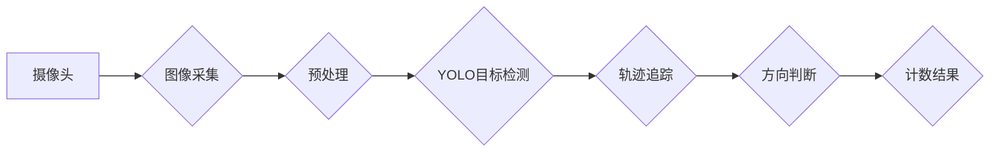

## 基于yolov的行人进出双向计数

> 关键词：YOLO, 行人计数, 双向计数, 深度学习, 物体检测, 视频分析

## 1. 背景介绍

随着城市化进程的加速和智能化社会的不断发展，行人流量统计已成为城市管理、交通规划、商业分析等领域的重要应用场景。传统的行人计数方法主要依赖于人工统计或红外传感器，存在效率低、成本高、精度不高等问题。近年来，深度学习技术的发展为行人计数带来了新的突破。

基于深度学习的图像识别和物体检测算法，例如YOLO（You Only Look Once），能够快速准确地识别和定位图像中的行人，为行人计数提供了新的技术手段。本文将介绍基于YOLO的行人进出双向计数方法，并探讨其原理、算法、实现步骤以及应用场景。

## 2. 核心概念与联系

### 2.1  YOLO算法

YOLO是一种基于深度学习的实时目标检测算法，其特点是速度快、精度高。YOLO算法将图像划分为多个网格单元，每个网格单元负责预测该区域内是否存在目标，以及目标的类别和位置信息。YOLO算法采用端到端训练方式，直接将图像输入到神经网络中，输出目标的检测结果。

### 2.2  行人进出双向计数

行人进出双向计数是指对行人流动的方向进行区分，统计进出的人数。传统的行人计数方法难以区分行人进出方向，而基于YOLO的行人进出双向计数方法可以利用图像中的上下文信息和行人运动轨迹，准确地识别行人进出方向。

### 2.3  算法架构



## 3. 核心算法原理 & 具体操作步骤

### 3.1  算法原理概述

基于YOLO的行人进出双向计数方法主要包括以下步骤：

1. **图像采集:** 使用摄像头采集视频流。
2. **图像预处理:** 对采集到的图像进行预处理，例如调整亮度、对比度、尺寸等，以提高检测精度。
3. **YOLO目标检测:** 使用预训练好的YOLO模型对预处理后的图像进行检测，识别出图像中的行人。
4. **轨迹追踪:** 对检测到的行人进行轨迹追踪，跟踪其运动轨迹。
5. **方向判断:** 根据行人的运动轨迹，判断其进出方向。
6. **计数结果:** 根据方向判断结果，统计进出的人数。

### 3.2  算法步骤详解

1. **图像采集:** 使用摄像头采集视频流，并将其存储为图像序列。
2. **图像预处理:** 对图像进行预处理，例如：
    * **尺寸调整:** 将图像调整为YOLO模型输入的尺寸。
    * **归一化:** 将图像像素值归一化到[0, 1]区间。
    * **数据增强:** 使用数据增强技术，例如随机裁剪、旋转、翻转等，增加训练数据的多样性。
3. **YOLO目标检测:** 使用预训练好的YOLO模型对预处理后的图像进行检测，识别出图像中的行人。YOLO模型会输出每个检测框的坐标、置信度和类别信息。
4. **轨迹追踪:** 使用轨迹追踪算法，例如Kalman滤波器或匈牙利算法，跟踪检测到的行人，并构建其运动轨迹。
5. **方向判断:** 根据行人的运动轨迹，判断其进出方向。可以根据以下方法进行判断：
    * **速度方向:** 如果行人的速度方向与摄像头的视角方向一致，则判断其为进方向；反之，则判断其为出方向。
    * **轨迹方向:** 如果行人的轨迹方向与摄像头的视角方向一致，则判断其为进方向；反之，则判断其为出方向。
6. **计数结果:** 根据方向判断结果，统计进出的人数。

### 3.3  算法优缺点

**优点:**

* **实时性:** YOLO算法具有较高的实时性，能够实时检测和跟踪行人。
* **精度:** YOLO算法的检测精度较高，能够准确识别图像中的行人。
* **通用性:** YOLO算法可以应用于各种场景，例如人流统计、安防监控等。

**缺点:**

* **计算复杂度:** YOLO算法的计算复杂度较高，需要较强的计算能力。
* **参数量大:** YOLO算法的参数量较大，需要较大的存储空间。
* **小目标检测能力有限:** YOLO算法对小目标的检测能力有限。

### 3.4  算法应用领域

基于YOLO的行人进出双向计数方法在以下领域具有广泛的应用前景：

* **城市管理:** 统计城市人流，分析人口流动规律，为城市规划提供数据支持。
* **交通规划:** 监测交通流量，优化交通信号灯控制，缓解交通拥堵。
* **商业分析:** 分析商场人流，了解顾客行为，优化商业布局。
* **安防监控:** 监控人员进出，提高安防安全水平。

## 4. 数学模型和公式 & 详细讲解 & 举例说明

### 4.1  数学模型构建

行人进出双向计数方法的核心是利用YOLO算法检测行人，并根据其运动轨迹判断进出方向。

**YOLO目标检测模型:**

YOLO模型是一个基于卷积神经网络的深度学习模型，其输入是图像，输出是检测框的坐标、置信度和类别信息。

**轨迹追踪模型:**

轨迹追踪模型通常使用Kalman滤波器或匈牙利算法，根据连续帧中的行人检测结果，构建其运动轨迹。

**方向判断模型:**

方向判断模型可以根据行人的速度方向或轨迹方向，判断其进出方向。

### 4.2  公式推导过程

**速度方向判断:**

假设行人的速度向量为 $v = (v_x, v_y)$，摄像头的视角方向为 $d = (d_x, d_y)$，则速度方向与视角方向的夹角为 $\theta$：

$$
\theta = \arccos(\frac{v_x \cdot d_x + v_y \cdot d_y}{||v|| ||d||})
$$

如果 $\theta < \alpha$，则判断行人为进方向；否则，判断其为出方向。其中 $\alpha$ 是一个预设的阈值。

**轨迹方向判断:**

假设行人的轨迹点为 $p_t = (x_t, y_t)$，则轨迹方向向量为 $p_{t+1} - p_t$。

根据轨迹方向向量与摄像头的视角方向的夹角，判断行人进出方向。

### 4.3  案例分析与讲解

**案例:**

假设摄像头位于商场门口，需要统计进出的人数。

**分析:**

* 使用YOLO模型检测商场门口的行人。
* 使用轨迹追踪算法跟踪检测到的行人，构建其运动轨迹。
* 根据行人的速度方向或轨迹方向，判断其进出方向。
* 统计进出的人数。

**讲解:**

* 由于商场门口的摄像头视角方向固定，因此可以设定一个阈值 $\alpha$，判断速度方向与视角方向的夹角是否小于 $\alpha$。
* 轨迹方向判断可以更加准确地识别行人进出方向，尤其是在行人速度较慢或方向变化较大的情况下。

## 5. 项目实践：代码实例和详细解释说明

### 5.1  开发环境搭建

* **操作系统:** Ubuntu 18.04 或更高版本
* **Python:** 3.6 或更高版本
* **深度学习框架:** TensorFlow 或 PyTorch
* **YOLO模型:** 使用预训练好的YOLO模型，例如YOLOv3或YOLOv5

### 5.2  源代码详细实现

```python
# 导入必要的库
import cv2
import numpy as np

# 加载YOLO模型
net = cv2.dnn.readNet("yolov3.weights", "yolov3.cfg")

# 定义类标签
classes = []
with open("coco.names", "r") as f:
    classes = [line.strip() for line in f.readlines()]

# 读取视频流
cap = cv2.VideoCapture("video.mp4")

# 计数器
count_in = 0
count_out = 0

while True:
    # 读取视频帧
    ret, frame = cap.read()
    if not ret:
        break

    # 预处理图像
    height, width, _ = frame.shape
    blob = cv2.dnn.blobFromImage(frame, 1/255, (416, 416), (0, 0, 0), True, crop=False)

    # 将图像输入到YOLO模型
    net.setInput(blob)
    output_layers_names = net.getUnconnectedOutLayersNames()
    layerOutputs = net.forward(output_layers_names)

    # 后处理检测结果
    boxes = []
    confidences = []
    class_ids = []

    for output in layerOutputs:
        for detection in output:
            scores = detection[5:]
            class_id = np.argmax(scores)
            confidence = scores[class_id]
            if confidence > 0.5:
                center_x = int(detection[0] * width)
                center_y = int(detection[1] * height)
                w = int(detection[2] * width)
                h = int(detection[3] * height)

                x = int(center_x - w / 2)
                y = int(center_y - h / 2)

                boxes.append([x, y, w, h])
                confidences.append(float(confidence))
                class_ids.append(class_id)

    # 使用非极大值抑制算法去除重叠的检测框
    indexes = cv2.dnn.NMSBoxes(boxes, confidences, 0.5, 0.4)

    # 绘制检测框
    for i in range(len(boxes)):
        if i in indexes:
            x, y, w, h = boxes[i]
            label = str(classes[class_ids[i]])
            confidence = confidences[i]
            color = (0, 255, 0)
            cv2.rectangle(frame, (x, y), (x + w, y + h), color, 2)
            cv2.putText(frame, label + " " + str(round(confidence, 2)), (x, y - 10), cv2.FONT_HERSHEY_SIMPLEX, 0.5, color, 2)

    # 统计进出人数
    #...

    # 显示视频帧
    cv2.imshow("Frame", frame)

    # 按键退出
    if cv2.waitKey(1) & 0xFF == ord("q"):
        break

# 释放资源
cap.release()
cv2.destroyAllWindows()
```

### 5.3  代码解读与分析

* **加载YOLO模型:** 使用`cv2.dnn.readNet()`函数加载预训练好的YOLO模型。
* **定义类标签:** 读取`coco.names`文件，获取YOLO模型识别的类别标签。
* **读取视频流:** 使用`cv2.VideoCapture()`函数读取视频流。
* **预处理图像:** 将图像调整为YOLO模型输入的尺寸，并进行归一化处理。
* **将图像输入到YOLO模型:** 使用`net.setInput()`函数将预处理后的图像输入到YOLO模型。
* **获取检测结果:** 使用`net.forward()`函数获取YOLO模型的检测结果。