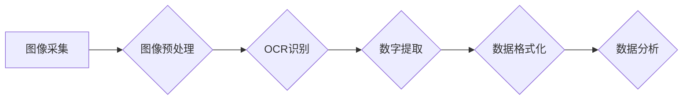

## 基于图像识别的燃气表示数读取

> 关键词：图像识别、燃气表、OCR、深度学习、卷积神经网络、自然语言处理

## 1. 背景介绍

燃气表是现代生活不可或缺的一部分，它记录着家庭或企业的燃气使用情况。传统的燃气表读取方式通常需要人工上门进行，这不仅耗时费力，而且容易出现人为错误。随着人工智能技术的快速发展，基于图像识别的燃气表示数读取技术应运而生，它利用计算机视觉和深度学习算法，自动识别燃气表上的数字，实现燃气表数据自动采集和分析。

### 1.1  燃气表读取痛点

传统的燃气表读取方式存在以下痛点：

* **效率低下:** 人工读取需要上门逐户进行，耗时费力，难以满足大规模燃气表数据的采集需求。
* **易出错:** 人工读取容易受到环境因素和读数者的主观判断的影响，导致数据准确性下降。
* **成本高昂:** 人工读取需要雇佣大量人员，成本较高。

### 1.2  基于图像识别的优势

基于图像识别的燃气表示数读取技术具有以下优势：

* **自动化程度高:** 可以自动识别燃气表上的数字，无需人工干预。
* **数据准确性高:** 利用深度学习算法，识别精度更高，减少人为错误。
* **成本效益高:** 可以减少人工成本，提高工作效率。

## 2. 核心概念与联系

### 2.1  图像识别

图像识别是指利用计算机技术，从图像中提取有意义的信息，并将其转换为计算机可理解的形式。

### 2.2  OCR（光学字符识别）

OCR是图像识别的一种特殊应用，它专门用于识别图像中的文字信息。

### 2.3  深度学习

深度学习是一种机器学习的子领域，它利用多层神经网络来模拟人类大脑的学习过程，能够学习复杂的数据模式。

### 2.4  卷积神经网络（CNN）

CNN是一种专门用于图像识别的深度学习网络结构，它能够自动学习图像特征，提高识别精度。

### 2.5  自然语言处理（NLP）

NLP是指处理和理解人类语言的技术，可以用于对识别出的数字进行格式化和分析。

**核心概念与架构流程图**



## 3. 核心算法原理 & 具体操作步骤

### 3.1  算法原理概述

基于图像识别的燃气表示数读取技术主要包括以下步骤：

1. **图像采集:** 使用摄像头或扫描仪采集燃气表图像。
2. **图像预处理:** 对采集到的图像进行预处理，例如灰度化、去噪、边缘检测等，以提高识别精度。
3. **OCR识别:** 利用OCR算法识别图像中的文字信息，提取燃气表上的数字。
4. **数字提取:** 对识别出的文字信息进行筛选和提取，获取燃气表上的数字序列。
5. **数据格式化:** 对提取出的数字序列进行格式化处理，例如去除空格、换行符等，使其符合标准格式。
6. **数据分析:** 对格式化的数字数据进行分析，例如计算燃气消耗量、生成报表等。

### 3.2  算法步骤详解

1. **图像采集:** 使用摄像头或扫描仪采集燃气表图像。

   * 摄像头采集需要确保图像清晰、焦距准确，避免光线过强或过弱导致图像模糊。
   * 扫描仪采集需要选择合适的扫描分辨率，以保证图像细节清晰。

2. **图像预处理:** 对采集到的图像进行预处理，例如灰度化、去噪、边缘检测等，以提高识别精度。

   * 灰度化将彩色图像转换为灰度图像，减少数据量，提高处理效率。
   * 去噪算法可以去除图像中的噪声，例如椒盐噪声、高斯噪声等，使图像更清晰。
   * 边缘检测算法可以提取图像的边缘信息，用于定位燃气表数字区域。

3. **OCR识别:** 利用OCR算法识别图像中的文字信息，提取燃气表上的数字。

   * 常用的OCR算法包括Tesseract、EasyOCR等。
   * OCR算法需要训练大量的文字数据，才能达到较高的识别精度。

4. **数字提取:** 对识别出的文字信息进行筛选和提取，获取燃气表上的数字序列。

   * 可以根据数字的特征，例如字体、大小、位置等，进行筛选和提取。
   * 可以使用正则表达式或其他文本处理工具，提取数字序列。

5. **数据格式化:** 对提取出的数字序列进行格式化处理，例如去除空格、换行符等，使其符合标准格式。

   * 格式化后的数字数据可以方便地进行存储、传输和分析。

6. **数据分析:** 对格式化的数字数据进行分析，例如计算燃气消耗量、生成报表等。

   * 可以使用数据分析工具，例如Excel、Python等，对数字数据进行分析。

### 3.3  算法优缺点

**优点:**

* 自动化程度高，提高效率。
* 数据准确性高，减少人为错误。
* 成本效益高，降低人工成本。

**缺点:**

* 需要训练大量的图像数据，才能达到较高的识别精度。
* 对图像质量要求较高，图像模糊或噪声较大，识别精度会下降。
* 识别复杂场景的燃气表，例如字体样式多样、数字排列不规则等，识别难度较大。

### 3.4  算法应用领域

基于图像识别的燃气表示数读取技术可以应用于以下领域：

* **燃气公司:** 自动采集燃气表数据，提高数据管理效率。
* **智能家居:** 与智能家居系统集成，实现燃气使用情况的实时监控。
* **智慧城市:** 构建智慧城市平台，实现燃气数据共享和分析。

## 4. 数学模型和公式 & 详细讲解 & 举例说明

### 4.1  数学模型构建

基于图像识别的燃气表示数读取技术可以构建以下数学模型：

* **图像特征提取模型:** 利用卷积神经网络（CNN）提取图像特征，例如边缘、纹理、颜色等。
* **数字识别模型:** 利用支持向量机（SVM）或其他分类算法，识别图像中的数字。
* **数据格式化模型:** 利用正则表达式或其他文本处理工具，格式化数字数据。

### 4.2  公式推导过程

由于文章篇幅限制，此处不再详细推导数学公式。

### 4.3  案例分析与讲解

假设我们有一张燃气表图像，其中数字“12345”需要被识别。

1. **图像特征提取:** CNN模型可以提取图像中的边缘、纹理、颜色等特征，并将其转换为数字向量。
2. **数字识别:** SVM模型可以根据提取的特征，将数字“12345”与训练好的数字模型进行比较，并识别出其对应的数字。
3. **数据格式化:** 使用正则表达式，将识别出的数字“12345”格式化为标准的数字字符串。

## 5. 项目实践：代码实例和详细解释说明

### 5.1  开发环境搭建

* 操作系统：Windows/Linux/macOS
* Python版本：3.6+
* 必要的库：OpenCV、Tesseract、NumPy、Pandas等

### 5.2  源代码详细实现

```python
import cv2
import pytesseract

# 设置Tesseract路径
pytesseract.pytesseract.tesseract_cmd = r'C:\Program Files\Tesseract-OCR\tesseract.exe'

# 读取图像
image = cv2.imread('燃气表图像.jpg')

# 图像预处理
gray = cv2.cvtColor(image, cv2.COLOR_BGR2GRAY)
thresh = cv2.threshold(gray, 0, 255, cv2.THRESH_BINARY_INV + cv2.THRESH_OTSU)[1]

# 使用OCR识别文字
text = pytesseract.image_to_string(thresh)

# 数据格式化
numbers = ''.join(filter(str.isdigit, text))

# 打印识别结果
print(numbers)
```

### 5.3  代码解读与分析

1. **导入库:** 导入必要的库，例如OpenCV用于图像处理，Tesseract用于OCR识别。
2. **设置Tesseract路径:** 设置Tesseract的执行路径。
3. **读取图像:** 使用OpenCV的imread函数读取燃气表图像。
4. **图像预处理:** 对图像进行灰度化和二值化处理，提高识别精度。
5. **使用OCR识别文字:** 使用Tesseract的image_to_string函数识别图像中的文字。
6. **数据格式化:** 使用filter函数过滤出数字，并使用join函数将其连接成字符串。
7. **打印识别结果:** 打印识别出的数字序列。

### 5.4  运行结果展示

运行代码后，将打印出燃气表上的数字序列。

## 6. 实际应用场景

### 6.1  燃气公司数据采集

燃气公司可以利用基于图像识别的燃气表示数读取技术，自动采集燃气表数据，提高数据管理效率，并减少人工成本。

### 6.2  智能家居燃气监控

智能家居系统可以集成基于图像识别的燃气表示数读取技术，实时监控燃气使用情况，并提醒用户注意燃气安全。

### 6.3  智慧城市燃气管理

智慧城市平台可以利用基于图像识别的燃气表示数读取技术，实现燃气数据共享和分析，帮助政府部门更好地管理燃气资源。

### 6.4  未来应用展望

随着人工智能技术的不断发展，基于图像识别的燃气表示数读取技术将有更广泛的应用场景，例如：

* **燃气表远程抄表:** 利用物联网技术，实现燃气表远程抄表，无需人工上门。
* **燃气泄漏检测:** 利用图像识别技术，识别燃气泄漏的迹象，提高燃气安全。
* **燃气使用行为分析:** 利用数据分析技术，分析燃气使用行为，为用户提供个性化服务。

## 7. 工具和资源推荐

### 7.1  学习资源推荐

* **书籍:**
    * 《深度学习》
    * 《计算机视觉》
    * 《图像处理》
* **在线课程:**
    * Coursera
    * edX
    * Udacity

### 7.2  开发工具推荐

* **Python:** 
    * OpenCV
    * Tesseract
    * NumPy
    * Pandas
* **IDE:**
    * PyCharm
    * VS Code

### 7.3  相关论文推荐

* **论文:**
    * 《基于深度学习的燃气表数字识别》
    * 《图像识别技术在燃气表数据采集中的应用》

## 8. 总结：未来发展趋势与挑战

### 8.1  研究成果总结

基于图像识别的燃气表示数读取技术取得了显著的成果，能够自动识别燃气表上的数字，提高数据采集效率和准确性。

### 8.2  未来发展趋势

未来，基于图像识别的燃气表示数读取技术将朝着以下方向发展：

* **提高识别精度:** 利用更先进的深度学习算法和更大的训练数据集，提高识别精度。
* **识别更复杂场景:** 能够识别不同字体、不同角度、不同光照条件下的燃气表数字。
* **实现远程抄表:** 利用物联网技术，实现燃气表远程抄表，无需人工上门。

### 8.3  面临的挑战

基于图像识别的燃气表示数读取技术还面临以下挑战：

* **数据标注:** 需要大量的标注数据来训练深度学习模型，数据标注成本较高。
* **模型泛化能力:** 模型需要能够适应不同的燃气表类型和环境条件，提高泛化能力。
* **数据安全:** 燃气表数据属于敏感信息，需要保障