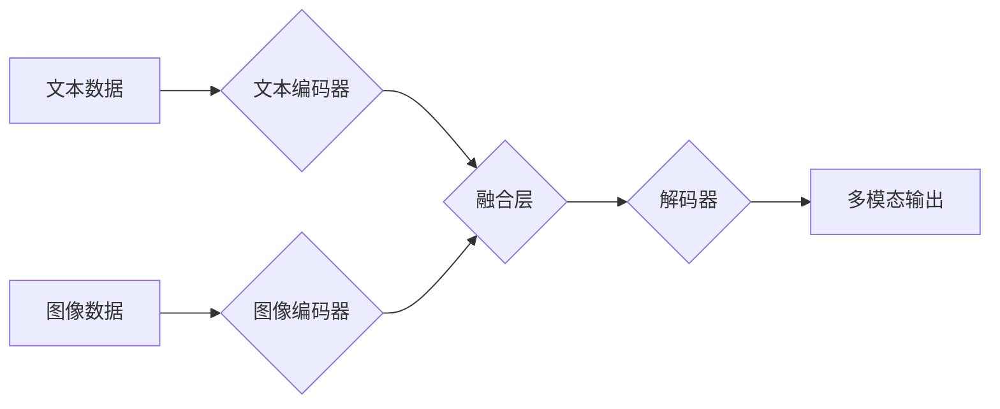

## 多模态大模型：技术原理与实战 OpenAI特殊的股权设计带来的启示

> 关键词：多模态大模型、Transformer、深度学习、自然语言处理、计算机视觉、股权设计、OpenAI、人工智能

### 1. 背景介绍

近年来，人工智能（AI）技术取得了飞速发展，其中大模型在自然语言处理（NLP）、计算机视觉（CV）等领域展现出强大的能力。传统的单模态大模型主要处理文本或图像等单一类型数据，而多模态大模型则能够融合多种模态数据，例如文本、图像、音频、视频等，从而实现更全面、更智能的理解和生成。

OpenAI的ChatGPT和DALL-E 2等多模态大模型的成功应用，标志着多模态AI进入了一个新的发展阶段。这些模型能够进行跨模态的理解和生成，例如根据文本描述生成图像、根据图像描述生成文本、甚至能够理解和生成音频和视频内容。

### 2. 核心概念与联系

多模态大模型的核心是融合不同模态数据，实现跨模态的理解和生成。

**2.1 多模态数据融合**

多模态数据融合是指将来自不同模态的数据进行整合，形成一个统一的表示，以便模型能够理解和处理。常见的融合方法包括：

* **特征级融合:** 将不同模态的数据分别提取特征，然后将特征进行拼接或融合，形成一个新的特征向量。
* **表示级融合:** 将不同模态的数据分别表示为向量，然后将向量进行加权求和或其他融合操作，形成一个新的表示。
* **决策级融合:** 将不同模态的数据分别输入到不同的模型，然后将模型的输出进行融合，形成最终的决策。

**2.2 Transformer架构**

Transformer是一种强大的深度学习架构，在NLP领域取得了突破性的进展。其核心是注意力机制，能够捕捉文本序列中不同词之间的长距离依赖关系。Transformer架构也适用于多模态数据处理，例如在Vision Transformer（ViT）中，图像被分割成patches，然后通过Transformer编码器进行处理。

**2.3 多模态学习**

多模态学习是指训练模型能够从多个模态数据中学习，并进行跨模态的理解和生成。常见的学习方法包括：

* **联合训练:** 将多个模态数据一起训练模型，使得模型能够学习不同模态之间的关系。
* **迁移学习:** 利用预训练的单模态模型，迁移到多模态任务中，提高训练效率。
* **自监督学习:** 利用无标签的多模态数据进行自监督学习，例如通过预测图像中的文本描述或文本中的图像内容。

**Mermaid 流程图**



### 3. 核心算法原理 & 具体操作步骤

**3.1 算法原理概述**

多模态大模型的训练主要基于深度学习算法，例如Transformer架构。模型通过学习不同模态数据之间的关系，实现跨模态的理解和生成。

**3.2 算法步骤详解**

1. **数据预处理:** 将多模态数据进行预处理，例如文本数据进行分词、图像数据进行裁剪和增强等。
2. **特征提取:** 使用预训练的单模态模型或专门设计的多模态模型提取不同模态数据的特征。
3. **数据融合:** 将不同模态的特征进行融合，形成一个统一的表示。
4. **模型训练:** 使用深度学习算法，例如Transformer，训练多模态模型，使其能够理解和生成跨模态数据。
5. **模型评估:** 使用测试数据评估模型的性能，例如准确率、召回率、F1-score等。

**3.3 算法优缺点**

**优点:**

* 能够处理多种模态数据，实现更全面、更智能的理解和生成。
* 能够学习不同模态之间的关系，提高模型的泛化能力。

**缺点:**

* 训练数据量大，计算资源消耗高。
* 模型复杂度高，需要更强大的计算能力进行训练和推理。

**3.4 算法应用领域**

* **图像字幕生成:** 根据图像生成文本描述。
* **文本到图像生成:** 根据文本描述生成图像。
* **视频理解:** 理解视频内容，例如识别动作、场景和人物。
* **多模态对话系统:** 能够理解和生成文本、图像、音频等多种模态数据。

### 4. 数学模型和公式 & 详细讲解 & 举例说明

**4.1 数学模型构建**

多模态大模型的数学模型通常基于深度学习框架，例如TensorFlow或PyTorch。模型的结构通常包括编码器和解码器。编码器负责提取不同模态数据的特征，解码器负责根据编码后的特征生成输出。

**4.2 公式推导过程**

深度学习模型的训练基于优化目标函数，例如交叉熵损失函数。目标函数的计算涉及到模型的输出和真实标签之间的差异。通过反向传播算法，模型的参数会被更新，使得目标函数的值逐渐减小。

**4.3 案例分析与讲解**

例如，在文本到图像生成任务中，模型的输入是文本描述，输出是图像。模型的训练目标是使得生成的图像与真实图像尽可能相似。

**举例说明:**

假设文本描述为“一只可爱的猫在草地上玩耍”，模型的输出是一个图像，该图像显示一只可爱的猫在草地上玩耍。

**4.3.1 损失函数:**

可以使用交叉熵损失函数来衡量模型的输出与真实图像之间的差异。

$$
Loss = - \sum_{i=1}^{N} y_i \log(\hat{y}_i)
$$

其中，$y_i$是真实图像的像素值，$\hat{y}_i$是模型输出的像素值，$N$是图像的像素数量。

**4.3.2 反向传播:**

通过反向传播算法，可以计算出模型参数的梯度，并根据梯度更新模型参数。

$$
\theta = \theta - \alpha \nabla Loss
$$

其中，$\theta$是模型参数，$\alpha$是学习率，$\nabla Loss$是损失函数的梯度。

### 5. 项目实践：代码实例和详细解释说明

**5.1 开发环境搭建**

* Python 3.7+
* TensorFlow 或 PyTorch
* CUDA 和 cuDNN

**5.2 源代码详细实现**

```python
# 使用 TensorFlow 实现文本到图像生成模型

import tensorflow as tf

# 定义编码器模型
encoder = tf.keras.Sequential([
    tf.keras.layers.Embedding(vocab_size, embedding_dim),
    tf.keras.layers.LSTM(units),
])

# 定义解码器模型
decoder = tf.keras.Sequential([
    tf.keras.layers.LSTM(units),
    tf.keras.layers.Dense(image_size * image_size, activation='sigmoid'),
])

# 定义模型
model = tf.keras.Model(inputs=encoder.input, outputs=decoder(encoder.output))

# 编译模型
model.compile(optimizer='adam', loss='binary_crossentropy')

# 训练模型
model.fit(text_data, image_data, epochs=10)

# 生成图像
generated_image = model.predict(text_<h1>