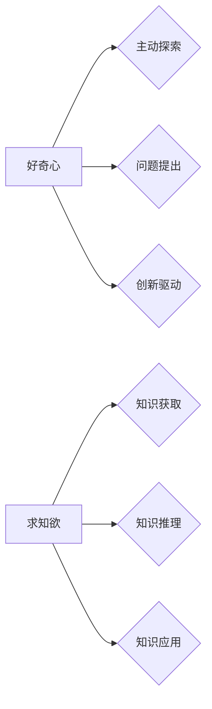

## 好奇心与求知欲：探索的动力

> 关键词：人工智能、机器学习、深度学习、好奇心、求知欲、探索、算法、模型

### 1. 背景介绍

在瞬息万变的科技时代，人工智能 (AI) 正以惊人的速度发展，深刻地改变着我们生活和工作的方式。从自动驾驶汽车到智能语音助手，从医疗诊断到金融交易，AI 的应用领域日益广泛。然而，推动 AI 发展前进的，不仅仅是强大的计算能力和海量数据，更重要的是人类的 **好奇心** 和 **求知欲**。

好奇心是人类天生的本能，它驱使我们探索未知世界，寻求答案。求知欲则是我们对知识的渴望，它让我们不断学习、思考、进步。这两股强大的动力共同构成了人类探索和创新的源泉，也是推动 AI 发展的重要驱动力。

### 2. 核心概念与联系

**好奇心** 和 **求知欲** 在 AI 领域有着重要的意义。它们不仅是 AI 研究人员的驱动力，也为 AI 系统的设计和开发提供了新的思路。

**2.1.  好奇心在 AI 中的体现**

* **主动探索:**  好奇心驱使 AI 系统主动探索未知领域，而不是仅仅被动地处理已知数据。例如，一些 AI 系统能够通过自我学习和探索，发现新的数据模式和知识。
* **问题提出:**  好奇心促使 AI 系统提出新的问题，并试图找到答案。这有助于 AI 系统从更深层次地理解世界，并推动 AI 研究的进步。
* **创新驱动:**  好奇心是创新的源泉，它鼓励 AI 系统尝试新的方法和思路，从而产生新的算法、模型和应用。

**2.2. 求知欲在 AI 中的体现**

* **知识获取:**  求知欲驱动 AI 系统不断获取新的知识，并将其整合到自己的知识库中。这使得 AI 系统能够不断学习和成长，并更好地理解世界。
* **知识推理:**  求知欲促使 AI 系统对已知知识进行推理和分析，从而发现新的规律和洞察。
* **知识应用:**  求知欲鼓励 AI 系统将所学知识应用到实际问题中，从而解决实际问题并创造价值。

**2.3.  核心概念关系图**



### 3. 核心算法原理 & 具体操作步骤

为了更好地理解好奇心和求知欲在 AI 中的体现，我们以 **强化学习 (Reinforcement Learning)** 为例，深入探讨其核心算法原理和具体操作步骤。

**3.1. 算法原理概述**

强化学习是一种机器学习方法，它通过**奖励和惩罚**来训练 AI 系统学习最佳行为。在强化学习中，AI 系统被称为**代理**，它与环境进行交互，并根据环境的反馈来调整自己的行为。

**3.2. 算法步骤详解**

1. **环境建模:**  首先，需要建立一个环境模型，该模型描述了代理与环境之间的交互方式。
2. **状态空间定义:**  定义代理可能处于的各种状态，例如游戏中的棋盘状态或机器人控制的关节角度。
3. **动作空间定义:**  定义代理可以执行的各种动作，例如在游戏中移动棋子或机器人改变关节角度。
4. **奖励函数设计:**  设计一个奖励函数，该函数根据代理的行为和环境状态来分配奖励或惩罚。
5. **策略学习:**  使用强化学习算法，例如 Q-学习或深度 Q-网络，训练代理学习一个策略，该策略能够在给定状态下选择最优动作。
6. **策略评估:**  评估代理学习到的策略的性能，例如在游戏中获得的得分或完成任务的成功率。

**3.3. 算法优缺点**

**优点:**

* 可以训练代理学习解决复杂问题。
* 不需要明确的监督信号，可以从环境反馈中学习。
* 可以应用于各种领域，例如游戏、机器人控制和医疗诊断。

**缺点:**

* 训练过程可能很慢，需要大量的样本数据和计算资源。
* 设计奖励函数是一个困难的任务，奖励函数的设计会影响代理的学习效果。
* 难以处理连续状态和动作空间。

**3.4. 算法应用领域**

强化学习在以下领域有着广泛的应用:

* **游戏:**  训练 AI 代理玩游戏，例如 AlphaGo 和 AlphaStar。
* **机器人控制:**  训练机器人执行复杂的任务，例如导航、抓取和组装。
* **医疗诊断:**  训练 AI 系统辅助医生诊断疾病。
* **金融交易:**  训练 AI 系统进行股票交易和风险管理。

### 4. 数学模型和公式 & 详细讲解 & 举例说明

强化学习的核心是**价值函数**和**策略函数**。

**4.1. 数学模型构建**

* **状态空间:**  S = {s1, s2,..., sn}
* **动作空间:**  A = {a1, a2,..., am}
* **奖励函数:**  R(s, a)
* **价值函数:**  V(s)
* **策略函数:**  π(s)

**4.2. 公式推导过程**

* **价值函数:**  V(s) 表示在状态 s 下获得的期望总奖励。
* **Bellman 方程:**  V(s) = max_a [R(s, a) + γ * V(s')]，其中 γ 是折扣因子，s' 是采取动作 a 后到达的状态。
* **策略函数:**  π(s) 表示在状态 s 下采取动作 a 的概率。

**4.3. 案例分析与讲解**

假设有一个简单的强化学习问题，例如一个机器人需要在迷宫中找到出口。

* **状态空间:**  迷宫中的每个位置都是一个状态。
* **动作空间:**  机器人可以向左、右、上、下移动。
* **奖励函数:**  如果机器人到达出口，则获得最大奖励，否则获得较小的奖励。
* **价值函数:**  可以用来评估每个状态的价值，即从该状态开始，按照最佳策略执行动作所能获得的期望总奖励。
* **策略函数:**  可以用来指导机器人选择动作，例如选择价值最高的下一个状态。

通过使用强化学习算法，例如 Q-学习，可以训练机器人学习一个策略，从而能够在迷宫中找到出口。

### 5. 项目实践：代码实例和详细解释说明

为了更直观地理解强化学习的原理和应用，我们可以使用 Python 和 OpenAI Gym 库实现一个简单的强化学习项目，例如训练一个代理学习玩 CartPole 游戏。

**5.1. 开发环境搭建**

需要安装 Python 和 OpenAI Gym 库。

```bash
pip install gym
```

**5.2. 源代码详细实现**

```python
import gym
import numpy as np

# 创建 CartPole 环境
env = gym.make('CartPole-v1')

# 定义 Q-学习算法
def q_learning(env, alpha=0.1, gamma=0.99, epsilon=0.1):
    # 初始化 Q-表
    q_table = np.zeros((env.observation_space.n, env.action_space.n))

    # 训练循环
    for episode in range(1000):
        # 重置环境
        state = env.reset()

        # 训练一个回合
        done = False
        while not done:
            # 选择动作
            action = choose_action(state, q_table, epsilon)

            # 执行动作
            next_state, reward, done, _ = env.step(action)

            # 更新 Q-表
            q_table[state, action] = q_table[state, action] + alpha * (reward + gamma * np.max(q_table[next_state, :]) - q_table[state, action])

            # 更新状态
            state = next_state

    return q_table

# 选择动作函数
def choose_action(state, q_table, epsilon):
    if np.random.uniform(0, 1) < epsilon:
        return env.action_space.sample()
    else:
        return np.argmax(q_table[state, :])

# 训练 Q-表
q_table = q_learning(env)

# 使用训练好的 Q-表玩游戏
state = env.reset()
done = False
while not done:
    action = choose_action(state, q_table, 0)
    next_state, reward, done, _ = env.step(action)
    env.render()
    state = next_state

env.close()
```

**5.3. 代码解读与分析**

* 该代码首先创建了一个 CartPole 环境，然后定义了一个 Q-学习算法。
* Q-学习算法使用一个 Q-表来存储每个状态下每个动作的价值。
* 算法通过迭代更新 Q-表，最终学习到一个策略，该策略能够使代理在游戏中获得尽可能高的奖励。
* 代码还包含了一个选择动作函数，该函数根据 epsilon-贪婪策略选择动作。
* 最后，代码使用训练好的 Q-表玩游戏，并显示游戏过程。

**5.4. 运行结果展示**

运行代码后，可以观察到代理在游戏中学习并逐渐掌握平衡杆的行为。

### 6. 实际应用场景

强化学习在许多实际应用场景中发挥着重要作用，例如:

* **推荐系统:**  训练 AI 系统推荐用户感兴趣的内容，例如电影、音乐和商品。
* **个性化教育:**  训练 AI 系统根据学生的学习进度和能力提供个性化的学习内容和辅导。
* **自动驾驶:**  训练 AI 系统控制自动驾驶汽车，使其能够安全地行驶在道路上。
* **医疗保健:**  训练 AI 系统辅助医生诊断疾病、制定治疗方案和预测患者的健康状况。

**6.4. 未来应用展望**

随着计算能力和数据量的不断增长，强化学习的应用场景将会更加广泛。未来，强化学习可能在以下领域发挥更大的作用:

* **机器人控制:**  训练更智能、更灵活的机器人，能够执行更复杂的任务。
* **药物研发:**  加速药物研发过程，发现新的药物和治疗方法。
* **金融市场预测:**  更准确地预测金融市场趋势，帮助投资者做出更好的决策。
* **人工智能安全:**  提高人工智能系统的安全性，防止其被恶意利用。

### 7. 工具和资源推荐

**7.1. 学习资源推荐**

* **书籍:**
    * Reinforcement Learning: An Introduction by Richard S. Sutton and Andrew G. Barto
    * Deep Reinforcement Learning Hands-On by Maxim Lapan
* **在线课程:**
    * Deep Reinforcement Learning Specialization by DeepLearning.AI
    * Reinforcement Learning by David Silver (University of DeepMind)

**7.2. 开发工具推荐**

* **OpenAI Gym:**  一个用于强化学习研究和开发的开源库。
* **TensorFlow:**  一个开源机器学习框架，支持强化学习算法的实现。
* **PyTorch:**  另一个开源机器学习框架，也支持强化学习算法的实现。

**7.3. 相关论文推荐**

* Deep Q-Network (DQN)
* Proximal Policy Optimization (PPO)
* Trust Region Policy Optimization (TRPO)

### 8. 总结：未来发展趋势与挑战

**8.1. 研究成果总结**

近年来，强化学习取得了显著的进展，在许多领域取得了成功应用。

**8.2. 未来发展趋势**

* **更强大的算法:**  开发更强大、更有效的强化学习算法，能够解决更复杂的问题。
* **更丰富的环境模拟:**  构建更逼真的环境模拟，能够更好地模拟现实世界。
* **更有效的样本利用:**  开发更有效的样本利用方法，能够减少训练数据需求。
* **更安全的强化学习:**  研究强化学习的安全性问题，防止其被恶意利用。

**8.3. 面临的挑战**

* **样本效率:**  强化学习算法通常需要大量的