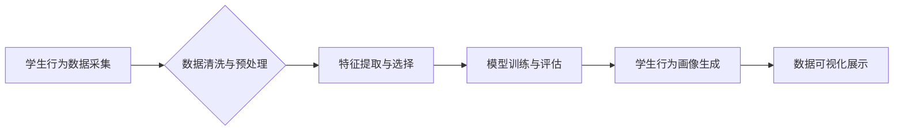

## 学生行为习惯“画像”可视分析平台

> 关键词：学生行为分析、数据可视化、机器学习、画像分析、教育科技

## 1. 背景介绍

随着教育信息化进程的不断加速，海量学生行为数据正在被生成和积累。这些数据蕴含着丰富的学习规律和个性化特征，为深入了解学生学习行为、个性化教学和提升教育质量提供了宝贵资源。然而，这些数据往往分散、复杂，难以有效挖掘和利用。因此，亟需一种能够对学生行为数据进行高效分析、可视化和画像的平台，以帮助教育工作者更好地了解学生，提供个性化学习支持。

## 2. 核心概念与联系

### 2.1 学生行为数据

学生行为数据是指学生在学习过程中产生的各种行为记录，包括但不限于：

* **学习行为数据:**  学习时长、学习进度、作业完成情况、考试成绩等。
* **互动行为数据:**  在线论坛参与度、与老师和同学的交流记录、学习资源访问记录等。
* **心理状态数据:**  学习情绪、学习兴趣、学习动机等。

### 2.2 画像分析

画像分析是指通过对大量数据进行分析和挖掘，构建学生个性化的画像，以揭示学生学习行为的特征、规律和趋势。

### 2.3 数据可视化

数据可视化是指将复杂的数据以直观、易于理解的方式呈现出来，帮助人们快速发现数据中的规律和趋势。

**核心架构流程图:**



## 3. 核心算法原理 & 具体操作步骤

### 3.1 算法原理概述

学生行为习惯“画像”可视分析平台的核心算法主要包括：

* **数据清洗与预处理:**  去除数据中的噪声、缺失值和异常值，并将数据转换为模型可处理的格式。
* **特征提取与选择:**  从原始数据中提取具有代表性的特征，并选择最相关的特征用于模型训练。
* **模型训练与评估:**  利用机器学习算法对特征进行训练，构建学生行为画像模型，并对模型性能进行评估。
* **学生行为画像生成:**  将模型应用于新的学生数据，生成每个学生的个性化行为画像。
* **数据可视化展示:**  将学生行为画像以直观、易于理解的方式呈现出来，帮助教育工作者更好地理解学生。

### 3.2 算法步骤详解

**数据清洗与预处理:**

1.  **数据收集:**  从各种数据源收集学生行为数据，例如学习管理系统、在线考试平台、学生反馈系统等。
2.  **数据清洗:**  去除数据中的重复记录、错误数据和缺失值。
3.  **数据转换:**  将数据转换为统一的格式，例如将日期格式统一为YYYY-MM-DD。

**特征提取与选择:**

1.  **特征工程:**  根据业务需求和模型要求，设计和提取具有代表性的特征，例如学习时长、学习进度、作业完成情况、考试成绩等。
2.  **特征选择:**  利用特征选择算法，从提取的特征中选择最相关的特征，减少模型训练时间和提高模型精度。

**模型训练与评估:**

1.  **模型选择:**  根据数据特点和业务需求，选择合适的机器学习算法，例如K-means聚类、决策树、支持向量机等。
2.  **模型训练:**  利用训练数据对模型进行训练，调整模型参数，使模型能够准确地预测学生行为。
3.  **模型评估:**  利用测试数据对模型进行评估，评估模型的精度、召回率、F1-score等指标。

**学生行为画像生成:**

1.  **模型应用:**  将训练好的模型应用于新的学生数据，预测每个学生的学习行为特征。
2.  **画像构建:**  将预测结果与学生基本信息等数据结合，构建每个学生的个性化行为画像。

**数据可视化展示:**

1.  **数据可视化工具:**  利用数据可视化工具，例如Tableau、Power BI等，将学生行为画像以直观、易于理解的方式呈现出来。
2.  **可视化类型:**  根据数据特点和业务需求，选择合适的可视化类型，例如柱状图、饼图、散点图等。

### 3.3 算法优缺点

**优点:**

*  能够有效挖掘学生行为数据中的隐藏规律和趋势。
*  能够构建个性化的学生行为画像，帮助教育工作者更好地了解学生。
*  能够为个性化教学提供数据支持，提高教学效率。

**缺点:**

*  需要大量的学生行为数据作为训练样本。
*  模型训练需要一定的技术难度。
*  学生行为数据存在隐私问题，需要做好数据保护工作。

### 3.4 算法应用领域

*  **个性化学习:**  根据学生的学习行为画像，提供个性化的学习内容、学习路径和学习支持。
*  **教学质量评估:**  分析学生的学习行为数据，评估教学效果和改进教学方法。
*  **学生风险预警:**  识别学习困难的学生，及时提供帮助和干预。
*  **教育资源推荐:**  根据学生的学习行为画像，推荐合适的学习资源。

## 4. 数学模型和公式 & 详细讲解 & 举例说明

### 4.1 数学模型构建

学生行为画像生成模型可以采用聚类算法，例如K-means聚类算法。K-means聚类算法的目标是将数据点划分为K个簇，每个簇中的数据点具有相似的特征。

### 4.2 公式推导过程

K-means聚类算法的迭代过程如下：

1.  **随机初始化K个聚类中心:**  每个聚类中心代表一个簇的中心点。
2.  **计算每个数据点到每个聚类中心的距离:**  常用的距离度量方法是欧氏距离。
3.  **将每个数据点分配到距离最近的聚类中心:**  每个数据点属于距离它最近的聚类中心所在的簇。
4.  **重新计算每个簇的中心点:**  每个簇的中心点是该簇中所有数据点的平均值。
5.  **重复步骤2-4，直到聚类中心不再变化:**  算法收敛，得到最终的聚类结果。

### 4.3 案例分析与讲解

假设我们有100个学生的数据，我们想将这些学生划分为5个簇。我们可以使用K-means聚类算法，将学生根据他们的学习行为特征进行分组。例如，我们可以将学习时长、学习进度、作业完成情况等作为特征，将学生划分为不同的学习类型，例如“勤奋型”、“中等型”、“拖延型”等。

## 5. 项目实践：代码实例和详细解释说明

### 5.1 开发环境搭建

*  操作系统: Windows/Linux/macOS
*  编程语言: Python
*  开发工具: Jupyter Notebook/VS Code
*  库依赖: pandas, scikit-learn, matplotlib, seaborn

### 5.2 源代码详细实现

```python
import pandas as pd
from sklearn.cluster import KMeans
import matplotlib.pyplot as plt

# 加载学生行为数据
data = pd.read_csv('student_behavior_data.csv')

# 选择特征
features = ['学习时长', '学习进度', '作业完成情况']
X = data[features]

# 确定聚类数目
wcss = []
for i in range(1, 11):
    kmeans = KMeans(n_clusters=i, random_state=42)
    kmeans.fit(X)
    wcss.append(kmeans.inertia_)
plt.plot(range(1, 11), wcss)
plt.title('Elbow Method')
plt.xlabel('Number of clusters')
plt.ylabel('WCSS')
plt.show()

# 训练K-means模型
kmeans = KMeans(n_clusters=5, random_state=42)
kmeans.fit(X)

# 获取聚类标签
labels = kmeans.labels_

# 将聚类标签添加到数据中
data['聚类标签'] = labels

# 可视化聚类结果
plt.scatter(data['学习时长'], data['学习进度'], c=data['聚类标签'], cmap='viridis')
plt.title('学生行为聚类')
plt.xlabel('学习时长')
plt.ylabel('学习进度')
plt.show()
```

### 5.3 代码解读与分析

*  **数据加载和特征选择:**  代码首先加载学生行为数据，并选择需要用于聚类的特征。
*  **Elbow Method:**  代码使用Elbow Method方法确定最佳的聚类数目。Elbow Method方法通过绘制WCSS（Within-Cluster Sum of Squares）曲线，找到拐点作为最佳聚类数目。
*  **K-means模型训练:**  代码使用K-means算法训练模型，将学生数据划分为5个簇。
*  **聚类标签获取和可视化:**  代码获取每个学生的聚类标签，并将标签添加到数据中。然后，使用matplotlib库绘制散点图，可视化每个簇的学生分布。

### 5.4 运行结果展示

运行代码后，会生成一个散点图，将学生根据他们的学习行为特征划分为5个簇。每个簇的学生具有相似的学习行为模式。

## 6. 实际应用场景

### 6.1 个性化学习方案

根据学生行为画像，可以为每个学生定制个性化的学习方案，例如：

*  **学习内容推荐:**  根据学生的学习兴趣和能力水平，推荐合适的学习内容。
*  **学习路径规划:**  根据学生的学习进度和目标，规划个性化的学习路径。
*  **学习支持提供:**  根据学生的学习困难和需求，提供个性化的学习支持。

### 6.2 教师教学指导

学生行为画像可以帮助教师更好地了解学生的学习情况，从而进行更有效的教学指导。例如：

*  **学生学习状态监测:**  及时发现学习困难的学生，并提供及时帮助。
*  **教学方法调整:**  根据学生的学习行为特征，调整教学方法，提高教学效果。
*  **课堂互动优化:**  根据学生的参与度和互动方式，优化课堂互动，提高学生的学习兴趣。

### 6.3 教育资源分配

学生行为画像可以帮助教育机构更合理地分配教育资源。例如：

*  **资源推荐:**  根据学生的学习需求，推荐合适的学习资源。
*  **人才培养:**  根据学生的学习潜力，培养人才。
*  **政策制定:**  根据学生的学习情况，制定相应的教育政策。

### 6.4 未来应用展望

随着人工智能技术的不断发展，学生行为习惯“画像”可视分析平台将会有更广泛的应用场景，例如：

*  **智能辅导系统:**  利用人工智能技术，为学生提供个性化的学习辅导。
*  **学习行为预测:**  预测学生的学习行为，帮助教育工作者提前做好准备。
*  **教育公平性提升:**  利用数据分析，帮助教育机构解决教育公平性问题。

## 7. 工具和资源推荐

### 7.1 学习资源推荐

*  **机器学习课程:**  Coursera, edX, Udacity 等平台提供丰富的机器学习课程。
*  **数据可视化工具教程:**  Tableau, Power BI 等平台提供官方教程和社区资源。
*  **Python编程教程:**  Python官网, Real Python 等网站提供Python编程教程。

### 7.2 开发工具推荐

*  **Jupyter Notebook:**  交互式编程环境，方便数据分析和可视化。
*  **VS Code:**  功能强大的代码编辑器，支持多种编程语言和插件。
*  **PyCharm:**  专业的Python IDE，提供丰富的开发工具和调试功能。

### 7.3 相关论文推荐

*  **K-means聚类算法:**  MacQueen, J. (1967). Some methods for classification and analysis of multivariate observations.
*