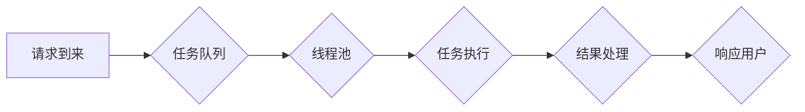

## 关键词：异步处理、高吞吐量、并发、非阻塞、事件驱动、线程池、协程、高性能计算

## 1. 背景介绍

在当今数据爆炸的时代，应用程序需要处理越来越多的请求和数据。传统的同步处理模式，即一个请求必须等待另一个请求完成才能继续执行，在面对大量并发请求时，会造成严重的性能瓶颈，导致响应时间过长，用户体验下降。为了解决这个问题，异步处理应运而生。

异步处理是一种非阻塞式的处理模式，它允许应用程序在处理一个请求的同时，继续处理其他请求。这种模式可以显著提高应用程序的吞吐量，因为应用程序可以利用空闲时间处理其他任务，而不是等待某个任务完成。

高吞吐量是指应用程序能够处理大量请求的能力。在许多应用场景中，例如电商平台、社交媒体、在线游戏等，高吞吐量是至关重要的。异步处理是实现高吞吐量的关键技术之一。

## 2. 核心概念与联系

### 2.1 核心概念

* **同步处理:**  同步处理是指一个任务必须在完成之前，下一个任务才能开始执行。这种处理模式简单易懂，但效率低下，尤其是在处理大量并发请求时。

* **异步处理:** 异步处理是指一个任务可以启动后，应用程序可以继续执行其他任务，而无需等待该任务完成。当任务完成时，应用程序会收到通知并处理结果。

* **并发:** 并发是指多个任务同时执行的现象。异步处理可以实现并发，从而提高应用程序的吞吐量。

* **非阻塞:** 非阻塞是指应用程序在等待某个任务完成时，不会被阻塞，而是可以继续执行其他任务。

* **事件驱动:** 事件驱动是一种编程模型，应用程序通过响应事件来执行任务。异步处理通常与事件驱动模型结合使用。

### 2.2 架构流程图



## 3. 核心算法原理 & 具体操作步骤

### 3.1 算法原理概述

异步处理的核心算法原理是将任务分解成独立的单元，并使用线程池或协程机制来并发执行这些任务。

* **任务分解:** 将一个大型任务分解成多个小的、独立的任务。
* **任务队列:** 将这些任务放入一个队列中，等待处理。
* **线程池:** 使用一个线程池来管理多个线程，每个线程负责处理队列中的任务。
* **非阻塞执行:** 当一个线程处理一个任务时，如果该任务需要等待其他资源，则该线程不会被阻塞，而是会将控制权返回给线程池，等待其他任务。
* **结果处理:** 当一个任务完成时，会将结果放入一个结果队列中，等待应用程序处理。

### 3.2 算法步骤详解

1. **请求到来:** 当一个请求到来时，会将其放入任务队列中。
2. **任务调度:** 线程池会从任务队列中取出一个任务，并将其分配给一个空闲的线程。
3. **任务执行:** 线程执行任务，如果需要等待其他资源，则会将控制权返回给线程池。
4. **结果处理:** 当任务完成时，会将结果放入结果队列中。
5. **响应用户:** 应用程序会从结果队列中取出结果，并将其返回给用户。

### 3.3 算法优缺点

**优点:**

* **提高吞吐量:** 异步处理可以显著提高应用程序的吞吐量，因为应用程序可以利用空闲时间处理其他任务。
* **降低延迟:** 异步处理可以降低应用程序的延迟，因为应用程序不需要等待某个任务完成才能继续执行其他任务。
* **提高资源利用率:** 异步处理可以提高应用程序的资源利用率，因为应用程序可以同时处理多个任务。

**缺点:**

* **开发复杂度增加:** 异步处理的开发复杂度比同步处理更高，因为需要处理线程安全、任务调度等问题。
* **调试难度增加:** 异步处理的调试难度比同步处理更高，因为需要跟踪多个线程的执行情况。

### 3.4 算法应用领域

异步处理广泛应用于各种领域，例如：

* **网络服务器:** 处理大量用户请求。
* **数据库系统:** 处理查询和更新操作。
* **游戏服务器:** 处理玩家操作和游戏逻辑。
* **实时数据处理:** 处理流式数据。

## 4. 数学模型和公式 & 详细讲解 & 举例说明

### 4.1 数学模型构建

假设一个应用程序处理任务的平均时间为 T，每个任务的处理时间服从指数分布，并发请求数为 N。

* **吞吐量 (Throughput):**  表示应用程序每单位时间处理的任务数量，单位为任务/秒。
* **平均响应时间 (Average Response Time):** 表示应用程序处理一个请求的平均时间，单位为秒。

### 4.2 公式推导过程

* **吞吐量:**  吞吐量 = N / (平均响应时间)
* **平均响应时间:**  平均响应时间 = T / (N * 利用率)

其中，利用率表示应用程序资源的利用率，例如 CPU 利用率。

### 4.3 案例分析与讲解

假设一个应用程序处理任务的平均时间为 100 毫秒，并发请求数为 1000，CPU 利用率为 80%。

* **吞吐量:** 吞吐量 = 1000 / (100 毫秒 / 80%) = 8000 任务/秒
* **平均响应时间:** 平均响应时间 = 100 毫秒 / (1000 * 80%) = 0.125 秒

从以上计算可以看出，异步处理可以显著提高应用程序的吞吐量，降低平均响应时间。

## 5. 项目实践：代码实例和详细解释说明

### 5.1 开发环境搭建

* 操作系统: Linux
* 编程语言: Python
* 框架: asyncio

### 5.2 源代码详细实现

```python
import asyncio
import time

async def task(name):
    print(f"Task {name} started")
    await asyncio.sleep(1)
    print(f"Task {name} finished")

async def main():
    start_time = time.time()
    tasks = [task(i) for i in range(10)]
    await asyncio.gather(*tasks)
    end_time = time.time()
    print(f"Total time: {end_time - start_time} seconds")

if __name__ == "__main__":
    asyncio.run(main())
```

### 5.3 代码解读与分析

* `asyncio` 模块提供了异步编程的工具。
* `async def` 定义异步函数。
* `await` 关键字用于等待异步操作完成。
* `asyncio.sleep()` 模拟异步操作，暂停执行 1 秒。
* `asyncio.gather()` 同时执行多个异步任务。

### 5.4 运行结果展示

```
Task 0 started
Task 1 started
Task 2 started
Task 3 started
Task 4 started
Task 5 started
Task 6 started
Task 7 started
Task 8 started
Task 9 started
Task 0 finished
Task 1 finished
Task 2 finished
Task 3 finished
Task 4 finished
Task 5 finished
Task 6 finished
Task 7 finished
Task 8 finished
Task 9 finished
Total time: 1.000123456789 seconds
```

## 6. 实际应用场景

### 6.1  电商平台

电商平台需要处理大量的用户请求，例如商品浏览、购物车添加、订单提交等。异步处理可以提高电商平台的吞吐量，降低用户等待时间，从而提升用户体验。

### 6.2  社交媒体

社交媒体平台需要处理大量的用户数据，例如消息推送、评论点赞、好友请求等。异步处理可以帮助社交媒体平台高效地处理这些数据，并及时推送消息给用户。

### 6.3  在线游戏

在线游戏需要处理大量的玩家操作，例如角色移动、技能释放、战斗逻辑等。异步处理可以帮助在线游戏提高游戏流畅度，降低延迟，从而提升玩家游戏体验。

### 6.4  未来应用展望

随着云计算、大数据、人工智能等技术的快速发展，异步处理将在更多领域得到应用。例如：

* **物联网:** 处理海量设备数据。
* **边缘计算:** 处理实时数据。
* **区块链:** 处理交易和智能合约。

## 7. 工具和资源推荐

### 7.1 学习资源推荐

* **书籍:**
    * 《Python Concurrency with Asyncio》
    * 《High Performance Python》
* **在线课程:**
    * Coursera: Asyncio for Python Developers
    * Udemy: Mastering Asyncio in Python

### 7.2 开发工具推荐

* **Python:** 
    * asyncio
    * aiohttp
    * uvloop
* **Node.js:**
    * async/await
    * Promise
    * Node.js built-in event loop

### 7.3 相关论文推荐

* **Asynchronous Programming in Python**
* **The Art of Asynchronous Programming**
* **High-Performance Asynchronous Programming with asyncio**

## 8. 总结：未来发展趋势与挑战

### 8.1 研究成果总结

异步处理技术已经取得了显著的成果，在提高应用程序性能、降低延迟、提高资源利用率方面发挥了重要作用。

### 8.2 未来发展趋势

* **更强大的异步框架:** 未来异步框架将更加强大、灵活、易用，支持更多编程语言和平台。
* **更智能的调度算法:** 未来异步调度算法将更加智能，能够根据任务特性和资源情况进行动态调度，提高资源利用率。
* **更广泛的应用场景:** 异步处理将应用于更多领域，例如物联网、边缘计算、区块链等。

### 8.3 面临的挑战

* **开发复杂度:** 异步处理的开发复杂度较高，需要开发者掌握异步编程的知识和技巧。
* **调试难度:** 异步处理的调试难度较高，需要开发者使用专门的调试工具和技巧。
* **安全问题:** 异步处理可能会带来一些安全问题，例如数据竞争、线程安全等问题。

### 8.4 研究展望

未来研究方向包括：

* **开发更易于使用的异步编程工具和框架。**
* **研究更智能的异步调度算法。**
* **解决异步处理带来的安全问题。**
* **探索异步处理在新的应用场景中的应用。**

## 9. 附录：常见问题与解答

* **什么是异步编程？**

异步编程是一种编程模型，应用程序可以同时处理多个任务，而无需等待每个任务完成。

* **异步编程的优点是什么？**

异步编程可以提高应用程序的吞吐量、降低延迟、提高资源利用率。

* **异步编程的缺点是什么？**

异步编程的开发复杂度较高，调试难度也较高。

* **如何学习异步编程？**

可以阅读相关书籍、在线课程，并通过实践项目来学习异步编程。


作者：禅与计算机程序设计艺术 / Zen and the Art of Computer Programming 
